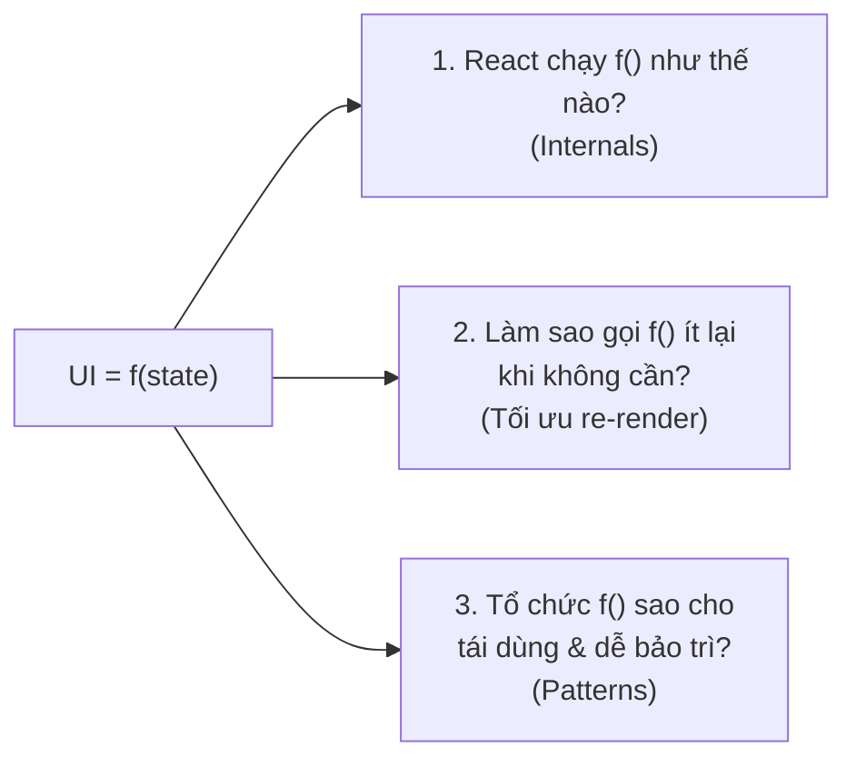

# React Nâng Cao — Hiểu Sâu Để Viết Tốt

## Mục lục

- [Blog này dành cho ai](#blog-này-dành-cho-ai)
- [Tư duy xuyên suốt](#tư-duy-xuyên-suốt)
- [Bản đồ nội dung](#bản-đồ-nội-dung)
- [Cách đọc hiệu quả](#cách-đọc-hiệu-quả)

---

## Blog này dành cho ai

Blog này **không** dạy lại JSX, props, state hay cách bắt sự kiện `onClick`. Nó dành cho người **đã viết React được rồi** nhưng muốn trả lời được những câu hỏi "tại sao":

- Vì sao component của tôi re-render dù props nhìn như không đổi?
- `React.memo`, `useMemo`, `useCallback` thực sự làm gì — và vì sao 90% trường hợp dùng sai?
- React render ra màn hình theo các bước nào? Fiber là gì?
- Vì sao danh sách bắt buộc cần `key`, và vì sao dùng `index` làm key lại sinh bug?
- Làm sao tổ chức code bằng pattern thay vì copy-paste logic?

> [!IMPORTANT]
> Mục tiêu của blog không phải "học thuộc API" mà là xây **mô hình tư duy (mental model)** đúng về cách React hoạt động. Khi mental model đúng, bạn tự suy ra được API nên dùng, không cần nhớ máy móc.

---

## Tư duy xuyên suốt

Toàn bộ blog xoay quanh một công thức duy nhất:

```
UI = f(state)
```

Giao diện là **kết quả của một hàm thuần** áp lên state. Bạn không "sửa DOM", bạn chỉ **mô tả** UI ứng với state hiện tại, còn React lo việc biến mô tả đó thành thao tác DOM tối thiểu.

Từ công thức này suy ra 3 nhóm chủ đề:



---

## Bản đồ nội dung

<Cards>
  <Card href="/react-internals/render-pipeline/" title="React Internals">
    Render pipeline, Fiber, reconciliation, vì sao re-render, và vì sao list cần key.
  </Card>
  <Card href="/toi-uu-rerender/tong-quan-toi-uu/" title="Tối ưu Re-render">
    memo, useMemo, useCallback, referential equality, tối ưu Context, code-splitting.
  </Card>
  <Card href="/patterns/composition/" title="React Patterns">
    Composition, custom hooks, compound components, render props, provider, state reducer.
  </Card>
</Cards>

### Thứ tự đề xuất

<Steps>
  <Step>
    ### Hiểu máy chạy thế nào
    Đọc nhóm **React Internals** trước. Không hiểu render pipeline & Fiber thì mọi mẹo tối ưu chỉ là học vẹt.
  </Step>
  <Step>
    ### Học cách tối ưu đúng chỗ
    Đọc nhóm **Tối ưu Re-render**. Nắm được "khi nào nên tối ưu" quan trọng hơn biết API.
  </Step>
  <Step>
    ### Tổ chức code chuyên nghiệp
    Đọc nhóm **Patterns** để biết cách chia logic tái dùng được, hết copy-paste.
  </Step>
</Steps>

---

## Cách đọc hiệu quả

> [!TIP]
> Mỗi bài đều có ví dụ code **chạy được** và bảng/sơ đồ minh hoạ. Hãy mở một sandbox (CodeSandbox, StackBlitz) và gõ lại từng ví dụ — đọc suông sẽ quên rất nhanh.

- Phiên bản tham chiếu: **React 19** (kèm ghi chú khác biệt với React 18 khi cần).
- Code mẫu dùng function component + hooks. Không dùng class component trừ khi minh hoạ lịch sử.
- Khi gặp thuật ngữ tiếng Anh (reconciliation, bailout, ...) bài sẽ giải thích lần đầu rồi giữ nguyên — vì đó là từ bạn sẽ gặp trong tài liệu & lỗi thật.
