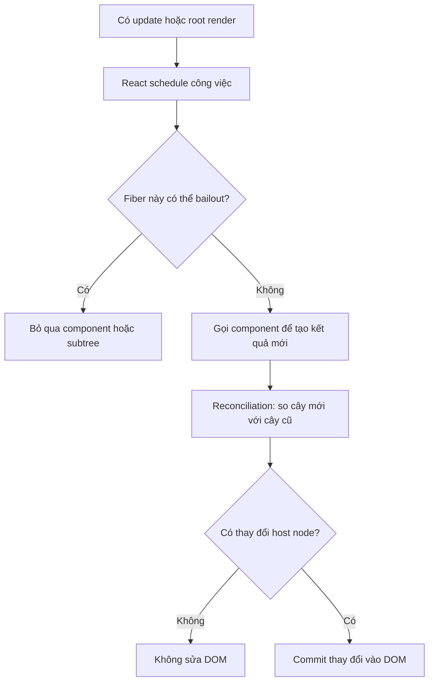

<Callout type="info" title="Mục tiêu phỏng vấn">

Câu hỏi này không chỉ kiểm tra việc nhớ `setState`. Nhà tuyển dụng thường muốn biết bạn có phân biệt được **trigger**, **render** và **DOM update** hay không.

</Callout>

## Mục lục

- [Câu trả lời trong 30 giây](#câu-trả-lời-trong-30-giây)
- [React thực sự đưa ra quyết định ở đâu](#react-thực-sự-đưa-ra-quyết-định-ở-đâu)
- [Những trường hợp làm component được render](#những-trường-hợp-làm-component-được-render)
  - [1. Lần render đầu tiên](#1-lần-render-đầu-tiên)
  - [2. State hoặc reducer của chính component được cập nhật](#2-state-hoặc-reducer-của-chính-component-được-cập-nhật)
  - [3. Component cha render lại](#3-component-cha-render-lại)
  - [4. Context mà component đọc thay đổi](#4-context-mà-component-đọc-thay-đổi)
  - [5. External store phát ra snapshot mới](#5-external-store-phát-ra-snapshot-mới)
  - [6. Root được yêu cầu render lại](#6-root-được-yêu-cầu-render-lại)
- [Khi nào React bỏ qua render](#khi-nào-react-bỏ-qua-render)
- [Render lại không đồng nghĩa DOM thay đổi](#render-lại-không-đồng-nghĩa-dom-thay-đổi)
- [Bảng quyết định nhanh](#bảng-quyết-định-nhanh)
- [Ví dụ truy vết](#ví-dụ-truy-vết)
- [Những câu gài thường gặp](#những-câu-gài-thường-gặp)
- [Câu trả lời mẫu hoàn chỉnh](#câu-trả-lời-mẫu-hoàn-chỉnh)
- [Câu hỏi mở rộng](#câu-hỏi-mở-rộng)
- [Tài liệu tham khảo](#tài-liệu-tham-khảo)

---

## Câu trả lời trong 30 giây

Sau lần mount đầu tiên, một function component có thể được render lại khi:

1. state hoặc reducer của chính nó nhận update;
2. component cha render lại, nên React tiếp tục xử lý cây con theo mặc định;
3. context mà component đang đọc đổi giá trị;
4. một nguồn dữ liệu bên ngoài mà component đăng ký, chẳng hạn qua `useSyncExternalStore`, trả về snapshot mới;
5. hoặc root được gọi `render` lại.

Tuy nhiên, một update được **schedule** chưa chắc làm hàm component chạy. React có thể **bailout** nếu dữ liệu liên quan không đổi, hoặc nếu một cơ chế như `React.memo` cho phép bỏ qua component. Và kể cả hàm component đã chạy lại, DOM chỉ được cập nhật nếu kết quả render thật sự khác.

<Callout type="idea" title="Câu chốt nên nói">

**Re-render là React gọi lại component để tính UI; commit mới là lúc React thay đổi DOM. Hai việc này không đồng nghĩa.**

</Callout>

## React thực sự đưa ra quyết định ở đâu

Không có một câu lệnh duy nhất kiểu “props đổi thì render”. Quy trình đúng là:



React trước hết **xếp lịch công việc**. Trong render phase, React đi qua cây Fiber và quyết định node nào cần xử lý, node nào có thể bailout. Chỉ sau khi so sánh kết quả mới với kết quả cũ, React mới biết DOM có cần thay đổi hay không.

Nói ngắn gọn:

```text
update → schedule → render hoặc bailout → reconciliation → commit nếu cần
```

## Những trường hợp làm component được render

### 1. Lần render đầu tiên

Khi ứng dụng được mount, React phải gọi component để biết UI ban đầu trông như thế nào.

```tsx
import { createRoot } from 'react-dom/client';

const root = createRoot(document.getElementById('root')!);
root.render(<App />); // initial render
```

Đây là **render**, không phải **re-render**. Trong phỏng vấn, nên nhắc riêng trường hợp mount để câu trả lời đầy đủ.

### 2. State hoặc reducer của chính component được cập nhật

Gọi setter của `useState` hoặc `dispatch` của `useReducer` sẽ đưa một update vào hàng đợi.

```tsx
function Counter() {
  const [count, setCount] = useState(0);

  return (
    <button onClick={() => setCount((value) => value + 1)}>
      {count}
    </button>
  );
}
```

Mỗi lần bấm, `Counter` nhận update state và React schedule công việc cho nó.

Nếu giá trị mới giống giá trị hiện tại theo `Object.is`, React có thể bỏ qua update:

```tsx
setCount(0); // count đã là 0 → React có thể bailout
```

Với object, “cùng nội dung” chưa chắc là “cùng giá trị”:

```tsx
const [user, setUser] = useState({ name: 'An' });

setUser(user);            // cùng reference → có thể bailout
setUser({ name: 'An' });  // reference mới → được xem là giá trị mới
```

<Callout type="warn" title="Chi tiết dễ bị hỏi sâu">

React có thể vẫn gọi component thêm một lần trước khi bỏ kết quả của update cùng giá trị. Điều có thể khẳng định là React sẽ không commit thay đổi không cần thiết và có thể dừng trước khi đi sâu xuống subtree.

</Callout>

### 3. Component cha render lại

Theo mặc định, khi một component render lại, React tiếp tục render các component con được nó trả về.

```tsx
function Child() {
  console.log('Child render');
  return <p>Không nhận props</p>;
}

function Parent() {
  const [count, setCount] = useState(0);

  return (
    <>
      <button onClick={() => setCount((value) => value + 1)}>
        {count}
      </button>
      <Child />
    </>
  );
}
```

Bấm nút làm `Parent` render lại. `Child` cũng chạy lại dù không nhận `count`.

`React.memo` có thể thay đổi hành vi mặc định này:

```tsx
const Child = memo(function Child({ label }: { label: string }) {
  console.log('Child render');
  return <p>{label}</p>;
});
```

Nếu cha render lại nhưng props của `Child` không đổi theo phép so sánh nông, React có thể bỏ qua `Child`.

<Callout type="info" title="Cách nói chính xác về props">

“Props đổi” không phải một nguồn update độc lập. Props mới chỉ được React quan sát khi cha đang render và tạo element con mới. Vì vậy câu nói chính xác hơn là: **cha render lại; sau đó React xét props để quyết định có bailout component con hay không**.

</Callout>

### 4. Context mà component đọc thay đổi

Component dùng `useContext` sẽ nhận update khi `value` gần nhất của Provider thay đổi theo `Object.is`.

```tsx
const ThemeContext = createContext('light');

function Toolbar() {
  const theme = useContext(ThemeContext);
  return <div className={theme}>Toolbar</div>;
}
```

Nếu Provider chuyển từ `'light'` sang `'dark'`, `Toolbar` cần render lại. Bọc `Toolbar` bằng `memo` không chặn update context mà chính `Toolbar` đang đọc.

Với object, Provider tạo object mới ở mỗi render cũng tạo ra value mới:

```tsx
<SettingsContext value={{ theme, locale }}>
  {children}
</SettingsContext>
```

Nếu đây là điểm nóng hiệu năng, hãy ổn định `value` hoặc tách context theo phạm vi thay đổi. Không nên memo hóa mọi Provider một cách máy móc; hãy đo trước.

### 5. External store phát ra snapshot mới

React có API chính thức để đăng ký nguồn dữ liệu nằm ngoài React: `useSyncExternalStore`.

```tsx
const online = useSyncExternalStore(
  subscribe,
  getSnapshot,
  getServerSnapshot,
);
```

Khi store phát thông báo, React gọi lại `getSnapshot`. Nếu snapshot mới khác snapshot trước theo `Object.is`, component được render lại.

Các thư viện state management thường dùng subscription tương tự. Trong câu trả lời ngắn, bạn có thể bỏ chi tiết này. Trong câu trả lời senior, nhắc đến external store cho thấy bạn hiểu re-render không chỉ đến từ `useState` và Context.

### 6. Root được yêu cầu render lại

Gọi lại `root.render(...)` yêu cầu React cập nhật root:

```tsx
root.render(<App version={1} />);
root.render(<App version={2} />);
```

Nếu type và vị trí component vẫn khớp, React thường giữ state và reconcile cây hiện có thay vì remount toàn bộ. Đây không phải tình huống phổ biến trong code ứng dụng, nhưng là một nguồn render hợp lệ.

## Khi nào React bỏ qua render

**Bailout** là việc React bỏ qua một component hoặc cả subtree vì không có công việc liên quan cần xử lý.

Các trường hợp thường gặp:

| Trường hợp | Cơ chế bỏ qua |
|---|---|
| Setter nhận cùng state theo `Object.is` | React có thể bỏ update state |
| Component bọc bằng `React.memo` và props không đổi | So sánh nông từng prop bằng `Object.is` |
| Fiber không có update, context không đổi và subtree không có pending work | React tái sử dụng công việc cũ |
| React element con giữ nguyên cùng reference | React có thể tái sử dụng subtree tương ứng |

`memo` không phải “khóa render”. Component được memo hóa vẫn render khi:

- state của chính nó thay đổi;
- context mà nó đọc thay đổi;
- props bị xem là khác;
- hoặc React cần render lại vì các lý do phát triển như Strict Mode.

```tsx
const Profile = memo(function Profile() {
  const theme = useContext(ThemeContext);
  const [open, setOpen] = useState(false);
  // Context hoặc state đổi vẫn làm Profile render lại.
});
```

<Callout type="warn" title="Đừng hứa tuyệt đối">

`React.memo` là tối ưu hiệu năng, không phải bảo đảm ngữ nghĩa. Code phải đúng ngay cả khi component được render lại.

</Callout>

## Render lại không đồng nghĩa DOM thay đổi

Ví dụ sau làm `Greeting` render lại khi cha render, nhưng DOM của đoạn `<p>` không cần thay đổi vì output vẫn giống nhau:

```tsx
function Greeting() {
  console.log('render');
  return <p>Xin chào</p>;
}
```

React tách công việc thành hai phần:

| Khái niệm | Điều xảy ra |
|---|---|
| **Render phase** | Gọi component và tính cây React mới |
| **Commit phase** | Áp những thay đổi cần thiết vào DOM |

Vì vậy, `console.log` trong thân component xuất hiện không chứng minh DOM đã bị sửa. Muốn phân tích hiệu năng, hãy dùng React DevTools Profiler thay vì chỉ đếm log.

## Bảng quyết định nhanh

| Tình huống | Component có thể render lại? | Ghi chú |
|---|---:|---|
| `setState` với primitive mới | Có | Update được schedule |
| `setState` với cùng giá trị | Thường không | So sánh bằng `Object.is`; có thể bị gọi thêm trước khi bailout |
| Gán `ref.current` | Không | Ref không schedule render |
| Sửa biến thường | Không | React không theo dõi biến thường |
| Cha render, con thường | Có | Hành vi mặc định |
| Cha render, con `memo`, props ổn định | Thường không | Có thể bailout |
| Context đang đọc đổi | Có | `memo` không chặn context update |
| Object Context được tạo mới | Có | Reference mới dù nội dung giống |
| External-store snapshot đổi | Có | Ví dụ `useSyncExternalStore` |
| Component render lại nhưng JSX giống cũ | Có render, có thể không sửa DOM | Render khác commit |

## Ví dụ truy vết

Hãy dự đoán log của đoạn code sau:

```tsx
const ThemeContext = createContext('light');

const Name = memo(function Name({ value }: { value: string }) {
  console.log('Name render');
  return <span>{value}</span>;
});

function Panel() {
  const theme = useContext(ThemeContext);
  console.log('Panel render');
  return <section data-theme={theme}>Panel</section>;
}

function App() {
  const [count, setCount] = useState(0);
  const [theme, setTheme] = useState('light');

  console.log('App render');

  return (
    <ThemeContext value={theme}>
      <button onClick={() => setCount((value) => value + 1)}>
        Count: {count}
      </button>
      <button onClick={() => setTheme('dark')}>Dark</button>
      <Name value="An" />
      <Panel />
    </ThemeContext>
  );
}
```

Khi tăng `count`:

1. `App` nhận state update và render lại.
2. `Name` nhận prop `value="An"` như cũ, nên `memo` cho phép bailout.
3. `Panel` là component thường nằm trong cây con của `App`, nên render lại.
4. Context vẫn là `'light'`; đây không phải lý do làm `Panel` render, nhưng cha render vẫn đủ để nó chạy lại.

Log đáng chú ý:

```text
App render
Panel render
```

Khi bấm **Dark** lần đầu:

1. `App` render vì state `theme` đổi.
2. Provider phát context value mới.
3. `Panel` render và nhận `'dark'`.
4. `Name` vẫn có thể bailout vì không đọc context và props không đổi.

Khi bấm **Dark** lần nữa, state đã là `'dark'`. React có thể bỏ update theo `Object.is`, nên không cần render lại cây con.

<Callout type="info" title="Trong môi trường development">

Nếu bật `<StrictMode>`, bạn có thể thấy log nhiều hơn dự đoán. Strict Mode cố ý gọi lại một số logic trong development để phát hiện code không thuần. Hành vi kiểm tra này không xảy ra giống vậy trong production.

</Callout>

## Những câu gài thường gặp

<Accordions type="single">
  <Accordion title="Props đổi có tự trigger re-render không?">
    Không theo nghĩa một nguồn update độc lập. Cha phải render để tạo props mới. Sau đó component con thường render theo; component được memo hóa có thể bailout nếu props không đổi.
  </Accordion>
  <Accordion title="useRef thay đổi có render lại không?">
    Không. Thay đổi `ref.current` không schedule render. Nếu dữ liệu phải xuất hiện trên UI, nó thường nên nằm trong state.
  </Accordion>
  <Accordion title="React.memo có chặn mọi re-render không?">
    Không. Nó chủ yếu cho phép bỏ qua render do cha khi props không đổi. State nội bộ và context mà component đọc vẫn có thể làm component render.
  </Accordion>
  <Accordion title="useMemo và useCallback có ngăn component hiện tại render không?">
    Không. Component phải chạy thì React mới gọi các hook đó. Chúng giữ lại value hoặc function reference, nhờ đó có thể giúp component con được memo hóa bailout hoặc tránh chạy lại phép tính đắt.
  </Accordion>
  <Accordion title="Mutate object state rồi set lại cùng object thì sao?">
    React thấy cùng reference và có thể bailout, khiến UI không phản ánh mutation. Hãy tạo state mới thay vì mutate state hiện tại.
  </Accordion>
  <Accordion title="Re-render có luôn là vấn đề hiệu năng không?">
    Không. Phần lớn render rất rẻ. Chỉ tối ưu khi Profiler cho thấy công việc render gây chậm đáng kể.
  </Accordion>
</Accordions>

## Câu trả lời mẫu hoàn chỉnh

> React render component lần đầu khi mount. Sau đó, component có thể được render lại khi state hoặc reducer của nó nhận update, khi cha render lại, khi context nó đọc thay đổi, hoặc khi subscription bên ngoài trả về snapshot mới. Gọi lại `root.render` cũng là một nguồn update.
>
> Tuy nhiên, React có thể bailout trước khi gọi component nếu không có công việc liên quan. Ví dụ, state mới bằng state cũ theo `Object.is`, hoặc component được bọc `React.memo` và props không đổi. `memo` không chặn update từ state nội bộ hay context.
>
> Cuối cùng, re-render chỉ là gọi component để tính UI mới. DOM chỉ thay đổi ở commit phase nếu reconciliation tìm thấy khác biệt thực sự.

Câu trả lời này đủ ngắn để nói trong khoảng một phút, nhưng vẫn mở ra các hướng đào sâu về `Object.is`, `memo`, Context, Fiber và commit phase.

## Câu hỏi mở rộng

Sau câu hỏi chính, nhà tuyển dụng có thể hỏi tiếp:

1. Vì sao object hoặc function inline làm `React.memo` mất tác dụng?
2. `useMemo` và `useCallback` khác `React.memo` ở đâu?
3. Vì sao Context có thể làm nhiều component render lại?
4. Strict Mode vì sao làm component chạy hai lần trong development?
5. Render phase khác commit phase như thế nào?
6. Làm sao chứng minh một re-render đang gây chậm?

<Cards>
  <Card title="Vì sao component re-render" href="/react-internals/vi-sao-component-rerender/" description="Đi sâu vào state snapshot, batching, context và bailout." />
  <Card title="Render Pipeline" href="/react-internals/render-pipeline/" description="Phân biệt trigger, render, commit và browser paint." />
  <Card title="React.memo" href="/toi-uu-rerender/react-memo/" description="Hiểu phép so sánh props và khi memo thực sự có tác dụng." />
</Cards>

## Tài liệu tham khảo

- [React — Render and Commit](https://react.dev/learn/render-and-commit)
- [React — `memo`](https://react.dev/reference/react/memo)
- [React — `useState`](https://react.dev/reference/react/useState)
- [React — `useContext`](https://react.dev/reference/react/useContext)
- [React — `useSyncExternalStore`](https://react.dev/reference/react/useSyncExternalStore)
- [React — `createRoot`](https://react.dev/reference/react-dom/client/createRoot)
- [React — Strict Mode](https://react.dev/reference/react/StrictMode)
