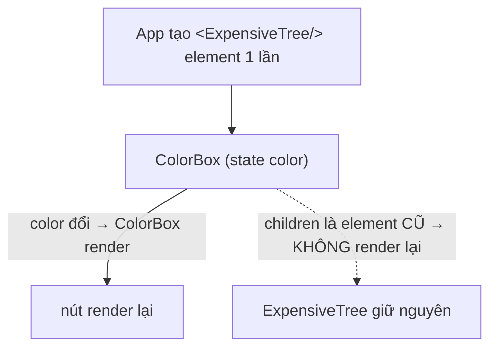

# Composition

## Mục lục

- [Tổng quan](#tổng-quan)
- [1. Composition thay cho kế thừa](#1-composition-thay-cho-kế-thừa)
  - [1.1 Specialization: biến thể bằng cách bọc](#11-specialization-biến-thể-bằng-cách-bọc)
- [2. children — slot mặc định](#2-children--slot-mặc-định)
- [3. Nhiều slot bằng props](#3-nhiều-slot-bằng-props)
  - [3.1 children hay slot props?](#31-children-hay-slot-props)
- [4. Composition giải bài toán prop drilling](#4-composition-giải-bài-toán-prop-drilling)
- [5. Composition là một tối ưu performance](#5-composition-là-một-tối-ưu-performance)
- [6. Khi nào chia component](#6-khi-nào-chia-component)
- [7. Composition vs HOC](#7-composition-vs-hoc)
- [8. Câu hỏi tự kiểm tra](#8-câu-hỏi-tự-kiểm-tra)
- [Tài liệu tham khảo](#tài-liệu-tham-khảo)

---

## Tổng quan

**Composition** (ghép nối) là triết lý cốt lõi của React: xây UI phức tạp bằng cách **lồng các component đơn giản** vào nhau, truyền nội dung qua `children` và props, thay vì kế thừa class hay nhồi mọi thứ vào một component khổng lồ.

> [!IMPORTANT]
> Gần như mọi "pattern" nâng cao (compound components, render props, provider...) đều là biến thể của composition. Nắm chắc composition, các pattern sau chỉ là áp dụng có chủ đích.

---

## 1. Composition thay cho kế thừa

Trong OOP bạn hay nghĩ tới kế thừa (`class Admin extends User`). React **không** khuyến khích điều đó. Muốn tái dùng/biến thể, ta **ghép** component.

```tsx
// ❌ Tư duy kế thừa (không React-y)
// class SuccessButton extends Button { ... }

// ✅ Tư duy composition: Button tổng quát, các biến thể là cách DÙNG nó
function Button({ variant = 'default', children }: {
  variant?: 'default' | 'success' | 'danger';
  children: React.ReactNode;
}) {
  return <button className={`btn btn-${variant}`}>{children}</button>;
}

// Tạo biến thể bằng cách bọc, không kế thừa:
const SuccessButton = (props: { children: React.ReactNode }) => (
  <Button variant="success" {...props} />
);
```

> [!NOTE]
> Tài liệu React chính thức khẳng định: "chúng tôi chưa từng gặp trường hợp nào cần dùng kế thừa component". Bất cứ cái gì kế thừa làm được, composition đều làm được — gọn và linh hoạt hơn.

### 1.1 Specialization: biến thể bằng cách bọc

"Specialization" là tạo một component **chuyên biệt** từ một component **tổng quát** bằng cách cố định một số props:

```tsx
// Tổng quát
function Dialog({ title, children }: { title: string; children: React.ReactNode }) {
  return (
    <div role="dialog">
      <h1>{title}</h1>
      {children}
    </div>
  );
}

// Chuyên biệt: WelcomeDialog là Dialog với title cố định
function WelcomeDialog({ children }: { children: React.ReactNode }) {
  return <Dialog title="Chào mừng!">{children}</Dialog>;
}
```

---

## 2. children — slot mặc định

`children` là "lỗ trống" để nhét nội dung tùy ý vào component. Nó biến component thành cái hộp chứa.

```tsx
function Card({ children }: { children: React.ReactNode }) {
  return <div className="card">{children}</div>;
}

// Dùng:
<Card>
  <h2>Tiêu đề</h2>
  <p>Nội dung bất kỳ</p>
</Card>
```

`Card` không cần biết bên trong là gì — nó chỉ lo phần khung. Đây là **đảo ngược điều khiển (inversion of control)**: nơi dùng quyết định nội dung, component quyết định bố cục.

> [!TIP]
> "Inversion of control" là chìa khóa: thay vì component cứng nhắc tự dựng mọi thứ bên trong, nó **giao quyền** cho nơi gọi quyết định nội dung. Component càng "không biết" về nội dung càng tái dùng được nhiều.

---

## 3. Nhiều slot bằng props

Khi cần nhiều "lỗ trống" ở các vị trí khác nhau, truyền JSX qua **props** (slot pattern):

```tsx
function PageLayout({ header, sidebar, children, footer }: {
  header: React.ReactNode;
  sidebar: React.ReactNode;
  children: React.ReactNode;
  footer: React.ReactNode;
}) {
  return (
    <div className="layout">
      <header>{header}</header>
      <div className="body">
        <aside>{sidebar}</aside>
        <main>{children}</main>
      </div>
      <footer>{footer}</footer>
    </div>
  );
}

// Dùng:
<PageLayout
  header={<NavBar />}
  sidebar={<Menu />}
  footer={<Copyright />}
>
  <Article />
</PageLayout>
```

> [!TIP]
> JSX là giá trị bình thường — truyền được qua bất kỳ prop nào, không chỉ `children`. Dùng tên prop có nghĩa (`header`, `icon`, `actions`) khi có nhiều slot.

### 3.1 children hay slot props?

| Tình huống | Nên dùng |
|------------|----------|
| Một vùng nội dung chính | `children` |
| Nhiều vùng ở vị trí cố định (header/footer/sidebar) | slot props có tên |
| Nội dung "nằm trong" về mặt ngữ nghĩa | `children` |
| Nội dung là "cấu hình bố cục" | slot props |

> [!NOTE]
> Có thể kết hợp: `children` cho nội dung chính + vài slot props có tên cho các vùng phụ. Đừng nhồi mọi thứ vào `children` rồi tự đoán vị trí.

---

## 4. Composition giải bài toán prop drilling

**Prop drilling** = truyền một prop qua nhiều tầng trung gian không dùng tới nó. Composition thường xóa bỏ nhu cầu đó: thay vì truyền *dữ liệu* xuống, ta truyền *JSX đã gắn sẵn dữ liệu* vào.

```tsx
// ❌ Drilling: user đi qua Page → Layout → Header → Avatar
<Page user={user} /> // Page truyền cho Layout, Layout truyền cho Header...

// ✅ Composition: gắn Avatar(user) ở ngoài, nhét vào qua slot
<Layout header={<Avatar user={user} />}>
  <Content />
</Layout>
// Layout & Header không cần biết tới "user" nữa
```

> [!NOTE]
> Composition không thay thế Context — nó **giảm** nhu cầu Context cho các trường hợp đơn giản. Context dành cho dữ liệu cần ở **rất nhiều nơi rải rác**; composition giải quyết drilling theo một nhánh dọc.

---

## 5. Composition là một tối ưu performance

Như đã nói ở [React.memo](/toi-uu-rerender/react-memo/): nội dung truyền qua `children` **không** render lại khi component bọc nó đổi state, vì element đó được tạo ở cấp trên.

```tsx
function ColorBox({ children }: { children: React.ReactNode }) {
  const [color, setColor] = useState('white');
  return (
    <div style={{ background: color }}>
      <button onClick={() => setColor('skyblue')}>Đổi màu</button>
      {children} {/* không render lại khi color đổi */}
    </div>
  );
}

export default function App() {
  return (
    <ColorBox>
      <ExpensiveTree /> {/* tạo 1 lần ở App; bấm "Đổi màu" không khiến nó render lại */}
    </ColorBox>
  );
}
```



> [!IMPORTANT]
> Đây là một trong những kỹ thuật tối ưu **rẻ và sạch** nhất: thay vì `memo`, hãy thử **đẩy phần nặng ra ngoài và nhận lại qua `children`**. Không cần so sánh props, không cần ổn định tham chiếu.

---

## 6. Khi nào chia component

<Accordions type="single">
  <Accordion title="Khi một phần UI lặp lại">
    Lặp 2-3 lần → tách thành component nhận props khác nhau.
  </Accordion>
  <Accordion title="Khi một component quá dài / nhiều việc">
    Một component nên có một trách nhiệm rõ ràng. Trên 200 dòng hay quản lý nhiều mảng state không liên quan = dấu hiệu cần tách.
  </Accordion>
  <Accordion title="Khi cần tối ưu re-render cục bộ">
    Tách phần đổi state thành component con để re-render chỉ giới hạn ở đó (colocation).
  </Accordion>
  <Accordion title="ĐỪNG chia quá sớm">
    Chia khi có nhu cầu thật. Tách quá nhỏ tạo 'lasagna code' — nhiều tầng mỏng khó lần theo.
  </Accordion>
</Accordions>

---

## 7. Composition vs HOC

Trước hooks, **Higher-Order Component** (HOC — hàm nhận component, trả component mới) là cách tái dùng logic phổ biến. Ngày nay composition + custom hooks thường tốt hơn:

| | HOC | Composition + hooks |
|---|-----|---------------------|
| Cách tái dùng | Bọc component | Ghép JSX + dùng [custom hooks](/patterns/custom-hooks/) |
| Vấn đề | "Wrapper hell", trùng tên prop, khó lần nguồn props | Rõ ràng, dữ liệu đi tường minh |
| Khi nào còn hợp | Tích hợp lib cũ (vd `connect` của Redux) | Hầu hết trường hợp mới |

> [!TIP]
> Nếu đang định viết một HOC mới, hãy cân nhắc custom hook (cho logic) + composition (cho UI) trước — gần như luôn gọn hơn và dễ debug hơn.

---

## 8. Câu hỏi tự kiểm tra

<Accordions type="single">
  <Accordion title="1. Vì sao React khuyến khích composition thay vì kế thừa?">
    Vì mọi nhu cầu tái dùng/biến thể đều giải được bằng ghép component + props, gọn và linh hoạt hơn kế thừa. React docs nói chưa từng cần kế thừa component.
  </Accordion>
  <Accordion title="2. 'Inversion of control' với children nghĩa là gì?">
    Component quyết định bố cục, còn nơi gọi quyết định nội dung nhét vào. Component càng ít biết về nội dung càng tái dùng được nhiều.
  </Accordion>
  <Accordion title="3. Khi nào dùng slot props thay vì children?">
    Khi có nhiều vùng nội dung ở vị trí cố định (header/sidebar/footer). children hợp cho một vùng nội dung chính.
  </Accordion>
  <Accordion title="4. Vì sao truyền qua children lại là một tối ưu?">
    Element children được tạo ở cấp cha cao hơn nên không bị tái tạo khi component bọc đổi state → không render lại, không cần memo.
  </Accordion>
  <Accordion title="5. Composition có thay thế Context không?">
    Không hẳn. Nó giảm nhu cầu Context cho drilling theo một nhánh dọc; Context vẫn cần cho dữ liệu dùng ở nhiều nơi rải rác.
  </Accordion>
</Accordions>

---

## Tài liệu tham khảo

- [React Docs — Passing JSX as children](https://react.dev/learn/passing-props-to-a-component#passing-jsx-as-children)
- [React.memo — phần children](/toi-uu-rerender/react-memo/)
- [Compound Components](/patterns/compound-components/)
- [Custom Hooks](/patterns/custom-hooks/)
