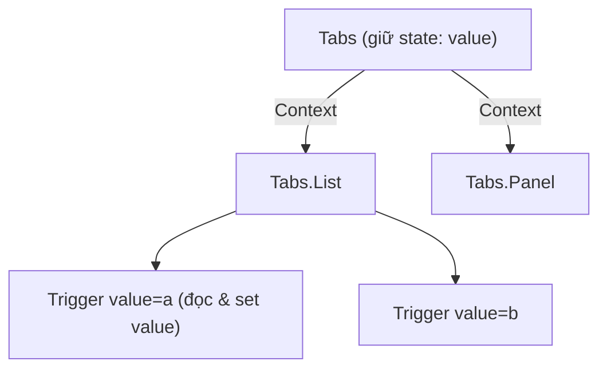

# Compound Components

## Mục lục

- [Tổng quan](#tổng-quan)
- [1. Vấn đề: props nổ tung](#1-vấn-đề-props-nổ-tung)
- [2. Ý tưởng compound components](#2-ý-tưởng-compound-components)
- [3. Cài đặt với Context](#3-cài-đặt-với-context)
- [4. Dùng và vì sao nó linh hoạt](#4-dùng-và-vì-sao-nó-linh-hoạt)
- [5. Gắn component con làm thuộc tính](#5-gắn-component-con-làm-thuộc-tính)
- [6. Controlled vs uncontrolled](#6-controlled-vs-uncontrolled)
- [7. cloneElement: cách cũ và vì sao tránh](#7-cloneelement-cách-cũ-và-vì-sao-tránh)
- [8. Ưu / nhược điểm](#8-ưu--nhược-điểm)
- [9. Câu hỏi tự kiểm tra](#9-câu-hỏi-tự-kiểm-tra)
- [Tài liệu tham khảo](#tài-liệu-tham-khảo)

---

## Tổng quan

**Compound components** là một nhóm component được thiết kế để **làm việc cùng nhau**, chia sẻ state ngầm thông qua Context. API trông như HTML gốc: `<select>` và `<option>`, hay `<Tabs>` và `<Tab>`.

> [!IMPORTANT]
> Pattern này giải quyết vấn đề "component cấu hình bằng quá nhiều props". Thay vì một `<Tabs items={[...]} activeColor=... renderTab=... />` rối rắm, người dùng **ghép** các mảnh con và bạn quản lý state chung phía sau.

---

## 1. Vấn đề: props nổ tung

Một component "all-in-one" cấu hình qua props sẽ phình to khó kiểm soát:

```tsx
// ❌ API cứng nhắc, khó tùy biến: muốn thêm icon? badge? đổi layout 1 tab?
<Tabs
  tabs={[
    { label: 'Hồ sơ', content: <Profile /> },
    { label: 'Cài đặt', content: <Settings /> },
  ]}
  activeIndex={0}
  onChange={...}
  tabClassName="..."
  contentClassName="..."
/>
```

Mỗi nhu cầu mới = thêm một prop. Cuối cùng component có 20 props và vẫn không đủ linh hoạt. Hiện tượng này gọi là **"prop explosion"** hay **"apropcalypse"**.

---

## 2. Ý tưởng compound components

Tách thành các mảnh, để người dùng tự sắp xếp; state chung (tab nào đang active) được chia sẻ **ngầm**:

```tsx
// ✅ API biểu cảm, linh hoạt
<Tabs defaultValue="profile">
  <Tabs.List>
    <Tabs.Trigger value="profile">Hồ sơ</Tabs.Trigger>
    <Tabs.Trigger value="settings">⚙️ Cài đặt</Tabs.Trigger>
  </Tabs.List>
  <Tabs.Panel value="profile"><Profile /></Tabs.Panel>
  <Tabs.Panel value="settings"><Settings /></Tabs.Panel>
</Tabs>
```

---

## 3. Cài đặt với Context

State chung (`value` đang chọn) đặt trong Context của `Tabs`; các con đọc Context để biết mình có đang active không.

```tsx
import { createContext, useContext, useState, ReactNode } from 'react';

type TabsCtx = { value: string; setValue: (v: string) => void };
const TabsContext = createContext<TabsCtx | null>(null);

function useTabs() {
  const ctx = useContext(TabsContext);
  if (!ctx) throw new Error('Các component Tabs.* phải nằm trong <Tabs>');
  return ctx;
}

function Tabs({ defaultValue, children }: { defaultValue: string; children: ReactNode }) {
  const [value, setValue] = useState(defaultValue);
  return <TabsContext.Provider value={{ value, setValue }}>{children}</TabsContext.Provider>;
}

function List({ children }: { children: ReactNode }) {
  return <div role="tablist" className="tabs-list">{children}</div>;
}

function Trigger({ value, children }: { value: string; children: ReactNode }) {
  const { value: active, setValue } = useTabs();
  const selected = active === value;
  return (
    <button role="tab" aria-selected={selected}
      className={selected ? 'tab active' : 'tab'}
      onClick={() => setValue(value)}>
      {children}
    </button>
  );
}

function Panel({ value, children }: { value: string; children: ReactNode }) {
  const { value: active } = useTabs();
  if (active !== value) return null; // chỉ hiện panel đang active
  return <div role="tabpanel">{children}</div>;
}
```

> [!TIP]
> Ném lỗi rõ ràng trong `useTabs` khi dùng ngoài `<Tabs>` giúp người dùng API của bạn debug nhanh — một dấu hiệu của compound component "có tâm".

---

## 4. Dùng và vì sao nó linh hoạt

```tsx
<Tabs defaultValue="a">
  <Tabs.List>
    <Tabs.Trigger value="a">Tab A</Tabs.Trigger>
    {/* Thêm icon, badge, bất cứ gì — không cần đổi code Tabs */}
    <Tabs.Trigger value="b"><Icon /> Tab B <Badge>3</Badge></Tabs.Trigger>
  </Tabs.List>
  <Tabs.Panel value="a">Nội dung A</Tabs.Panel>
  <Tabs.Panel value="b">Nội dung B</Tabs.Panel>
</Tabs>
```



Người dùng **toàn quyền** về bố cục, thứ tự, nội dung mỗi mảnh; bạn chỉ quản lý logic "tab nào đang chọn". Đây là **inversion of control** ở mức cao.

> [!NOTE]
> Vì các mảnh con đọc state qua Context, hãy nhớ bài học ở [Tối ưu Context](/toi-uu-rerender/context-optimization/): nếu value của Provider tạo mới mỗi render, mọi mảnh sẽ re-render. Với UI nhỏ thường không sao; với widget lớn, cân nhắc `useMemo` cho context value.

---

## 5. Gắn component con làm thuộc tính

Để có API `Tabs.List`, `Tabs.Trigger`, gắn chúng làm thuộc tính của `Tabs`:

```tsx
Tabs.List = List;
Tabs.Trigger = Trigger;
Tabs.Panel = Panel;

export { Tabs };
```

> [!NOTE]
> Cách này gom toàn bộ API vào một import (`import { Tabs }`) và thể hiện rõ quan hệ cha-con. Bạn cũng có thể export riêng từng cái nếu thích cây import phẳng — cả hai đều phổ biến.

---

## 6. Controlled vs uncontrolled

Như input HTML, compound component nên hỗ trợ cả hai chế độ:

```tsx
// Uncontrolled: Tabs tự giữ state, chỉ cần giá trị mặc định
<Tabs defaultValue="a">...</Tabs>

// Controlled: cha giữ state, Tabs nhận value + onValueChange
<Tabs value={tab} onValueChange={setTab}>...</Tabs>
```

```tsx
function Tabs({ value: controlled, defaultValue, onValueChange, children }: Props) {
  const [uncontrolled, setUncontrolled] = useState(defaultValue);
  const isControlled = controlled !== undefined;
  const value = isControlled ? controlled : uncontrolled;
  const setValue = (v: string) => {
    if (!isControlled) setUncontrolled(v);
    onValueChange?.(v);
  };
  return <TabsContext.Provider value={{ value, setValue }}>{children}</TabsContext.Provider>;
}
```

> [!TIP]
> Đây chính là cách các thư viện thật (Radix UI, Reach UI) thiết kế: dùng `value`/`onValueChange` để cha kiểm soát, hoặc `defaultValue` để component tự lo.

---

## 7. cloneElement: cách cũ và vì sao tránh

Trước khi Context phổ biến, người ta tiêm state cho con bằng `React.cloneElement`:

```tsx
// ❌ Cách cũ: lặp qua children và clone để tiêm props
function Tabs({ children }) {
  const [active, setActive] = useState(0);
  return Children.map(children, (child, i) =>
    cloneElement(child, { active: active === i, onSelect: () => setActive(i) })
  );
}
```

> [!WARNING]
> `cloneElement` chỉ tiêm được vào **con trực tiếp** — nếu user bọc thêm một `<div>` quanh `<Tab>`, props không tới được. Context không bị giới hạn này (con sâu mấy tầng vẫn đọc được). Vì vậy **ưu tiên Context** cho compound components hiện đại.

---

## 8. Ưu / nhược điểm

| Ưu điểm | Nhược điểm |
|---------|-----------|
| API biểu cảm, đọc như HTML | Cài đặt phức tạp hơn component props |
| Cực kỳ linh hoạt về bố cục | Người dùng phải đặt đúng cấu trúc lồng nhau |
| Không prop drilling giữa các mảnh | State ngầm khó lần hơn props tường minh |
| Mở rộng không cần thêm props | Cần xử lý lỗi khi dùng sai chỗ |

> [!IMPORTANT]
> Dùng compound components khi bạn xây **thư viện UI tái dùng** (tabs, accordion, menu, select, modal) cần linh hoạt cao. Với component đơn giản dùng nội bộ một chỗ, props thường gọn hơn — đừng over-engineer.

---

## 9. Câu hỏi tự kiểm tra

<Accordions type="single">
  <Accordion title="1. Compound components chia sẻ state cho các mảnh con bằng gì?">
    Bằng Context: cha (Tabs) đặt state vào Provider, các con (Trigger/Panel) đọc qua useContext.
  </Accordion>
  <Accordion title="2. Pattern này giải quyết vấn đề gì?">
    'Prop explosion' — component all-in-one phình ra hàng chục props mà vẫn không đủ linh hoạt. Thay bằng ghép các mảnh con.
  </Accordion>
  <Accordion title="3. Vì sao Context tốt hơn cloneElement?">
    cloneElement chỉ tiêm vào con trực tiếp; nếu user bọc thêm tầng thì props không tới. Context cho con sâu mấy tầng vẫn đọc được.
  </Accordion>
  <Accordion title="4. Controlled và uncontrolled khác gì?">
    Uncontrolled: component tự giữ state (defaultValue). Controlled: cha giữ state và truyền value + onValueChange. Component tốt nên hỗ trợ cả hai.
  </Accordion>
  <Accordion title="5. Khi nào KHÔNG nên dùng compound components?">
    Với component đơn giản dùng một chỗ — props tường minh gọn hơn. Pattern này hợp cho thư viện UI tái dùng cần linh hoạt cao.
  </Accordion>
</Accordions>

---

## Tài liệu tham khảo

- [Composition](/patterns/composition/)
- [Tối ưu Context](/toi-uu-rerender/context-optimization/)
- [Provider Pattern](/patterns/provider-pattern/)
- [Radix UI — Tabs](https://www.radix-ui.com/primitives/docs/components/tabs)
