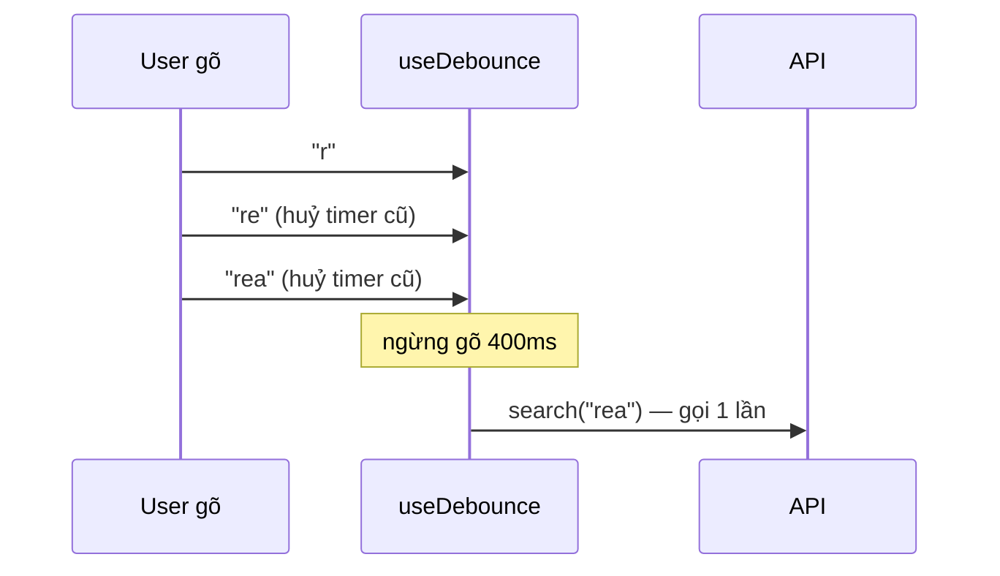
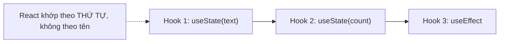

# Custom Hooks

## Mục lục

- [Tổng quan](#tổng-quan)
- [1. Custom hook là gì](#1-custom-hook-là-gì)
- [2. Hook chia sẻ LOGIC, không chia sẻ STATE](#2-hook-chia-sẻ-logic-không-chia-sẻ-state)
- [3. Ví dụ: useToggle](#3-ví-dụ-usetoggle)
- [4. Ví dụ: useDebounce](#4-ví-dụ-usedebounce)
- [5. Ví dụ: useFetch](#5-ví-dụ-usefetch)
- [6. Quy tắc của Hook (Rules of Hooks)](#6-quy-tắc-của-hook-rules-of-hooks)
  - [6.1 Vì sao thứ tự gọi hook quan trọng](#61-vì-sao-thứ-tự-gọi-hook-quan-trọng)
- [7. Ghép các hook lại với nhau](#7-ghép-các-hook-lại-với-nhau)
- [8. Thiết kế API hook tốt](#8-thiết-kế-api-hook-tốt)
- [9. Câu hỏi tự kiểm tra](#9-câu-hỏi-tự-kiểm-tra)
- [Tài liệu tham khảo](#tài-liệu-tham-khảo)

---

## Tổng quan

**Custom hook** là một hàm JavaScript có tên bắt đầu bằng `use` và **gọi các hook khác** bên trong. Nó là cách chính thống để **trích xuất logic stateful** ra khỏi component để tái dùng — thay thế các pattern cũ như HOC và render props cho hầu hết trường hợp.

<Callout type="info" title="Important">

Custom hook không phải là tính năng đặc biệt của React — nó chỉ là một hàm tuân theo quy ước đặt tên `use*`. "Phép màu" nằm ở chỗ nó gọi `useState`/`useEffect`... bên trong, và React theo dõi các hook đó theo đúng thứ tự gọi (xem [Fiber](/react-internals/fiber-reconciliation/)).

</Callout>

---

## 1. Custom hook là gì

```tsx
import { useState, useEffect } from 'react';

// Logic "lắng nghe kích thước cửa sổ" trích thành hook tái dùng
function useWindowWidth() {
  const [width, setWidth] = useState(window.innerWidth);

  useEffect(() => {
    const onResize = () => setWidth(window.innerWidth);
    window.addEventListener('resize', onResize);
    return () => window.removeEventListener('resize', onResize); // cleanup
  }, []);

  return width;
}

// Dùng trong nhiều component khác nhau:
function Header() {
  const width = useWindowWidth();
  return <p>Bề rộng: {width}px {width < 768 && '(mobile)'}</p>;
}
```

---

## 2. Hook chia sẻ LOGIC, không chia sẻ STATE

Đây là hiểu lầm phổ biến nhất. Hai component dùng **cùng** một custom hook sẽ có **state riêng biệt**, hoàn toàn độc lập.

```tsx
function A() {
  const w = useWindowWidth(); // state riêng của A
}
function B() {
  const w = useWindowWidth(); // state riêng của B — KHÔNG dùng chung với A
}
```

<Callout type="info" title="Note">

Mỗi lần gọi hook là một "thể hiện" state mới. Muốn **chia sẻ state** giữa nhiều component, dùng Context hoặc một store ngoài — không phải custom hook. Custom hook chỉ chia sẻ **công thức**, không chia sẻ **dữ liệu**.

</Callout>

---

## 3. Ví dụ: useToggle

Hook nhỏ cho mẫu bật/tắt rất hay gặp:

```tsx
import { useState, useCallback } from 'react';

function useToggle(initial = false) {
  const [on, setOn] = useState(initial);
  const toggle = useCallback(() => setOn((v) => !v), []);
  const setTrue = useCallback(() => setOn(true), []);
  const setFalse = useCallback(() => setOn(false), []);
  return { on, toggle, setTrue, setFalse };
}

function Modal() {
  const { on, toggle, setFalse } = useToggle();
  return (
    <>
      <button onClick={toggle}>Mở/Đóng</button>
      {on && <div className="modal">Nội dung <button onClick={setFalse}>×</button></div>}
    </>
  );
}
```

---

## 4. Ví dụ: useDebounce

Trì hoãn một giá trị — kinh điển cho ô tìm kiếm để không gọi API mỗi ký tự:

```tsx
import { useState, useEffect } from 'react';

function useDebounce<T>(value: T, delay = 300): T {
  const [debounced, setDebounced] = useState(value);

  useEffect(() => {
    const id = setTimeout(() => setDebounced(value), delay);
    return () => clearTimeout(id); // hủy timer cũ nếu value đổi trước khi hết delay
  }, [value, delay]);

  return debounced;
}

function Search() {
  const [text, setText] = useState('');
  const debouncedText = useDebounce(text, 400);

  useEffect(() => {
    if (debouncedText) fetch(`/api/search?q=${debouncedText}`);
  }, [debouncedText]); // chỉ gọi API sau khi user ngừng gõ 400ms

  return <input value={text} onChange={(e) => setText(e.target.value)} />;
}
```



---

## 5. Ví dụ: useFetch

Đóng gói trạng thái loading/error/data:

```tsx
import { useState, useEffect } from 'react';

type State<T> = { data: T | null; loading: boolean; error: Error | null };

function useFetch<T>(url: string): State<T> {
  const [state, setState] = useState<State<T>>({ data: null, loading: true, error: null });

  useEffect(() => {
    let cancelled = false;
    setState({ data: null, loading: true, error: null });

    fetch(url)
      .then((r) => r.json())
      .then((data) => { if (!cancelled) setState({ data, loading: false, error: null }); })
      .catch((error) => { if (!cancelled) setState({ data: null, loading: false, error }); });

    return () => { cancelled = true; }; // tránh setState sau khi unmount / url đổi
  }, [url]);

  return state;
}

function UserProfile({ id }: { id: number }) {
  const { data, loading, error } = useFetch<{ name: string }>(`/api/users/${id}`);
  if (loading) return <p>Đang tải…</p>;
  if (error) return <p>Lỗi: {error.message}</p>;
  return <h1>{data!.name}</h1>;
}
```

<Callout type="info" title="Tip">

Cho production, hãy dùng **TanStack Query** hoặc **SWR** thay vì tự viết `useFetch` — chúng lo cache, retry, dedupe, revalidate. Nhưng tự viết một lần giúp bạn hiểu vì sao cần cờ `cancelled` (tránh race condition khi `url` đổi nhanh).

</Callout>

---

## 6. Quy tắc của Hook (Rules of Hooks)

<Callout type="warn" title="Warning">

Hai quy tắc bắt buộc, vi phạm là bug khó lường:

1. **Chỉ gọi hook ở cấp cao nhất** — không trong `if`, vòng lặp, hàm lồng. React khớp hook theo **thứ tự gọi**; gọi có điều kiện làm lệch thứ tự → lấy nhầm state.
2. **Chỉ gọi hook trong** function component hoặc custom hook khác — không trong hàm thường.

</Callout>

```tsx
// ❌ SAI: gọi hook trong điều kiện
function Bad({ enabled }: { enabled: boolean }) {
  if (enabled) {
    const [x] = useState(0); // thứ tự hook đổi theo enabled → vỡ
  }
}

// ✅ ĐÚNG: hook luôn ở cấp cao nhất, điều kiện nằm BÊN TRONG
function Good({ enabled }: { enabled: boolean }) {
  const [x, setX] = useState(0);
  useEffect(() => {
    if (!enabled) return;
    // ...logic chỉ chạy khi enabled
  }, [enabled]);
}
```

Bật ESLint plugin `eslint-plugin-react-hooks` để bắt vi phạm tự động.

### 6.1 Vì sao thứ tự gọi hook quan trọng

React **không** biết tên biến bạn gán. Nó lưu state của mỗi hook vào một **danh sách liên kết** theo đúng **thứ tự gọi** trong fiber (xem [Fiber](/react-internals/fiber-reconciliation/)). Mỗi lần render, nó đi theo cùng thứ tự để lấy đúng ô state.



<Callout type="warn" title="Warning">

Nếu bạn gọi hook trong `if`, một lần render có 3 hook, lần sau chỉ còn 2 → React lấy nhầm state của hook này cho hook khác → bug rất khó lần. Đó là lý do "luôn gọi ở cấp cao nhất, số lượng và thứ tự hook phải cố định giữa các lần render".

</Callout>

---

## 7. Ghép các hook lại với nhau

Sức mạnh thực sự: custom hook có thể **gọi custom hook khác**, xếp tầng logic như lập trình hàm. Ví dụ `useLocalStorage` dựng trên `useState` + `useEffect`:

```tsx
import { useState, useEffect } from 'react';

function useLocalStorage<T>(key: string, initial: T) {
  const [value, setValue] = useState<T>(() => {
    if (typeof window === 'undefined') return initial; // an toàn SSR
    const raw = localStorage.getItem(key);
    return raw ? (JSON.parse(raw) as T) : initial;
  });

  useEffect(() => {
    localStorage.setItem(key, JSON.stringify(value));
  }, [key, value]);

  return [value, setValue] as const;
}

// Ghép tiếp: một hook "theme lưu localStorage" chỉ viết thêm vài dòng
function useTheme() {
  const [theme, setTheme] = useLocalStorage<'light' | 'dark'>('theme', 'light');
  const toggle = () => setTheme((t) => (t === 'light' ? 'dark' : 'light'));
  return { theme, toggle };
}
```

<Callout type="info" title="Tip">

Ghép hook nhỏ thành hook lớn là cách tái dùng đẹp nhất trong React hiện đại — thay cho "wrapper hell" của HOC. Mỗi hook một việc, rồi xếp tầng.

</Callout>

---

## 8. Thiết kế API hook tốt

<Steps>
  <Step>
    ### Tên bắt đầu bằng "use"
    Bắt buộc để ESLint và React nhận diện là hook.
  </Step>
  <Step>
    ### Trả về thứ dễ dùng
    Trả mảng `[value, setter]` (như useState) khi muốn người dùng tự đặt tên, hoặc object `{ ... }` khi có nhiều giá trị cần tên rõ ràng.
  </Step>
  <Step>
    ### Mỗi hook một việc
    `useFetch` lo fetch, `useDebounce` lo debounce. Ghép chúng lại trong component, đừng nhồi mọi thứ vào một hook.
  </Step>
  <Step>
    ### Nhận tham số reactive đúng cách
    Nếu hook phụ thuộc props/state, nhận chúng làm tham số và đưa vào deps bên trong — đừng đọc biến ngoài.
  </Step>
</Steps>

---

## 9. Câu hỏi tự kiểm tra

<Accordions type="single">
  <Accordion title="1. Custom hook chia sẻ state hay logic?">
    Chia sẻ LOGIC (công thức). Hai component dùng cùng hook có state riêng biệt. Muốn chia sẻ state thì dùng Context/store ngoài.
  </Accordion>
  <Accordion title="2. Vì sao không được gọi hook trong if?">
    Vì React khớp state theo THỨ TỰ gọi (danh sách liên kết trong fiber). Gọi có điều kiện làm số lượng/thứ tự hook đổi → lấy nhầm state.
  </Accordion>
  <Accordion title="3. Cờ cancelled trong useFetch để làm gì?">
    Tránh race condition và setState sau khi unmount/url đổi: response cũ về muộn sẽ bị bỏ qua nhờ cờ cancelled trong cleanup.
  </Accordion>
  <Accordion title="4. Custom hook có thể gọi custom hook khác không?">
    Có. Đó chính là cách xếp tầng logic (vd useTheme dựng trên useLocalStorage dựng trên useState + useEffect).
  </Accordion>
  <Accordion title="5. Khi nào trả mảng vs object từ hook?">
    Mảng `[value, setter]` khi muốn người dùng tự đặt tên (như `useState`). Object `{ ... }` khi có nhiều giá trị cần tên rõ ràng.
  </Accordion>
</Accordions>

---

## Tài liệu tham khảo

- [React Docs — Reusing Logic with Custom Hooks](https://react.dev/learn/reusing-logic-with-custom-hooks)
- [React Docs — Rules of Hooks](https://react.dev/reference/rules/rules-of-hooks)
- [Render Props](/patterns/render-props/)
- [Fiber & Reconciliation](/react-internals/fiber-reconciliation/)
