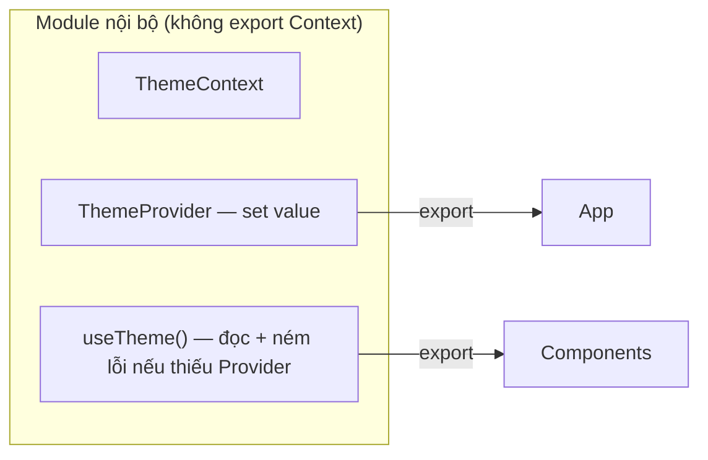

# Provider Pattern

## Mục lục

- [Tổng quan](#tổng-quan)
- [1. Context "trần" và vấn đề của nó](#1-context-trần-và-vấn-đề-của-nó)
- [2. Đóng gói: Provider + custom hook](#2-đóng-gói-provider--custom-hook)
- [3. Ví dụ đầy đủ: ThemeProvider](#3-ví-dụ-đầy-đủ-themeprovider)
- [4. Ghép nhiều Provider gọn gàng](#4-ghép-nhiều-provider-gọn-gàng)
- [5. Provider Pattern + performance](#5-provider-pattern--performance)
- [6. Checklist một Provider tốt](#6-checklist-một-provider-tốt)
- [Tài liệu tham khảo](#tài-liệu-tham-khảo)

---

## Tổng quan

**Provider Pattern** là cách đóng gói một Context thành một bộ ba sạch sẽ: một component `Provider` quản lý state, một custom hook `use*` để đọc, và Context được **giấu kín** không export ra ngoài. Đây là cách dùng Context "đúng chuẩn" trong app thật.

> [!IMPORTANT]
> Pattern này là sự kết hợp của ba thứ đã học: **Context** ([tối ưu context](/toi-uu-rerender/context-optimization/)) + **composition** ([composition](/patterns/composition/)) + **custom hook** ([custom hooks](/patterns/custom-hooks/)). Nó biến Context lộn xộn thành một API gọn như một thư viện.

---

## 1. Context "trần" và vấn đề của nó

Dùng Context trực tiếp khắp nơi sinh ra nhiều phiền:

```tsx
const ThemeContext = createContext(null); // export ra ngoài

function DeepComponent() {
  const theme = useContext(ThemeContext); // theme có thể là null!
  return <div>{theme.color}</div>; // 💥 crash nếu component nằm ngoài Provider
}
```

Vấn đề:
- Phải import cả `ThemeContext` lẫn `useContext` ở mọi nơi.
- Không có cảnh báo khi dùng **ngoài** Provider → `null` → crash khó hiểu.
- Kiểu (type) thường là `T | null`, phải kiểm tra null lặp đi lặp lại.

---

## 2. Đóng gói: Provider + custom hook

Giải pháp: **giấu** Context, chỉ export `Provider` và hook `use*`.



---

## 3. Ví dụ đầy đủ: ThemeProvider

```tsx
import { createContext, useContext, useState, useMemo, useCallback, ReactNode } from 'react';

type Theme = 'light' | 'dark';
type ThemeValue = { theme: Theme; toggle: () => void };

// Context KHÔNG export — chi tiết nội bộ
const ThemeContext = createContext<ThemeValue | undefined>(undefined);

export function ThemeProvider({ children }: { children: ReactNode }) {
  const [theme, setTheme] = useState<Theme>('light');
  const toggle = useCallback(() => setTheme((t) => (t === 'light' ? 'dark' : 'light')), []);

  // useMemo để value chỉ đổi tham chiếu khi theme đổi (tránh re-render thừa)
  const value = useMemo(() => ({ theme, toggle }), [theme, toggle]);

  return <ThemeContext.Provider value={value}>{children}</ThemeContext.Provider>;
}

// Custom hook: API duy nhất để đọc — type-safe, có guard
export function useTheme(): ThemeValue {
  const ctx = useContext(ThemeContext);
  if (ctx === undefined) {
    throw new Error('useTheme phải được dùng bên trong <ThemeProvider>');
  }
  return ctx; // kiểu là ThemeValue (không còn undefined) → hết phải check null
}
```

Sử dụng cực gọn ở mọi nơi:

```tsx
function App() {
  return (
    <ThemeProvider>
      <Toolbar />
    </ThemeProvider>
  );
}

function Toolbar() {
  const { theme, toggle } = useTheme(); // không cần import Context, type chuẩn
  return <button onClick={toggle}>Theme hiện tại: {theme}</button>;
}
```

> [!TIP]
> Cái lỗi ném ra trong `useTheme` là "vàng": nếu ai đó vô tình dùng `useTheme` ngoài `<ThemeProvider>`, họ nhận thông báo rõ ràng ngay, thay vì một `Cannot read property of undefined` bí ẩn.

---

## 4. Ghép nhiều Provider gọn gàng

App thật có nhiều Provider lồng nhau → dễ thành "kim tự tháp". Gom lại thành một component:

```tsx
// ❌ Kim tự tháp trong App
<ThemeProvider>
  <AuthProvider>
    <I18nProvider>
      <QueryProvider>
        <App />
      </QueryProvider>
    </I18nProvider>
  </AuthProvider>
</ThemeProvider>

// ✅ Gom thành <AppProviders>
function AppProviders({ children }: { children: ReactNode }) {
  return (
    <ThemeProvider>
      <AuthProvider>
        <I18nProvider>
          <QueryProvider>{children}</QueryProvider>
        </I18nProvider>
      </AuthProvider>
    </ThemeProvider>
  );
}

// Dùng: <AppProviders><App /></AppProviders>
```

> [!NOTE]
> Có thể viết helper gộp mảng provider để hết lồng, nhưng cách trên đủ rõ ràng cho hầu hết dự án. Đừng trừu tượng hoá quá mức.

---

## 5. Provider Pattern + performance

Một Provider tốt phải `useMemo` cho `value` (như ví dụ trên). Nếu state trong provider đổi **nhiều** và nhiều consumer chỉ cần một phần, áp dụng kỹ thuật ở bài [Tối ưu Context](/toi-uu-rerender/context-optimization/):

- Tách `state` và `dispatch` thành hai context.
- Chia một provider lớn thành nhiều provider theo tần suất đổi.

```tsx
// Provider tách dispatch để component "chỉ ghi" không render khi state đổi
export function TodosProvider({ children }: { children: ReactNode }) {
  const [todos, dispatch] = useReducer(reducer, []);
  return (
    <TodosStateContext.Provider value={todos}>
      <TodosDispatchContext.Provider value={dispatch}>
        {children}
      </TodosDispatchContext.Provider>
    </TodosStateContext.Provider>
  );
}
```

---

## 6. Checklist một Provider tốt

<Steps>
  <Step>
    ### Giấu Context, export Provider + hook
    Không cho ai `import` Context trực tiếp.
  </Step>
  <Step>
    ### Hook ném lỗi khi thiếu Provider
    Dùng `undefined` làm default + guard → type-safe và báo lỗi rõ.
  </Step>
  <Step>
    ### useMemo cho value
    Tránh re-render toàn bộ consumer mỗi lần Provider render.
  </Step>
  <Step>
    ### Tách theo tần suất đổi nếu cần
    State hay đổi tách khỏi state ít đổi; tách state khỏi dispatch.
  </Step>
</Steps>

---

## Tài liệu tham khảo

- [React Docs — Scaling Up with Reducer and Context](https://react.dev/learn/scaling-up-with-reducer-and-context)
- [Tối ưu Context](/toi-uu-rerender/context-optimization/)
- [Custom Hooks](/patterns/custom-hooks/)
- [State Reducer](/patterns/state-reducer/)
