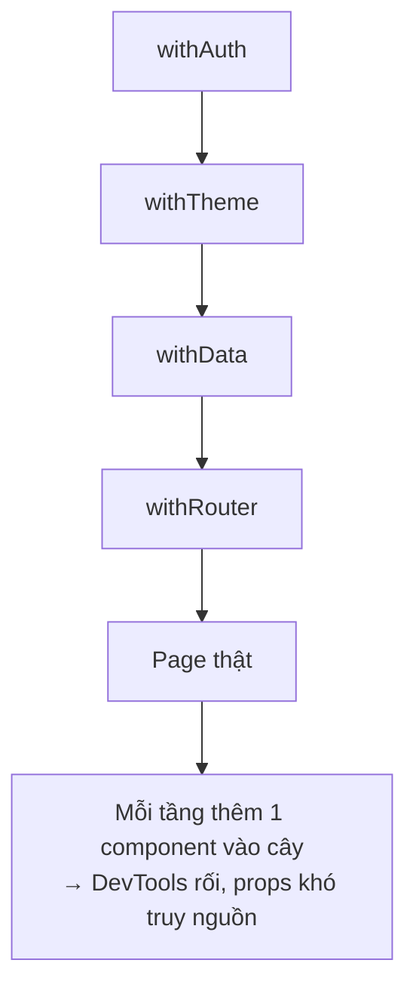

# Render Props & HOC

## Mục lục

- [Tổng quan](#tổng-quan)
- [1. Render Props là gì](#1-render-props-là-gì)
- [2. Ví dụ: MouseTracker](#2-ví-dụ-mousetracker)
  - [2.1 render prop vs children-as-function](#21-render-prop-vs-children-as-function)
- [3. Higher-Order Component (HOC)](#3-higher-order-component-hoc)
  - [3.1 Ba quy tắc viết HOC đúng](#31-ba-quy-tắc-viết-hoc-đúng)
- [4. Vấn đề: wrapper hell](#4-vấn-đề-wrapper-hell)
- [5. Custom hook thay thế cả hai](#5-custom-hook-thay-thế-cả-hai)
- [6. Lưu ý performance của render props](#6-lưu-ý-performance-của-render-props)
- [7. Khi nào vẫn nên dùng](#7-khi-nào-vẫn-nên-dùng)
- [8. Câu hỏi tự kiểm tra](#8-câu-hỏi-tự-kiểm-tra)
- [Tài liệu tham khảo](#tài-liệu-tham-khảo)

---

## Tổng quan

**Render props** và **HOC** (Higher-Order Component) là hai pattern kinh điển để **chia sẻ logic** giữa các component — ra đời **trước** khi có hooks. Hiểu chúng giúp bạn (a) đọc code cũ, (b) nắm vì sao hooks thắng thế, (c) nhận ra vài trường hợp chúng vẫn hữu ích.

<Callout type="info" title="Important">

Với code mới, **custom hook** gần như luôn là lựa chọn tốt hơn cả render props lẫn HOC để chia sẻ logic stateful. Nhưng render props vẫn sống khỏe cho việc **chia sẻ JSX/cách render**, và HOC vẫn xuất hiện trong nhiều thư viện.

</Callout>

---

## 1. Render Props là gì

Một component nhận một **hàm** qua prop (thường là `children` hoặc `render`), và **gọi hàm đó** để biết phải render gì — truyền dữ liệu nội bộ vào hàm.

```tsx
// "render prop" = prop có giá trị là một hàm trả về JSX
<DataProvider render={(data) => <h1>{data.title}</h1>} />

// Hoặc dùng children làm hàm:
<DataProvider>{(data) => <h1>{data.title}</h1>}</DataProvider>
```

Component giữ **logic + state**; nơi dùng quyết định **giao diện** từ dữ liệu đó. Đây là một dạng [inversion of control](/patterns/composition/) — nhưng thay vì giao "nội dung tĩnh" (children thường), ta giao một **hàm** nhận dữ liệu động.

---

## 2. Ví dụ: MouseTracker

```tsx
import { useState, ReactNode } from 'react';

function Mouse({ children }: { children: (pos: { x: number; y: number }) => ReactNode }) {
  const [pos, setPos] = useState({ x: 0, y: 0 });
  return (
    <div
      style={{ height: '100vh' }}
      onMouseMove={(e) => setPos({ x: e.clientX, y: e.clientY })}
    >
      {children(pos)} {/* gọi render prop với dữ liệu nội bộ */}
    </div>
  );
}

// Cùng logic "theo dõi chuột", hai cách hiển thị khác nhau:
function App() {
  return (
    <Mouse>
      {({ x, y }) => <p>Chuột ở ({x}, {y})</p>}
    </Mouse>
  );
}
```

`Mouse` không quyết định hiển thị gì — nó đưa toạ độ cho hàm con. Logic theo dõi chuột được tái dùng cho mọi cách render.

### 2.1 render prop vs children-as-function

Cùng một ý tưởng, hai cú pháp:

| Cách | Cú pháp | Khi nào |
|------|---------|---------|
| Prop tên `render` | `<X render={(d) => ...} />` | Khi cần nhiều "slot hàm" (render, renderHeader, renderRow) |
| `children` là hàm | `<X>{(d) => ...}</X>` | Khi chỉ có một vùng render — đọc tự nhiên hơn |

<Callout type="info" title="Note">

Cả hai hoàn toàn tương đương về cơ chế: component bên trong gọi hàm và truyền dữ liệu vào. Chọn cái nào là vấn đề khẩu vị/đọc hiểu.

</Callout>

---

## 3. Higher-Order Component (HOC)

HOC là một **hàm nhận một component, trả về một component mới** đã "bọc" thêm logic/props. Quy ước tên `with*`.

```tsx
import { ComponentType, useState, useEffect } from 'react';

// HOC tiêm prop "width" vào component được bọc
function withWindowWidth<P>(Wrapped: ComponentType<P & { width: number }>) {
  return function Enhanced(props: P) {
    const [width, setWidth] = useState(window.innerWidth);
    useEffect(() => {
      const onResize = () => setWidth(window.innerWidth);
      window.addEventListener('resize', onResize);
      return () => window.removeEventListener('resize', onResize);
    }, []);
    return <Wrapped {...props} width={width} />;
  };
}

// Dùng:
function Bar({ width }: { width: number }) {
  return <p>Rộng {width}px</p>;
}
const BarWithWidth = withWindowWidth(Bar);
```

<Callout type="info" title="Note">

`connect()` của Redux cũ, `withRouter` của React Router cũ đều là HOC. Bạn vẫn gặp chúng nhiều trong codebase đời trước.

</Callout>

### 3.1 Ba quy tắc viết HOC đúng

<Steps>
  <Step>
    ### Truyền xuyên props không liên quan
    HOC chỉ nên thêm/sửa props nó phụ trách, còn lại `{...props}` chuyển thẳng cho component bọc.
  </Step>
  <Step>
    ### Không gọi HOC trong render
    `const Enhanced = withX(Comp)` phải nằm ở **module scope**. Gọi trong render tạo component mới mỗi lần → remount, mất state.
  </Step>
  <Step>
    ### Copy static & đặt displayName
    Sao chép static methods (hoặc dùng `hoist-non-react-statics`) và đặt `Enhanced.displayName = 'withX(Comp)'` để DevTools dễ đọc.
  </Step>
</Steps>

---

## 4. Vấn đề: wrapper hell

Cả render props lồng nhau lẫn HOC chồng nhau đều tạo ra **cây bọc sâu**, khó đọc và khó debug:

```tsx
// Render props lồng — "kim tự tháp tận thế"
<Auth>
  {(user) => (
    <Theme>
      {(theme) => (
        <Data>
          {(data) => <Page user={user} theme={theme} data={data} />}
        </Data>
      )}
    </Theme>
  )}
</Auth>

// HOC chồng — khó biết prop nào từ đâu
export default withAuth(withTheme(withData(withRouter(Page))));
```



---

## 5. Custom hook thay thế cả hai

Hook làm cùng việc (chia sẻ logic stateful) mà **không** thêm tầng vào cây component:

```tsx
// Thay vì withWindowWidth (HOC) hay <Mouse> (render prop):
function useWindowWidth() {
  const [width, setWidth] = useState(window.innerWidth);
  useEffect(() => {
    const onResize = () => setWidth(window.innerWidth);
    window.addEventListener('resize', onResize);
    return () => window.removeEventListener('resize', onResize);
  }, []);
  return width;
}

// Dùng phẳng, rõ ràng:
function Page() {
  const width = useWindowWidth();
  const user = useAuth();
  const theme = useTheme();
  return <p>{user.name} – {theme} – {width}px</p>;
}
```

| Tiêu chí | Render Props | HOC | Custom Hook |
|----------|-------------|-----|-------------|
| Thêm tầng vào cây | Có | Có | **Không** |
| Truy nguồn dữ liệu | Trung bình | Khó (props "ma") | **Dễ** |
| Trùng tên prop | — | Dễ đụng | Không vấn đề |
| Chia sẻ logic stateful | Được | Được | **Tốt nhất** |
| Chia sẻ cách **render** | **Tốt** | Kém | Không phải việc của nó |

---

## 6. Lưu ý performance của render props

Hàm render prop viết **inline** được tạo mới mỗi render của cha → nếu component nhận nó bọc `memo`, memo sẽ vô hiệu (xem [Referential Equality](/toi-uu-rerender/referential-equality/)):

```tsx
// Mỗi lần Parent render, hàm này là tham chiếu mới
<Mouse>{(pos) => <Dot pos={pos} />}</Mouse>
```

<Callout type="warn" title="Warning">

Thường thì điều này **không đáng lo** vì render prop bản chất phải chạy lại khi dữ liệu nội bộ đổi. Chỉ để tâm khi component chứa render prop nặng và bạn đang cố memo hóa — khi đó cân nhắc `useCallback` cho hàm render hoặc chuyển sang custom hook.

</Callout>

---

## 7. Khi nào vẫn nên dùng

<Accordions type="single">
  <Accordion title="Render props: khi cần chia sẻ CÁCH RENDER">
    Khi component cần để nơi dùng quyết định render gì từ dữ liệu/trạng thái nội bộ — vd Virtualizer, Tooltip cho phép custom nội dung, list ảo hóa. Hook không truyền JSX ngược lên được.
  </Accordion>
  <Accordion title="HOC: khi bọc cross-cutting cho component bất kỳ">
    Khi cần áp một hành vi lên nhiều component có sẵn mà không sửa từng cái (vd error boundary wrapper, analytics tracking, code cũ của thư viện).
  </Accordion>
  <Accordion title="Mặc định cho logic mới: custom hook">
    Mọi logic stateful tái dùng → viết custom hook trước. Chỉ rơi về render props/HOC khi hook không diễn đạt được nhu cầu.
  </Accordion>
</Accordions>

---

## 8. Câu hỏi tự kiểm tra

<Accordions type="single">
  <Accordion title="1. Render prop khác children thường ở điểm nào?">
    children thường là JSX tĩnh; render prop là một HÀM nhận dữ liệu nội bộ và trả JSX, cho phép nơi dùng render theo state của component.
  </Accordion>
  <Accordion title="2. HOC là gì?">
    Một hàm nhận một component và trả về component mới đã bọc thêm logic/props. Quy ước tên with*.
  </Accordion>
  <Accordion title="3. Vì sao không gọi withX(Comp) trong render?">
    Mỗi render tạo một component mới → React remount, mất state. Phải đặt ở module scope.
  </Accordion>
  <Accordion title="4. Vì sao custom hook thường thắng cả render props lẫn HOC?">
    Vì hook chia sẻ logic mà KHÔNG thêm tầng vào cây component, dữ liệu đi tường minh, không 'wrapper hell', không trùng tên prop.
  </Accordion>
  <Accordion title="5. Khi nào render props vẫn hơn hook?">
    Khi cần để NƠI DÙNG quyết định cách render từ trạng thái nội bộ (vd list ảo hóa, tooltip custom). Hook không trả JSX ngược lên cây được.
  </Accordion>
</Accordions>

---

## Tài liệu tham khảo

- [React (legacy) — Render Props](https://legacy.reactjs.org/docs/render-props.html)
- [React (legacy) — Higher-Order Components](https://legacy.reactjs.org/docs/higher-order-components.html)
- [Custom Hooks](/patterns/custom-hooks/)
- [Composition](/patterns/composition/)
