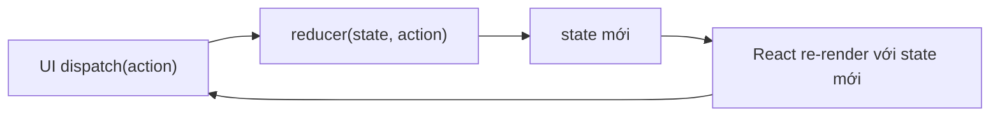
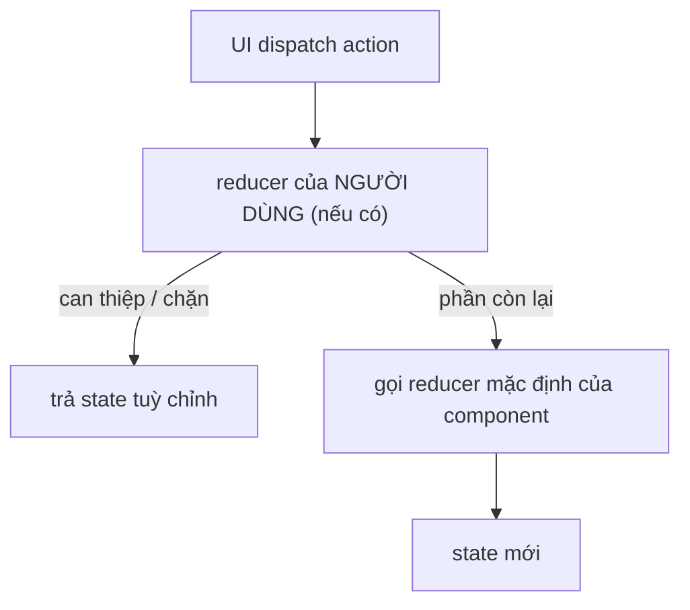

# State Reducer & useReducer

## Mục lục

- [Tổng quan](#tổng-quan)
- [1. Khi useState không còn đủ](#1-khi-usestate-không-còn-đủ)
- [2. useReducer cơ bản](#2-usereducer-cơ-bản)
- [3. Ví dụ: giỏ hàng](#3-ví-dụ-giỏ-hàng)
- [4. useReducer vs useState](#4-usereducer-vs-usestate)
- [5. State Reducer Pattern — đảo quyền điều khiển](#5-state-reducer-pattern--đảo-quyền-điều-khiển)
- [6. Best practices](#6-best-practices)
- [Tài liệu tham khảo](#tài-liệu-tham-khảo)

---

## Tổng quan

`useReducer` gom logic cập nhật state vào **một hàm thuần `reducer(state, action) => newState`**, thay vì rải rác nhiều `setState`. **State Reducer Pattern** (do Kent C. Dodds phổ biến) tiến thêm một bước: cho **người dùng component** truyền vào reducer của riêng họ để **can thiệp** cách state thay đổi — đỉnh cao của inversion of control.

> [!IMPORTANT]
> Phân biệt hai khái niệm cùng tên: **`useReducer`** là một hook quản lý state nội bộ. **State reducer pattern** là một kỹ thuật thiết kế component tái dùng, cho phép bên ngoài ghi đè logic transition. Bài này nói cả hai.

---

## 1. Khi useState không còn đủ

`useState` lý tưởng cho state đơn giản, độc lập. Nó đuối khi:

- Nhiều mẩu state **liên quan** và đổi cùng nhau.
- State mới phụ thuộc phức tạp vào state cũ + loại hành động.
- Logic cập nhật rải rác qua nhiều handler, khó test.

```tsx
// ❌ Nhiều useState liên quan → handler phức tạp, dễ quên cập nhật đồng bộ
const [items, setItems] = useState([]);
const [total, setTotal] = useState(0);
const [count, setCount] = useState(0);
// mỗi lần thêm hàng phải nhớ set cả 3 → dễ lệch
```

---

## 2. useReducer cơ bản

```tsx
import { useReducer } from 'react';

type State = { count: number };
type Action = { type: 'increment' } | { type: 'decrement' } | { type: 'reset' };

// reducer là HÀM THUẦN: (state, action) => state mới. Không side effect.
function reducer(state: State, action: Action): State {
  switch (action.type) {
    case 'increment': return { count: state.count + 1 };
    case 'decrement': return { count: state.count - 1 };
    case 'reset': return { count: 0 };
    default: return state;
  }
}

function Counter() {
  const [state, dispatch] = useReducer(reducer, { count: 0 });
  return (
    <div>
      <button onClick={() => dispatch({ type: 'decrement' })}>−</button>
      <span>{state.count}</span>
      <button onClick={() => dispatch({ type: 'increment' })}>+</button>
      <button onClick={() => dispatch({ type: 'reset' })}>Reset</button>
    </div>
  );
}
```



> [!NOTE]
> `dispatch` **ổn định** suốt vòng đời component (giống setter của useState) — truyền xuống con hay đưa vào deps đều an toàn, không gây re-render thừa.

---

## 3. Ví dụ: giỏ hàng

State liên quan (danh sách + tổng tiền) được tính **tập trung**, không bao giờ lệch:

```tsx
type Item = { id: string; name: string; price: number; qty: number };
type CartState = { items: Item[]; total: number };
type CartAction =
  | { type: 'add'; item: Omit<Item, 'qty'> }
  | { type: 'remove'; id: string }
  | { type: 'changeQty'; id: string; qty: number };

function cartReducer(state: CartState, action: CartAction): CartState {
  switch (action.type) {
    case 'add': {
      const existing = state.items.find((i) => i.id === action.item.id);
      const items = existing
        ? state.items.map((i) => i.id === action.item.id ? { ...i, qty: i.qty + 1 } : i)
        : [...state.items, { ...action.item, qty: 1 }];
      return { items, total: calcTotal(items) };
    }
    case 'remove': {
      const items = state.items.filter((i) => i.id !== action.id);
      return { items, total: calcTotal(items) };
    }
    case 'changeQty': {
      const items = state.items.map((i) => i.id === action.id ? { ...i, qty: action.qty } : i);
      return { items, total: calcTotal(items) };
    }
    default: return state;
  }
}

const calcTotal = (items: Item[]) => items.reduce((s, i) => s + i.price * i.qty, 0);
```

`total` luôn được tính lại cùng `items` trong reducer → **không thể** lệch nhau. Đây là lợi ích lớn nhất so với nhiều `useState` riêng lẻ.

---

## 4. useReducer vs useState

| Tiêu chí | useState | useReducer |
|----------|----------|------------|
| State đơn giản, độc lập | ✅ Gọn | Thừa |
| Nhiều mẩu state liên quan | Dễ lệch | ✅ Tập trung, đồng bộ |
| Logic transition phức tạp | Rải rác | ✅ Một chỗ, dễ đọc |
| Test logic | Phải render | ✅ Test reducer thuần, không cần React |
| Truyền "cách cập nhật" xuống sâu | Truyền nhiều setter | ✅ Chỉ truyền `dispatch` |

> [!TIP]
> Reducer là **hàm thuần** nên test cực dễ: `expect(reducer(state, action)).toEqual(expected)` — không cần render component, không cần mock. Đây là lý do logic phức tạp nên nằm trong reducer.

---

## 5. State Reducer Pattern — đảo quyền điều khiển

Đây là phần "nâng cao" thực sự. Một component tái dùng (vd `<Toggle>`) quản lý state nội bộ bằng reducer, nhưng **cho phép người dùng truyền vào một reducer** để **can thiệp/ghi đè** quyết định transition.

```tsx
import { useReducer } from 'react';

type ToggleState = { on: boolean };
type ToggleAction = { type: 'toggle' } | { type: 'force'; value: boolean };

// reducer mặc định của component
function toggleReducer(state: ToggleState, action: ToggleAction): ToggleState {
  switch (action.type) {
    case 'toggle': return { on: !state.on };
    case 'force': return { on: action.value };
    default: return state;
  }
}

function useToggle({
  // người dùng có thể truyền reducer riêng để bọc/ghi đè reducer mặc định
  reducer = toggleReducer,
}: { reducer?: typeof toggleReducer } = {}) {
  const [state, dispatch] = useReducer(reducer, { on: false });
  return {
    on: state.on,
    toggle: () => dispatch({ type: 'toggle' }),
    setOn: (value: boolean) => dispatch({ type: 'force', value }),
  };
}
```

Người dùng can thiệp logic mà **không** cần component cho sẵn prop cho từng tình huống:

```tsx
function App() {
  // Yêu cầu lạ: "không cho phép tắt quá 4 lần" — component gốc đâu lường trước!
  const clickCount = useRef(0);

  const { on, toggle } = useToggle({
    reducer(state, action) {
      if (action.type === 'toggle' && state.on && clickCount.current >= 4) {
        return state; // chặn việc tắt — giữ nguyên
      }
      if (action.type === 'toggle') clickCount.current++;
      return toggleReducer(state, action); // còn lại theo mặc định
    },
  });

  return <button onClick={toggle}>{on ? 'BẬT' : 'TẮT'}</button>;
}
```



> [!IMPORTANT]
> Sức mạnh của state reducer pattern: component thư viện **không thể** đoán hết mọi nhu cầu tương lai. Thay vì nhồi vô số props (`onBeforeToggle`, `maxToggles`, ...), nó giao cho người dùng **toàn bộ quyết định transition** qua một reducer. Người dùng tái dùng reducer mặc định cho phần họ không quan tâm. Đây là mức inversion of control cao nhất trong các pattern.

---

## 6. Best practices

<Steps>
  <Step>
    ### Reducer phải thuần
    Không fetch, không set ref, không random/Date.now() trong reducer. Side effect đặt ở effect/handler.
  </Step>
  <Step>
    ### Action có cấu trúc rõ
    Dùng `type` + payload, đặt tên theo "chuyện gì đã xảy ra" (`'addedToCart'`) hơn là "set field gì".
  </Step>
  <Step>
    ### Không mutate state
    Luôn trả object/array MỚI (`{...state}`, `[...arr]`). Mutate trực tiếp phá cơ chế so sánh và bailout.
  </Step>
  <Step>
    ### Kết hợp với Context khi cần chia sẻ
    `useReducer` + Context (tách state/dispatch) là bộ đôi quản lý state toàn cục nhẹ — xem Provider Pattern & Tối ưu Context.
  </Step>
</Steps>

---

## Tài liệu tham khảo

- [React Docs — useReducer](https://react.dev/reference/react/useReducer)
- [React Docs — Extracting State Logic into a Reducer](https://react.dev/learn/extracting-state-logic-into-a-reducer)
- [Kent C. Dodds — The State Reducer Pattern with Hooks](https://kentcdodds.com/blog/the-state-reducer-pattern-with-hooks)
- [Provider Pattern](/patterns/provider-pattern/)
