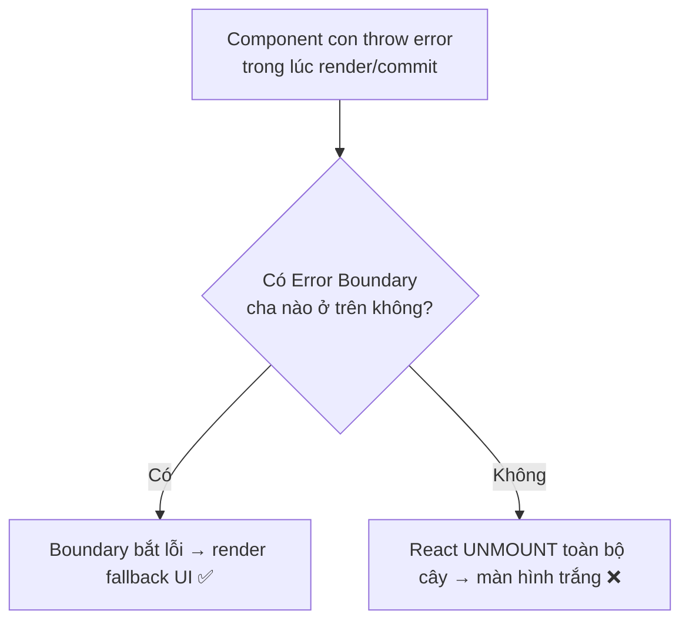
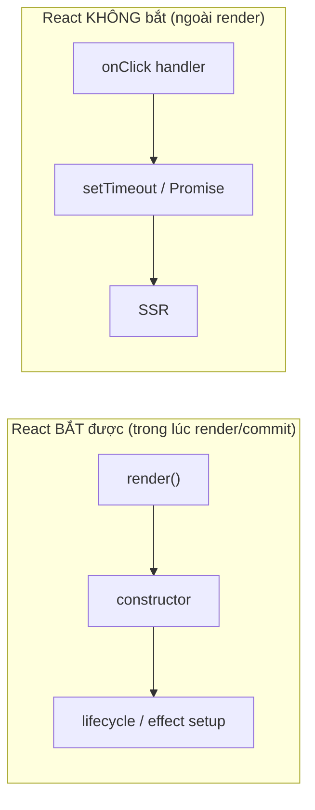
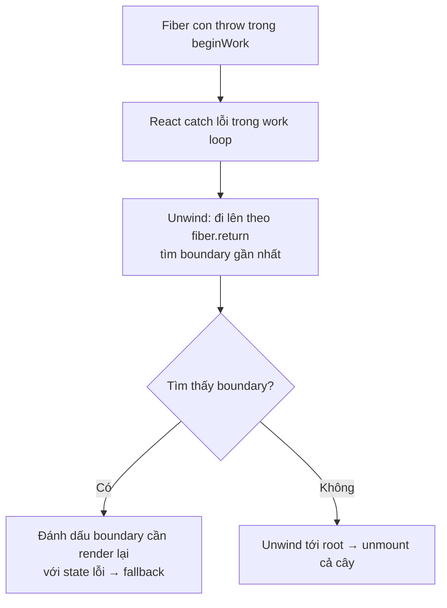
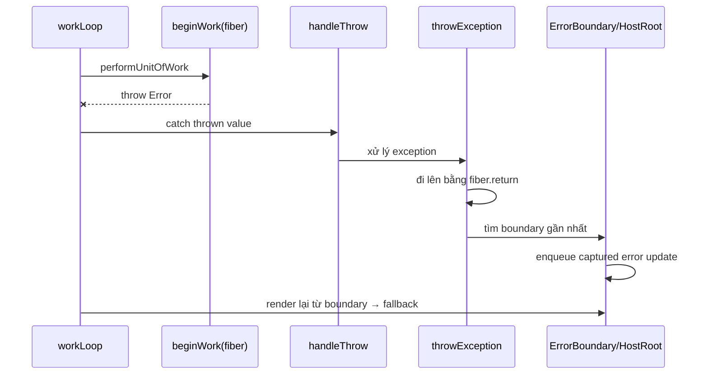
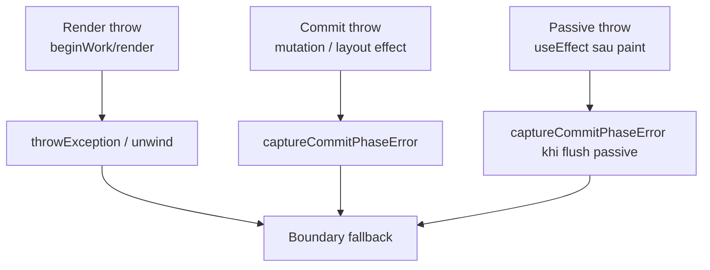
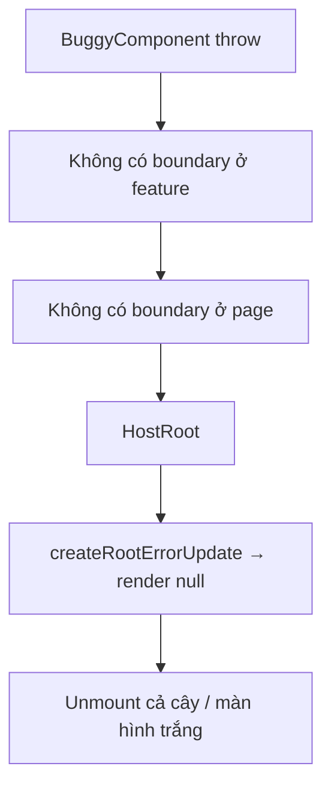
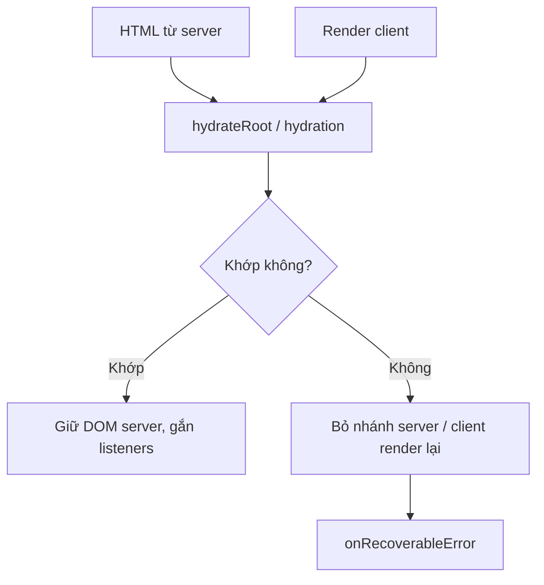
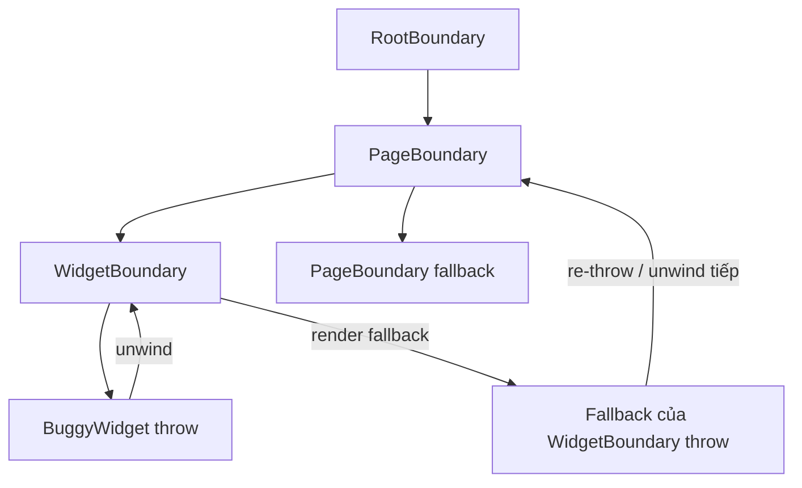
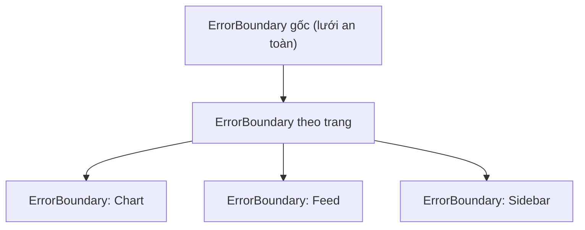

# Error Boundaries

## Mục lục

- [Tổng quan](#tổng-quan)
- [1. Vấn đề: một lỗi làm sập cả app](#1-vấn-đề-một-lỗi-làm-sập-cả-app)
- [2. Error Boundary bắt gì và KHÔNG bắt gì](#2-error-boundary-bắt-gì-và-không-bắt-gì)
- [3. Cơ chế bên trong: error unwinding](#3-cơ-chế-bên-trong-error-unwinding)
  - [3.1 getDerivedStateFromError — render phase](#31-getderivedstatefromerror--render-phase)
  - [3.2 componentDidCatch — commit phase](#32-componentdidcatch--commit-phase)
- [4. Source-level: work loop bắt lỗi render như thế nào](#4-source-level-work-loop-bắt-lỗi-render-như-thế-nào)
- [5. Ba nguồn lỗi và đường đi khác nhau](#5-ba-nguồn-lỗi-và-đường-đi-khác-nhau)
- [6. Vì sao lỗi không có boundary lại unmount cả cây](#6-vì-sao-lỗi-không-có-boundary-lại-unmount-cả-cây)
- [7. Error replay ở development](#7-error-replay-ở-development)
- [8. React 19: root error options](#8-react-19-root-error-options)
- [9. error.stack vs componentStack](#9-errorstack-vs-componentstack)
- [10. Hydration error là recoverable](#10-hydration-error-là-recoverable)
- [11. Nested boundaries và re-throw](#11-nested-boundaries-và-re-throw)
- [12. Lỗi event handler đi đâu](#12-lỗi-event-handler-đi-đâu)
- [13. Vì sao chỉ class component làm được](#13-vì-sao-chỉ-class-component-làm-được)
- [14. Ví dụ chạy được: ErrorBoundary đầy đủ](#14-ví-dụ-chạy-được-errorboundary-đầy-đủ)
- [15. Reset boundary — cho user thử lại](#15-reset-boundary--cho-user-thử-lại)
- [16. Bắt lỗi ở event handler & async](#16-bắt-lỗi-ở-event-handler--async)
- [17. Đặt boundary ở đâu — chiến lược granularity](#17-đặt-boundary-ở-đâu--chiến-lược-granularity)
- [18. Quan hệ với Suspense](#18-quan-hệ-với-suspense)
- [19. Hiểu lầm thường gặp (FAQ)](#19-hiểu-lầm-thường-gặp-faq)
- [20. Câu hỏi tự kiểm tra](#20-câu-hỏi-tự-kiểm-tra)
- [Tài liệu tham khảo](#tài-liệu-tham-khảo)

---

## Tổng quan

**Error Boundary** là một component đặc biệt **bắt lỗi JavaScript xảy ra trong cây con của nó**, ghi log, và hiển thị **UI dự phòng (fallback)** thay vì để cả app trắng màn hình.



<Callout type="info" title="Important">

Từ React 16, nếu một lỗi lúc render **không** được error boundary nào bắt, React sẽ **unmount toàn bộ cây component** — người dùng thấy màn hình trắng. Đây là quyết định có chủ đích: React coi "UI hỏng lặng lẽ hiển thị sai dữ liệu" còn nguy hiểm hơn "UI trống". Error boundary là cách bạn **giành lại quyền kiểm soát** trước hành vi này.

</Callout>

Bài này dựa trên [Render Pipeline](/react-internals/render-pipeline/) — bạn cần hiểu rạch ròi **render phase** và **commit phase** vì hai callback của error boundary chạy ở hai pha khác nhau.

---

## 1. Vấn đề: một lỗi làm sập cả app

Trước React 16, một lỗi trong render có thể để lại cây fiber ở trạng thái hỏng, dẫn đến các lỗi tiếp theo khó hiểu. React 16 đưa ra hợp đồng rõ ràng: **render lỗi mà không ai bắt → gỡ bỏ toàn bộ cây**.

```tsx
function Profile({ user }) {
  // Nếu user là null → đọc user.name throw TypeError
  return <h1>{user.name}</h1>;
}

// Không có boundary: cả app biến mất, không chỉ riêng Profile
```

Error boundary cho phép **cô lập** lỗi: chỉ nhánh gặp sự cố hiển thị fallback, phần còn lại của app vẫn chạy.

---

## 2. Error Boundary bắt gì và KHÔNG bắt gì

Đây là bảng quan trọng nhất của bài. Error boundary **chỉ** bắt lỗi phát sinh **trong quá trình React kiểm soát việc render/commit** của cây con.

| Loại lỗi | Boundary bắt? | Lý do |
|----------|---------------|-------|
| Lỗi trong **render** của component con | ✅ Có | Nằm trong render phase mà React điều khiển |
| Lỗi trong **lifecycle** (constructor, useEffect setup...) | ✅ Có | React gọi các hàm này |
| Lỗi trong **event handler** (`onClick`...) | ❌ Không | Chạy ngoài render, dùng `try/catch` |
| Lỗi trong **code bất đồng bộ** (`setTimeout`, `fetch().then`) | ❌ Không | Callback chạy ngoài stack render |
| Lỗi trong **server-side rendering** | ❌ Không | Boundary chỉ hoạt động phía client |
| Lỗi **ngay trong chính error boundary** | ❌ Không | Phải để boundary **cấp cao hơn** bắt |



<Callout type="warn" title="Warning">

Hiểu lầm phổ biến nhất: "bọc error boundary là bắt được mọi lỗi". **Sai.** Lỗi trong `onClick`, trong `await fetch(...)`, hay trong `setTimeout` **không** đi qua error boundary — bạn phải tự `try/catch` (mục 16). Boundary chỉ bắt lỗi xảy ra **trong lúc React đang render hoặc commit** cây.

</Callout>

---

## 3. Cơ chế bên trong: error unwinding

Khi một component throw trong lúc React đang gọi nó ở **render phase**, React không để lỗi lan ra ngoài như một exception JS bình thường. Thay vào đó nó **bắt lại (catch)**, rồi thực hiện **unwinding**: đi ngược lên cây fiber theo con trỏ `return` để tìm **error boundary gần nhất**.



Điểm mấu chốt: vì lỗi xảy ra ở **render phase** (chỉ dựng cây WIP trong bộ nhớ, chưa đụng DOM), React có thể **an toàn vứt bỏ** cây WIP dang dở và render lại nhánh đó bằng fallback — người dùng không bao giờ thấy trạng thái nửa vời. Đây là lợi ích trực tiếp của việc render phase **gián đoạn/hủy được** (xem [Fiber](/react-internals/fiber-reconciliation/#6-render-pha-có-thể-gián-đoạn-concurrent--lanes)).

Một error boundary được định nghĩa bằng **một hoặc cả hai** phương thức sau:

### 3.1 getDerivedStateFromError — render phase

Chạy trong **render phase**, là hàm **static thuần** (không side effect). Nhiệm vụ duy nhất: nhận error và trả về **state mới** để lần render kế tiếp hiển thị fallback.

```tsx
static getDerivedStateFromError(error: Error) {
  // Chỉ được phép trả state — KHÔNG log, KHÔNG gọi API ở đây
  return { hasError: true };
}
```

<Callout type="info" title="Note">

Vì chạy ở render phase (phải thuần, có thể bị gọi lại/hủy), **không** đặt side effect (logging, gọi API) vào đây. Việc "phản ứng" với lỗi đặt ở `componentDidCatch`.

</Callout>

### 3.2 componentDidCatch — commit phase

Chạy trong **commit phase** (sau khi fallback đã được cam kết), nơi side effect được phép. Đây là chỗ để **ghi log lỗi** lên service giám sát (Sentry, Datadog...).

```tsx
componentDidCatch(error: Error, info: { componentStack: string }) {
  // Side effect OK ở đây
  logToService(error, info.componentStack);
}
```

| Callback | Pha | Được side effect? | Dùng cho |
|----------|-----|-------------------|----------|
| `getDerivedStateFromError` | Render | ❌ Không | Đặt state → chuyển sang fallback |
| `componentDidCatch` | Commit | ✅ Có | Log lỗi, báo cáo, analytics |

---

## 4. Source-level: work loop bắt lỗi render như thế nào

Ở source của reconciler, lỗi render không được xử lý bằng `try/catch` rải rác trong từng component. React bọc **work loop** bằng một lớp xử lý lỗi trung tâm: khi `beginWork` hoặc quá trình render một fiber throw, lỗi đi qua `handleThrow`, rồi được phân loại/đẩy vào `throwException`.



`throwException` đi ngược lên cây theo con trỏ `return` để tìm fiber có thể xử lý lỗi:

| Fiber được xét | Điều kiện bắt lỗi | Update được tạo | Kết quả |
|----------------|-------------------|-----------------|---------|
| `ClassComponent` | Có `static getDerivedStateFromError` hoặc `componentDidCatch` | `createClassErrorUpdate` | Render lại boundary với state lỗi, rồi gọi callback log ở commit |
| `HostRoot` | Không còn boundary class nào phía trên | `createRootErrorUpdate` | Render root thành `null` → unmount cả cây |

Với class boundary, `createClassErrorUpdate` làm hai việc cùng lúc:

1. **Payload render phase**: nếu class có `getDerivedStateFromError`, payload tính state mới để lần render kế tiếp trả fallback.
2. **Callback commit phase**: nếu class có `componentDidCatch`, update gắn callback để React gọi sau khi fallback đã commit.

<Callout type="info" title="Note">

Đây là mô hình hoá giản lược để đọc source dễ hơn. Tên hàm thật có thể nằm trong các file như `ReactFiberThrow` / `ReactFiberWorkLoop`, và React còn xử lý thêm Suspense, hydration, lanes, profiler, dev overlay. Ý chính không đổi: **catch ở work loop → `throwException` → tìm boundary bằng `return` → enqueue error update**.

</Callout>

---

## 5. Ba nguồn lỗi và đường đi khác nhau

Không phải lỗi nào cũng đi qua cùng một đường. React phân biệt lỗi xảy ra trong **render phase**, **commit phase**, và **passive effects**.

| Nguồn lỗi | Thời điểm user thấy UI | Ví dụ | Hàm nội bộ tiêu biểu | Boundary xử lý ra sao |
|-----------|------------------------|-------|----------------------|-----------------------|
| **Render phase** | Chưa đụng DOM; user chưa thấy render lỗi | Throw trong function component, `render()`, constructor | `handleThrow` → `throwException` → unwind | Tạo captured update trên boundary, render lại fallback trước commit |
| **Commit phase** | Đang áp mutation/layout effect; commit không gián đoạn | Lỗi trong mutation lifecycle, `componentDidMount`, `useLayoutEffect` setup | `captureCommitPhaseError` | Tìm boundary gần nhất và schedule update lỗi sau commit hiện tại |
| **Passive effect** | Sau paint; user có thể đã thấy UI mới | Lỗi trong `useEffect` setup/cleanup | `captureCommitPhaseError` (khi flush passive effects) | Cũng route tới boundary, nhưng xảy ra muộn hơn vì passive effects chạy sau paint |



<Callout type="info" title="Important">

Commit phase không thể bị hủy giữa chừng như render phase. Vì vậy lỗi commit thường được **capture rồi schedule update lỗi tiếp theo**. Với passive effect, user có thể đã thấy UI vừa commit trước khi fallback thay thế nhánh lỗi.

</Callout>

---

## 6. Vì sao lỗi không có boundary lại unmount cả cây

Nếu `throwException` đi lên tới `HostRoot` mà không gặp class boundary, root trở thành boundary cuối cùng. React tạo `createRootErrorUpdate`: update này làm root render ra `null`, tức là **gỡ bỏ toàn bộ cây React**.



Đây là thay đổi lớn từ React 16. React 15 có thể để cây nội bộ bị hỏng và tiếp tục hiển thị UI sai, dẫn đến lỗi dây chuyền khó debug. React 16 chọn hành vi rõ ràng hơn: **không thể tin cây nữa thì tháo nó xuống**.

Triết lý mà team React (Dan Abramov thường nhắc khi giải thích quyết định này): để một UI hỏng tiếp tục hiển thị dữ liệu sai còn nguy hiểm hơn UI trống. Với dashboard tài chính, y tế, giao dịch, quyền truy cập... một con số sai hoặc nút sai trạng thái có thể gây hậu quả thật.

<Callout type="warn" title="Fail closed thay vì fail open">
  Màn hình trắng không phải trải nghiệm tốt, nhưng nó là tín hiệu rõ ràng rằng app đang không an toàn để tương tác. Boundary gốc giúp bạn thay màn hình trắng bằng trang lỗi có kiểm soát, còn boundary nhỏ hơn giúp cô lập lỗi theo vùng.
</Callout>

---

## 7. Error replay ở development

Trong development, đặc biệt với Concurrent root, React có thể **replay** component vừa throw bằng một render đồng bộ để thu thập stack trace/component stack tốt hơn cho overlay và log. Vì vậy khi có lỗi, bạn có thể thấy:

- `console.log` trong component lỗi in ra 2 lần.
- Breakpoint trong render bị hit nhiều hơn dự kiến.
- Stack trace dev chi tiết hơn production.

Điểm dễ nhầm: đây **không phải** StrictMode double-render.

| Cơ chế | Khi xảy ra | Mục đích | Có ở production? |
|--------|------------|----------|------------------|
| StrictMode double-render | Dev, với subtree trong `<StrictMode>` | Tìm render side effect không thuần | ❌ Không |
| Error replay | Dev, khi React bắt lỗi render/commit cần báo cáo tốt hơn | Lấy JS stack/component stack chính xác | ❌ Không |

<Callout type="info" title="Note">

Nếu log chỉ nhân đôi khi component throw, hãy nghĩ tới **error replay**. Nếu log nhân đôi cả khi không lỗi trong StrictMode, đó là **StrictMode double invoke**. Cả hai đều nhắc bạn giữ render phase thuần.

</Callout>

---

## 8. React 19: root error options

React 19 bổ sung các callback cấu hình ở `createRoot` để bạn tập trung báo cáo lỗi ở cấp root, thay vì chỉ dựa vào `componentDidCatch` của từng boundary.

| Option | Khi nào được gọi | Dùng để làm gì |
|--------|------------------|----------------|
| `onCaughtError` | Lỗi được một Error Boundary bắt | Log lỗi theo boundary, kèm `componentStack` |
| `onUncaughtError` | Không boundary nào bắt được lỗi | Báo lỗi toàn cục trước/sau khi root bị unmount |
| `onRecoverableError` | React tự phục hồi được | Hydration mismatch, một số lỗi recoverable khác |

```tsx
import { createRoot } from 'react-dom/client';
import { App } from './App';

createRoot(document.getElementById('root')!, {
  onCaughtError(error, errorInfo) {
    reportErrorToService('caught', {
      error,
      componentStack: errorInfo.componentStack,
    });
  },
  onUncaughtError(error, errorInfo) {
    reportErrorToService('uncaught', {
      error,
      componentStack: errorInfo.componentStack,
    });
  },
  onRecoverableError(error, errorInfo) {
    reportErrorToService('recoverable', {
      error,
      componentStack: errorInfo.componentStack,
      cause: error.cause,
    });
  },
}).render(<App />);
```

<Callout type="info" title="Root callback không thay thế fallback UI">
  `onCaughtError`/`onUncaughtError` là hook để **quan sát và log**. UI fallback vẫn do Error Boundary quyết định; lỗi không bắt vẫn khiến root bị tháo xuống.
</Callout>

---

## 9. error.stack vs componentStack

`error.stack` là stack trace của JavaScript engine: nó nói exception đi qua những hàm JS nào. `info.componentStack` là stack do React dựng: nó nói lỗi nằm trong **cây component** nào. Hai thứ trả lời hai câu hỏi khác nhau.

| Trường | Nguồn | Trả lời câu hỏi | Ví dụ thông tin |
|--------|-------|-----------------|-----------------|
| `error.stack` | JS engine / browser | Hàm nào throw và call stack JS ra sao? | `BuggyChart.render`, `Array.map`, file/line |
| `info.componentStack` | React reconciler | Component nào chứa component lỗi trong cây UI? | `at BuggyChart`, `at DashboardPanel`, `at App` |

```tsx
componentDidCatch(error: Error, info: { componentStack: string }) {
  console.error(error.stack);          // stack JS
  console.error(info.componentStack);  // stack component React
}
```

React 19 dev cũng có API `captureOwnerStack()` để lấy owner stack trong một số công cụ debug/lint nội bộ. API này chỉ dành cho development; đừng dựa vào nó cho logging production.

```tsx
import { captureOwnerStack } from 'react';

if (process.env.NODE_ENV !== 'production') {
  console.log(captureOwnerStack());
}
```

---

## 10. Hydration error là recoverable

Hydration mismatch xảy ra khi HTML từ server không khớp với render phía client. Ví dụ server render giờ hiện tại, client hydrate muộn hơn vài giây; text không giống nhau.

React không coi hầu hết mismatch này là lỗi làm sập app. Nó có thể **bỏ HTML server của nhánh đó và client render lại**, rồi gọi `onRecoverableError`.



Liên hệ với Error Boundary: boundary xử lý **exception trong cây React**; hydration recoverable là cơ chế phục hồi của root/renderer. Nếu mismatch dẫn tới exception thật trong render, lỗi đó vẫn đi theo đường Error Boundary như mục 4-5.

---

## 11. Nested boundaries và re-throw

Boundary chỉ bắt lỗi của **cây con**, không bắt lỗi của **chính nó**. Nếu fallback của boundary cũng throw, lỗi mới sẽ được ném lên boundary cha gần nhất.



Điều này giải thích hai quy tắc thực tế:

- Fallback phải **đơn giản, ít dependency, ít khả năng throw**.
- Nên có boundary nhiều tầng: widget → page → root. Nếu fallback tầng thấp lỗi, tầng cao vẫn cứu được app.

---

## 12. Lỗi event handler đi đâu

Event handler không chạy trong render phase. Khi user click và handler throw, lỗi đi theo cơ chế sự kiện JavaScript/browser: nó propagate ra global error reporting (`window.onerror`, `error` event, hoặc `reportError` nếu môi trường dùng). Error Boundary không có cơ hội unwind cây fiber vì React không đang dựng WIP từ `beginWork`.

```tsx
function SaveButton() {
  return (
    <button
      onClick={() => {
        throw new Error('Lỗi khi click'); // không vào Error Boundary
      }}
    >
      Lưu
    </button>
  );
}
```

Cách bắt đúng:

```tsx
window.addEventListener('error', (event) => {
  logGlobalError(event.error);
});

function SaveButton() {
  async function handleClick() {
    try {
      await save();
    } catch (error) {
      showToast('Lưu thất bại');
      logGlobalError(error);
    }
  }

  return <button onClick={handleClick}>Lưu</button>;
}
```

Trong React 19, một số lỗi không bắt ở root có thể được báo qua `onUncaughtError`, nhưng đừng xem đó là thay thế cho `try/catch` trong handler. Nếu muốn dùng cùng fallback với boundary, dùng `showBoundary(error)` như mục 16.

---

## 13. Vì sao chỉ class component làm được

Tính đến React 19, **chưa có hook** tương đương cho error boundary. Bạn **bắt buộc** phải dùng class component (hoặc thư viện bọc sẵn) vì cần hai phương thức `getDerivedStateFromError` / `componentDidCatch` — vốn là lifecycle của class.

<Callout type="info" title="Important">

Không có `useErrorBoundary` chính thức trong React core. Lý do kỹ thuật: cơ chế bắt lỗi gắn chặt với lifecycle của class trong reconciler. Trong thực tế, người ta **viết một class ErrorBoundary duy nhất** rồi tái dùng, hoặc dùng thư viện [`react-error-boundary`](https://github.com/bvaughn/react-error-boundary) (cung cấp hook `useErrorBoundary` để **kích hoạt** boundary từ code function, dù bản thân boundary vẫn là class bên dưới).

</Callout>

---

## 14. Ví dụ chạy được: ErrorBoundary đầy đủ

```tsx
import { Component, type ReactNode } from 'react';

type Props = { fallback: ReactNode; children: ReactNode };
type State = { hasError: boolean; error: Error | null };

class ErrorBoundary extends Component<Props, State> {
  state: State = { hasError: false, error: null };

  // (1) Render phase: chuyển sang trạng thái lỗi (thuần, không side effect)
  static getDerivedStateFromError(error: Error): State {
    return { hasError: true, error };
  }

  // (2) Commit phase: log lỗi (side effect OK)
  componentDidCatch(error: Error, info: { componentStack: string }) {
    console.error('Đã bắt lỗi:', error, info.componentStack);
    // logToSentry(error, info);
  }

  render() {
    if (this.state.hasError) return this.props.fallback;
    return this.props.children;
  }
}

// Component cố tình lỗi
function Buggy() {
  throw new Error('Bùm 💥');
  return null;
}

export default function App() {
  return (
    <div>
      <h1>App vẫn sống</h1>
      <ErrorBoundary fallback={<p>Đã có lỗi ở phần này 😢</p>}>
        <Buggy />
      </ErrorBoundary>
      <p>Phần này vẫn hiển thị bình thường ✅</p>
    </div>
  );
}
```

Chạy đoạn này: `Buggy` throw, nhưng chỉ vùng bọc bởi `ErrorBoundary` hiện fallback; tiêu đề và đoạn cuối **vẫn hiển thị**. Đó chính là "cô lập lỗi".

<Callout type="info" title="Tip">

Trong **development + StrictMode**, bạn có thể thấy lỗi hiện lên overlay đỏ của dev server **trước** khi fallback xuất hiện — bấm tắt overlay để thấy fallback. Ở production chỉ có fallback. Đừng nhầm overlay dev là "boundary không hoạt động".

</Callout>

---

## 15. Reset boundary — cho user thử lại

Sau khi vào fallback, boundary "kẹt" ở trạng thái lỗi. Muốn cho user thử lại, ta phải **reset state** của boundary — thường bằng cách đổi `key` (buộc React remount boundary) hoặc dùng cơ chế reset của thư viện.

<Tabs items={['react-error-boundary', 'Tự viết với key']}>
  <Tab value="react-error-boundary">
    ```tsx
    import { ErrorBoundary } from 'react-error-boundary';

    function Fallback({ error, resetErrorBoundary }) {
      return (
        <div role="alert">
          <p>Lỗi: {error.message}</p>
          <button onClick={resetErrorBoundary}>Thử lại</button>
        </div>
      );
    }

    <ErrorBoundary
      FallbackComponent={Fallback}
      onReset={() => {/* dọn state gây lỗi */}}
      resetKeys={[userId]} // tự reset khi userId đổi
    >
      <Profile userId={userId} />
    </ErrorBoundary>
    ```
  </Tab>
  <Tab value="Tự viết với key">
    ```tsx
    // Đổi key → React coi là component KHÁC → unmount boundary cũ,
    // mount boundary mới với state sạch (hasError = false)
    const [attempt, setAttempt] = useState(0);

    <ErrorBoundary key={attempt} fallback={<Fallback onRetry={() => setAttempt(a => a + 1)} />}>
      <Buggy />
    </ErrorBoundary>
    ```
  </Tab>
</Tabs>

<Callout type="info" title="Note">

Kỹ thuật đổi `key` để reset là ứng dụng trực tiếp của quy tắc diffing "**đổi key = component khác → remount, reset state**" (xem [key trong list](/react-internals/key-trong-list/) và [Fiber](/react-internals/fiber-reconciliation/#52-quy-tắc-1-khác-type--đập-đi-xây-lại)).

</Callout>

---

## 16. Bắt lỗi ở event handler & async

Vì boundary **không** bắt lỗi ngoài render, với event handler và code async bạn phải tự xử lý:

```tsx
// (a) Event handler: dùng try/catch
function SaveButton() {
  const [error, setError] = useState<Error | null>(null);
  async function handleSave() {
    try {
      await api.save();
    } catch (e) {
      setError(e as Error); // tự quản trạng thái lỗi
    }
  }
  if (error) return <p>Lưu thất bại: {error.message}</p>;
  return <button onClick={handleSave}>Lưu</button>;
}
```

Nếu muốn **đẩy** lỗi async vào error boundary (để dùng chung một fallback), dùng hook `useErrorBoundary` của `react-error-boundary`:

```tsx
import { useErrorBoundary } from 'react-error-boundary';

function Widget() {
  const { showBoundary } = useErrorBoundary();
  async function load() {
    try {
      await fetchData();
    } catch (e) {
      showBoundary(e); // ném lỗi async vào boundary gần nhất
    }
  }
  // ...
}
```

<Callout type="info" title="Tip">

Mẹo bản chất: `showBoundary` hoạt động bằng cách gọi một `setState` **rồi throw trong render kế tiếp** — biến lỗi async thành lỗi render mà boundary bắt được. Đó là cách "lách" giới hạn của cơ chế.

</Callout>

---

## 17. Đặt boundary ở đâu — chiến lược granularity

Không có một chỗ đặt "đúng" duy nhất — chọn theo mức độ cô lập mong muốn:

| Vị trí | Hiệu ứng | Khi nào |
|--------|----------|---------|
| **Bọc toàn app** (1 boundary ở gốc) | Lỗi bất kỳ → 1 trang lỗi toàn cục | Lưới an toàn tối thiểu, luôn nên có |
| **Bọc từng route/page** | Lỗi 1 trang không sập trang khác | App nhiều trang |
| **Bọc từng widget độc lập** (sidebar, chart, comment) | Widget hỏng, phần còn lại vẫn dùng được | Dashboard, trang ghép nhiều khối |



<Callout type="info" title="Important">

Nguyên tắc: đặt boundary **quanh những khối có thể hỏng độc lập** mà bạn muốn giữ phần còn lại sống. Một boundary gốc là bắt buộc; boundary chi tiết hơn thêm vào nơi trải nghiệm người dùng đáng được bảo vệ.

</Callout>

---

## 18. Quan hệ với Suspense

Error Boundary và `<Suspense>` là **cặp bài trùng** trong React hiện đại: Suspense xử lý trạng thái **đang tải** (loading), Error Boundary xử lý trạng thái **lỗi** (error). Cả hai đều hoạt động bằng cách "bắt" thứ mà component con **throw** trong render (Suspense bắt promise, Boundary bắt error).

```tsx
<ErrorBoundary fallback={<p>Tải dữ liệu thất bại</p>}>
  <Suspense fallback={<Spinner />}>
    <AsyncProfile />   {/* throw promise → Suspense; throw error → Boundary */}
  </Suspense>
</ErrorBoundary>
```

<Callout type="info" title="Note">

Cùng một cơ chế nền: component con **throw** trong render, React unwind lên tìm boundary phù hợp. Promise → Suspense bắt (hiện fallback loading). Error → Error Boundary bắt (hiện fallback lỗi). Đây là lý do hai thứ này thiết kế song song nhau.

</Callout>

---

## 19. Hiểu lầm thường gặp (FAQ)

<Accordions type="single">
  <Accordion title="Error boundary bắt được lỗi trong onClick không?">
    Không. Event handler chạy ngoài render phase. Dùng try/catch trong handler, hoặc showBoundary từ react-error-boundary để đẩy lỗi vào boundary.
  </Accordion>
  <Accordion title="Viết được error boundary bằng function component + hook chưa?">
    Chưa (tính đến React 19). Cần class với getDerivedStateFromError / componentDidCatch. Thực tế dùng một class tái sử dụng hoặc thư viện react-error-boundary.
  </Accordion>
  <Accordion title="Vì sao app trắng màn hình khi có lỗi mà tôi không thấy fallback?">
    Vì không có error boundary nào bao quanh nhánh lỗi → React unmount cả cây. Thêm ít nhất một boundary ở gốc.
  </Accordion>
  <Accordion title="Nên log lỗi ở getDerivedStateFromError hay componentDidCatch?">
    componentDidCatch — nó chạy ở commit phase, được phép side effect. getDerivedStateFromError chạy ở render phase nên phải thuần, chỉ trả về state.
  </Accordion>
  <Accordion title="Sau khi vào fallback làm sao cho user thử lại?">
    Reset state của boundary: đổi key để remount, hoặc dùng resetErrorBoundary/resetKeys của react-error-boundary.
  </Accordion>
  <Accordion title="Vì sao useEffect lỗi đôi khi user đã thấy UI mới rồi mới hiện fallback?">
    Vì useEffect là passive effect, chạy sau paint. React vẫn route lỗi qua captureCommitPhaseError tới boundary, nhưng thời điểm xảy ra muộn hơn render/layout effect.
  </Accordion>
  <Accordion title="onCaughtError có thay componentDidCatch không?">
    Không hoàn toàn. onCaughtError là callback root để log tập trung khi boundary bắt lỗi; componentDidCatch vẫn hữu ích khi boundary cần logic logging/ngữ cảnh riêng.
  </Accordion>
  <Accordion title="Hydration mismatch có phải lúc nào cũng làm sập app không?">
    Không. Nhiều mismatch là recoverable: React client render lại nhánh không khớp và gọi onRecoverableError để bạn log/điều tra.
  </Accordion>
</Accordions>

---

## 20. Câu hỏi tự kiểm tra

<Accordions type="single">
  <Accordion title="1. Error boundary bắt những loại lỗi nào?">
    Lỗi trong render, trong lifecycle/constructor, và trong effect setup của cây con. KHÔNG bắt: event handler, code async, SSR, và lỗi trong chính boundary.
  </Accordion>
  <Accordion title="2. Hai callback của error boundary chạy ở pha nào?">
    getDerivedStateFromError ở render phase (thuần, trả state → fallback). componentDidCatch ở commit phase (side effect: log lỗi).
  </Accordion>
  <Accordion title="3. Điều gì xảy ra nếu lỗi render không được boundary nào bắt?">
    React unwind lên tới root và unmount toàn bộ cây component → màn hình trắng. Đó là lý do luôn cần ít nhất một boundary gốc.
  </Accordion>
  <Accordion title="4. Vì sao có thể vứt bỏ cây WIP khi gặp lỗi mà không hỏng UI?">
    Vì lỗi xảy ra ở render phase — chỉ dựng cây WIP trong bộ nhớ, chưa đụng DOM. React hủy WIP an toàn và render lại nhánh bằng fallback.
  </Accordion>
  <Accordion title="5. Cách bắt lỗi async và đưa vào cùng một fallback?">
    Dùng useErrorBoundary().showBoundary(error) — nó set state rồi throw trong render kế tiếp, biến lỗi async thành lỗi render mà boundary bắt được.
  </Accordion>
  <Accordion title="6. Khác nhau giữa lỗi render, commit và passive effect là gì?">
    Render error đi qua throwException/unwind trước khi đụng DOM. Commit error đi qua captureCommitPhaseError trong lúc commit. Passive effect error cũng captureCommitPhaseError nhưng xảy ra sau paint, nên user có thể đã thấy UI mới.
  </Accordion>
  <Accordion title="7. createRoot có những callback lỗi nào trong React 19?">
    onCaughtError cho lỗi được boundary bắt, onUncaughtError cho lỗi không boundary nào bắt, và onRecoverableError cho lỗi React tự phục hồi được như hydration mismatch.
  </Accordion>
  <Accordion title="8. Nếu fallback của boundary throw thì ai bắt?">
    Boundary đó không tự bắt lỗi của chính nó. Lỗi fallback unwind lên boundary cha gần nhất; nếu không có, HostRoot render null.
  </Accordion>
</Accordions>

---

## Tài liệu tham khảo

- [React Docs — Component (catching errors)](https://react.dev/reference/react/Component#catching-rendering-errors-with-an-error-boundary)
- [react-error-boundary (bvaughn)](https://github.com/bvaughn/react-error-boundary)
- [React Docs — getDerivedStateFromError](https://react.dev/reference/react/Component#static-getderivedstatefromerror)
- [React Docs — createRoot options](https://react.dev/reference/react-dom/client/createRoot#parameters)
- [React Docs — captureOwnerStack](https://react.dev/reference/react/captureOwnerStack)
- [Render Pipeline](/react-internals/render-pipeline/)
- [Fiber & Reconciliation](/react-internals/fiber-reconciliation/)
- [Vì sao list cần key](/react-internals/key-trong-list/)
