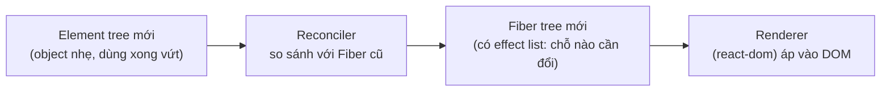
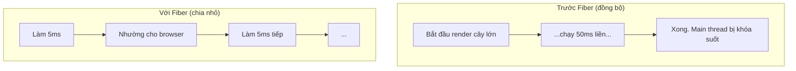
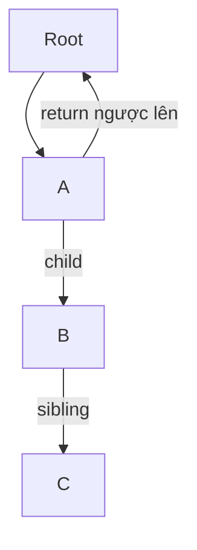
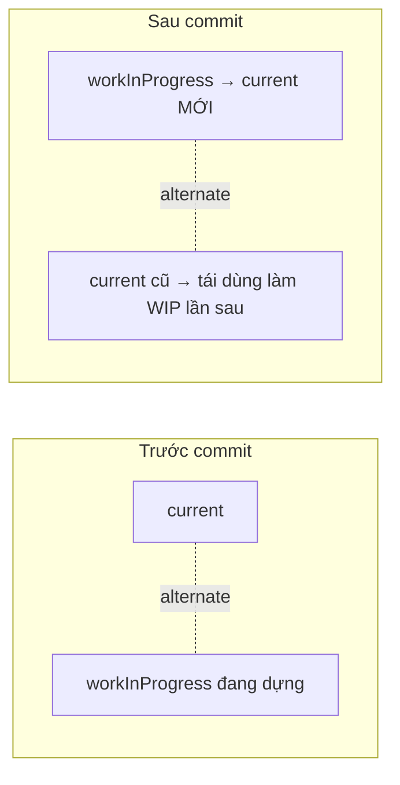

# Fiber & Reconciliation

## Mục lục

- [Tổng quan](#tổng-quan)
- [1. Vấn đề Fiber sinh ra để giải quyết](#1-vấn-đề-fiber-sinh-ra-để-giải-quyết)
- [2. Fiber node là gì](#2-fiber-node-là-gì)
- [3. Cây Fiber & Double Buffering](#3-cây-fiber--double-buffering)
- [4. Reconciliation — thuật toán diffing](#4-reconciliation--thuật-toán-diffing)
  - [4.1 Quy tắc 1: khác type → đập đi xây lại](#41-quy-tắc-1-khác-type--đập-đi-xây-lại)
  - [4.2 Quy tắc 2: cùng type → giữ node, cập nhật prop](#42-quy-tắc-2-cùng-type--giữ-node-cập-nhật-prop)
  - [4.3 Quy tắc 3: list cần key](#43-quy-tắc-3-list-cần-key)
- [5. Render pha có thể gián đoạn (Concurrent)](#5-render-pha-có-thể-gián-đoạn-concurrent)
- [6. Ví dụ minh hoạ diffing](#6-ví-dụ-minh-hoạ-diffing)
- [Tài liệu tham khảo](#tài-liệu-tham-khảo)

---

## Tổng quan

**Reconciliation** là quá trình React so sánh cây UI mới (vừa render) với cây cũ để tìm ra **tập thao tác DOM tối thiểu**. **Fiber** là kiến trúc dữ liệu + thuật toán (ra mắt từ React 16) giúp quá trình đó có thể **chia nhỏ, tạm dừng và tiếp tục** thay vì chạy một mạch.



> [!IMPORTANT]
> **Element** vs **Fiber**: Element là object mô tả UI bạn trả về từ component — sinh ra mỗi lần render rồi vứt đi. Fiber là object **tồn tại lâu dài**, mỗi component/DOM node có một fiber, lưu state, ref, vị trí trong cây và "việc cần làm". React 19 vẫn dùng kiến trúc Fiber này.

---

## 1. Vấn đề Fiber sinh ra để giải quyết

Trước React 16, reconciliation chạy **đệ quy đồng bộ**: một khi bắt đầu là chạy đến hết, không dừng được. Cây lớn → main thread bị khóa hàng chục ms → animation giật, gõ phím trễ.

Fiber biến công việc đệ quy đó thành một **danh sách liên kết duyệt được bằng vòng lặp**, nhờ vậy React có thể:

- Làm một ít việc, **nhường (yield)** lại cho trình duyệt xử lý input/animation, rồi quay lại làm tiếp.
- **Ưu tiên** việc gấp (gõ phím) hơn việc không gấp (render danh sách lớn).
- **Hủy** một render đang dang dở nếu có update mới quan trọng hơn.



---

## 2. Fiber node là gì

Mỗi fiber là một object. Các trường quan trọng (đơn giản hoá):

```ts
type Fiber = {
  type: any;          // 'div', hoặc function component
  key: string | null; // key bạn đặt trong list
  stateNode: any;     // DOM node thật, hoặc instance class

  // Liên kết tạo thành cây dạng linked-list:
  child: Fiber | null;   // con đầu tiên
  sibling: Fiber | null; // anh em kế tiếp
  return: Fiber | null;  // cha (để quay lên)

  memoizedState: any;    // state/hooks đã lưu (chuỗi hook nằm ở đây)
  memoizedProps: any;    // props của lần commit trước
  pendingProps: any;     // props mới đang xử lý

  alternate: Fiber | null; // trỏ tới fiber "phiên bản kia" (xem double buffering)
  flags: number;           // đánh dấu cần làm gì: Placement, Update, Deletion...
};
```

> [!NOTE]
> Hooks của bạn (`useState`, `useEffect`, ...) được lưu thành một **danh sách liên kết** trong `memoizedState` của fiber, theo đúng thứ tự gọi. Đây là lý do **không được gọi hook trong điều kiện/vòng lặp** — sai thứ tự thì React lấy nhầm state của hook khác.

Cây fiber được duyệt theo kiểu **depth-first** dùng `child` → `sibling` → `return`, thay cho đệ quy thật:



---

## 3. Cây Fiber & Double Buffering

React giữ **hai** cây fiber cùng lúc — kỹ thuật mượn từ đồ hoạ game gọi là **double buffering**:

| Cây | Vai trò |
|-----|---------|
| **current** | Cây đang hiển thị trên màn hình |
| **workInProgress (WIP)** | Cây đang được dựng ở pha render |

Hai cây trỏ tới nhau qua trường `alternate`. React dựng xong cây WIP trong "hậu trường"; tới pha commit nó chỉ cần **hoán đổi con trỏ**: WIP trở thành current. Nhờ vậy người dùng không bao giờ thấy trạng thái nửa vời.



> [!TIP]
> Tái dùng object fiber cũ (thay vì tạo mới hoàn toàn) giúp giảm áp lực cho bộ thu gom rác (GC) — một lý do React mượt khi update liên tục.

---

## 4. Reconciliation — thuật toán diffing

So sánh hai cây bất kỳ có độ phức tạp `O(n³)` — quá đắt. React dùng **heuristic** rút xuống `O(n)` dựa trên 2 giả định thực tế và 1 cơ chế (key):

### 4.1 Quy tắc 1: khác type → đập đi xây lại

Nếu `type` ở cùng vị trí khác nhau (ví dụ `<div>` đổi thành `<span>`, hay `ComponentA` đổi thành `ComponentB`), React **không** cố so sánh sâu bên trong. Nó **hủy toàn bộ subtree cũ** (unmount, mất hết state) và **dựng lại từ đầu**.

```tsx
// count chẵn render <div>, lẻ render <section>
{isEven ? <div><Counter/></div> : <section><Counter/></section>}
// Mỗi lần đổi chẵn/lẻ: <Counter> bị UNMOUNT rồi MOUNT lại → state reset về 0!
```

> [!WARNING]
> Đổi type của phần tử cha sẽ **reset toàn bộ state** của subtree con. Đây là nguyên nhân bug "state tự nhiên mất" rất khó tìm.

### 4.2 Quy tắc 2: cùng type → giữ node, cập nhật prop

Nếu cùng `type`, React **giữ nguyên DOM node** (và fiber, và state), chỉ cập nhật những attribute/prop thay đổi.

```tsx
// className đổi 'red' → 'blue'
<div className="red" /> → <div className="blue" />
// React giữ nguyên thẻ <div> trong DOM, chỉ đổi mỗi class. Không tạo node mới.
```

### 4.3 Quy tắc 3: list cần key

Với danh sách con, React cần biết phần tử nào là "vẫn là phần tử cũ" sau khi thêm/xóa/đảo thứ tự. `key` chính là **danh tính** đó. Đây là chủ đề riêng, rất hay gây bug — đọc kỹ ở bài [Vì sao list cần key](/react-internals/key-trong-list/).

---

## 5. Render pha có thể gián đoạn (Concurrent)

Vì pha render chỉ dựng cây WIP trong bộ nhớ (chưa đụng DOM), React **có thể** dừng giữa chừng mà không để lại UI hỏng. Đây là nền tảng của các tính năng Concurrent (React 18+): `startTransition`, `useDeferredValue`, Suspense.

```tsx
import { startTransition, useState } from 'react';

function Search() {
  const [text, setText] = useState('');
  const [list, setList] = useState<string[]>([]);

  function onChange(e: React.ChangeEvent<HTMLInputElement>) {
    setText(e.target.value);                 // update GẤP: ô input phải mượt
    startTransition(() => {
      setList(filterHugeList(e.target.value)); // update KHÔNG gấp: được phép trễ/gián đoạn
    });
  }
  return <input value={text} onChange={onChange} />;
}
```

> [!IMPORTANT]
> `startTransition` báo cho React: "update này không gấp". Nếu user gõ tiếp, React **vứt bỏ** render danh sách đang dang dở và làm lại với giá trị mới — không khóa ô input. Điều này chỉ khả thi vì pha render gián đoạn được, nhờ Fiber. Pha commit thì **không** gián đoạn được (phải nguyên tử).

---

## 6. Ví dụ minh hoạ diffing

Quan sát quy tắc "khác type → reset state":

```tsx
import { useState } from 'react';

function Counter() {
  const [n, setN] = useState(0);
  return <button onClick={() => setN(n + 1)}>Đếm: {n}</button>;
}

export default function App() {
  const [wrapInDiv, setWrap] = useState(true);
  return (
    <div>
      <button onClick={() => setWrap((w) => !w)}>Đổi thẻ bọc</button>
      {/* Bấm "Đổi thẻ bọc" → type cha đổi div<->section → Counter reset về 0 */}
      {wrapInDiv ? (
        <div><Counter /></div>
      ) : (
        <section><Counter /></section>
      )}
    </div>
  );
}
```

Bấm "Đếm" vài lần cho `n = 5`, rồi bấm "Đổi thẻ bọc": số đếm **tụt về 0**. Đổi `div`/`section` thành **cùng** một thẻ thì state sẽ được giữ — tự thử để thấy rõ.

---

## Tài liệu tham khảo

- [React Docs — Preserving and Resetting State](https://react.dev/learn/preserving-and-resetting-state)
- [Acdlite — React Fiber Architecture (notes)](https://github.com/acdlite/react-fiber-architecture)
- [Render Pipeline](/react-internals/render-pipeline/)
- [Vì sao list cần key](/react-internals/key-trong-list/)
