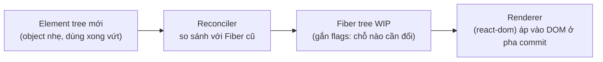
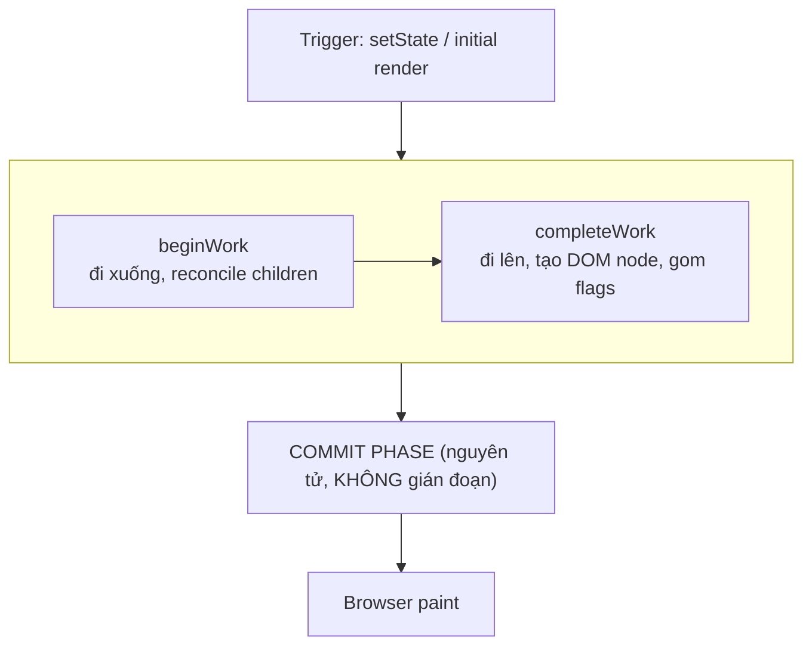
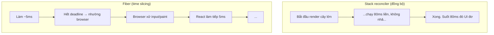
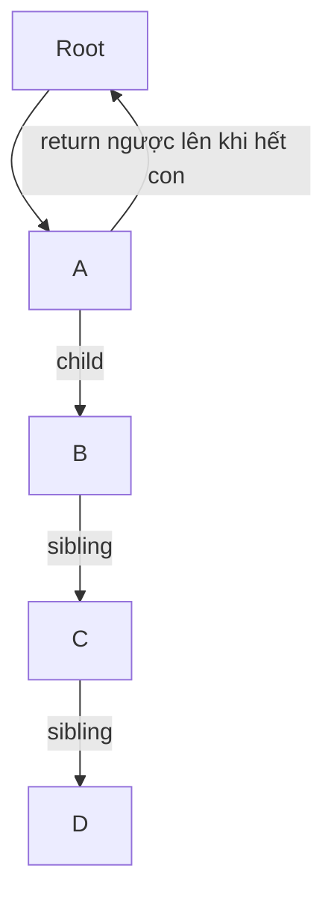
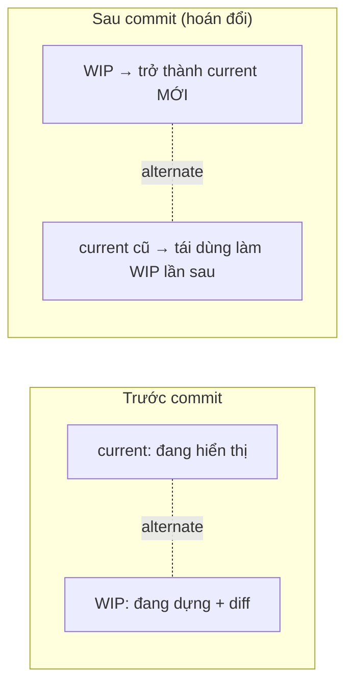
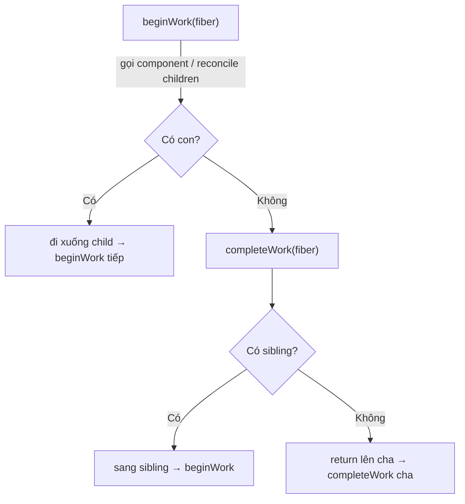
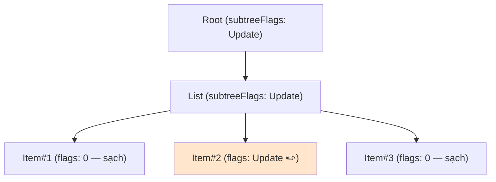
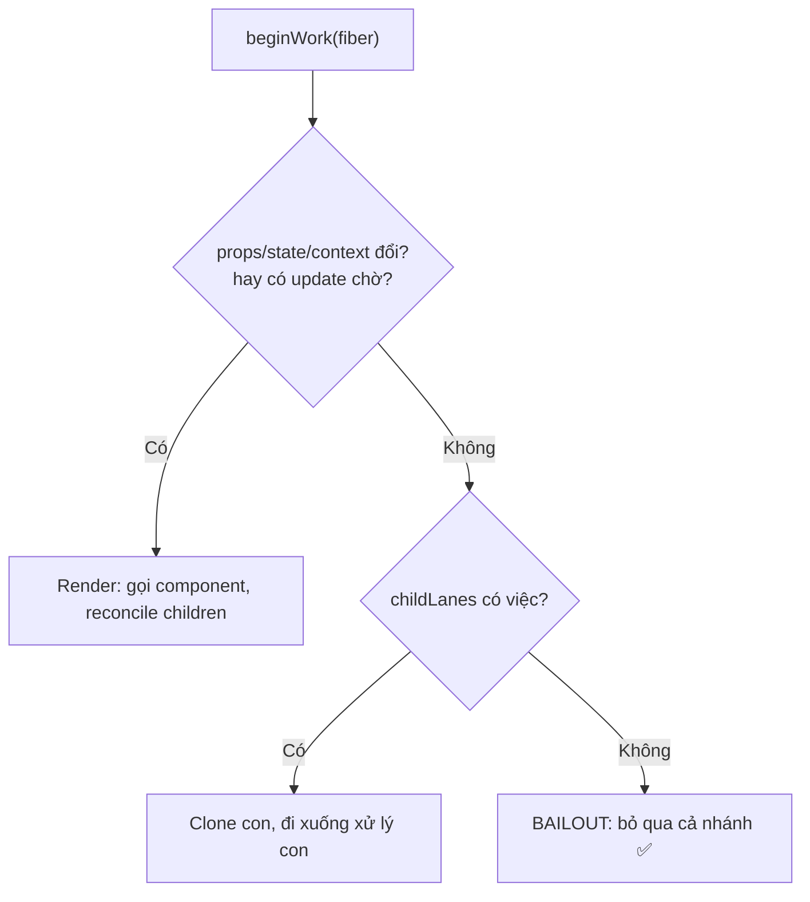
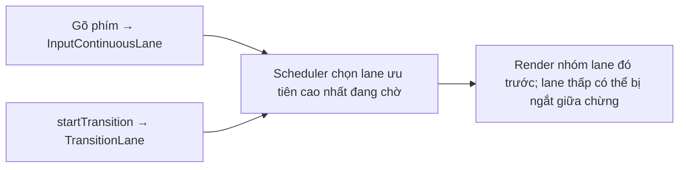

# Fiber & Reconciliation

## Mục lục

- [Tổng quan](#tổng-quan)
- [1. Vấn đề Fiber sinh ra để giải quyết](#1-vấn-đề-fiber-sinh-ra-để-giải-quyết)
  - [1.1 Stack reconciler cũ và sự "không dừng được"](#11-stack-reconciler-cũ-và-sự-không-dừng-được)
  - [1.2 Ý tưởng cốt lõi: biến call stack thành dữ liệu](#12-ý-tưởng-cốt-lõi-biến-call-stack-thành-dữ-liệu)
- [2. Fiber node là gì](#2-fiber-node-là-gì)
  - [2.1 Toàn bộ các trường quan trọng](#21-toàn-bộ-các-trường-quan-trọng)
  - [2.2 Vì sao hooks là linked list trong memoizedState](#22-vì-sao-hooks-là-linked-list-trong-memoizedstate)
- [3. Cây Fiber & Double Buffering](#3-cây-fiber--double-buffering)
- [4. Work loop: beginWork & completeWork](#4-work-loop-beginwork--completework)
  - [4.1 Hai pha của một đơn vị công việc](#41-hai-pha-của-một-đơn-vị-công-việc)
  - [4.2 Effect list — danh sách "việc cần commit"](#42-effect-list--danh-sách-việc-cần-commit)
  - [4.3 Bailout — khi React bỏ qua cả subtree](#43-bailout--khi-react-bỏ-qua-cả-subtree)
- [5. Reconciliation — thuật toán diffing](#5-reconciliation--thuật-toán-diffing)
  - [5.1 Vì sao O(n³) là không khả thi](#51-vì-sao-on³-là-không-khả-thi)
  - [5.2 Quy tắc 1: khác type → đập đi xây lại](#52-quy-tắc-1-khác-type--đập-đi-xây-lại)
  - [5.3 Quy tắc 2: cùng type → giữ node, cập nhật prop](#53-quy-tắc-2-cùng-type--giữ-node-cập-nhật-prop)
  - [5.4 Quy tắc 3: list cần key](#54-quy-tắc-3-list-cần-key)
- [6. Render pha có thể gián đoạn (Concurrent & Lanes)](#6-render-pha-có-thể-gián-đoạn-concurrent--lanes)
  - [6.1 Lanes — hệ thống ưu tiên bằng bitmask](#61-lanes--hệ-thống-ưu-tiên-bằng-bitmask)
  - [6.2 Vì sao commit KHÔNG gián đoạn được](#62-vì-sao-commit-không-gián-đoạn-được)
- [7. Ví dụ chạy được](#7-ví-dụ-chạy-được)
  - [7.1 Khác type → reset state](#71-khác-type--reset-state)
  - [7.2 Quan sát interruption với startTransition](#72-quan-sát-interruption-với-starttransition)
- [8. Đo & quan sát bằng công cụ](#8-đo--quan-sát-bằng-công-cụ)
- [9. Hiểu lầm thường gặp (FAQ)](#9-hiểu-lầm-thường-gặp-faq)
- [10. Câu hỏi tự kiểm tra](#10-câu-hỏi-tự-kiểm-tra)
- [Thuật ngữ](#thuật-ngữ)
- [Tài liệu tham khảo](#tài-liệu-tham-khảo)

---

## Tổng quan

**Reconciliation** là quá trình React so sánh cây UI mới (vừa render) với cây cũ để tìm ra **tập thao tác DOM tối thiểu**. **Fiber** là kiến trúc dữ liệu + thuật toán (ra mắt từ React 16) giúp quá trình đó có thể **chia nhỏ, tạm dừng, tiếp tục, ưu tiên và hủy** thay vì chạy một mạch.



<Callout type="info" title="Important">

**Element** vs **Fiber** là phân biệt nền tảng nhất của bài này. **Element** là object mô tả UI bạn trả về từ component (`{ type, props, key }`) — sinh ra mỗi lần render rồi vứt đi. **Fiber** là object **tồn tại lâu dài**: mỗi component/DOM node có đúng một fiber, lưu state, hooks, ref, vị trí trong cây, và "việc cần làm". React 19 vẫn dùng kiến trúc Fiber này.

</Callout>

**Bức tranh toàn cảnh — đặt Fiber vào đúng chỗ trong pipeline:**



Bài [Render Pipeline](/react-internals/render-pipeline/) mô tả 3 pha ở mức khái niệm; bài này phóng to vào **bên trong pha Render** — nơi Fiber thực sự sống.

---

## 1. Vấn đề Fiber sinh ra để giải quyết

### 1.1 Stack reconciler cũ và sự "không dừng được"

Trước React 16, reconciliation chạy bằng **đệ quy đồng bộ** trên call stack của JS — gọi là **stack reconciler**. Một khi bắt đầu duyệt cây là chạy đến hết, **không có điểm dừng**. Vấn đề:

- Call stack của JS không cho phép "tạm dừng giữa chừng rồi quay lại sau". Bạn không thể `pause()` một hàm đệ quy đang chạy.
- Cây lớn (vài nghìn node) → main thread bị khóa hàng chục đến hàng trăm ms.
- Trong lúc đó: animation đứng hình, gõ phím không phản hồi, scroll giật. Trình duyệt **không kịp** vẽ frame mới (mỗi frame chỉ có ~16ms ở 60fps).



### 1.2 Ý tưởng cốt lõi: biến call stack thành dữ liệu

Fiber **tái hiện call stack bằng một cấu trúc dữ liệu của riêng React** — mỗi fiber chính là một "stack frame" có thể lưu lại và tiếp tục. Thay cho đệ quy, React duyệt cây bằng một **vòng lặp** (`workLoop`) trên danh sách liên kết. Nhờ đó React có thể:

- Làm một ít việc, kiểm tra "còn thời gian trong frame không?", nếu hết thì **nhường (yield)** lại cho trình duyệt, rồi quay lại làm tiếp ở fiber dang dở.
- **Ưu tiên** việc gấp (gõ phím, click) hơn việc không gấp (render danh sách lớn) — qua hệ thống **lanes**.
- **Hủy** một render đang dang dở nếu có update mới quan trọng hơn, rồi bắt đầu lại từ đầu mà không để lại UI hỏng (vì chưa đụng DOM).

<Callout type="info" title="Note">

"Async" ở đây **không** liên quan tới `Promise`/`await`. Đó là **cooperative scheduling**: React tự nguyện nhả quyền điều khiển theo từng lát thời gian (time slicing), dựa trên scheduler nội bộ (`scheduler` package) chứ không phải thread thật. JavaScript vẫn single-threaded.

</Callout>

---

## 2. Fiber node là gì

### 2.1 Toàn bộ các trường quan trọng

Mỗi fiber là một object thường (mutable, được tái dùng). Dưới đây là các trường quan trọng nhất (đơn giản hoá so với source thật của React):

```ts
type Fiber = {
  // --- Định danh & loại ---
  tag: WorkTag;        // loại fiber: FunctionComponent, HostComponent('div'), HostRoot...
  type: any;           // 'div', hoặc tham chiếu tới function component
  key: string | null;  // key bạn đặt trong list
  stateNode: any;      // DOM node thật, hoặc instance class, hoặc root container

  // --- Liên kết tạo thành cây dạng linked-list ---
  child: Fiber | null;   // con đầu tiên
  sibling: Fiber | null; // anh em kế tiếp (cùng cha)
  return: Fiber | null;  // cha (để "quay lên" thay cho return của đệ quy)
  index: number;         // vị trí trong danh sách con (dùng khi diff list)

  // --- State & props ---
  memoizedState: any;    // state/hooks đã commit (CHUỖI HOOK nằm ở đây)
  memoizedProps: any;    // props của lần commit trước
  pendingProps: any;     // props mới đang được xử lý ở lần render này
  updateQueue: any;      // hàng đợi update (setState chưa áp dụng)

  // --- Double buffering ---
  alternate: Fiber | null; // trỏ tới fiber "phiên bản kia" (current <-> WIP)

  // --- Side effects (việc cần commit) ---
  flags: Flags;          // bitmask việc của RIÊNG fiber này: Placement, Update, Deletion...
  subtreeFlags: Flags;   // gộp flags của toàn bộ con cháu — để bỏ qua nhánh sạch
  deletions: Fiber[] | null; // các con bị xoá

  // --- Ưu tiên (Concurrent) ---
  lanes: Lanes;          // mức ưu tiên của update trên chính fiber này
  childLanes: Lanes;     // gộp lanes của con cháu
};
```

Diễn giải các trường "khó" nhất:

| Trường | Kiểu | Vai trò |
|--------|------|---------|
| `child` / `sibling` / `return` | `Fiber \| null` | Ba con trỏ thay thế cho đệ quy. Duyệt depth-first: xuống `child`, hết thì sang `sibling`, hết nữa thì `return` lên cha. |
| `alternate` | `Fiber \| null` | Cầu nối giữa cây current (đang hiển thị) và WIP (đang dựng). Mỗi fiber có tối đa 2 phiên bản, trỏ nhau qua `alternate`. |
| `flags` | `number` (bitmask) | Đánh dấu việc cần làm ở commit: thêm/xoá/sửa node, chạy effect... |
| `subtreeFlags` | `number` (bitmask) | Gộp flags của con cháu. Nếu `= 0`, React **bỏ qua** cả nhánh khi commit — tối ưu lớn. |
| `lanes` | `number` (bitmask) | Mức ưu tiên của update. Quyết định update nào được xử lý trước (gõ phím vs render nền). |

### 2.2 Vì sao hooks là linked list trong memoizedState

Hooks của bạn (`useState`, `useEffect`, ...) **không** được lưu theo tên — chúng được lưu thành một **danh sách liên kết** trong `memoizedState` của fiber, theo **đúng thứ tự gọi** ở lần render đầu:

```ts
// fiber.memoizedState trỏ tới hook đầu tiên:
hook1 (useState count)  ->  hook2 (useState name)  ->  hook3 (useEffect)  ->  null
//        .next ───────────────────^      .next ──────────^      .next ──────^
```

Mỗi lần render lại, React đi qua danh sách này **theo thứ tự** để khớp từng lời gọi hook với slot tương ứng. Đó là lý do của **Rules of Hooks**:

```tsx
// ❌ SAI: gọi hook trong điều kiện → thứ tự thay đổi giữa các lần render
function Bad({ show }: { show: boolean }) {
  if (show) {
    const [a] = useState(0); // lần show=true là hook#1, lần show=false biến mất
  }
  const [b] = useState(''); // bị lệch slot → React đọc nhầm state!
}

// ✅ ĐÚNG: luôn gọi hook ở top level, số lượng & thứ tự cố định
function Good({ show }: { show: boolean }) {
  const [a] = useState(0);
  const [b] = useState('');
  return show ? <p>{a}</p> : <p>{b}</p>;
}
```

<Callout type="warn" title="Warning">

Gọi hook trong `if`/`for`/sau `return` sớm làm **lệch danh sách hook**. React khớp hook theo **vị trí**, không theo tên — nên một state có thể bất ngờ nhận giá trị của hook khác. ESLint rule `react-hooks/rules-of-hooks` bắt lỗi này.

</Callout>

Cây fiber được duyệt **depth-first** dùng `child` → `sibling` → `return`:



---

## 3. Cây Fiber & Double Buffering

React giữ **hai** cây fiber cùng lúc — kỹ thuật mượn từ đồ hoạ game gọi là **double buffering**:

| Cây | Vai trò |
|-----|---------|
| **current** | Cây đang phản ánh đúng những gì hiển thị trên màn hình |
| **workInProgress (WIP)** | Cây đang được dựng trong bộ nhớ ở pha render |

Hai cây trỏ tới nhau qua trường `alternate`. React dựng xong cây WIP trong "hậu trường" (chưa đụng DOM); tới pha commit nó chỉ cần **hoán đổi con trỏ gốc**: WIP trở thành current. Nhờ vậy người dùng **không bao giờ** thấy trạng thái nửa vời.



<Callout type="info" title="Tip">

Tái dùng object fiber cũ (clone `current` thành WIP qua `alternate` thay vì tạo mới hoàn toàn) giúp giảm áp lực cho bộ thu gom rác (GC) — một lý do React mượt khi update liên tục. Cơ chế này cũng giải thích vì sao việc dựng WIP **gián đoạn được**: cây current vẫn nguyên vẹn, lỡ bỏ WIP dang dở cũng không sao.

</Callout>

---

## 4. Work loop: beginWork & completeWork

Đây là trái tim của pha render. React duyệt cây WIP bằng vòng lặp, mỗi fiber đi qua **2 lượt**: một lượt **đi xuống** (`beginWork`) và một lượt **đi lên** (`completeWork`).

```ts
// Pseudo-code work loop (giản lược)
function workLoopConcurrent() {
  while (workInProgress !== null && !shouldYield()) {
    performUnitOfWork(workInProgress);
  }
}

function performUnitOfWork(fiber: Fiber) {
  const next = beginWork(fiber);   // đi XUỐNG: reconcile children, trả về con đầu tiên
  if (next === null) {
    completeUnitOfWork(fiber);     // hết con → đi LÊN: completeWork rồi sang sibling
  } else {
    workInProgress = next;
  }
}
```

`shouldYield()` chính là điểm React **nhả quyền** cho trình duyệt khi đã dùng hết lát thời gian — bí mật của time slicing.

### 4.1 Hai pha của một đơn vị công việc



| Lượt | Hàm | Làm gì |
|------|-----|--------|
| **Đi xuống** | `beginWork` | Gọi function component (chạy code của bạn), tính element con, **reconcile** (diff) con mới với con cũ, gắn `flags` (Placement/Update). Hoặc **bailout** nếu không có gì đổi. |
| **Đi lên** | `completeWork` | Với host component (`<div>`): **tạo DOM node thật trong bộ nhớ** (chưa gắn vào trang), set thuộc tính, gom `subtreeFlags` từ con lên cha (tạo effect list). |

<Callout type="info" title="Important">

DOM node thật được **tạo ở `completeWork`** (trong pha render, trong bộ nhớ) nhưng **gắn vào trang ở pha commit**. Vì việc tạo node nằm trong bộ nhớ, nó vẫn an toàn để gián đoạn — chưa có gì hiển thị cho user.

</Callout>

### 4.2 Effect list — danh sách "việc cần commit"

Sau khi reconcile, mỗi fiber có thay đổi được gắn `flags`. Khi `completeWork` đi lên, nó **gộp** flags của con vào `subtreeFlags` của cha. Kết quả: ở pha commit, React không cần duyệt lại toàn bộ cây — chỉ cần đi theo những nhánh có `subtreeFlags !== 0`.



Chỉ `Item#2` có việc. Nhờ `subtreeFlags`, React đi thẳng tới nó ở commit, bỏ qua Item#1 và #3.

### 4.3 Bailout — khi React bỏ qua cả subtree

Trong `beginWork`, nếu React phát hiện một fiber **không cần render lại** (props không đổi theo `Object.is`, state không đổi, context không đổi, và không có update đang chờ), nó thực hiện **bailout**: bỏ qua việc gọi lại component đó. Thậm chí nếu cả `childLanes` cũng trống, React clone luôn cả subtree con mà **không** đi vào — gọi là `bailoutOnAlreadyFinishedWork`.



<Callout type="info" title="Note">

Đây chính là cơ chế đằng sau `React.memo`: nó thêm một bước so sánh props ở `beginWork` để **kích hoạt bailout** sớm hơn. Hiểu bailout giúp bạn biết vì sao đôi khi `memo` vô dụng (xem bài [Referential Equality](/toi-uu-rerender/referential-equality/)) — nếu props là object/hàm tạo mới mỗi lần, so sánh luôn ra "khác" và bailout không xảy ra.

</Callout>

---

## 5. Reconciliation — thuật toán diffing

### 5.1 Vì sao O(n³) là không khả thi

So sánh "tối ưu" hai cây bất kỳ (tìm số phép biến đổi tối thiểu) là bài toán **tree edit distance**, độ phức tạp `O(n³)`. Với 1000 node, đó là ~1 tỷ phép tính cho **mỗi** lần update — bất khả thi cho UI 60fps.

React rút xuống `O(n)` (duyệt mỗi node đúng một lần) bằng **2 giả định thực tế** + **1 cơ chế (key)**:

1. Hai phần tử khác `type` sinh ra hai cây khác hẳn nhau → không cần so sánh sâu, cứ thay mới.
2. Lập trình viên có thể "gợi ý" phần tử nào ổn định giữa các lần render bằng prop `key`.

### 5.2 Quy tắc 1: khác type → đập đi xây lại

Nếu `type` ở **cùng vị trí** khác nhau (ví dụ `<div>` đổi thành `<span>`, hay `ComponentA` đổi thành `ComponentB`), React **không** cố so sánh sâu bên trong. Nó **hủy toàn bộ subtree cũ** (unmount, gọi cleanup effect, vứt hết state) và **dựng lại từ đầu** (mount mới).

```tsx
// count chẵn render <div>, lẻ render <section>
{isEven ? <div><Counter /></div> : <section><Counter /></section>}
// Mỗi lần đổi chẵn/lẻ: type cha đổi (div<->section)
// → <Counter> bị UNMOUNT rồi MOUNT lại → state reset về 0!
```

<Callout type="warn" title="Warning">

Đổi type của phần tử cha sẽ **reset toàn bộ state** của subtree con (kể cả input đang gõ dở, scroll position, focus). Đây là nguyên nhân bug "state tự nhiên mất" rất khó tìm. Tránh tạo component **bên trong** render của component khác — mỗi lần render type là một hàm mới → React coi là khác type → reset:

```tsx
// ❌ Parent định nghĩa Child bên trong → mỗi render là type MỚI
function Parent() {
  function Child() { return <input />; } // type khác nhau mỗi lần!
  return <Child />;
}
```

</Callout>

### 5.3 Quy tắc 2: cùng type → giữ node, cập nhật prop

Nếu cùng `type`, React **giữ nguyên DOM node** (và fiber, và toàn bộ state), chỉ cập nhật những attribute/prop thay đổi.

```tsx
// className đổi 'red' → 'blue'
<div className="red" />  →  <div className="blue" />
// React giữ nguyên thẻ <div> trong DOM, chỉ gắn flag Update để đổi mỗi class.
// Không tạo node mới, không mất focus, không mất scroll.
```

### 5.4 Quy tắc 3: list cần key

Với danh sách con, React duyệt qua từng phần tử để biết phần tử nào "vẫn là phần tử cũ" sau khi thêm/xóa/đảo thứ tự. `key` chính là **danh tính** đó.

```tsx
// Không key → React khớp theo INDEX (vị trí). Chèn đầu danh sách = thảm hoạ:
[<Row a/>, <Row b/>]  →  [<Row x/>, <Row a/>, <Row b/>]
// React tưởng: index0 a→x (update), index1 b→a (update), index2 thêm mới b
// → 2 update sai + 1 mount, thay vì chỉ 1 mount ở đầu.
```

Đây là chủ đề riêng, rất hay gây bug (đặc biệt với input/state trong list) — đọc kỹ ở bài [Vì sao list cần key](/react-internals/key-trong-list/).

---

## 6. Render pha có thể gián đoạn (Concurrent & Lanes)

Vì pha render chỉ dựng cây WIP trong bộ nhớ (chưa đụng DOM), React **có thể** dừng giữa chừng mà không để lại UI hỏng. Đây là nền tảng của các tính năng Concurrent (React 18+): `startTransition`, `useDeferredValue`, Suspense.

```tsx
import { startTransition, useState } from 'react';

function Search() {
  const [text, setText] = useState('');
  const [list, setList] = useState<string[]>([]);

  function onChange(e: React.ChangeEvent<HTMLInputElement>) {
    setText(e.target.value);                  // update GẤP: ô input phải mượt
    startTransition(() => {
      setList(filterHugeList(e.target.value)); // update KHÔNG gấp: được phép trễ/gián đoạn
    });
  }
  return <input value={text} onChange={onChange} />;
}
```

<Callout type="info" title="Important">

`startTransition` báo cho React: "update này không gấp". Nếu user gõ tiếp, React **vứt bỏ** render danh sách đang dang dở và làm lại với giá trị mới — không khóa ô input. Điều này chỉ khả thi vì pha render gián đoạn được, nhờ Fiber.

</Callout>

### 6.1 Lanes — hệ thống ưu tiên bằng bitmask

Từ React 18, mỗi update được gán vào một **lane** — một bit trong số 31-bit. Lane bit càng thấp → ưu tiên càng cao. React gộp nhiều update vào một bitmask và xử lý nhóm ưu tiên cao trước.

| Nhóm lane (ví dụ) | Ưu tiên | Nguồn update tiêu biểu |
|-------------------|---------|------------------------|
| `SyncLane` | Cao nhất | `flushSync`, một số sự kiện rời rạc |
| `InputContinuousLane` | Cao | Gõ phím, hover liên tục |
| `DefaultLane` | Thường | `setState` thông thường, fetch xong |
| `TransitionLanes` | Thấp | `startTransition`, `useDeferredValue` |
| `IdleLane` | Thấp nhất | Việc nền không ai chờ |



<Callout type="info" title="Note">

Đây là lý do `startTransition` khác `setTimeout`: transition không bị đẩy ra cuối hàng đợi macrotask, nó vẫn chạy sớm nhưng **có thể bị ngắt** bởi update gấp hơn. Nó là một mức ưu tiên, không phải một độ trễ.

</Callout>

### 6.2 Vì sao commit KHÔNG gián đoạn được

Pha **commit** phải **nguyên tử (atomic)**: React áp tất cả mutation DOM, chạy layout effect, hoán đổi cây current trong **một lượt không nhả**. Nếu commit bị ngắt giữa chừng, user sẽ thấy DOM ở trạng thái nửa vời (một nửa cây mới, một nửa cũ) — không chấp nhận được.


---

## 7. Ví dụ chạy được

### 7.1 Khác type → reset state

Quan sát trực tiếp quy tắc "khác type → reset state":

```tsx
import { useState } from 'react';

function Counter() {
  const [n, setN] = useState(0);
  return <button onClick={() => setN(n + 1)}>Đếm: {n}</button>;
}

export default function App() {
  const [wrapInDiv, setWrap] = useState(true);
  return (
    <div>
      <button onClick={() => setWrap((w) => !w)}>Đổi thẻ bọc</button>
      {/* Bấm "Đổi thẻ bọc" → type cha đổi div<->section → Counter reset về 0 */}
      {wrapInDiv ? (
        <div><Counter /></div>
      ) : (
        <section><Counter /></section>
      )}
    </div>
  );
}
```

Bấm "Đếm" vài lần cho `n = 5`, rồi bấm "Đổi thẻ bọc": số đếm **tụt về 0**. Đổi cả hai nhánh thành **cùng** một thẻ (`<div>` cả hai) thì state được giữ — tự thử để thấy rõ vai trò của `type` trong diffing.

### 7.2 Quan sát interruption với startTransition

```tsx
import { useState, useTransition } from 'react';

function buildHugeList(q: string) {
  // Cố tình nặng để thấy rõ việc gián đoạn
  const out: string[] = [];
  for (let i = 0; i < 20000; i++) out.push(`${q} — dòng ${i}`);
  return out;
}

export default function App() {
  const [text, setText] = useState('');
  const [list, setList] = useState<string[]>([]);
  const [isPending, startTransition] = useTransition();

  function onChange(e: React.ChangeEvent<HTMLInputElement>) {
    setText(e.target.value);                 // luôn mượt
    startTransition(() => setList(buildHugeList(e.target.value)));
  }

  return (
    <>
      <input value={text} onChange={onChange} placeholder="Gõ nhanh..." />
      {isPending && <span> đang cập nhật danh sách...</span>}
      <ul>{list.slice(0, 50).map((s, i) => <li key={i}>{s}</li>)}</ul>
    </>
  );
}
```

Gõ nhanh liên tục: ô input **không** bị khựng dù danh sách 20.000 phần tử đang dựng. Mỗi lần gõ, render danh sách dở dang bị React **hủy** và làm lại — chính là interruption nhờ Fiber.

---

## 8. Đo & quan sát bằng công cụ

<Steps>
  <Step>
    ### Cài React DevTools
    Cài extension React Developer Tools cho Chrome/Firefox. Mở tab **⚛️ Components** và **⚛️ Profiler**.
  </Step>
  <Step>
    ### Bật "Highlight updates"
    Trong Components → ⚙️ Settings → tick **"Highlight updates when components render"**. Mỗi fiber bị render lại sẽ nhấp nháy viền màu — thấy ngay re-render thừa.
  </Step>
  <Step>
    ### Record với Profiler
    Tab Profiler → bấm record → thao tác → stop. Flamegraph cho biết fiber nào render, mất bao lâu, và **vì sao** (bật "Record why each component rendered").
  </Step>
  <Step>
    ### Quan sát bailout
    Component được bailout sẽ hiện màu xám ("Did not render") trong flamegraph — bằng chứng `memo`/bailout đang hoạt động.
  </Step>
</Steps>

<Callout type="info" title="Tip">

Đừng tối ưu mù. Luôn **đo trước** bằng Profiler để biết fiber nào thực sự đắt, rồi mới quyết định `memo`/`useMemo`. Xem [Tổng quan tối ưu re-render](/toi-uu-rerender/tong-quan-toi-uu/).

</Callout>

---

## 9. Hiểu lầm thường gặp (FAQ)

<Accordions type="single">
  <Accordion title="Fiber có phải là 'thread' hay chạy đa luồng không?">
    Không. JavaScript vẫn single-threaded. "Fiber" mượn tên từ khái niệm lightweight thread, nhưng ở đây nó chỉ là một đơn vị công việc + cấu trúc dữ liệu cho phép React tự nguyện nhả/tiếp tục (cooperative scheduling) trên cùng một thread.
  </Accordion>
  <Accordion title="Reconciliation có đụng vào DOM không?">
    Không. Reconciliation chỉ diff trên cây fiber trong bộ nhớ và gắn flags. Mọi mutation DOM xảy ra ở pha commit. DOM node thật được TẠO ở completeWork (trong bộ nhớ) nhưng GẮN vào trang ở commit.
  </Accordion>
  <Accordion title="Đổi key có khác gì đổi type?">
    Cả hai đều khiến React coi đó là phần tử khác → unmount cũ, mount mới, reset state. Đổi key là cách CHỦ ĐỘNG để reset state của một component (ví dụ reset form khi đổi user: `key={userId}`). Đổi type thường là TAI NẠN.
  </Accordion>
  <Accordion title="Vì sao memo của tôi không hoạt động?">
    Vì bailout dựa trên so sánh props bằng `Object.is`. Nếu bạn truyền object/array/hàm tạo mới mỗi lần render (ví dụ `style={{...}}` hay `onClick={() => ...}`), so sánh luôn ra "khác" → không bailout. Xem bài Referential Equality.
  </Accordion>
  <Accordion title="Concurrent có làm app tự động nhanh hơn?">
    Không tự động. Nó cho phép React ưu tiên và gián đoạn, nhưng bạn phải đánh dấu update nào là "không gấp" (startTransition / useDeferredValue) thì lợi ích mới xuất hiện.
  </Accordion>
</Accordions>

---

## 10. Câu hỏi tự kiểm tra

<Accordions type="single">
  <Accordion title="1. Phân biệt Element và Fiber trong một câu.">
    Element là object mô tả UI, tạo mới và vứt đi mỗi lần render; Fiber là object tồn tại lâu dài (một per component/DOM node) lưu state, hooks, vị trí và việc cần làm.
  </Accordion>
  <Accordion title="2. Vì sao pha render gián đoạn được nhưng pha commit thì không?">
    Render chỉ dựng cây WIP trong bộ nhớ (current vẫn nguyên), nên hủy/làm lại an toàn. Commit áp mutation lên DOM thật — phải nguyên tử để user không thấy UI nửa vời.
  </Accordion>
  <Accordion title="3. subtreeFlags dùng để làm gì?">
    Gộp flags của con cháu để pha commit bỏ qua các nhánh sạch (subtreeFlags = 0), không phải duyệt lại toàn bộ cây.
  </Accordion>
  <Accordion title="4. Khi nào React bailout một subtree?">
    Khi props không đổi (Object.is), state/context không đổi, không có update chờ trên fiber, và childLanes trống. memo giúp kích hoạt bailout sớm bằng so sánh props.
  </Accordion>
  <Accordion title="5. Vì sao gọi hook trong if là sai?">
    Hooks lưu thành linked list khớp theo thứ tự gọi. Bỏ/thêm một hook giữa chừng làm lệch slot → React đọc nhầm state của hook khác.
  </Accordion>
</Accordions>

---

## Thuật ngữ

| Thuật ngữ | Nghĩa |
|-----------|-------|
| **Fiber** | Đơn vị công việc + node trong cây fiber; tồn tại lâu dài, lưu state/hooks/flags. |
| **Reconciliation** | Quá trình diff cây mới với cũ để tìm thao tác DOM tối thiểu. |
| **beginWork / completeWork** | Lượt đi xuống (reconcile children) và đi lên (tạo DOM, gom flags) của work loop. |
| **Double buffering** | Giữ 2 cây (current + WIP), commit chỉ hoán đổi con trỏ gốc. |
| **flags / subtreeFlags** | Bitmask việc cần commit của riêng fiber / của cả subtree. |
| **Bailout** | Bỏ qua render một fiber (và có thể cả subtree) vì không có gì đổi. |
| **Lanes** | Hệ thống ưu tiên update bằng bitmask 31-bit. |
| **Time slicing** | Chia render thành lát nhỏ, nhả cho browser giữa các lát. |

---

## Tài liệu tham khảo

- [React Docs — Preserving and Resetting State](https://react.dev/learn/preserving-and-resetting-state)
- [React Docs — Render and Commit](https://react.dev/learn/render-and-commit)
- [Acdlite — React Fiber Architecture (notes)](https://github.com/acdlite/react-fiber-architecture)
- [Lin Clark — A Cartoon Intro to Fiber (React Conf)](https://www.youtube.com/watch?v=ZCuYPiUIONs)
- [Render Pipeline](/react-internals/render-pipeline/)
- [Vì sao component re-render](/react-internals/vi-sao-component-rerender/)
- [Vì sao list cần key](/react-internals/key-trong-list/)
- [Referential Equality](/toi-uu-rerender/referential-equality/)
