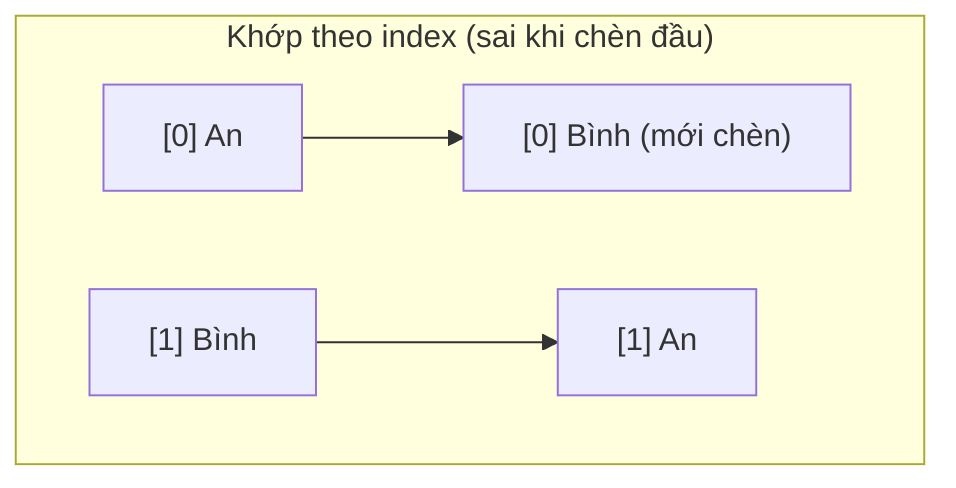

# Vì sao list cần key

## Mục lục

- [Tổng quan](#tổng-quan)
- [1. Không có key thì sao](#1-không-có-key-thì-sao)
- [2. Key giải quyết bài toán "danh tính"](#2-key-giải-quyết-bài-toán-danh-tính)
- [3. Bug kinh điển: dùng index làm key](#3-bug-kinh-điển-dùng-index-làm-key)
  - [3.1 Tái hiện bug với input](#31-tái-hiện-bug-với-input)
  - [3.2 Vì sao xảy ra — bảng trace](#32-vì-sao-xảy-ra--bảng-trace)
- [4. Khi nào index làm key lại an toàn](#4-khi-nào-index-làm-key-lại-an-toàn)
- [5. Chọn key đúng](#5-chọn-key-đúng)
- [6. Mẹo: dùng key để cố tình reset state](#6-mẹo-dùng-key-để-cố-tình-reset-state)
- [Tài liệu tham khảo](#tài-liệu-tham-khảo)

---

## Tổng quan

Khi render một danh sách, React cần biết: sau khi dữ liệu đổi (thêm/xóa/sắp xếp lại), phần tử nào trong cây mới **tương ứng** với phần tử nào trong cây cũ? `key` là **danh tính ổn định** trả lời câu hỏi đó.

> [!IMPORTANT]
> `key` **không** được truyền vào component như một prop. Nó là tín hiệu **nội bộ** cho thuật toán reconciliation (xem [Fiber & Reconciliation](/react-internals/fiber-reconciliation/)) để khớp fiber cũ với element mới. Chọn sai key → React khớp nhầm → state, DOM, animation bị "dính" sai phần tử.

---

## 1. Không có key thì sao

Khi thiếu key, React mặc định khớp các phần tử **theo vị trí (index)**. Điều này ổn nếu danh sách không bao giờ đổi thứ tự, nhưng sai ngay khi bạn chèn/xóa ở đầu/giữa danh sách.

```tsx
// React sẽ cảnh báo trong console:
// "Warning: Each child in a list should have a unique key prop."
{items.map((item) => <li>{item.text}</li>)}
```

---

## 2. Key giải quyết bài toán "danh tính"

Hãy hình dung danh sách học sinh xếp hàng. Nếu bạn điểm danh **theo vị trí đứng** ("bạn thứ 2"), thì khi một bạn ở đầu hàng đi ra, mọi người dịch lên — "bạn thứ 2" giờ là người khác. Nếu bạn điểm danh **theo tên** (key ổn định), ai là ai vẫn đúng dù hàng có xáo trộn.



Với `key`, React khớp `key='an'` cũ với `key='an'` mới dù chúng đổi vị trí — giữ nguyên DOM node, state nội bộ và không tạo lại thừa.

---

## 3. Bug kinh điển: dùng index làm key

`key={index}` về bản chất **giống hệt không có key** xét về danh tính: index 0 luôn là "phần tử đầu tiên", bất kể nội dung. Khi danh sách thay đổi thứ tự, state nội bộ của các phần tử **dính nhầm**.

### 3.1 Tái hiện bug với input

```tsx
import { useState } from 'react';

export default function App() {
  const [items, setItems] = useState(['Táo', 'Chuối', 'Cam']);

  function removeFirst() {
    setItems((prev) => prev.slice(1)); // xóa phần tử đầu
  }

  return (
    <div>
      <button onClick={removeFirst}>Xóa phần tử đầu</button>
      {items.map((item, index) => (
        // ❌ BUG: dùng index làm key
        <div key={index}>
          {item}: <input placeholder="ghi chú của bạn" />
        </div>
      ))}
    </div>
  );
}
```

**Cách tái hiện:** gõ "AAA" vào ô của *Táo*, "BBB" vào ô của *Chuối*, "CCC" vào ô của *Cam*. Bấm "Xóa phần tử đầu". Bạn **kỳ vọng** còn lại Chuối="BBB", Cam="CCC". Nhưng thực tế: **Chuối="AAA", Cam="BBB"** — ghi chú bị dính sai!

### 3.2 Vì sao xảy ra — bảng trace

`<input>` không được điều khiển (uncontrolled) nên state "AAA/BBB/CCC" nằm trong **DOM node**, được React khớp theo `key`. Vì key là index, sau khi xóa phần tử đầu:

| Vị trí (key) | Trước khi xóa | Sau khi xóa (data) | DOM node React giữ lại (theo key) | Kết quả thấy được |
|--------------|---------------|--------------------|------------------------------------|-------------------|
| key=0 | Táo + "AAA" | Chuối | giữ node cũ của key=0 (đang chứa "AAA") | **Chuối + "AAA"** ❌ |
| key=1 | Chuối + "BBB" | Cam | giữ node cũ của key=1 (đang chứa "BBB") | **Cam + "BBB"** ❌ |
| key=2 | Cam + "CCC" | — (bị xóa) | node key=2 bị remove | mất "CCC" |

React thấy "vẫn còn key=0 và key=1" nên **giữ nguyên** DOM input cũ (cùng nội dung gõ), chỉ đổi mỗi text bên cạnh. Danh tính bị gán sai.

> [!TIP]
> Đổi `key={index}` thành `key={item}` (hoặc id ổn định) thì React biết "Táo" đã biến mất, remove đúng ô của Táo, giữ đúng ô Chuối="BBB", Cam="CCC". Hãy thử để thấy bug biến mất.

---

## 4. Khi nào index làm key lại an toàn

Dùng index làm key **chấp nhận được** khi **cả ba** điều sau đúng:

1. Danh sách **không bao giờ** được sắp xếp lại hay lọc.
2. Phần tử **không** được thêm/xóa ở đầu hoặc giữa (chỉ append cuối, hoặc tĩnh hoàn toàn).
3. Phần tử **không** có state nội bộ (không input, không component có state).

<Callout type="warn">
Nếu không chắc chắn cả ba, **đừng** dùng index. Cái giá của một id ổn định rẻ hơn nhiều so với một bug "dữ liệu nhảy lung tung" lúc 2 giờ sáng.
</Callout>

---

## 5. Chọn key đúng

<Steps>
  <Step>
    ### Ưu tiên id từ dữ liệu
    `key={user.id}`, `key={todo.uuid}` — id từ database/backend là lựa chọn tốt nhất: ổn định, duy nhất.
  </Step>
  <Step>
    ### Không có id? Tạo lúc thêm dữ liệu
    Sinh id khi tạo item (`crypto.randomUUID()`), lưu cùng item. **Đừng** sinh id trong lúc render (`key={Math.random()}`) — mỗi render ra key mới → React tưởng phần tử nào cũng mới → remount toàn bộ, mất state, chậm.
  </Step>
  <Step>
    ### Ghép field nếu cần duy nhất
    Khi không có id đơn, ghép các field bất biến: `key={`${item.date}-${item.userId}`}`.
  </Step>
</Steps>

| Lựa chọn key | Đánh giá |
|--------------|----------|
| `key={item.id}` (id thật) | ✅ Tốt nhất |
| `key={item.name}` (nếu name duy nhất & ổn định) | ✅ Chấp nhận được |
| `key={index}` | ⚠️ Chỉ khi list tĩnh, không state |
| `key={Math.random()}` | ❌ Không bao giờ — remount mọi thứ mỗi render |

---

## 6. Mẹo: dùng key để cố tình reset state

Vì đổi key = "đây là phần tử khác" → React remount component (reset state), bạn có thể **lợi dụng** điều này để reset một form/component một cách gọn gàng:

```tsx
// Đổi userId → đổi key → ProfileForm remount → mọi state nội bộ reset sạch
<ProfileForm key={userId} userId={userId} />
```

> [!NOTE]
> Đây là cách "chính thống" để reset state khi chuyển ngữ cảnh (vd chuyển hồ sơ người dùng), thay vì viết `useEffect` thủ công để xóa từng field. Liên quan tới quy tắc "key đổi → fiber mới" ở bài Fiber.

---

## Tài liệu tham khảo

- [React Docs — Rendering Lists](https://react.dev/learn/rendering-lists)
- [React Docs — Preserving and Resetting State](https://react.dev/learn/preserving-and-resetting-state)
- [Fiber & Reconciliation](/react-internals/fiber-reconciliation/)
