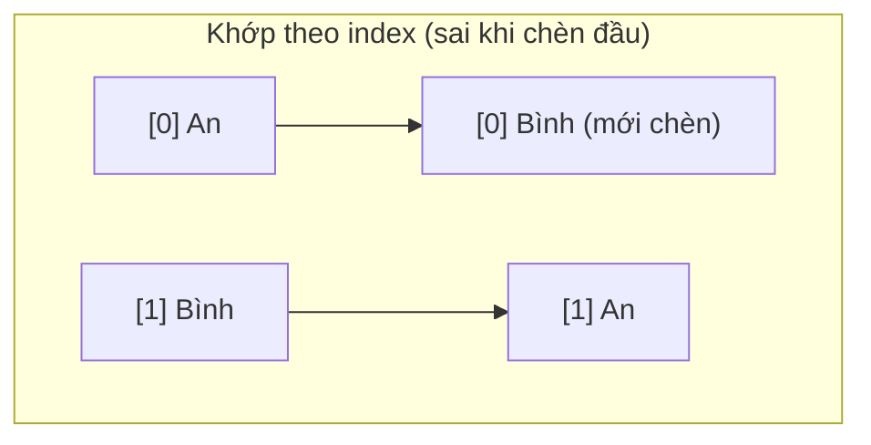
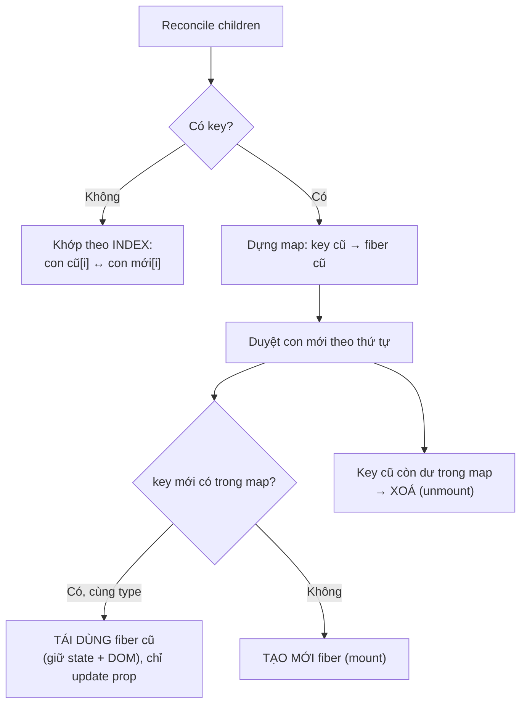

# Vì sao list cần key

## Mục lục

- [Tổng quan](#tổng-quan)
- [1. Không có key thì sao](#1-không-có-key-thì-sao)
- [2. Key giải quyết bài toán "danh tính"](#2-key-giải-quyết-bài-toán-danh-tính)
- [3. React khớp con như thế nào (cơ chế)](#3-react-khớp-con-như-thế-nào-cơ-chế)
- [4. Bug kinh điển: dùng index làm key](#4-bug-kinh-điển-dùng-index-làm-key)
  - [4.1 Tái hiện bug với input](#41-tái-hiện-bug-với-input)
  - [4.2 Vì sao xảy ra — bảng trace](#42-vì-sao-xảy-ra--bảng-trace)
  - [4.3 Không chỉ input — còn hiệu năng & animation](#43-không-chỉ-input--còn-hiệu-năng--animation)
- [5. Khi nào index làm key lại an toàn](#5-khi-nào-index-làm-key-lại-an-toàn)
- [6. Chọn key đúng](#6-chọn-key-đúng)
- [7. Các anti-pattern về key](#7-các-anti-pattern-về-key)
- [8. Mẹo: dùng key để cố tình reset state](#8-mẹo-dùng-key-để-cố-tình-reset-state)
- [9. Câu hỏi tự kiểm tra](#9-câu-hỏi-tự-kiểm-tra)
- [Tài liệu tham khảo](#tài-liệu-tham-khảo)

---

## Tổng quan

Khi render một danh sách, React cần biết: sau khi dữ liệu đổi (thêm/xóa/sắp xếp lại), phần tử nào trong cây mới **tương ứng** với phần tử nào trong cây cũ? `key` là **danh tính ổn định** trả lời câu hỏi đó.

> [!IMPORTANT]
> `key` **không** được truyền vào component như một prop. Nó là tín hiệu **nội bộ** cho thuật toán reconciliation (xem [Fiber & Reconciliation](/react-internals/fiber-reconciliation/)) để khớp fiber cũ với element mới. Chọn sai key → React khớp nhầm → state, DOM, animation bị "dính" sai phần tử.

> [!NOTE]
> Vì `key` không phải prop, bạn **không** đọc được nó trong component con (`props.key` là `undefined`). Nếu cần dùng giá trị đó bên trong con, hãy truyền lại qua một prop khác: `<Row key={id} id={id} />`.

---

## 1. Không có key thì sao

Khi thiếu key, React mặc định khớp các phần tử **theo vị trí (index)**. Điều này ổn nếu danh sách không bao giờ đổi thứ tự, nhưng sai ngay khi bạn chèn/xóa ở đầu/giữa danh sách.

```tsx
// React sẽ cảnh báo trong console:
// "Warning: Each child in a list should have a unique key prop."
{items.map((item) => <li>{item.text}</li>)}
```

Cảnh báo này **không phải** lỗi cú pháp — code vẫn chạy. Nhưng nó báo trước rằng React đang khớp theo index và bạn dễ gặp bug khi danh sách thay đổi.

---

## 2. Key giải quyết bài toán "danh tính"

Hãy hình dung danh sách học sinh xếp hàng. Nếu bạn điểm danh **theo vị trí đứng** ("bạn thứ 2"), thì khi một bạn ở đầu hàng đi ra, mọi người dịch lên — "bạn thứ 2" giờ là người khác. Nếu bạn điểm danh **theo tên** (key ổn định), ai là ai vẫn đúng dù hàng có xáo trộn.



Với `key`, React khớp `key='an'` cũ với `key='an'` mới dù chúng đổi vị trí — giữ nguyên DOM node, state nội bộ và không tạo lại thừa.

---

## 3. React khớp con như thế nào (cơ chế)

Khi reconcile một danh sách con, React không chạy thuật toán "tìm khác biệt tối thiểu" tốn kém. Nó duyệt theo quy tắc đơn giản, nhanh:



Tóm tắt 3 quyết định React đưa ra cho mỗi phần tử trong danh sách mới:

| Tình huống | Hành động của React |
|------------|---------------------|
| Cùng `key`, cùng `type` | Tái dùng fiber + DOM node, giữ state, chỉ cập nhật prop đổi |
| Cùng `key`, khác `type` | Unmount cũ, mount mới (state reset) |
| `key` mới không khớp ai | Mount mới |
| `key` cũ không còn dùng | Unmount (chạy cleanup effect) |

> [!TIP]
> Vì React khớp theo `key` trước rồi mới so `type`, một `key` ổn định cho phép React "nhận ra" phần tử dù nó nhảy vị trí — chỉ cần **di chuyển** DOM node thay vì xoá đi tạo lại.

---

## 4. Bug kinh điển: dùng index làm key

`key={index}` về bản chất **giống hệt không có key** xét về danh tính: index 0 luôn là "phần tử đầu tiên", bất kể nội dung. Khi danh sách thay đổi thứ tự, state nội bộ của các phần tử **dính nhầm**.

### 4.1 Tái hiện bug với input

```tsx
import { useState } from 'react';

export default function App() {
  const [items, setItems] = useState(['Táo', 'Chuối', 'Cam']);

  function removeFirst() {
    setItems((prev) => prev.slice(1)); // xóa phần tử đầu
  }

  return (
    <div>
      <button onClick={removeFirst}>Xóa phần tử đầu</button>
      {items.map((item, index) => (
        // ❌ BUG: dùng index làm key
        <div key={index}>
          {item}: <input placeholder="ghi chú của bạn" />
        </div>
      ))}
    </div>
  );
}
```

**Cách tái hiện:** gõ "AAA" vào ô của *Táo*, "BBB" vào ô của *Chuối*, "CCC" vào ô của *Cam*. Bấm "Xóa phần tử đầu". Bạn **kỳ vọng** còn lại Chuối="BBB", Cam="CCC". Nhưng thực tế: **Chuối="AAA", Cam="BBB"** — ghi chú bị dính sai!

### 4.2 Vì sao xảy ra — bảng trace

`<input>` không được điều khiển (uncontrolled) nên state "AAA/BBB/CCC" nằm trong **DOM node**, được React khớp theo `key`. Vì key là index, sau khi xóa phần tử đầu:

| Vị trí (key) | Trước khi xóa | Sau khi xóa (data) | DOM node React giữ lại (theo key) | Kết quả thấy được |
|--------------|---------------|--------------------|------------------------------------|-------------------|
| key=0 | Táo + "AAA" | Chuối | giữ node cũ của key=0 (đang chứa "AAA") | **Chuối + "AAA"** ❌ |
| key=1 | Chuối + "BBB" | Cam | giữ node cũ của key=1 (đang chứa "BBB") | **Cam + "BBB"** ❌ |
| key=2 | Cam + "CCC" | — (bị xóa) | node key=2 bị remove | mất "CCC" |

React thấy "vẫn còn key=0 và key=1" nên **giữ nguyên** DOM input cũ (cùng nội dung gõ), chỉ đổi mỗi text bên cạnh. Danh tính bị gán sai.

> [!TIP]
> Đổi `key={index}` thành `key={item}` (hoặc id ổn định) thì React biết "Táo" đã biến mất, remove đúng ô của Táo, giữ đúng ô Chuối="BBB", Cam="CCC". Hãy thử để thấy bug biến mất.

### 4.3 Không chỉ input — còn hiệu năng & animation

Index làm key còn gây hai hệ quả ít người để ý:

- **Hiệu năng:** khi chèn đầu danh sách, mọi index dịch đi → React tưởng **toàn bộ** phần tử đều "đổi nội dung" → cập nhật/đập đi dựng lại hàng loạt DOM node thay vì chỉ chèn 1 node. Với danh sách dài, đây là khác biệt thấy được khi cuộn.
- **Animation/transition:** thư viện như Framer Motion dựa vào key để biết phần tử nào "vừa vào/ra". Index làm key khiến animation chạy sai phần tử (cái đang ở lại bị animate như vừa xuất hiện).

```tsx
// ❌ Chèn đầu với index key: React update node 0,1,2... + thêm node cuối
//    → 4 thao tác sai thay vì 1 thao tác chèn đầu
[<Row key={0} a/>, <Row key={1} b/>]
  → [<Row key={0} x/>, <Row key={1} a/>, <Row key={2} b/>]
```

---

## 5. Khi nào index làm key lại an toàn

Dùng index làm key **chấp nhận được** khi **cả ba** điều sau đúng:

1. Danh sách **không bao giờ** được sắp xếp lại hay lọc.
2. Phần tử **không** được thêm/xóa ở đầu hoặc giữa (chỉ append cuối, hoặc tĩnh hoàn toàn).
3. Phần tử **không** có state nội bộ (không input, không component có state).

<Callout type="warn">
Nếu không chắc chắn cả ba, **đừng** dùng index. Cái giá của một id ổn định rẻ hơn nhiều so với một bug "dữ liệu nhảy lung tung" lúc 2 giờ sáng.
</Callout>

---

## 6. Chọn key đúng

<Steps>
  <Step>
    ### Ưu tiên id từ dữ liệu
    `key={user.id}`, `key={todo.uuid}` — id từ database/backend là lựa chọn tốt nhất: ổn định, duy nhất.
  </Step>
  <Step>
    ### Không có id? Tạo lúc thêm dữ liệu
    Sinh id khi tạo item (`crypto.randomUUID()`), lưu cùng item. **Đừng** sinh id trong lúc render (`key={Math.random()}`) — mỗi render ra key mới → React tưởng phần tử nào cũng mới → remount toàn bộ, mất state, chậm.
  </Step>
  <Step>
    ### Ghép field nếu cần duy nhất
    Khi không có id đơn, ghép các field bất biến: `` key={`${item.date}-${item.userId}`} ``.
  </Step>
</Steps>

| Lựa chọn key | Đánh giá |
|--------------|----------|
| `key={item.id}` (id thật) | ✅ Tốt nhất |
| `key={item.name}` (nếu name duy nhất & ổn định) | ✅ Chấp nhận được |
| `key={index}` | ⚠️ Chỉ khi list tĩnh, không state |
| `key={Math.random()}` | ❌ Không bao giờ — remount mọi thứ mỗi render |

---

## 7. Các anti-pattern về key

<Accordions type="single">
  <Accordion title="key={Math.random()} hoặc key={Date.now()}">
    Mỗi render sinh key mới → React coi mọi phần tử là mới → unmount + mount lại toàn bộ mỗi lần render. Mất hết state, focus, scroll; hiệu năng tệ. Tuyệt đối tránh.
  </Accordion>
  <Accordion title="key trùng nhau trong cùng danh sách">
    Hai phần tử cùng key → React không phân biệt được danh tính, cập nhật sai và cảnh báo. Key phải duy nhất trong PHẠM VI anh em (siblings), không cần duy nhất toàn app.
  </Accordion>
  <Accordion title="Đặt key trên phần tử con thay vì phần tử gốc của map">
    key phải nằm trên phần tử ngoài cùng mà .map() trả về. Đặt key sâu bên trong sẽ không có tác dụng và React vẫn cảnh báo.
  </Accordion>
  <Accordion title="Dùng index khi danh sách có sắp xếp/lọc">
    Khi user sort hoặc filter, index không còn ánh xạ đúng danh tính → state và DOM dính sai phần tử. Dùng id ổn định.
  </Accordion>
</Accordions>

---

## 8. Mẹo: dùng key để cố tình reset state

Vì đổi key = "đây là phần tử khác" → React remount component (reset state), bạn có thể **lợi dụng** điều này để reset một form/component một cách gọn gàng:

```tsx
// Đổi userId → đổi key → ProfileForm remount → mọi state nội bộ reset sạch
<ProfileForm key={userId} userId={userId} />
```

> [!NOTE]
> Đây là cách "chính thống" để reset state khi chuyển ngữ cảnh (vd chuyển hồ sơ người dùng), thay vì viết `useEffect` thủ công để xóa từng field. Liên quan tới quy tắc "key đổi → fiber mới" ở bài Fiber.

```tsx
// Ví dụ: reset form khi chuyển tab, không cần xoá thủ công từng field
function Editor({ tabId }: { tabId: string }) {
  return <RichTextForm key={tabId} />; // đổi tab → form mới tinh
}
```

> [!WARNING]
> Đây là con dao hai lưỡi: đổi key cũng **xoá toàn bộ** state, làm chạy lại effect mount, mất focus/scroll. Chỉ dùng khi bạn **thật sự muốn** reset hoàn toàn — đừng vô tình đặt key động lên component không muốn remount.

---

## 9. Câu hỏi tự kiểm tra

<Accordions type="single">
  <Accordion title="1. key có phải prop truyền vào component không?">
    Không. key là tín hiệu nội bộ cho reconciliation. props.key trong con là undefined. Muốn dùng giá trị đó hãy truyền thêm một prop riêng.
  </Accordion>
  <Accordion title="2. Vì sao input bị 'dính' nội dung sai khi dùng index làm key?">
    Vì state của input uncontrolled nằm trong DOM node, React giữ node theo key=index. Khi xoá phần tử đầu, các index dịch đi nhưng node cũ (chứa nội dung cũ) vẫn được giữ ở index đó → dính sai.
  </Accordion>
  <Accordion title="3. key cần duy nhất trong phạm vi nào?">
    Trong phạm vi anh em (cùng danh sách .map). Không cần duy nhất toàn ứng dụng.
  </Accordion>
  <Accordion title="4. Vì sao không nên dùng key={Math.random()}?">
    Mỗi render sinh key mới → mọi phần tử bị coi là mới → remount toàn bộ, mất state, chậm.
  </Accordion>
  <Accordion title="5. Làm sao reset sạch state của một component khi đổi ngữ cảnh?">
    Đặt key động lên nó (ví dụ `key={userId}`). Key đổi → React tạo fiber mới → state reset hoàn toàn.
  </Accordion>
</Accordions>

---

## Tài liệu tham khảo

- [React Docs — Rendering Lists](https://react.dev/learn/rendering-lists)
- [React Docs — Preserving and Resetting State](https://react.dev/learn/preserving-and-resetting-state)
- [React Docs — Keeping list items in order with key](https://react.dev/learn/rendering-lists#keeping-list-items-in-order-with-key)
- [Fiber & Reconciliation](/react-internals/fiber-reconciliation/)
- [Vì sao component re-render](/react-internals/vi-sao-component-rerender/)
