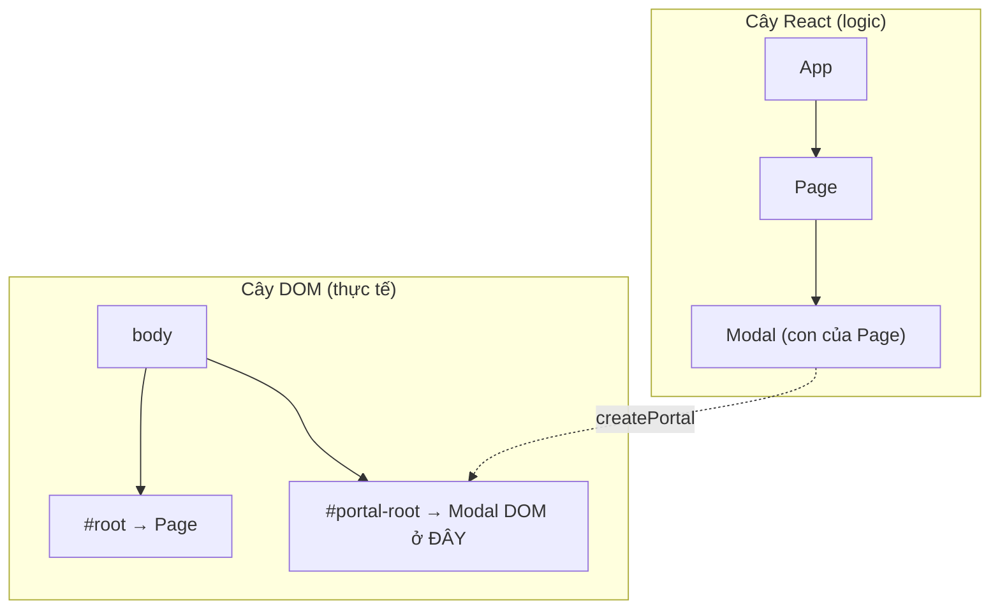
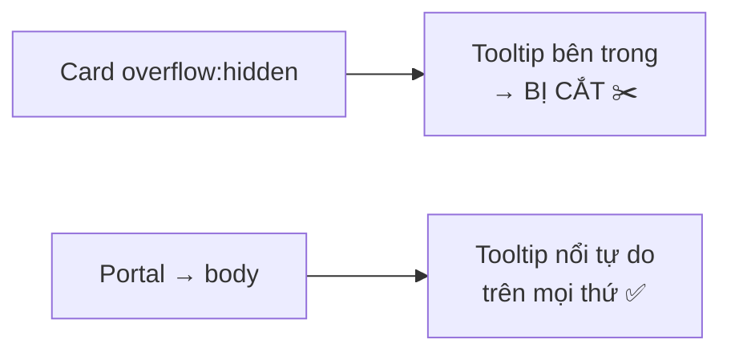
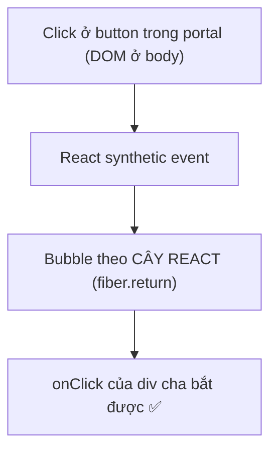
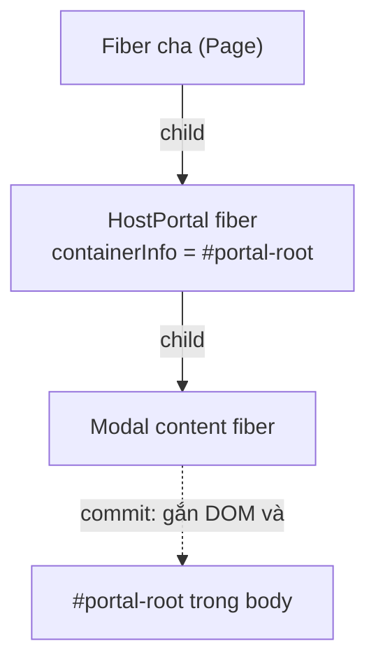
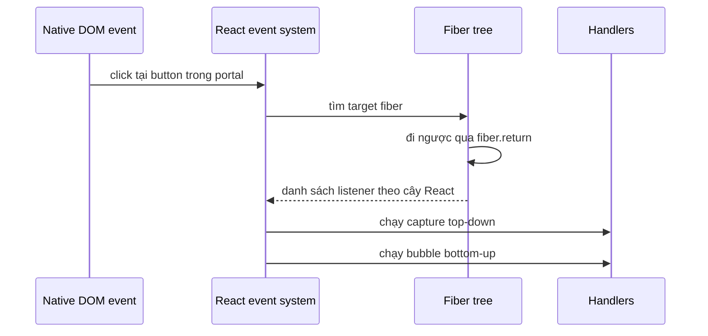
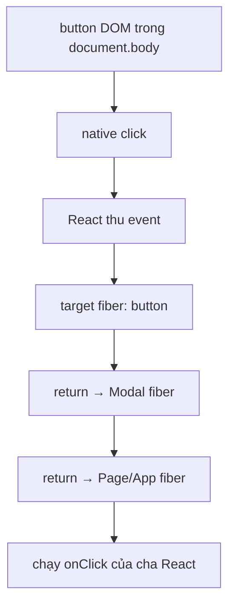
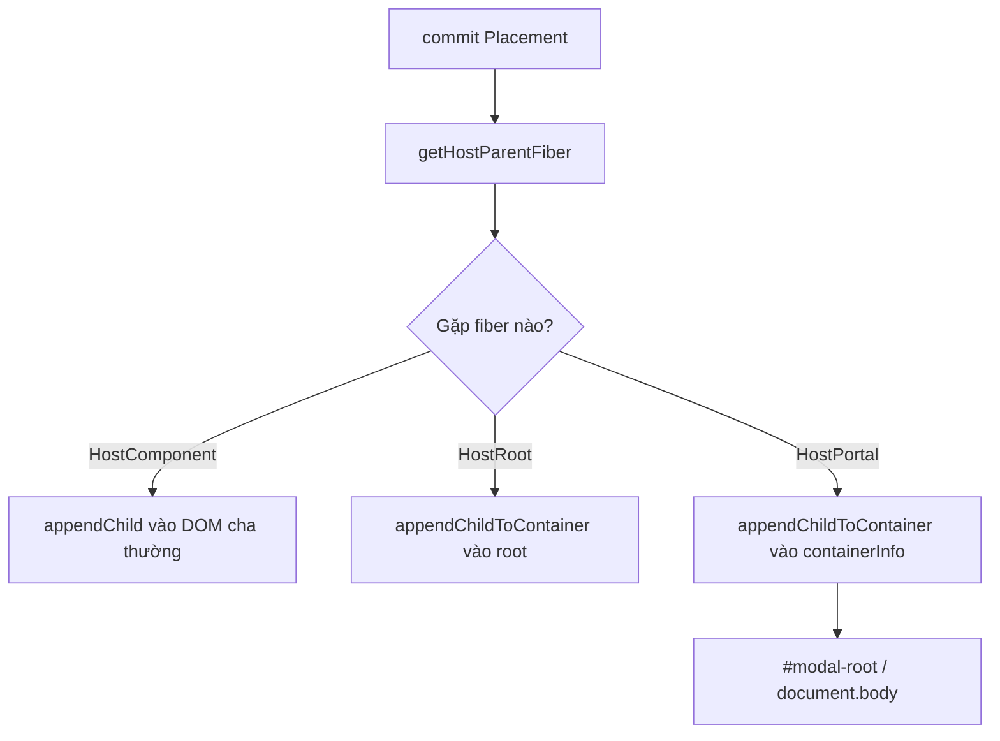
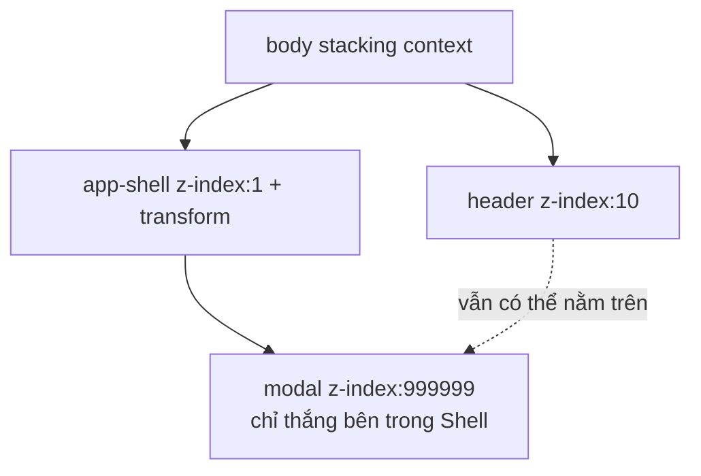

# Portals

## Mục lục

- [Tổng quan](#tổng-quan)
- [1. Vấn đề: CSS clipping & z-index](#1-vấn-đề-css-clipping--z-index)
- [2. createPortal — cú pháp](#2-createportal--cú-pháp)
- [3. Insight cốt lõi: DOM tree ≠ React tree](#3-insight-cốt-lõi-dom-tree--react-tree)
  - [3.1 Event bubbling đi theo cây React](#31-event-bubbling-đi-theo-cây-react)
  - [3.2 Context xuyên qua portal](#32-context-xuyên-qua-portal)
- [4. Bên trong: HostPortal fiber](#4-bên-trong-hostportal-fiber)
- [5. Cấu trúc object portal & fiber](#5-cấu-trúc-object-portal--fiber)
- [6. Synthetic event & delegation](#6-synthetic-event--delegation)
  - [6.1 React dựng propagation path từ fiber.return](#61-react-dựng-propagation-path-từ-fiberreturn)
  - [6.2 Capture phase vs bubble phase](#62-capture-phase-vs-bubble-phase)
- [7. Commit: node được chèn vào đâu](#7-commit-node-được-chèn-vào-đâu)
- [8. Nhiều portal vào cùng một node](#8-nhiều-portal-vào-cùng-một-node)
- [9. stopPropagation với listener bên thứ ba](#9-stoppropagation-với-listener-bên-thứ-ba)
- [10. Portal + Concurrent/transitions](#10-portal--concurrenttransitions)
- [11. z-index & stacking context — đào sâu](#11-z-index--stacking-context--đào-sâu)
- [12. Ví dụ chạy được: Modal](#12-ví-dụ-chạy-được-modal)
- [13. Accessibility & focus management](#13-accessibility--focus-management)
- [14. Bẫy SSR & hydration](#14-bẫy-ssr--hydration)
- [15. Khi nào dùng portal](#15-khi-nào-dùng-portal)
- [16. Hiểu lầm thường gặp (FAQ)](#16-hiểu-lầm-thường-gặp-faq)
- [17. Câu hỏi tự kiểm tra](#17-câu-hỏi-tự-kiểm-tra)
- [Tài liệu tham khảo](#tài-liệu-tham-khảo)

---

## Tổng quan

**Portal** cho phép render một component vào **một node DOM nằm ngoài** cây DOM của component cha — trong khi component đó vẫn là **con hợp lệ trong cây React**.



> [!IMPORTANT]
> Đây là điểm khiến portal "kỳ diệu" và cũng hay gây bối rối: node DOM của con **nhảy ra chỗ khác** (thường là `document.body`), **nhưng** về mặt React, con **vẫn nằm nguyên trong cây** — nên **event bubbling, context, state đều hoạt động như thể nó chưa đi đâu cả**. Portal chỉ đổi *nơi DOM được gắn*, không đổi *quan hệ cha-con trong React*.

Để hiểu sâu bài này, nên nắm khái niệm cây fiber ở [Fiber & Reconciliation](/react-internals/fiber-reconciliation/).

---

## 1. Vấn đề: CSS clipping & z-index

Các UI nổi (modal, tooltip, dropdown, toast) thường bị "kẹt" bên trong cha vì CSS:

- Cha có `overflow: hidden` → nội dung tràn ra bị **cắt**.
- Cha tạo **stacking context** (có `transform`, `opacity`, `z-index`) → phần tử con **không thể** nổi lên trên các phần tử ngoài cha, dù `z-index` cao cỡ nào.
- Cha có `position: relative` giới hạn định vị `absolute` của con.



Giải pháp sạch nhất: **render phần tử nổi ra thẳng `document.body`** (hoặc một `#portal-root` riêng), thoát khỏi mọi ràng buộc CSS của cha — đó chính là portal.

---

## 2. createPortal — cú pháp

```tsx
import { createPortal } from 'react-dom';

createPortal(children, domNode, key?);
```

| Tham số | Ý nghĩa |
|---------|---------|
| `children` | Bất cứ thứ gì render được (JSX, chuỗi, fragment) |
| `domNode` | Node DOM **có sẵn** để gắn `children` vào (vd `document.body`) |
| `key?` | Key tùy chọn, như mọi phần tử React |

```tsx
function Tooltip({ children }) {
  // children được render vào body, nhưng vẫn là con của Tooltip trong React
  return createPortal(children, document.body);
}
```

> [!WARNING]
> `domNode` phải **đã tồn tại** khi render. Nếu tạo `#portal-root` động, đảm bảo nó có mặt trước khi portal render (thường đặt sẵn trong `index.html`, hoặc tạo trong `useEffect` + chỉ render portal sau khi mounted — xem mục 7).

---

## 3. Insight cốt lõi: DOM tree ≠ React tree

Portal **tách rời** hai cây vốn thường trùng nhau:

| | Vị trí | Điều khiển bởi |
|---|--------|----------------|
| **Cây React (logic)** | Con vẫn nằm dưới cha đã gọi `createPortal` | Quan hệ cha-con trong code |
| **Cây DOM (vật lý)** | Node nằm ở `domNode` đích (vd `body`) | Tham số thứ 2 của `createPortal` |

Mọi hành vi "theo cây" của React đều bám vào **cây React**, không phải cây DOM.

### 3.1 Event bubbling đi theo cây React

Đây là hệ quả gây bất ngờ nhất. Một sự kiện (vd `onClick`) phát ra từ bên trong portal sẽ **bong bóng (bubble) lên cha React**, kể cả khi node DOM nằm tận `body` — vì React dùng hệ thống **synthetic event** gắn ở gốc và điều phối theo cây fiber.

```tsx
function App() {
  return (
    // Bấm vào nút BÊN TRONG portal vẫn kích hoạt onClick này!
    <div onClick={() => console.log('cha React bắt được click')}>
      <Modal>
        <button>Bấm tôi (DOM ở body)</button>
      </Modal>
    </div>
  );
}
```



> [!IMPORTANT]
> Bubbling theo cây React là **tính năng**, không phải bug — nó khiến portal "trong suốt" với logic của bạn. Nhưng cũng là **bẫy**: nếu bạn có handler "click ra ngoài để đóng modal" gắn ở cha, click **bên trong** modal (portal) vẫn bubble lên cha → có thể đóng modal ngoài ý muốn. Xử lý bằng `e.stopPropagation()` hoặc kiểm tra `event.target`.

### 3.2 Context xuyên qua portal

Vì con vẫn ở đúng vị trí trong cây React, nó **vẫn đọc được context** từ provider phía trên — dù DOM nằm ở `body`:

```tsx
<ThemeContext.Provider value="dark">
  <Modal>
    {/* useContext(ThemeContext) ở đây vẫn ra "dark" ✅ */}
    <ThemedButton />
  </Modal>
</ThemeContext.Provider>
```

Đây là ưu điểm lớn so với việc tự `ReactDOM.render` một cây riêng ở `body` (cây riêng đó sẽ **mất** context, event bubbling và state của cha).

---

## 4. Bên trong: HostPortal fiber

Về mặt reconciler, portal được biểu diễn bằng một fiber loại đặc biệt: **`HostPortal`**. Trong quá trình reconciliation, React vẫn duyệt con của portal như một phần cây fiber bình thường (nên context/event hoạt động), nhưng ở pha **commit**, khi thao tác DOM, React gắn các node con vào **`stateNode.containerInfo`** (chính là `domNode` bạn truyền) thay vì vào DOM của cha.



> [!NOTE]
> Vì portal chỉ là một fiber trong cùng cây, mọi cơ chế đã học vẫn áp dụng: reconciliation, bailout, effect chạy đúng thứ tự, unmount dọn dẹp. React tự tháo node khỏi `domNode` khi portal unmount — bạn **không** cần tự xóa DOM.

---

## 5. Cấu trúc object portal & fiber

`createPortal` không trả về DOM node. Nó trả về một **React Portal object** — một object mô tả "hãy render `children` vào container này". Ở mức source-level, hình dạng của nó gần như sau:

```ts
type ReactPortal = {
  $$typeof: symbol; // Symbol.for('react.portal')
  key: string | null;
  children: React.ReactNode;
  containerInfo: Element | DocumentFragment;
  implementation: unknown;
};
```

Ví dụ object minh hoạ khi gọi `createPortal(<p>Xin chào</p>, document.body, 'modal')`:

```tsx
const portal = createPortal(<p>Xin chào</p>, document.body, 'modal');

// Mô hình hoá để dễ hình dung, không nên phụ thuộc vào shape này trong app code.
const portalLikeObject = {
  $$typeof: Symbol.for('react.portal'),
  key: 'modal',
  children: <p>Xin chào</p>,
  containerInfo: document.body,
  implementation: null,
};
```

Trong reconciliation, React nhận ra `$$typeof === REACT_PORTAL_TYPE` và tạo fiber bằng `createFiberFromPortal(...)`. Fiber đó có `tag = HostPortal`; phần quan trọng nhất nằm ở `stateNode`:

```ts
// Giản lược từ ý tưởng của createFiberFromPortal
const fiber = {
  tag: HostPortal,
  key: portal.key,
  pendingProps: portal.children,
  stateNode: {
    containerInfo: portal.containerInfo, // DOM node đích
    pendingChildren: null,
    implementation: portal.implementation,
  },
};
```

| Thành phần | Ở đâu | Ý nghĩa |
|------------|-------|---------|
| `children` | Portal object / `pendingProps` của fiber | Subtree React cần render |
| `containerInfo` | Portal object và `fiber.stateNode.containerInfo` | DOM node đích, ví dụ `document.body` hoặc `#modal-root` |
| `HostPortal` | `fiber.tag` | Báo cho reconciler/commit phase rằng đây là ranh giới portal |
| `key` | Portal object / fiber | Dùng khi diff nhiều portal cùng cấp, giống key của element |

<Callout type="warn" title="Đừng dựa vào object nội bộ trong production">
  Shape trên hữu ích để học internals, nhưng app code chỉ nên dùng API công khai `createPortal(children, domNode, key?)`. Tên field nội bộ có thể thay đổi giữa các phiên bản React.
</Callout>

---

## 6. Synthetic event & delegation

React không gắn `onclick` riêng lẻ vào mọi button. Nó dùng **event delegation**: gắn listener ở cấp container, bắt native event, rồi tự dựng và dispatch **SyntheticEvent** tới các handler `onClick`, `onClickCapture`, ...

Từ React 17 trở đi, listener delegated cho phần lớn event được gắn ở **root container** mà bạn truyền cho `createRoot(...)`, thay vì gắn toàn cục ở `document` như React 16. Thay đổi này giúp nhiều phiên bản React hoặc nhiều root cùng tồn tại ít va chạm hơn.

<Callout type="info" title="Mô hình hoá cẩn thận với portal ngoài root container">
  React docs bảo đảm hành vi quan trọng cho người dùng: event từ portal **propagate theo cây component React**, không theo cây DOM. Chi tiết listener native được gắn ở đâu cho portal nằm ngoài root container là implementation detail của `react-dom`; đừng viết logic phụ thuộc vào vị trí listener nội bộ. Hãy suy luận ở mức contract: React sẽ dispatch synthetic event theo cây React.
</Callout>

### 6.1 React dựng propagation path từ fiber.return

Khi native event xảy ra, React tìm fiber gần target DOM nhất, rồi đi ngược bằng con trỏ `return` để gom listener. Trong source, một phần việc này nằm ở các hàm kiểu `accumulateSinglePhaseListeners(...)`.



Vì path được dựng từ **fiber tree**, cha React vẫn nhận được event dù DOM của portal nằm ở `body`:



Điểm cần nhớ: **DOM ancestry** và **React ancestry** khác nhau; SyntheticEvent ưu tiên React ancestry.

### 6.2 Capture phase vs bubble phase

Portal tôn trọng cả hai pha của event system:

| Pha | Handler | Thứ tự chạy | Tính theo cây nào? |
|-----|---------|-------------|--------------------|
| Capture | `onClickCapture` | Từ ancestor cao xuống target | Cây fiber / component tree |
| Bubble | `onClick` | Từ target đi ngược lên ancestor | Cây fiber / component tree |

```tsx
function Page() {
  return (
    <section
      onClickCapture={() => console.log('capture Page')}
      onClick={() => console.log('bubble Page')}
    >
      <Modal>
        <button
          onClickCapture={() => console.log('capture Button')}
          onClick={() => console.log('bubble Button')}
        >
          Click
        </button>
      </Modal>
    </section>
  );
}
```

Khi click button trong portal, thứ tự synthetic event hợp lý là: capture ancestor → capture target → bubble target → bubble ancestor. Việc button DOM nằm ngoài `<section>` không làm mất quan hệ này.

---

## 7. Commit: node được chèn vào đâu

Trong render phase, portal vẫn là fiber con bình thường. Khác biệt chỉ trở nên rõ ở **commit phase**, khi React cần chèn DOM node thật.

Khi tìm host parent để placement, logic kiểu `getHostParentFiber` đi ngược `return` cho tới khi gặp một host boundary:

- `HostComponent` → parent là DOM element thường, ví dụ `<div>`.
- `HostRoot` → parent là root container.
- `HostPortal` → parent là **portal container** (`stateNode.containerInfo`).

Với `HostPortal`, React đi theo nhánh **container** (`isContainer = true`) và dùng thao tác kiểu `appendChildToContainer(...)` hoặc `insertInContainerBefore(...)`, thay vì `appendChild(...)` thường.

| Trường hợp | Host parent | Hàm commit DOM | Kết quả |
|------------|-------------|----------------|---------|
| DOM thường | DOM element cha (`<div>`, `<main>`) | `appendChild(parent, child)` / `insertBefore(...)` | Node con nằm trong DOM cha |
| Portal | `HostPortal.stateNode.containerInfo` | `appendChildToContainer(containerInfo, child)` / `insertInContainerBefore(...)` | Node con được gắn vào container đích |



Khi portal unmount, React cũng đi qua commit deletion và gỡ các host node khỏi `containerInfo`, đồng thời chạy cleanup effect/ref như subtree bình thường. Bạn chỉ cần điều khiển state để mount/unmount portal; không tự `removeChild` các node do React quản lý.

---

## 8. Nhiều portal vào cùng một node

Nhiều component có thể cùng `createPortal(..., document.body)` hoặc cùng `#overlay-root`. React quản lý từng portal như từng subtree độc lập: reconciliation, effect, ref và cleanup của portal A không trộn với portal B.

```tsx
function App() {
  return (
    <>
      {createPortal(<Toast id="save" />, document.body, 'toast-save')}
      {createPortal(<Modal />, document.body, 'modal')}
    </>
  );
}
```

Về DOM, các node được chèn vào cùng container theo thứ tự commit/placement mà React quyết định từ cây hiện tại. Trong thực tế overlay, thứ tự DOM chỉ là một phần câu chuyện; **z-index, stacking context và thứ tự mount** đều ảnh hưởng cái nào nằm trên.

> [!TIP]
> Với app nhiều overlay, nên có một `OverlayProvider`/`PortalManager` tập trung để cấp `z-index`, thứ tự layer (`tooltip < popover < modal < toast`) và chính sách focus. Đừng để mỗi component tự chọn `z-index: 999999`.

---

## 9. stopPropagation với listener bên thứ ba

`e.stopPropagation()` trong React chặn propagation trong hệ SyntheticEvent của React và thường cũng gọi `nativeEvent.stopPropagation()`. Nhưng bẫy thực tế nằm ở chỗ nhiều thư viện không đi qua React: chúng gắn listener trực tiếp bằng `document.addEventListener(...)` hoặc `window.addEventListener(...)` để làm click-outside, analytics, hotkey...

Với portal, thứ tự và phạm vi listener dễ gây bất ngờ:

- React dispatch event theo cây component tới root/container của nó.
- Listener native trên `document`/`window` có thể chạy ở pha khác hoặc cấp khác so với handler React.
- Một click trong portal có thể vừa được React coi là "bên trong component", vừa bị code `document.addEventListener('click', ...)` coi là một target DOM nằm ngoài wrapper gốc.

```tsx
useEffect(() => {
  function onDocumentClick(event: MouseEvent) {
    // Nếu chỉ kiểm tra wrapperRef.current.contains(event.target),
    // portal DOM ở body có thể bị xem nhầm là "outside".
  }

  document.addEventListener('click', onDocumentClick);
  return () => document.removeEventListener('click', onDocumentClick);
}, []);
```

Các cách xử lý an toàn hơn:

| Cách | Khi dùng | Ghi chú |
|------|----------|---------|
| Kiểm tra đúng target | Click-outside tự viết | Dùng ref của cả trigger **và** portal content; kiểm tra `contains` trên cả hai |
| Dùng listener cùng cấp | Cần kiểm soát thứ tự | Gắn listener trong React tree hoặc cùng capture/bubble phase thay vì trộn lung tung |
| Dùng `pointerdown` capture có chủ đích | Dropdown/popover phức tạp | Chọn một phase duy nhất, document rõ thứ tự đóng/mở |
| Dùng thư viện headless | Dialog/menu production | Radix UI, React Aria, Headless UI đã xử lý portal + outside interaction kỹ hơn |

<Callout type="warn" title="Đừng xem stopPropagation là tường lửa tuyệt đối">
  `stopPropagation` không thay thế được thiết kế outside-click đúng. Khi có listener native bên thứ ba trên `document/window`, hãy kiểm tra target/ref rõ ràng và test cả click trong portal, click trigger, click ngoài overlay.
</Callout>

---

## 10. Portal + Concurrent/transitions

Portal không phải một root React riêng; nó là một fiber trong cùng cây. Vì vậy trong Concurrent rendering, `startTransition`, Suspense, lanes, bailout... vẫn áp dụng bình thường cho subtree portal.

```tsx
startTransition(() => {
  setShowLargeSearchDialog(true); // dialog render qua portal vẫn là update trong cùng cây
});
```

Ý nghĩa thực tế:

- Render phase của subtree portal có thể được ưu tiên/gián đoạn như các subtree khác.
- Commit phase vẫn nguyên tử: khi React quyết định commit, DOM portal được chèn/gỡ nhất quán.
- Context và event không cần xử lý đặc biệt trong transition.

> [!NOTE]
> Nếu bạn cần một lịch ưu tiên hoàn toàn độc lập, đó là câu chuyện **nhiều React root** (`createRoot` khác), không phải portal. Portal giữ subtree trong cùng root logic.

---

## 11. z-index & stacking context — đào sâu

`z-index` chỉ so sánh có ý nghĩa **bên trong cùng stacking context**. Nếu một ancestor tạo stacking context, mọi con của nó bị "đóng gói" trong layer đó; con không thể vượt ra ngoài layer của cha, dù đặt `z-index: 999999`.

Các thuộc tính hay tạo stacking context:

- `position` + `z-index` khác `auto`
- `transform`, `filter`, `perspective`
- `opacity < 1`
- `will-change: transform`
- `isolation: isolate`
- một số trường hợp `contain`, `mix-blend-mode`, `position: fixed/sticky` theo ngữ cảnh

Bug điển hình:

```css
.app-shell {
  position: relative;
  z-index: 1;
  transform: translateZ(0); /* tạo stacking context */
}

.header {
  position: relative;
  z-index: 10;
}

.modal-inside-shell {
  position: fixed;
  inset: 0;
  z-index: 999999;
}
```

Nếu `.modal-inside-shell` nằm trong `.app-shell`, nó vẫn bị nhốt trong stacking context có `z-index: 1`. Một `.header` bên ngoài với `z-index: 10` có thể nổi lên trên modal, dù modal có `999999`.



Portal khắc phục bằng cách đưa modal ra ngoài `.app-shell`, thường lên `document.body` hoặc `#modal-root` là sibling của root app:

```tsx
function Modal({ children }: { children: React.ReactNode }) {
  return createPortal(
    <div className="modal-layer">{children}</div>,
    document.body,
  );
}
```

```css
.modal-layer {
  position: fixed;
  inset: 0;
  z-index: 1000; /* giờ so trong stacking context gần body hơn */
}
```

<Callout type="info" title="Portal không tự động thắng mọi z-index">
  Portal giúp thoát khỏi stacking context của cha, nhưng bạn vẫn cần chiến lược layer rõ ràng ở cấp `body`: ví dụ `dropdown: 100`, `popover: 200`, `modal: 1000`, `toast: 1100`. Nếu chính `body`/ancestor ngoài cùng hoặc container portal cũng tạo stacking context lạ, vẫn phải debug CSS như bình thường.
</Callout>

---

## 12. Ví dụ chạy được: Modal

```tsx
import { createPortal } from 'react-dom';
import { useEffect, useState } from 'react';

function Modal({ onClose, children }: {
  onClose: () => void;
  children: React.ReactNode;
}) {
  // Đóng khi bấm Escape
  useEffect(() => {
    const onKey = (e: KeyboardEvent) => e.key === 'Escape' && onClose();
    document.addEventListener('keydown', onKey);
    return () => document.removeEventListener('keydown', onKey);
  }, [onClose]);

  return createPortal(
    // Overlay phủ toàn màn hình — render thẳng vào body
    <div
      onClick={onClose} // click nền → đóng
      style={{
        position: 'fixed', inset: 0,
        background: 'rgba(0,0,0,.5)',
        display: 'grid', placeItems: 'center',
      }}
    >
      <div
        onClick={(e) => e.stopPropagation()} // chặn bubble để click nội dung KHÔNG đóng
        role="dialog"
        aria-modal="true"
        style={{ background: '#fff', padding: 24, borderRadius: 8 }}
      >
        {children}
        <button onClick={onClose}>Đóng</button>
      </div>
    </div>,
    document.body,
  );
}

export default function App() {
  const [open, setOpen] = useState(false);
  return (
    <div style={{ overflow: 'hidden', height: 100 }}>
      <button onClick={() => setOpen(true)}>Mở modal</button>
      {open && <Modal onClose={() => setOpen(false)}><h2>Xin chào 👋</h2></Modal>}
    </div>
  );
}
```

Chú ý `stopPropagation()` ở khối nội dung: nhờ portal bubble theo cây React, click nội dung modal cũng bubble tới overlay `onClick={onClose}` → phải chặn để không đóng nhầm. Đây là biểu hiện thực tế của mục 3.1 và mục 6.

---

## 13. Accessibility & focus management

Portal giải quyết vấn đề CSS nhưng **không tự lo a11y** — bạn phải xử lý:

<Steps>
  <Step>
    ### Đánh dấu vai trò
    Thêm `role="dialog"` và `aria-modal="true"` cho container modal.
  </Step>
  <Step>
    ### Focus trap
    Khi mở, chuyển focus vào modal; giữ focus quẩn trong modal (Tab không thoát ra sau lưng). Khi đóng, trả focus về phần tử đã mở.
  </Step>
  <Step>
    ### Chặn cuộn nền
    Đặt `overflow: hidden` cho `body` khi modal mở để nền không cuộn phía sau.
  </Step>
  <Step>
    ### Đóng bằng Escape
    Lắng nghe phím Escape (như ví dụ trên) để bàn phím cũng đóng được.
  </Step>
</Steps>

> [!TIP]
> Đừng tự viết lại focus trap nếu có thể — các thư viện headless như Radix UI, Headless UI, React Aria đã xử lý đúng a11y (focus trap, `aria-*`, cuộn nền) bên trên portal. Chỉ tự viết khi cần kiểm soát tuyệt đối.

---

## 14. Bẫy SSR & hydration

`createPortal` **không chạy khi render phía server** (không có `document`). Nếu gọi trực tiếp trong render trên server → lỗi `document is not defined`, hoặc hydration mismatch.

```tsx
// ✅ Chỉ render portal sau khi đã mounted phía client
function ClientPortal({ children }: { children: React.ReactNode }) {
  const [mounted, setMounted] = useState(false);
  useEffect(() => setMounted(true), []); // effect chỉ chạy ở client, sau paint

  if (!mounted) return null; // server + lần render đầu client: chưa render portal
  return createPortal(children, document.body);
}
```

> [!WARNING]
> Trong Next.js (SSR/SSG), luôn bảo vệ portal bằng cờ `mounted` như trên, hoặc dùng `dynamic(() => ..., { ssr: false })`. Truy cập `document`/`window` trong thân render sẽ vỡ ở bước build/SSR. Xem thêm cơ chế hydration ở [Render Pipeline](/react-internals/render-pipeline/).

---

## 15. Khi nào dùng portal

| Trường hợp | Portal? | Vì sao |
|-----------|---------|--------|
| Modal / Dialog | ✅ | Thoát `overflow`, phủ toàn màn hình, quản z-index tập trung |
| Tooltip / Popover | ✅ | Tránh bị cha cắt, định vị tự do theo viewport |
| Dropdown menu | ✅ | Nổi trên mọi thứ, không bị stacking context của cha |
| Toast / Notification | ✅ | Gom về một `#toast-root` cố định |
| Layout / nội dung thường | ❌ | Không có lý do tách khỏi DOM cha; portal làm phức tạp thừa |

> [!IMPORTANT]
> Chỉ dùng portal cho UI **nổi/overlay** cần thoát ràng buộc CSS của cha. Đừng dùng portal cho layout thông thường — nó khiến DOM khó suy luận và tăng độ phức tạp không cần thiết.

---

## 16. Hiểu lầm thường gặp (FAQ)

<Accordions type="single">
  <Accordion title="Portal có tạo một cây React riêng biệt không?">
    Không. Con của portal vẫn thuộc cùng cây React với cha. Chỉ node DOM được gắn ở nơi khác. Vì vậy context, state, event bubbling đều hoạt động bình thường.
  </Accordion>
  <Accordion title="Vì sao click trong modal (portal) lại kích hoạt onClick của cha ở xa?">
    Vì event bubble theo cây React (synthetic event), không theo cây DOM. Node ở body nhưng React coi nó là con của cha → sự kiện bubble lên cha. Dùng stopPropagation nếu không muốn.
  </Accordion>
  <Accordion title="Context có xuyên qua portal không?">
    Có. Con vẫn ở đúng vị trí trong cây React nên đọc được mọi Provider phía trên, dù DOM nằm ở body.
  </Accordion>
  <Accordion title="Có phải tự xóa node DOM khi đóng portal không?">
    Không. Khi portal unmount, React tự tháo node con khỏi domNode đích và chạy cleanup effect như bình thường.
  </Accordion>
  <Accordion title="Portal object có phải React element thông thường không?">
    Không hẳn. `createPortal` trả về object có `$$typeof: Symbol(react.portal)`, `children`, `containerInfo`... Reconciler nhận ra object này và tạo `HostPortal` fiber thay vì `HostComponent`/`FunctionComponent` thông thường.
  </Accordion>
  <Accordion title="onClickCapture có đi xuyên portal như onClick không?">
    Có. Cả capture và bubble đều được React tính theo cây fiber/component tree. `onClickCapture` chạy top-down từ ancestor React tới target; `onClick` chạy bottom-up từ target lên ancestor React.
  </Accordion>
  <Accordion title="Vì sao click-outside tự viết hay lỗi với portal?">
    Vì portal content nằm ngoài wrapper DOM ban đầu. Nếu listener native trên `document` chỉ kiểm tra `wrapperRef.current.contains(event.target)`, click bên trong portal có thể bị xem nhầm là outside. Cần kiểm tra cả ref của portal content hoặc dùng thư viện headless.
  </Accordion>
  <Accordion title="Portal chạy được khi SSR không?">
    Không render phía server. Phải bảo vệ bằng cờ mounted (set trong useEffect) hoặc dynamic import ssr:false, nếu không sẽ lỗi document is not defined.
  </Accordion>
</Accordions>

---

## 17. Câu hỏi tự kiểm tra

<Accordions type="single">
  <Accordion title="1. Portal thay đổi điều gì và GIỮ nguyên điều gì?">
    Thay đổi: nơi node DOM được gắn (ra ngoài cây DOM cha). Giữ nguyên: vị trí con trong cây React → context, state, event bubbling vẫn theo cây React.
  </Accordion>
  <Accordion title="2. Vì sao portal giải quyết được overflow:hidden và z-index?">
    Vì node được render thẳng ra body (hoặc #portal-root), thoát khỏi overflow clipping và stacking context của cha.
  </Accordion>
  <Accordion title="3. Event từ trong portal bubble theo cây nào?">
    Theo cây React (synthetic event), không theo cây DOM. Nên nó bubble tới cha React dù DOM ở body.
  </Accordion>
  <Accordion title="4. Fiber loại nào đại diện cho portal và nó commit DOM vào đâu?">
    HostPortal fiber. Ở commit, React gắn node con vào containerInfo (chính là domNode bạn truyền) thay vì DOM của cha.
  </Accordion>
  <Accordion title="5. Cần làm gì để portal chạy an toàn với SSR?">
    Chỉ render portal sau khi mounted (cờ set trong useEffect) hoặc dùng dynamic ssr:false, tránh truy cập document trong thân render trên server.
  </Accordion>
  <Accordion title="6. createPortal trả về object có những field quan trọng nào?">
    Các field cốt lõi là `$$typeof: Symbol(react.portal)`, `key`, `children`, `containerInfo` và `implementation`. `containerInfo` chính là DOM node đích mà commit phase sẽ gắn host node vào.
  </Accordion>
  <Accordion title="7. React gom listener synthetic event bằng đường nào?">
    React tìm target fiber rồi đi ngược cây fiber qua con trỏ `return` (logic kiểu `accumulateSinglePhaseListeners`) để dựng propagation path. Vì vậy path đi theo component tree, kể cả với portal.
  </Accordion>
  <Accordion title="8. Vì sao z-index rất cao vẫn có thể thua?">
    Vì `z-index` chỉ so sánh trong cùng stacking context. Nếu ancestor có `transform`, `opacity < 1`, `filter`, `position + z-index`... subtree bị đóng gói trong stacking context đó; portal ra `body` giúp thoát khỏi ràng buộc này.
  </Accordion>
</Accordions>

---

## Tài liệu tham khảo

- [React Docs — createPortal](https://react.dev/reference/react-dom/createPortal)
- [React Docs — Rendering a modal dialog with a portal](https://react.dev/reference/react-dom/createPortal#rendering-a-modal-dialog-with-a-portal)
- [React Docs — Responding to events](https://react.dev/learn/responding-to-events)
- [MDN — Stacking context](https://developer.mozilla.org/en-US/docs/Web/CSS/CSS_positioned_layout/Stacking_context)
- [Fiber & Reconciliation](/react-internals/fiber-reconciliation/)
- [Render Pipeline](/react-internals/render-pipeline/)
