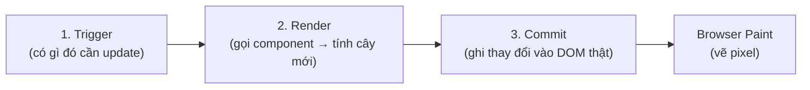
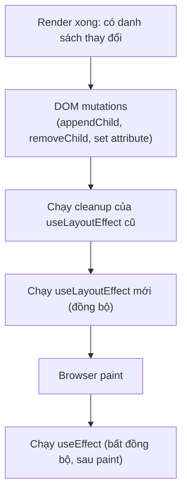
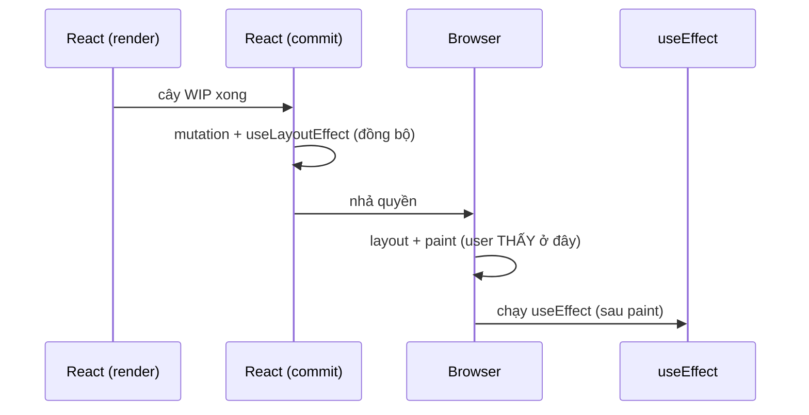
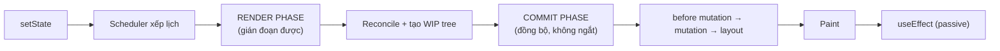

# Render Pipeline: Trigger → Render → Commit

## Mục lục

- [Tổng quan](#tổng-quan)
- [1. Pha Trigger — cái gì khởi động render](#1-pha-trigger--cái-gì-khởi-động-render)
  - [1.1 setState là "xếp lịch", không phải "làm ngay"](#11-setstate-là-xếp-lịch-không-phải-làm-ngay)
- [2. Pha Render — gọi component, tính ra cây mới](#2-pha-render--gọi-component-tính-ra-cây-mới)
  - [2.1 Element vs Fiber](#21-element-vs-fiber)
  - [2.2 "Render" không phải là "vẽ lên màn hình"](#22-render-không-phải-là-vẽ-lên-màn-hình)
  - [2.3 Render phải là hàm thuần](#23-render-phải-là-hàm-thuần)
- [3. Pha Commit — áp thay đổi vào DOM](#3-pha-commit--áp-thay-đổi-vào-dom)
  - [3.1 Ba pha con của Commit](#31-ba-pha-con-của-commit)
  - [3.2 useEffect vs useLayoutEffect — thời điểm chạy](#32-useeffect-vs-uselayouteffect--thời-điểm-chạy)
- [4. Sau Commit — Browser Paint](#4-sau-commit--browser-paint)
- [5. Toàn cảnh dòng thời gian](#5-toàn-cảnh-dòng-thời-gian)
- [6. Ví dụ chạy được: đếm số lần render](#6-ví-dụ-chạy-được-đếm-số-lần-render)
- [7. StrictMode gọi render 2 lần](#7-strictmode-gọi-render-2-lần)
- [8. Những hiểu lầm thường gặp](#8-những-hiểu-lầm-thường-gặp)
- [9. Câu hỏi tự kiểm tra](#9-câu-hỏi-tự-kiểm-tra)
- [Tài liệu tham khảo](#tài-liệu-tham-khảo)

---

## Tổng quan

Mỗi lần UI cập nhật, React đi qua đúng **3 pha**. Hiểu rạch ròi 3 pha này là nền tảng để sau đó hiểu Fiber, hiểu vì sao re-render, và hiểu mọi kỹ thuật tối ưu.



<Callout type="info" title="Important">

Từ **"render"** trong React **không** có nghĩa là "vẽ lên màn hình". Render = React **gọi hàm component của bạn** để biết UI nên trông như thế nào. Việc đụng vào DOM thật chỉ xảy ra ở pha **Commit**. Nhầm lẫn hai khái niệm này là gốc rễ của hầu hết hiểu lầm về performance.

</Callout>

**Phép loại suy đời thường:** hãy tưởng tượng bạn là kiến trúc sư.

| Pha React | Loại suy |
|-----------|----------|
| **Trigger** | Khách báo "đổi phòng khách" |
| **Render** | Bạn vẽ lại **bản thiết kế** trên giấy (chưa đụng vào nhà) |
| **Commit** | Thợ chỉ sửa **đúng phần khác nhau** giữa bản cũ và bản mới |
| **Paint** | Sơn khô, mắt người nhìn thấy |

Vẽ lại bản thiết kế (render) rất rẻ. Đập tường xây lại (commit/DOM) mới đắt. React cố tình render nhiều, nhưng commit ít nhất có thể.

<Callout type="info" title="Note">

Bài này mô tả pipeline ở **mức khái niệm**. Bên trong pha Render, React dùng kiến trúc **Fiber** để chia nhỏ và gián đoạn công việc — chi tiết ở [Fiber & Reconciliation](/react-internals/fiber-reconciliation/).

</Callout>

---

## 1. Pha Trigger — cái gì khởi động render

Một component render vì **một trong các** lý do sau:

1. **Initial render** — lần đầu app gắn vào DOM (`createRoot(...).render(<App/>)`).
2. **Re-render** — state của chính nó thay đổi, **hoặc** component cha re-render, **hoặc** context nó đang đọc đổi giá trị.

```tsx
import { createRoot } from 'react-dom/client';

// (1) Initial render — chạy đúng 1 lần
const root = createRoot(document.getElementById('root')!);
root.render(<App />);
```

```tsx
function Counter() {
  const [count, setCount] = useState(0);

  // (2) Gọi setCount → "trigger" một re-render cho Counter
  return <button onClick={() => setCount(count + 1)}>{count}</button>;
}
```

<Callout type="info" title="Tip">

Ba nguyên nhân re-render (state / cha / context) được mổ xẻ riêng ở [Vì sao component re-render](/react-internals/vi-sao-component-rerender/). Ở đây chỉ cần nhớ: trigger luôn quy về "có một update được xếp lịch".

</Callout>

### 1.1 setState là "xếp lịch", không phải "làm ngay"

<Callout type="info" title="Note">

`setState` không cập nhật biến ngay lập tức và cũng không render đồng bộ ngay tại dòng đó. Nó **xếp lịch (schedule)** một re-render qua scheduler nội bộ của React. Nhiều `setState` trong cùng một sự kiện sẽ được gộp lại — gọi là **batching** — và chỉ render một lần. Chi tiết ở bài [Vì sao component re-render](/react-internals/vi-sao-component-rerender/).

</Callout>

```tsx
function handleClick() {
  setCount(count + 1);
  console.log(count); // vẫn in giá trị CŨ — render mới chưa xảy ra
}
```

---

## 2. Pha Render — gọi component, tính ra cây mới

Ở pha này React **gọi hàm component**. Hàm trả về JSX, JSX biên dịch thành các lời gọi `React.createElement(...)` tạo ra **React elements** — các object mô tả UI (chưa phải DOM).

```tsx
// JSX bạn viết:
return <h1 className="title">Xin chào</h1>;

// Sau khi biên dịch (Babel/SWC):
return React.createElement('h1', { className: 'title' }, 'Xin chào');

// Kết quả là một object thuần:
// { type: 'h1', props: { className: 'title', children: 'Xin chào' } }
```

- **Initial render:** React tạo element cho toàn bộ cây.
- **Re-render:** React gọi lại các component cần update, tạo cây element **mới**, rồi **so sánh** với cây cũ (reconciliation) để tìm ra điểm khác biệt. Xem bài [Fiber & Reconciliation](/react-internals/fiber-reconciliation/).

### 2.1 Element vs Fiber

Đây là phân biệt nền tảng dễ nhầm:

| | React Element | Fiber |
|---|---------------|-------|
| Là gì | Object mô tả UI: `{ type, props, key }` | Đơn vị công việc + node trong cây nội bộ của React |
| Vòng đời | Sinh ra **mỗi lần render** rồi vứt đi | **Tồn tại lâu dài** qua nhiều lần render |
| Lưu gì | Chỉ mô tả "nên trông thế nào" | State, hooks, ref, DOM node, flags, vị trí cây |
| Bạn tạo? | Có (qua JSX) | Không — React tự quản lý |

React so cây element mới với cây fiber hiện có để quyết định fiber nào tái dùng, fiber nào tạo/xoá.

### 2.2 "Render" không phải là "vẽ lên màn hình"

Đây là điểm khiến nhiều người hiểu sai performance:

<Callout type="warn" title="Warning">

Một component **re-render** (hàm bị gọi lại) **không** đồng nghĩa với việc DOM bị thay đổi. Nếu cây element mới giống hệt cây cũ, pha Commit sẽ **không** đụng vào DOM nào cả. Re-render thừa làm tốn CPU (chạy lại hàm + so sánh), nhưng không nhất thiết làm "nhấp nháy" màn hình.

</Callout>

### 2.3 Render phải là hàm thuần

React giả định pha render là **thuần (pure)**: cùng input (props, state, context) → cùng output, và **không có side effect**.

```tsx
// ❌ SAI: side effect ngay trong thân render
function Bad() {
  fetch('/api/log');            // gọi API mỗi lần render
  someGlobal.count++;           // mutate biến ngoài
  document.title = 'Xin chào';  // đụng DOM trong render
  return <div />;
}

// ✅ ĐÚNG: side effect đặt trong useEffect (chạy sau commit)
function Good() {
  useEffect(() => {
    document.title = 'Xin chào';
  }, []);
  return <div />;
}
```

<Callout type="info" title="Important">

Vì sao React khắt khe? Vì React có thể **render rồi bỏ đi** (trong Concurrent Mode, render có thể bị tạm dừng, hủy, hoặc chạy hai lần ở Strict Mode để bắt bug). Nếu render có side effect, các side effect đó sẽ chạy lung tung hoặc lặp lại. Hàm thuần cho phép React tự do lên lịch lại công việc.

</Callout>

---

## 3. Pha Commit — áp thay đổi vào DOM

Sau khi render xong và biết **chính xác** chỗ nào khác, React bước vào Commit: thực hiện các thao tác DOM tối thiểu (thêm/xóa/sửa node), rồi chạy các effect tương ứng.



### 3.1 Ba pha con của Commit

Commit không phải một bước đơn — React chia nó thành **3 pha con**, chạy **đồng bộ** (không gián đoạn được):

| Pha con | React làm gì | Hook liên quan |
|---------|--------------|----------------|
| **Before mutation** | Chụp lại trạng thái DOM trước khi đổi (vd lấy `scrollTop`) | `getSnapshotBeforeUpdate` (class) |
| **Mutation** | Áp các thao tác DOM: thêm/xoá/sửa node, set attribute; chạy cleanup của layout effect cũ | — |
| **Layout** | DOM mới đã có, chạy `useLayoutEffect`; cập nhật ref | `useLayoutEffect`, gán `ref` |

Sau pha Layout, React trả quyền cho trình duyệt để **paint**. `useEffect` (passive effect) được chạy **sau** paint, ở một lượt riêng.

<Callout type="info" title="Note">

`ref` được gán giá trị DOM node **ở pha Layout** (trong commit, trước paint). Vì vậy đọc `ref.current` trong `useLayoutEffect` luôn thấy DOM mới nhất; đọc trong thân render thì chưa chắc.

</Callout>

### 3.2 useEffect vs useLayoutEffect — thời điểm chạy

| Effect | Chạy khi nào | Dùng cho |
|--------|--------------|----------|
| `useLayoutEffect` | **Trong** commit, **trước** khi browser paint (đồng bộ) | Đo kích thước DOM, sửa layout trước khi user thấy (tránh nhấp nháy) |
| `useEffect` | **Sau** khi browser paint (bất đồng bộ) | Fetch data, subscribe, log, đa số trường hợp |

<Callout type="info" title="Tip">

Mặc định luôn dùng `useEffect`. Chỉ chuyển sang `useLayoutEffect` khi bạn **đọc kích thước/vị trí DOM rồi đồng bộ sửa lại** và thấy màn hình bị giật một frame. `useLayoutEffect` chặn paint nên lạm dụng sẽ làm chậm cảm giác.

</Callout>

---

## 4. Sau Commit — Browser Paint

Sau commit, React trả quyền lại cho trình duyệt. Trình duyệt thực hiện **layout** (tính vị trí) và **paint** (vẽ pixel). Đây là bước duy nhất người dùng thực sự "nhìn thấy". `useEffect` chạy sau bước này nên không làm trễ thời điểm hiển thị.



---

## 5. Toàn cảnh dòng thời gian



Điểm mấu chốt: **Render gián đoạn được, Commit thì không**. Đó là lý do mọi side effect "thấy được" phải nằm ở commit/effect, không phải trong thân render.

---

## 6. Ví dụ chạy được: đếm số lần render

Dán đoạn này vào một sandbox để **tận mắt** thấy sự khác nhau giữa "render" và "commit DOM":

```tsx
import { useState, useRef, useEffect } from 'react';

function RenderTracker({ label }: { label: string }) {
  const renderCount = useRef(0);
  renderCount.current++; // tăng trong thân render → đếm số lần HÀM bị gọi

  useEffect(() => {
    console.log(`[${label}] đã COMMIT lần ${renderCount.current}`);
  });

  console.log(`[${label}] đang RENDER lần ${renderCount.current}`);
  return <p>{label} render: {renderCount.current}</p>;
}

export default function App() {
  const [, setTick] = useState(0);
  return (
    <div>
      <button onClick={() => setTick((t) => t + 1)}>Re-render App</button>
      <RenderTracker label="Con" />
    </div>
  );
}
```

**Quan sát trong console:**

```text
[Con] đang RENDER lần 1     ← pha Render
[Con] đã COMMIT lần 1        ← pha Commit (sau paint)
// bấm nút:
[Con] đang RENDER lần 2     ← render lại vì cha re-render
[Con] đã COMMIT lần 2
```

Mỗi lần bấm nút: `App` re-render → kéo theo `Con` re-render. Nhưng vì JSX của `Con` không đổi (chỉ con số đếm trong ref đổi), DOM thực tế gần như không thay đổi. Đây chính là **re-render thừa** — mục tiêu tối ưu ở chương sau.

---

## 7. StrictMode gọi render 2 lần

<Callout type="warn">
Ở môi trường development có bật **Strict Mode**, bạn sẽ thấy log render xuất hiện **gấp đôi**. React cố tình gọi render 2 lần để phát hiện side effect không thuần. Ở production chỉ chạy 1 lần. Đừng hoảng.
</Callout>

Strict Mode (bọc `<StrictMode>` quanh app) còn chạy **2 lần**: hàm component (render), và cặp setup/cleanup của effect (mount → unmount → mount lại ngay) — chỉ ở dev. Mục đích: ép lộ ra các bug do render không thuần hoặc effect thiếu cleanup.

```tsx
// main.tsx
import { StrictMode } from 'react';
createRoot(el).render(
  <StrictMode>
    <App />
  </StrictMode>
);
```

<Callout type="info" title="Important">

Nếu một component "chạy hai lần" gây lỗi (vd gọi API hai lần, tăng biến đếm hai lần), đó là **dấu hiệu** code chưa thuần hoặc effect thiếu cleanup — hãy sửa gốc, đừng tắt Strict Mode.

</Callout>

---

## 8. Những hiểu lầm thường gặp

<Accordions type="single">
  <Accordion title="Re-render là tốn kém và phải tránh bằng mọi giá?">
    Sai. Render là gọi một hàm JS — thường rất rẻ. Cái đắt là DOM mutation và các phép tính nặng trong render. Tối ưu mù quáng (bọc memo/useMemo khắp nơi) còn làm code chậm và khó đọc hơn. Hãy đo trước (React DevTools Profiler) rồi mới tối ưu.
  </Accordion>
  <Accordion title="setState xong là biến state đổi giá trị ngay dòng dưới?">
    Sai. State là hằng số trong suốt một lần render. setState chỉ xếp lịch render mới; giá trị mới chỉ xuất hiện ở lần render kế tiếp. Xem bài Vì sao component re-render.
  </Accordion>
  <Accordion title="useEffect chạy trong lúc render?">
    Sai. useEffect chạy sau commit và sau paint. Đó là lý do bạn không nên đặt logic ảnh hưởng tới UI hiện tại vào đó nếu cần đồng bộ — dùng useLayoutEffect.
  </Accordion>
  <Accordion title="Render và commit luôn đi cùng nhau 1-1?">
    Không hẳn. Một render có thể bị hủy giữa chừng (Concurrent) và không bao giờ tới commit. Ngược lại, mỗi commit luôn đến từ một render đã hoàn tất.
  </Accordion>
</Accordions>

---

## 9. Câu hỏi tự kiểm tra

<Accordions type="single">
  <Accordion title="1. Ba pha của pipeline là gì và pha nào đụng DOM?">
    Trigger → Render → Commit. Chỉ pha Commit mới đụng DOM thật. Render chỉ gọi hàm component và tính cây element.
  </Accordion>
  <Accordion title="2. Element khác Fiber thế nào?">
    Element là object mô tả UI, sinh ra mỗi render rồi vứt. Fiber tồn tại lâu dài, lưu state/hooks/DOM node/flags. React tự quản lý fiber.
  </Accordion>
  <Accordion title="3. Vì sao render phải là hàm thuần?">
    Vì React có thể render rồi bỏ đi (Concurrent), hoặc render 2 lần (StrictMode). Side effect trong render sẽ chạy lặp/sai. Hàm thuần cho phép React tự do lên lịch lại.
  </Accordion>
  <Accordion title="4. useLayoutEffect chạy trước hay sau paint?">
    Trước paint, đồng bộ trong commit. useEffect chạy sau paint, bất đồng bộ. Dùng useLayoutEffect khi cần đo/sửa DOM trước khi user thấy.
  </Accordion>
  <Accordion title="5. Vì sao StrictMode làm log render gấp đôi?">
    React cố tình gọi render và effect 2 lần ở dev để lộ side effect không thuần / thiếu cleanup. Production chỉ 1 lần.
  </Accordion>
</Accordions>

---

## Tài liệu tham khảo

- [React Docs — Render and Commit](https://react.dev/learn/render-and-commit)
- [React Docs — Keeping Components Pure](https://react.dev/learn/keeping-components-pure)
- [React Docs — You Might Not Need an Effect](https://react.dev/learn/you-might-not-need-an-effect)
- [Fiber & Reconciliation](/react-internals/fiber-reconciliation/)
- [Vì sao component re-render](/react-internals/vi-sao-component-rerender/)
