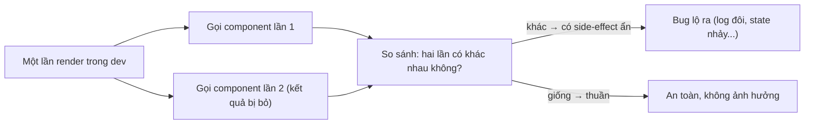
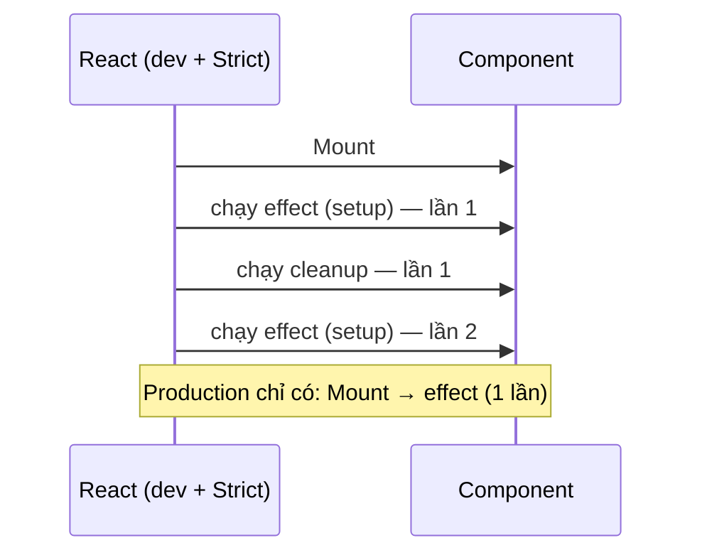
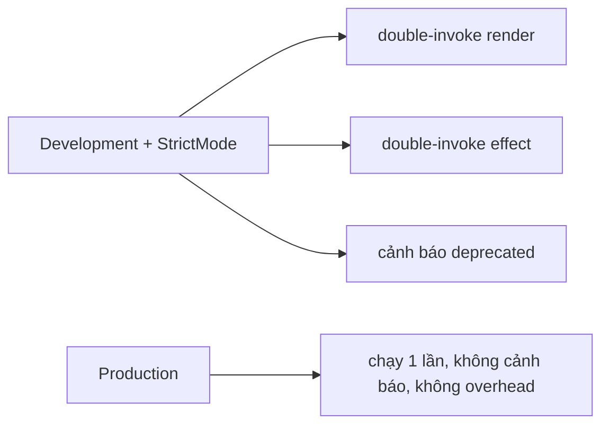

# Strict Mode

## Mục lục

- [Tổng quan](#tổng-quan)
- [1. StrictMode là gì và bật thế nào](#1-strictmode-là-gì-và-bật-thế-nào)
- [2. Double-invoke render: vì sao chạy 2 lần](#2-double-invoke-render-vì-sao-chạy-2-lần)
  - [2.1 Component phải "thuần"](#21-component-phải-thuần)
  - [2.2 Vì sao console.log bị làm mờ](#22-vì-sao-consolelog-bị-làm-mờ)
- [3. Double-invoke effect: mount → unmount → mount](#3-double-invoke-effect-mount--unmount--mount)
  - [3.1 Bẫy kinh điển: API gọi 2 lần](#31-bẫy-kinh-điển-api-gọi-2-lần)
- [4. Vì sao React làm vậy](#4-vì-sao-react-làm-vậy)
- [5. Các kiểm tra khác mà StrictMode bật](#5-các-kiểm-tra-khác-mà-strictmode-bật)
- [6. Cái gì bị gọi 2 lần, cái gì không](#6-cái-gì-bị-gọi-2-lần-cái-gì-không)
- [7. Viết code "qua" được StrictMode](#7-viết-code-qua-được-strictmode)
- [8. StrictMode trong production](#8-strictmode-trong-production)
- [9. Những hiểu lầm thường gặp](#9-những-hiểu-lầm-thường-gặp)
- [10. Câu hỏi tự kiểm tra](#10-câu-hỏi-tự-kiểm-tra)
- [Tài liệu tham khảo](#tài-liệu-tham-khảo)

---

## Tổng quan

**Strict Mode** (`<StrictMode>`) là một công cụ **chỉ chạy ở môi trường development** giúp phát hiện sớm các lỗi tiềm ẩn trong component: side-effect đặt sai chỗ, effect thiếu cleanup, dùng API đã lỗi thời. Nó **không render ra UI nào** và **không ảnh hưởng tới production build**.

> [!IMPORTANT]
> Cách hoạt động chính của StrictMode là **cố tình gọi lặp lại** một số hàm (render, initializer, effect) trong dev để "ép lộ" những đoạn code không **idempotent** (chạy lại cho kết quả khác). Nếu code của bạn đúng theo mô hình `UI = f(state)` thuần khiết, double-invoke **không** làm gì hại; nếu nó làm vỡ thứ gì, đó chính là bug StrictMode muốn bạn thấy.

---

## 1. StrictMode là gì và bật thế nào

StrictMode là một component bọc quanh một phần (hoặc toàn bộ) cây. Mọi component **bên trong** nó được áp các kiểm tra dev.

```tsx
import { StrictMode } from 'react';
import { createRoot } from 'react-dom/client';

createRoot(document.getElementById('root')!).render(
  <StrictMode>
    <App />
  </StrictMode>
);
```

Có thể bọc cục bộ chỉ một nhánh:

```tsx
function App() {
  return (
    <>
      <Header />               {/* không bị StrictMode */}
      <StrictMode>
        <Experimental />       {/* chỉ nhánh này bị kiểm tra */}
      </StrictMode>
    </>
  );
}
```

> [!NOTE]
> Trong **Next.js**, không bọc `<StrictMode>` thủ công — bật bằng cờ `reactStrictMode: true` trong `next.config.js` (mặc định đã bật ở nhiều phiên bản). Create React App / Vite template cũng bọc sẵn `<StrictMode>` trong file entry.

---

## 2. Double-invoke render: vì sao chạy 2 lần

Trong dev + StrictMode, React **gọi thân component hai lần** mỗi lần render (lần thứ hai bị "bỏ" kết quả). Điều này áp cho:

- Thân function component.
- Hàm khởi tạo `useState(() => ...)`, `useReducer` initializer.
- Hàm updater truyền vào `setState(prev => ...)`.
- `useMemo` / `useCallback` callback.



### 2.1 Component phải "thuần"

Render phải là hàm **thuần**: cùng input → cùng output, **không** side-effect. Đoạn dưới sai vì mutate biến ngoài **trong lúc render**:

```tsx
let id = 0;

// ❌ Side-effect trong render: double-invoke làm id nhảy 2 bước
function BadList({ items }: { items: string[] }) {
  return items.map((x) => <li key={id++}>{x}</li>); // id++ khi render!
}

// ✅ Không side-effect khi render
function GoodList({ items }: { items: { id: string; text: string }[] }) {
  return items.map((x) => <li key={x.id}>{x.text}</li>);
}
```

> [!WARNING]
> Mutate biến module, đẩy vào mảng ngoài, ghi vào `ref.current`, hay gọi API **ngay trong thân render** đều là side-effect. Double-invoke của StrictMode sẽ làm chúng chạy 2 lần → kết quả lệch. Side-effect phải nằm trong event handler hoặc `useEffect`, không phải trong render.

### 2.2 Vì sao console.log bị làm mờ

Vì component chạy 2 lần, `console.log` trong render cũng in **2 lần**. Để đỡ rối, React **làm mờ (greyed out)** nhóm log lần thứ hai trong DevTools console thay vì in trùng rõ ràng.

> [!TIP]
> Nếu thấy log của mình in đôi (một dòng mờ) trong dev — đó là StrictMode, **không** phải bug. Ở production chỉ chạy một lần. Có thể tắt tính năng làm mờ này trong cài đặt console của React DevTools nếu muốn thấy đủ.

---

## 3. Double-invoke effect: mount → unmount → mount

Từ React 18, StrictMode còn **chạy lại effect** ngay sau khi mount: React **mount → chạy effect → chạy cleanup → chạy effect lại**. Mục đích: kiểm tra effect của bạn có **cleanup đúng** và **chịu được việc bị chạy nhiều lần** không.



```tsx
useEffect(() => {
  const conn = createConnection(roomId);
  conn.connect();
  return () => conn.disconnect(); // BẮT BUỘC: cleanup để chịu được double-invoke
}, [roomId]);
```

> [!IMPORTANT]
> Nếu effect **thiếu cleanup**, double-invoke sẽ để lại "rác": 2 kết nối WebSocket, 2 listener, 2 interval... StrictMode phơi bày điều này ngay trong dev thay vì để bạn phát hiện qua memory leak ở production.

### 3.1 Bẫy kinh điển: API gọi 2 lần

Trong dev, effect fetch dữ liệu chạy 2 lần → bạn thấy request đôi trong Network tab. Đây **không** phải bug của StrictMode mà là dấu hiệu effect cần xử lý hủy/đua (race):

```tsx
// ✅ Bỏ qua response cũ bằng cờ ignore — đúng cả khi double-invoke lẫn khi deps đổi nhanh
useEffect(() => {
  let ignore = false;
  fetch(`/api/users/${id}`)
    .then((r) => r.json())
    .then((data) => { if (!ignore) setUser(data); });
  return () => { ignore = true; };
}, [id]);
```

> [!NOTE]
> Với data fetching thật, dùng **TanStack Query** / **SWR** — chúng tự dedupe nên request đôi trong dev cũng được gộp. Xem [Code-splitting](/toi-uu-rerender/code-splitting/).

---

## 4. Vì sao React làm vậy

Double-invoke effect mô phỏng tình huống component **bị mount lại** mà không mất state — một kịch bản React muốn hỗ trợ tốt trong tương lai:

<Steps>
  <Step>
    ### Fast Refresh khi dev
    Sửa code → component re-mount liên tục. Effect không cleanup đúng sẽ rò rỉ ngay khi bạn code.
  </Step>
  <Step>
    ### Tính năng giữ & khôi phục state
    React hướng tới việc "ẩn" rồi "hiện lại" một phần UI (kiểu Activity/Offscreen) mà vẫn giữ state — tức effect bị tắt/bật lại. Code chịu được double-invoke sẽ sẵn sàng cho điều này.
  </Step>
  <Step>
    ### Buộc tư duy "effect = đồng bộ, không phải lifecycle"
    Effect nên mô tả "đồng bộ hệ thống ngoài với state hiện tại" và luôn dọn dẹp được — không phải "làm một việc một lần khi mount".
  </Step>
</Steps>

---

## 5. Các kiểm tra khác mà StrictMode bật

Ngoài double-invoke, StrictMode còn cảnh báo các mẫu lỗi thời / nguy hiểm:

| Kiểm tra | Ý nghĩa |
|----------|---------|
| API deprecated | Cảnh báo dùng `findDOMNode`, string ref (`ref="x"`), legacy context API |
| Effect không cleanup | Phơi bày qua double-invoke effect (mục 3) |
| Render không thuần | Phơi bày qua double-invoke render (mục 2) |
| `UNSAFE_` lifecycle | Cảnh báo các method class lỗi thời (`UNSAFE_componentWillMount`...) |

> [!NOTE]
> Các cảnh báo deprecated chủ yếu liên quan code cũ (class component, React đời trước). Code function + hooks hiện đại hầu như chỉ gặp hai loại double-invoke ở trên.

---

## 6. Cái gì bị gọi 2 lần, cái gì không

| Bị double-invoke (dev + Strict) | KHÔNG double-invoke |
|--------------------------------|---------------------|
| Thân function component | Event handler (onClick, onChange...) |
| `useState`/`useReducer` initializer | Code trong `setTimeout`/`Promise` callback |
| Updater `setState(prev => ...)` | Lệnh chạy ngoài render & ngoài effect |
| `useMemo` / `useCallback` callback | — |
| Effect setup + cleanup (mount lần đầu) | — |

> [!WARNING]
> Vì **initializer** và **updater** bị gọi 2 lần, tuyệt đối **không** đặt side-effect trong chúng:
> ```tsx
> // ❌ side-effect trong updater → chạy 2 lần
> setCount((c) => { logToServer(c); return c + 1; });
> // ✅ updater thuần; side-effect tách ra event handler
> setCount((c) => c + 1);
> ```

---

## 7. Viết code "qua" được StrictMode

<Steps>
  <Step>
    ### Render thuần
    Không mutate biến ngoài, không gọi API, không ghi ref trong thân component. Chỉ tính toán từ props/state và trả JSX.
  </Step>
  <Step>
    ### Mọi effect có cleanup
    Subscribe → unsubscribe, connect → disconnect, setInterval → clearInterval, addEventListener → removeEventListener.
  </Step>
  <Step>
    ### Effect idempotent / chịu race
    Dùng cờ `ignore`/`AbortController` cho fetch; thiết kế để chạy lại không gây hậu quả kép.
  </Step>
  <Step>
    ### Initializer & updater thuần
    Không log, không gọi API, không random/Date.now() có hệ quả bên ngoài trong các hàm này.
  </Step>
</Steps>

> [!TIP]
> Nguyên tắc vàng: nếu việc gì **chỉ được xảy ra một lần khi người dùng làm gì đó** (gửi form, mua hàng) → đặt trong **event handler**, không phải effect. Effect là để **đồng bộ**, mà đồng bộ thì lặp lại được.

---

## 8. StrictMode trong production

> [!IMPORTANT]
> StrictMode **không có tác dụng gì ở production**: không double-invoke, không cảnh báo, không chi phí. Toàn bộ kiểm tra chỉ chạy ở development. Vì vậy **luôn để StrictMode bật** — bạn được lợi khi dev mà không trả giá khi chạy thật.



---

## 9. Những hiểu lầm thường gặp

<Accordions type="single">
  <Accordion title="'StrictMode làm app tôi chậm gấp đôi'">
    Sai. Double-invoke CHỈ xảy ra ở dev. Production không hề bị. Và ngay cả ở dev, mục tiêu là phơi bày bug, không phải đo hiệu năng.
  </Accordion>
  <Accordion title="'API bị gọi 2 lần là bug của React'">
    Không. Đó là StrictMode chạy effect 2 lần ở dev để lộ việc effect thiếu xử lý hủy/race. Sửa bằng cờ ignore/AbortController, hoặc dùng thư viện data fetching tự dedupe.
  </Accordion>
  <Accordion title="'Nên tắt StrictMode cho đỡ phiền'">
    Không nên. Việc 'phiền' chính là bug được phơi bày sớm. Tắt đi chỉ giấu bug tới production.
  </Accordion>
  <Accordion title="'Double-invoke nghĩa là code tôi sai'">
    Không nhất thiết. Double-invoke luôn xảy ra; nó chỉ GÂY HẠI khi render/effect của bạn không thuần. Code thuần thì double-invoke vô hại.
  </Accordion>
</Accordions>

---

## 10. Câu hỏi tự kiểm tra

<Accordions type="single">
  <Accordion title="1. StrictMode chạy ở môi trường nào?">
    Chỉ development. Production hoàn toàn không bị double-invoke, không cảnh báo, không overhead.
  </Accordion>
  <Accordion title="2. StrictMode double-invoke những gì khi render?">
    Thân component, initializer của useState/useReducer, updater setState(prev => ...), và callback của useMemo/useCallback.
  </Accordion>
  <Accordion title="3. Thứ tự double-invoke effect khi mount là gì?">
    setup → cleanup → setup (mount → chạy effect → cleanup → chạy effect lại). Mục đích: kiểm tra effect có cleanup đúng và chịu được mount lại.
  </Accordion>
  <Accordion title="4. Vì sao API bị gọi 2 lần trong dev và sửa thế nào?">
    Vì effect chạy 2 lần. Sửa bằng cờ ignore hoặc AbortController trong cleanup để bỏ qua response cũ, hoặc dùng TanStack Query/SWR (tự dedupe).
  </Accordion>
  <Accordion title="5. Vì sao không được đặt side-effect trong updater setState(prev => ...)?">
    Vì updater bị gọi 2 lần trong dev + Strict → side-effect chạy đôi. Updater phải thuần; side-effect đặt ở event handler.
  </Accordion>
  <Accordion title="6. Có nên tắt StrictMode không?">
    Không. Nó không tốn gì ở production và phơi bày bug sớm ở dev. Luôn để bật.
  </Accordion>
</Accordions>

---

## Tài liệu tham khảo

- [React Docs — `<StrictMode>`](https://react.dev/reference/react/StrictMode)
- [React Docs — Keeping Components Pure](https://react.dev/learn/keeping-components-pure)
- [React Docs — Synchronizing with Effects](https://react.dev/learn/synchronizing-with-effects)
- [Render Pipeline](/react-internals/render-pipeline/)
- [Fiber & Reconciliation](/react-internals/fiber-reconciliation/)
- [Custom Hooks](/patterns/custom-hooks/)
