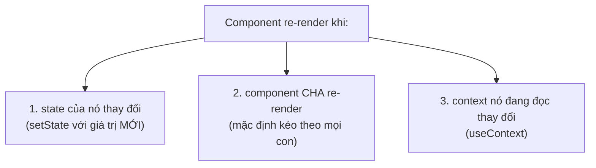
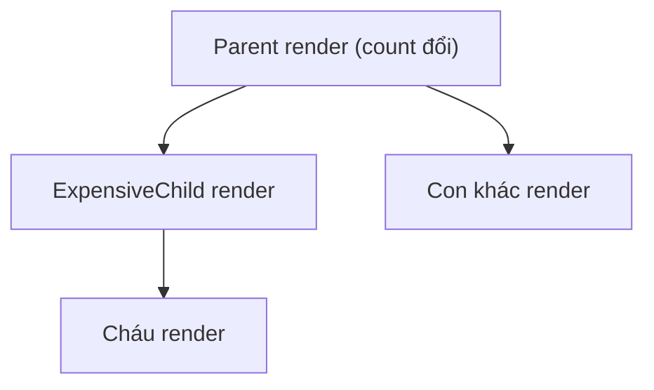

# Vì sao component re-render

## Mục lục

- [Tổng quan](#tổng-quan)
- [1. Ba nguyên nhân duy nhất](#1-ba-nguyên-nhân-duy-nhất)
- [2. State là một snapshot bất biến](#2-state-là-một-snapshot-bất-biến)
- [3. Batching — gộp nhiều setState](#3-batching--gộp-nhiều-setstate)
- [4. Cập nhật bằng updater function](#4-cập-nhật-bằng-updater-function)
- [5. Cha re-render → con re-render (mặc định)](#5-cha-re-render--con-re-render-mặc-định)
- [6. Bailout — khi React bỏ qua re-render](#6-bailout--khi-react-bỏ-qua-re-render)
- [7. Checklist gỡ rối re-render thừa](#7-checklist-gỡ-rối-re-render-thừa)
- [Tài liệu tham khảo](#tài-liệu-tham-khảo)

---

## Tổng quan

"Vì sao component của tôi cứ render lại?" là câu hỏi phổ biến nhất khi tối ưu React. Tin tốt: số nguyên nhân **rất ít** và rất xác định.

> [!IMPORTANT]
> Một component re-render **chỉ** vì 3 lý do: (1) **state của chính nó** đổi, (2) **component cha** re-render, hoặc (3) **context** mà nó đang đọc đổi giá trị. Props đổi **không phải** là một nguyên nhân độc lập — props chỉ đổi được khi cha re-render. Ghi nhớ điều này tiết kiệm cho bạn hàng giờ debug.

---

## 1. Ba nguyên nhân duy nhất



<Callout type="warn" title="Props không nằm trong danh sách">
Nhiều người nghĩ "props đổi → con render". Thực ra cơ chế là: cha render → con render (bất kể props có đổi hay không). Props chỉ là dữ liệu cha truyền xuống trong lần render đó. Một component con **vẫn re-render dù props y hệt** nếu cha render — trừ khi bạn dùng `React.memo` (xem chương Tối ưu).
</Callout>

---

## 2. State là một snapshot bất biến

Trong **một** lần render, mọi biến state là **hằng số cố định**. `setState` không sửa biến hiện có; nó yêu cầu React render lại với giá trị mới ở lần sau.

```tsx
function Counter() {
  const [count, setCount] = useState(0);

  function handleClick() {
    setCount(count + 1); // count đang là 0 → set thành 1
    setCount(count + 1); // count VẪN là 0 (snapshot) → set thành 1
    setCount(count + 1); // vẫn 0 → 1
    console.log(count);  // in ra 0, KHÔNG phải 3!
  }

  return <button onClick={handleClick}>{count}</button>;
}
```

Bấm nút: `count` chỉ tăng lên **1**, không phải 3.

> [!NOTE]
> Hãy hình dung: trong suốt `handleClick`, `count` giống như một bức ảnh chụp tại thời điểm render — đứng yên ở `0`. Ba dòng `setCount(count + 1)` đều tính `0 + 1`. Muốn cộng dồn thực sự, dùng **updater function** (mục 4).

**Phép loại suy:** `count` như giá ghi trên menu lúc bạn ngồi xuống. Dù nhà hàng có đổi giá (state mới), tờ menu **của bạn** trong bữa này vẫn in giá cũ. Phải gọi món lần sau (render mới) mới thấy menu mới.

---

## 3. Batching — gộp nhiều setState

React **gộp** nhiều lần `setState` xảy ra trong cùng một sự kiện thành **một** lần re-render duy nhất, để tránh render thừa.

```tsx
function handleClick() {
  setA(1);
  setB(2);
  setC(3);
  // Cả 3 được gộp → React render đúng 1 lần, không phải 3 lần
}
```

> [!TIP]
> Từ **React 18**, batching được tự động áp dụng **ở mọi nơi**: trong event handler, trong `setTimeout`, trong promise `.then`, trong native event. Trước React 18, các update ngoài event handler (vd trong `setTimeout`) **không** được gộp và gây render dư. Nếu bạn nâng cấp từ React cũ và thấy số lần render giảm, đây là lý do.

---

## 4. Cập nhật bằng updater function

Khi giá trị mới phụ thuộc giá trị cũ, **luôn** truyền hàm `prev => next` thay vì truyền giá trị trực tiếp. React đưa cho bạn state **mới nhất** đang chờ trong hàng đợi.

```tsx
function handleClick() {
  setCount((c) => c + 1); // c = 0 → 1
  setCount((c) => c + 1); // c = 1 → 2
  setCount((c) => c + 1); // c = 2 → 3
  // Kết quả: count = 3 ✅
}
```

| Cách viết | Kết quả khi gọi 3 lần | Khi nào dùng |
|-----------|----------------------|--------------|
| `setCount(count + 1)` | `1` (đều đọc snapshot cũ) | Khi giá trị mới **không** dựa vào cũ |
| `setCount(c => c + 1)` | `3` (cộng dồn trên hàng đợi) | Khi giá trị mới **dựa vào** giá trị cũ |

> [!IMPORTANT]
> Quy tắc an toàn: nếu giá trị mới phụ thuộc giá trị hiện tại của state (đếm, toggle, push vào mảng...) → dùng updater function. Nó cũng giúp bỏ state khỏi mảng phụ thuộc của `useCallback`/`useEffect`.

---

## 5. Cha re-render → con re-render (mặc định)

Khi một component render, **toàn bộ cây con** của nó render theo — kể cả con không nhận props nào.

```tsx
import { useState } from 'react';

function ExpensiveChild() {
  console.log('Child render'); // sẽ in mỗi lần bấm, dù child không liên quan gì tới count
  return <p>Tôi là con</p>;
}

export default function Parent() {
  const [count, setCount] = useState(0);
  return (
    <div>
      <button onClick={() => setCount((c) => c + 1)}>Count: {count}</button>
      <ExpensiveChild /> {/* render lại mỗi lần Parent render */}
    </div>
  );
}
```

Mỗi lần bấm nút, `ExpensiveChild` cũng render lại dù nó chẳng dùng `count`. Đây thường là **vô hại** (render rẻ), nhưng nếu con thật sự nặng thì cần tối ưu — bằng `React.memo` hoặc bằng cách **nâng con lên làm `children`** (xem [Composition](/patterns/composition/) và [React.memo](/toi-uu-rerender/react-memo/)).



---

## 6. Bailout — khi React bỏ qua re-render

React có một tối ưu sẵn gọi là **bailout**: nếu bạn `setState` với giá trị **y hệt** giá trị hiện tại (so sánh bằng `Object.is`), React **bỏ qua** re-render cho component đó.

```tsx
const [n, setN] = useState(0);
// ...
setN(0); // n vẫn đang là 0 → React BAILOUT, không re-render
```

> [!WARNING]
> Bailout dựa trên `Object.is`. Với **object/array**, tạo object mới có cùng nội dung **không** được coi là bằng nhau → vẫn re-render. Đây là gốc rễ của vấn đề "referential equality" — đọc kỹ ở [bài riêng](/toi-uu-rerender/referential-equality/).

```tsx
const [user, setUser] = useState({ name: 'An' });
setUser({ name: 'An' }); // object MỚI dù nội dung giống → KHÔNG bailout → vẫn re-render
```

---

## 7. Checklist gỡ rối re-render thừa

<Steps>
  <Step>
    ### Mở React DevTools Profiler
    Bật "Highlight updates" để thấy component nào đang render. Profiler chỉ rõ component nào render và **vì sao** (props/state/hooks đổi).
  </Step>
  <Step>
    ### Xác định nguyên nhân trong 3 loại
    State của nó? Cha render? Context đổi? Khoanh vùng đúng 1 trong 3.
  </Step>
  <Step>
    ### Hỏi: re-render này có thật sự đắt không?
    Nếu render nhanh (&lt;1ms), **đừng** tối ưu. Tối ưu thừa làm code khó đọc hơn mà không nhanh hơn.
  </Step>
  <Step>
    ### Nếu đắt, chọn đúng kỹ thuật
    Cha kéo con → `memo` hoặc lift content thành `children`. Object props đổi tham chiếu → `useMemo`/`useCallback`. Context → tách context.
  </Step>
</Steps>

---

## Tài liệu tham khảo

- [React Docs — State as a Snapshot](https://react.dev/learn/state-as-a-snapshot)
- [React Docs — Queueing a Series of State Updates](https://react.dev/learn/queueing-a-series-of-state-updates)
- [Tổng quan tối ưu re-render](/toi-uu-rerender/tong-quan-toi-uu/)
- [Referential Equality](/toi-uu-rerender/referential-equality/)
