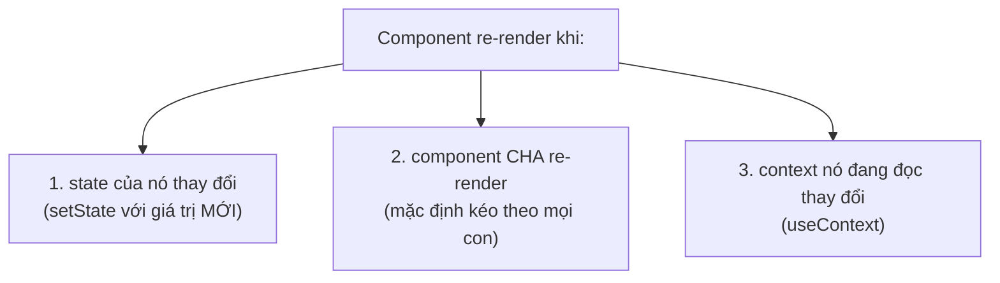
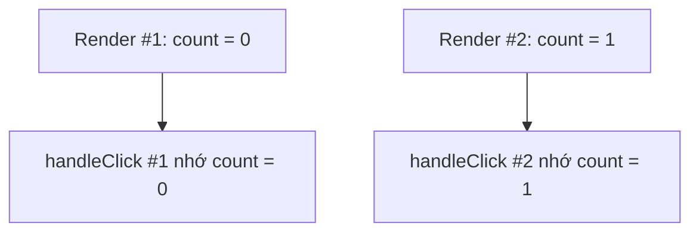
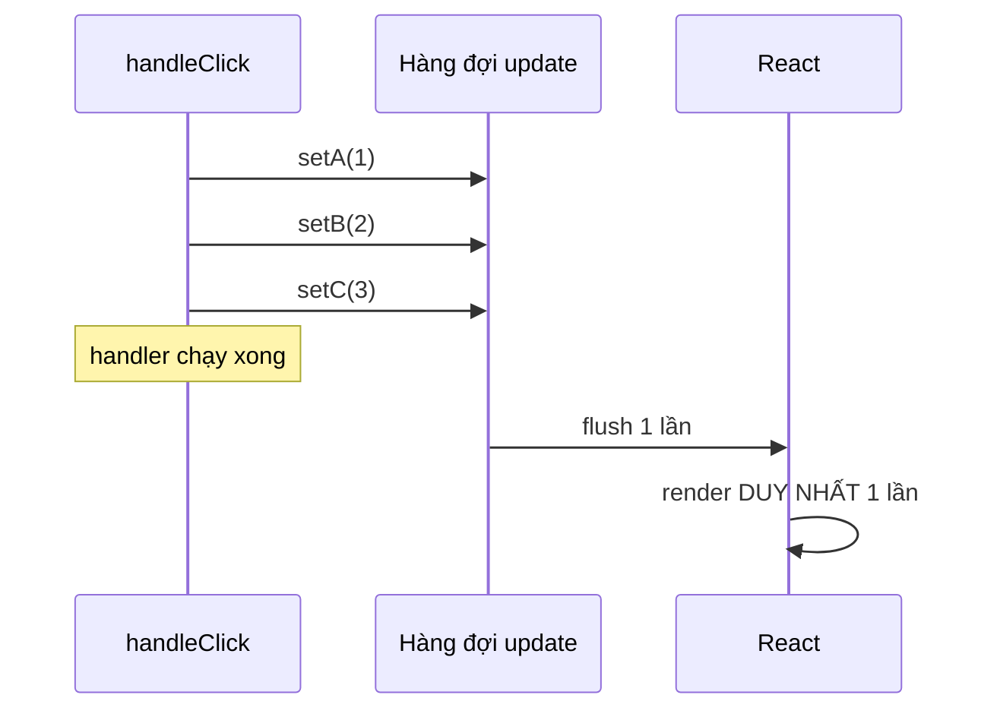
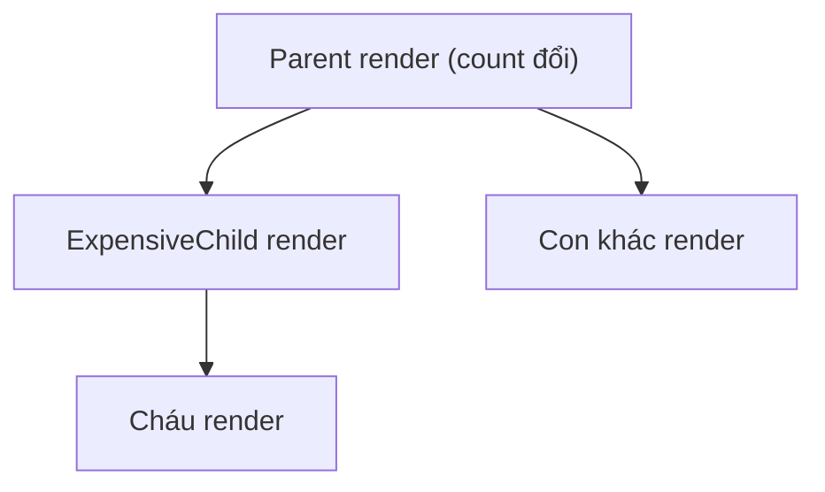
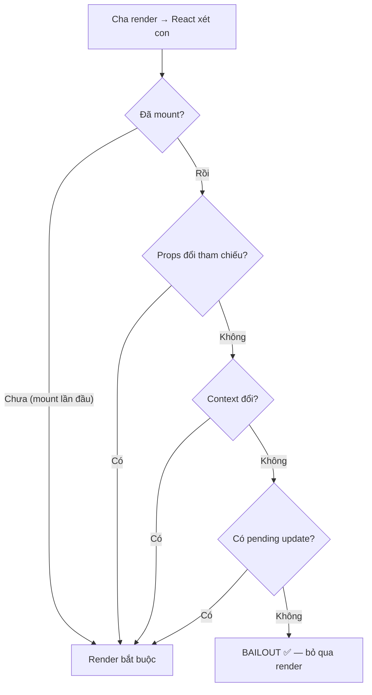

# Vì sao component re-render

## Mục lục

- [Tổng quan](#tổng-quan)
- [1. Ba nguyên nhân duy nhất](#1-ba-nguyên-nhân-duy-nhất)
- [2. State là một snapshot bất biến](#2-state-là-một-snapshot-bất-biến)
  - [2.1 Vì sao state đứng yên trong một render — closure](#21-vì-sao-state-đứng-yên-trong-một-render--closure)
  - [2.2 Stale closure — cái bẫy kinh điển](#22-stale-closure--cái-bẫy-kinh-điển)
- [3. Batching — gộp nhiều setState](#3-batching--gộp-nhiều-setstate)
  - [3.1 React 18 batch ở mọi nơi](#31-react-18-batch-ở-mọi-nơi)
  - [3.2 flushSync — thoát khỏi batching khi cần](#32-flushsync--thoát-khỏi-batching-khi-cần)
- [4. Cập nhật bằng updater function](#4-cập-nhật-bằng-updater-function)
  - [4.1 Hàng đợi update xử lý ra sao](#41-hàng-đợi-update-xử-lý-ra-sao)
- [5. Cha re-render → con re-render (mặc định)](#5-cha-re-render--con-re-render-mặc-định)
  - [5.1 Không phải con nào cũng bị render — element reference stability](#51-không-phải-con-nào-cũng-bị-render--element-reference-stability)
- [6. Context đổi → mọi consumer re-render](#6-context-đổi--mọi-consumer-re-render)
- [7. Bailout — khi React bỏ qua re-render](#7-bailout--khi-react-bỏ-qua-re-render)
  - [7.1 Bốn điều kiện bailout (passive rendering)](#71-bốn-điều-kiện-bailout-passive-rendering)
- [8. Những hiểu lầm thường gặp (FAQ)](#8-những-hiểu-lầm-thường-gặp-faq)
- [9. Checklist gỡ rối re-render thừa](#9-checklist-gỡ-rối-re-render-thừa)
- [10. Câu hỏi tự kiểm tra](#10-câu-hỏi-tự-kiểm-tra)
- [Tài liệu tham khảo](#tài-liệu-tham-khảo)

---

## Tổng quan

"Vì sao component của tôi cứ render lại?" là câu hỏi phổ biến nhất khi tối ưu React. Tin tốt: số nguyên nhân **rất ít** và rất xác định.

<Callout type="info" title="Important">

Một component re-render **chỉ** vì 3 lý do: (1) **state của chính nó** đổi, (2) **component cha** re-render, hoặc (3) **context** mà nó đang đọc đổi giá trị. Props đổi **không phải** là một nguyên nhân độc lập — props chỉ đổi được khi cha re-render. Ghi nhớ điều này tiết kiệm cho bạn hàng giờ debug.

</Callout>

Bài này dựa trên [Render Pipeline](/react-internals/render-pipeline/) (3 pha) và [Fiber](/react-internals/fiber-reconciliation/) (cơ chế bailout). Nếu chưa đọc, nên đọc trước để hiểu "render" ≠ "đụng DOM".

---

## 1. Ba nguyên nhân duy nhất



<Callout type="warn" title="Props không nằm trong danh sách">
Nhiều người nghĩ "props đổi → con render". Thực ra cơ chế là: cha render → con render (bất kể props có đổi hay không). Props chỉ là dữ liệu cha truyền xuống trong lần render đó. Một component con **vẫn re-render dù props y hệt** nếu cha render — trừ khi bạn dùng `React.memo` (xem chương Tối ưu).
</Callout>

Một câu hỏi hay gây tranh cãi: *"Đổi ref (`useRef`) có làm re-render không?"* — **Không**. Thay đổi `ref.current` không nằm trong 3 nguyên nhân trên. Đó chính là lý do `useRef` dùng để giữ giá trị "qua các lần render" mà không kích hoạt render.

| Hành động | Có re-render? |
|-----------|---------------|
| `setState(giá trị mới)` | ✅ Có |
| `setState(giá trị y hệt)` | ⚠️ React gọi render 1 lần rồi bailout (xem mục 7) |
| Cha re-render | ✅ Có (trừ khi `memo` + props không đổi) |
| Context value đổi | ✅ Mọi consumer re-render |
| `ref.current = x` | ❌ Không |
| Đổi biến thường ngoài state | ❌ Không |

---

## 2. State là một snapshot bất biến

Trong **một** lần render, mọi biến state là **hằng số cố định**. `setState` không sửa biến hiện có; nó yêu cầu React render lại với giá trị mới ở lần sau.

```tsx
function Counter() {
  const [count, setCount] = useState(0);

  function handleClick() {
    setCount(count + 1); // count đang là 0 → set thành 1
    setCount(count + 1); // count VẪN là 0 (snapshot) → set thành 1
    setCount(count + 1); // vẫn 0 → 1
    console.log(count);  // in ra 0, KHÔNG phải 3!
  }

  return <button onClick={handleClick}>{count}</button>;
}
```

Bấm nút: `count` chỉ tăng lên **1**, không phải 3.

<Callout type="info" title="Note">

Hãy hình dung: trong suốt `handleClick`, `count` giống như một bức ảnh chụp tại thời điểm render — đứng yên ở `0`. Ba dòng `setCount(count + 1)` đều tính `0 + 1`. Muốn cộng dồn thực sự, dùng **updater function** (mục 4).

</Callout>

**Phép loại suy:** `count` như giá ghi trên menu lúc bạn ngồi xuống. Dù nhà hàng có đổi giá (state mới), tờ menu **của bạn** trong bữa này vẫn in giá cũ. Phải gọi món lần sau (render mới) mới thấy menu mới.

### 2.1 Vì sao state đứng yên trong một render — closure

Mỗi lần render, hàm component **chạy lại từ đầu**, tạo ra một bộ biến `count`, `handleClick`... **mới hoàn toàn**. `handleClick` của lần render này "đóng gói" (closure) đúng giá trị `count` của lần render đó. Vì vậy nó không thể thấy giá trị tương lai.



Mỗi render là một "vũ trụ" riêng với state, props và event handler đóng băng theo nó. Đây không phải bug — đó là mô hình tinh thần đúng của React.

### 2.2 Stale closure — cái bẫy kinh điển

Khi một closure "sống lâu hơn" lần render tạo ra nó (đặt trong `setInterval`, `setTimeout`, listener không cleanup), nó vẫn nhớ state **cũ** → gọi là **stale closure**.

```tsx
// ❌ SAI: interval tạo ở render đầu, mãi mãi nhớ count = 0
function BrokenTimer() {
  const [count, setCount] = useState(0);
  useEffect(() => {
    const id = setInterval(() => {
      setCount(count + 1); // count luôn = 0 (closure của render đầu) → mãi set 1
    }, 1000);
    return () => clearInterval(id);
  }, []); // [] → effect chỉ chạy 1 lần → closure đóng băng count = 0
  return <p>{count}</p>; // dừng ở 1
}

// ✅ ĐÚNG: updater function đọc giá trị mới nhất từ hàng đợi
function GoodTimer() {
  const [count, setCount] = useState(0);
  useEffect(() => {
    const id = setInterval(() => setCount((c) => c + 1), 1000);
    return () => clearInterval(id);
  }, []);
  return <p>{count}</p>; // tăng đều
}
```

<Callout type="warn" title="Warning">

Khi callback "sống lâu" cần giá trị state mới nhất: hoặc dùng **updater function** (`c => c + 1`), hoặc đưa state vào dependency array để effect tạo lại closure mới, hoặc lưu vào `useRef`. Đừng đọc trực tiếp biến state trong callback bất đồng bộ tồn tại lâu.

</Callout>

---

## 3. Batching — gộp nhiều setState

React **gộp** nhiều lần `setState` xảy ra trong cùng một sự kiện thành **một** lần re-render duy nhất, để tránh render thừa.

```tsx
function handleClick() {
  setA(1);
  setB(2);
  setC(3);
  // Cả 3 được gộp → React render đúng 1 lần, không phải 3 lần
}
```



### 3.1 React 18 batch ở mọi nơi

<Callout type="info" title="Tip">

Từ **React 18** (với `createRoot`), batching được tự động áp dụng **ở mọi nơi**: trong event handler, trong `setTimeout`, trong promise `.then`, trong native event. Trước React 18, các update ngoài event handler (vd trong `setTimeout`) **không** được gộp và gây render dư. Nếu bạn nâng cấp từ React cũ và thấy số lần render giảm, đây là lý do.

</Callout>

```tsx
// React 18: cả 2 setState trong .then vẫn gộp thành 1 render
fetch('/api').then(() => {
  setLoading(false);
  setData(result);
  // React 17: 2 render. React 18: 1 render.
});
```

### 3.2 flushSync — thoát khỏi batching khi cần

Thi thoảng bạn cần DOM cập nhật **ngay lập tức** giữa hai update (ví dụ đo kích thước rồi scroll). `flushSync` ép React commit ngay:

```tsx
import { flushSync } from 'react-dom';

function onClick() {
  flushSync(() => setCount((c) => c + 1)); // commit NGAY, DOM đã cập nhật
  // tại đây DOM đã phản ánh count mới → có thể đo/scroll
  listRef.current?.scrollTo(0, listRef.current.scrollHeight);
}
```

<Callout type="error" title="Caution">

`flushSync` phá vỡ batching → có thể gây nhiều lần render/commit liên tiếp, ảnh hưởng performance. Chỉ dùng khi thật sự cần đọc DOM đã cập nhật giữa chừng.

</Callout>

---

## 4. Cập nhật bằng updater function

Khi giá trị mới phụ thuộc giá trị cũ, **luôn** truyền hàm `prev => next` thay vì truyền giá trị trực tiếp. React đưa cho bạn state **mới nhất** đang chờ trong hàng đợi.

```tsx
function handleClick() {
  setCount((c) => c + 1); // c = 0 → 1
  setCount((c) => c + 1); // c = 1 → 2
  setCount((c) => c + 1); // c = 2 → 3
  // Kết quả: count = 3 ✅
}
```

| Cách viết | Kết quả khi gọi 3 lần | Khi nào dùng |
|-----------|----------------------|--------------|
| `setCount(count + 1)` | `1` (đều đọc snapshot cũ) | Khi giá trị mới **không** dựa vào cũ |
| `setCount(c => c + 1)` | `3` (cộng dồn trên hàng đợi) | Khi giá trị mới **dựa vào** giá trị cũ |

### 4.1 Hàng đợi update xử lý ra sao

React không thực thi `setState` ngay; nó **xếp vào hàng đợi**. Khi flush, nó duyệt hàng đợi, lần lượt áp lên một biến tích lũy:

```tsx
// Hàng đợi sau handler:
// [ replaceWith(count+1)=1, (c)=>c+1, replaceWith(5), (c)=>c+1 ]
setCount(count + 1); // count=0 → đẩy "thay bằng 1"
setCount((c) => c + 1); // đẩy "hàm +1"
setCount(5);            // đẩy "thay bằng 5"
setCount((c) => c + 1); // đẩy "hàm +1"
```

| Bước | Phần tử hàng đợi | Tích lũy |
|------|------------------|----------|
| Bắt đầu | — | `0` |
| 1 | thay bằng `1` | `1` |
| 2 | `(c) => c + 1` | `2` |
| 3 | thay bằng `5` | `5` |
| 4 | `(c) => c + 1` | `6` |

Kết quả cuối: `count = 6`. Hiểu bảng này giúp bạn lý giải mọi hành vi "kỳ lạ" của nhiều `setState` trộn lẫn.

<Callout type="info" title="Important">

Quy tắc an toàn: nếu giá trị mới phụ thuộc giá trị hiện tại của state (đếm, toggle, push vào mảng...) → dùng updater function. Nó cũng giúp bỏ state khỏi mảng phụ thuộc của `useCallback`/`useEffect`.

</Callout>

---

## 5. Cha re-render → con re-render (mặc định)

Khi một component render, **toàn bộ cây con** của nó render theo — kể cả con không nhận props nào.

```tsx
import { useState } from 'react';

function ExpensiveChild() {
  console.log('Child render'); // sẽ in mỗi lần bấm, dù child không liên quan gì tới count
  return <p>Tôi là con</p>;
}

export default function Parent() {
  const [count, setCount] = useState(0);
  return (
    <div>
      <button onClick={() => setCount((c) => c + 1)}>Count: {count}</button>
      <ExpensiveChild /> {/* render lại mỗi lần Parent render */}
    </div>
  );
}
```

Mỗi lần bấm nút, `ExpensiveChild` cũng render lại dù nó chẳng dùng `count`. Đây thường là **vô hại** (render rẻ), nhưng nếu con thật sự nặng thì cần tối ưu — bằng `React.memo` hoặc bằng cách **nâng con lên làm `children`** (xem [Composition](/patterns/composition/) và [React.memo](/toi-uu-rerender/react-memo/)).



<Callout type="info" title="Tip">

Mẹo "children làm slot": nếu truyền component nặng qua prop `children`, nó được tạo ở **component cha cao hơn** và **không** re-render khi state của component giữa thay đổi. Đây là cách tối ưu không cần `memo` — chi tiết ở [Composition](/patterns/composition/).

</Callout>

### 5.1 Không phải con nào cũng bị render — element reference stability

Một insight hay từ [Zhenghao](https://www.zhenghao.io/posts/react-rerender): khi Parent re-render, **không phải mọi con** đều re-render như nhau. Quan trọng là **ai tạo ra ReactElement** đó:

```tsx
export default function App() {
  return (
    <Parent lastChild={<ChildC />}>
      <ChildB />
    </Parent>
  );
}

function Parent({ children, lastChild }) {
  const [, forceRender] = useReducer(() => ({}), {});
  useEffect(() => {
    const id = setInterval(forceRender, 2000);
    return () => clearInterval(id);
  }, []);

  console.log('Parent render');
  return (
    <div>
      <ChildA />   {/* ← inline trong Parent */}
      {children}   {/* ← element tạo ở App */}
      {lastChild}  {/* ← element tạo ở App */}
    </div>
  );
}
```

| Component | Re-render khi Parent render? | Vì sao |
|-----------|------------------------------|--------|
| `ChildA` | ✅ Có | Element `<ChildA />` viết inline trong `Parent` → mỗi lần render tạo **object mới** → tham chiếu khác → không bailout |
| `ChildB` | ❌ Không | Element `<ChildB />` được tạo ở `App` (không re-render) → **cùng tham chiếu** qua mọi lần Parent render → bailout |
| `ChildC` | ❌ Không | Tương tự `ChildB` — element tạo ở `App`, truyền qua prop `lastChild` |

**Cơ chế gốc:** mỗi lần `Parent` render, code `<ChildA />` chạy lại → tạo `{ type: ChildA, props: {} }` **mới** (khác tham chiếu so với lần trước). React so sánh element cũ vs mới bằng `Object.is` → khác → render. Trong khi `children` và `lastChild` là props nhận từ `App` — mà `App` **không** re-render, nên element giữ nguyên tham chiếu → React bailout.

<Callout type="info" title="Important">

Đây chính là lý do kỹ thuật "nâng component lên làm children" (composition) giúp tối ưu mà **không** cần `memo`: element được tạo ở tầng cao hơn (không re-render) nên tham chiếu ổn định tự nhiên. Xem [Composition — performance](/patterns/composition/#5-composition-là-một-tối-ưu-performance).

</Callout>

---

## 6. Context đổi → mọi consumer re-render

Khi `value` của một Context Provider đổi (theo `Object.is`), **tất cả** component đang `useContext` context đó sẽ re-render — bất kể chúng có dùng phần dữ liệu đã đổi hay không.

```tsx
const ThemeCtx = createContext({ theme: 'light', user: null });

function Provider({ children }) {
  const [theme, setTheme] = useState('light');
  const [user, setUser] = useState(null);
  // ❌ value là object MỚI mỗi render → mọi consumer re-render dù chỉ user đổi
  return (
    <ThemeCtx.Provider value={{ theme, user, setTheme, setUser }}>
      {children}
    </ThemeCtx.Provider>
  );
}
```

<Callout type="warn" title="Warning">

Tạo `value={{ ... }}` mới mỗi render khiến **toàn bộ** consumer re-render liên tục. Cách xử lý (memo hóa value, tách context theo tần suất đổi) được trình bày kỹ ở [Context Optimization](/toi-uu-rerender/context-optimization/).

</Callout>

---

## 7. Bailout — khi React bỏ qua re-render

React có một tối ưu sẵn gọi là **bailout**: nếu bạn `setState` với giá trị **y hệt** giá trị hiện tại (so sánh bằng `Object.is`), React **bỏ qua** re-render cho component đó.

```tsx
const [n, setN] = useState(0);
// ...
setN(0); // n vẫn đang là 0 → React BAILOUT, không re-render các con
```

<Callout type="info" title="Note">

Một chi tiết tinh tế: khi set cùng giá trị, React **có thể vẫn gọi hàm component đó một lần** rồi mới quyết định bailout (nếu kết quả render giống hệt, nó dừng và không lan xuống con). Nên đừng ngạc nhiên nếu thấy một log render lẻ — điều quan trọng là **subtree con không bị render lại**.

</Callout>

<Callout type="warn" title="Warning">

Bailout dựa trên `Object.is`. Với **object/array**, tạo object mới có cùng nội dung **không** được coi là bằng nhau → vẫn re-render. Đây là gốc rễ của vấn đề "referential equality" — đọc kỹ ở [bài riêng](/toi-uu-rerender/referential-equality/).

</Callout>

```tsx
const [user, setUser] = useState({ name: 'An' });
setUser({ name: 'An' }); // object MỚI dù nội dung giống → KHÔNG bailout → vẫn re-render
```

### 7.1 Bốn điều kiện bailout (passive rendering)

Ngoài bailout do "setState cùng giá trị" (proactive), React còn bailout cho component con trong quá trình **passive rendering** (bị cha kéo theo). Bốn điều kiện phải **đồng thời** thoả mãn:

| # | Điều kiện | Ý nghĩa |
|---|-----------|----------|
| 1 | Component đã mount | Lần render đầu tiên (mount) không bao giờ bailout |
| 2 | Props không đổi tham chiếu | `Object.is(propsCũ, propsMới)` cho **từng** prop |
| 3 | Context không đổi | Không có context nào component đang đọc bị thay đổi |
| 4 | Không có update nội bộ đang chờ | Component không tự `setState` trong chu kỳ này |



<Callout type="info" title="Note">

Phân biệt **proactive** vs **passive** rendering giúp hiểu khi nào bailout áp dụng:
- **Proactive**: component tự schedule update (setState/useReducer) → bailout chỉ khi giá trị y hệt.
- **Passive**: component bị cha kéo theo → bailout nếu thoả 4 điều kiện trên.

`React.memo` hoạt động bằng cách **chủ động kiểm tra điều kiện 2** (so sánh props) ngay ở `beginWork`, thay vì để React dùng referential equality mặc định của element. Xem [Fiber — Bailout](/react-internals/fiber-reconciliation/#43-bailout--khi-react-bỏ-qua-cả-subtree).

</Callout>

---

## 8. Những hiểu lầm thường gặp (FAQ)

<Accordions type="single">
  <Accordion title="setState xong thì dòng dưới đọc được giá trị mới chưa?">
    Chưa. State là hằng số trong suốt lần render hiện tại. Giá trị mới chỉ xuất hiện ở lần render kế tiếp. Muốn "phản ứng" với giá trị mới, đặt logic trong render hoặc useEffect, không phải ngay sau setState.
  </Accordion>
  <Accordion title="Re-render có nghĩa là DOM bị cập nhật?">
    Không. Re-render = React gọi lại hàm component. DOM chỉ đổi ở pha commit, và chỉ ở những chỗ thực sự khác. Xem Render Pipeline.
  </Accordion>
  <Accordion title="Truyền props giống hệt thì con có render lại không?">
    Có, nếu cha render. Props giống hệt KHÔNG ngăn re-render — chỉ React.memo (so sánh props) mới ngăn được.
  </Accordion>
  <Accordion title="Đổi giá trị trong useRef có làm re-render không?">
    Không. ref.current là 'ô nhớ thoát khỏi vòng render'. Đổi nó không kích hoạt render — đó là điểm mạnh để giữ giá trị mà không gây render.
  </Accordion>
  <Accordion title="Vì sao interval của tôi chỉ tăng tới 1 rồi dừng?">
    Stale closure: callback nhớ state cũ. Dùng updater function setCount(c => c + 1) hoặc đưa state vào dependency. Xem mục 2.2.
  </Accordion>
</Accordions>

---

## 9. Checklist gỡ rối re-render thừa

<Steps>
  <Step>
    ### Mở React DevTools Profiler
    Bật "Highlight updates" để thấy component nào đang render. Profiler chỉ rõ component nào render và **vì sao** (props/state/hooks đổi).
  </Step>
  <Step>
    ### Xác định nguyên nhân trong 3 loại
    State của nó? Cha render? Context đổi? Khoanh vùng đúng 1 trong 3.
  </Step>
  <Step>
    ### Hỏi: re-render này có thật sự đắt không?
    Nếu render nhanh (&lt;1ms), **đừng** tối ưu. Tối ưu thừa làm code khó đọc hơn mà không nhanh hơn.
  </Step>
  <Step>
    ### Nếu đắt, chọn đúng kỹ thuật
    Cha kéo con → `memo` hoặc lift content thành `children`. Object props đổi tham chiếu → `useMemo`/`useCallback`. Context → tách context.
  </Step>
</Steps>

---

## 10. Câu hỏi tự kiểm tra

<Accordions type="single">
  <Accordion title="1. Ba nguyên nhân duy nhất khiến component re-render là gì?">
    State của chính nó đổi; component cha re-render; context đang đọc đổi giá trị. Props đổi không phải nguyên nhân độc lập.
  </Accordion>
  <Accordion title="2. Vì sao 3 lần setCount(count + 1) chỉ tăng 1?">
    Vì count là snapshot bất biến trong lần render đó (= 0), cả 3 đều tính 0 + 1. Dùng updater function để cộng dồn.
  </Accordion>
  <Accordion title="3. React 18 batch những update nào?">
    Mọi nơi: event handler, setTimeout, promise .then, native event — miễn dùng createRoot. flushSync để thoát batching khi cần.
  </Accordion>
  <Accordion title="4. Khi nào React bailout dù bạn gọi setState?">
    Khi giá trị mới === giá trị cũ theo Object.is. Lưu ý object/array tạo mới luôn khác tham chiếu nên không bailout.
  </Accordion>
  <Accordion title="5. Cách sửa stale closure trong setInterval?">
    Dùng updater function, hoặc thêm state vào dependency array, hoặc lưu giá trị vào useRef.
  </Accordion>
</Accordions>

---

## Tài liệu tham khảo

- [React Docs — State as a Snapshot](https://react.dev/learn/state-as-a-snapshot)
- [React Docs — Queueing a Series of State Updates](https://react.dev/learn/queueing-a-series-of-state-updates)
- [React Docs — flushSync](https://react.dev/reference/react-dom/flushSync)
- [Render Pipeline](/react-internals/render-pipeline/)
- [Fiber & Reconciliation](/react-internals/fiber-reconciliation/)
- [Tổng quan tối ưu re-render](/toi-uu-rerender/tong-quan-toi-uu/)
- [Referential Equality](/toi-uu-rerender/referential-equality/)
- [Context Optimization](/toi-uu-rerender/context-optimization/)
- [Zhenghao — When does React render your component?](https://www.zhenghao.io/posts/react-rerender)
- [Mark Erikson — A (Mostly) Complete Guide to React Rendering Behavior](https://blog.isquaredsoftware.com/2020/05/blogged-answers-a-mostly-complete-guide-to-react-rendering-behavior/)
