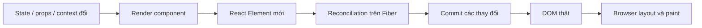
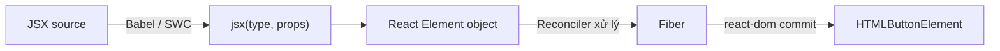
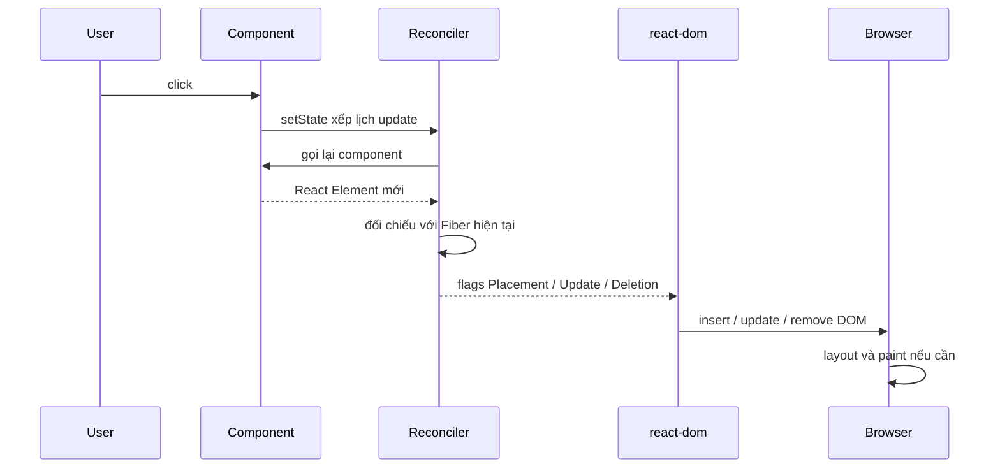
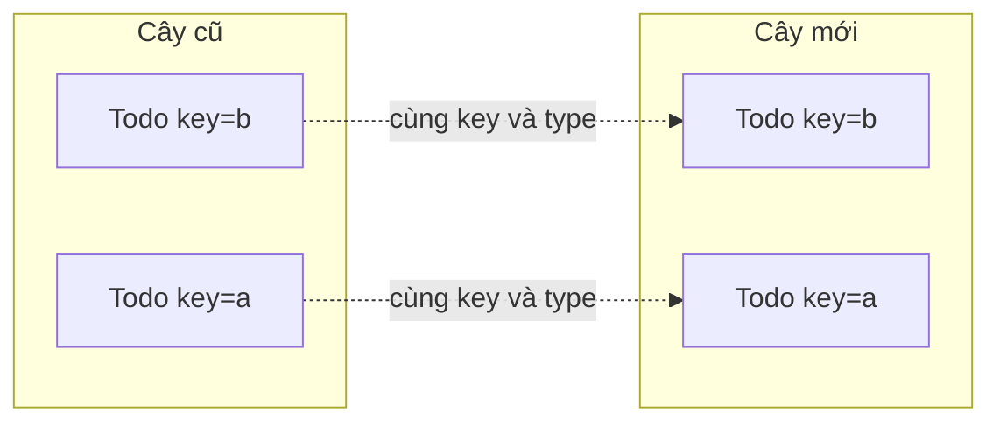
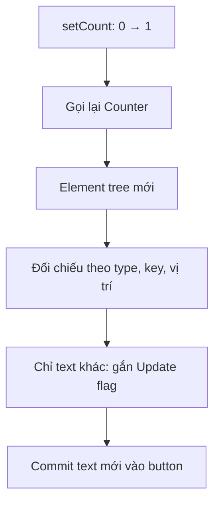
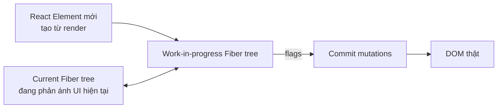

<Callout type="info" title="Ý chính">
  **Virtual DOM** là cách gọi mô hình UI được biểu diễn bằng dữ liệu JavaScript trong bộ nhớ. Trong React hiện đại, đừng hình dung nó chỉ là “hai bản sao DOM đem so sánh với nhau”. Mô hình chính xác hơn là: component tạo **React Element**, reconciler đối chiếu chúng với **cây Fiber hiện tại**, dựng cây Fiber đang làm dở, rồi `react-dom` chỉ áp các thay đổi cần thiết lên DOM thật.
</Callout>

## Mục lục

- [Tổng quan](#tổng-quan)
- [1. Virtual DOM là gì](#1-virtual-dom-là-gì)
  - [1.1 Bốn khái niệm dễ bị trộn lẫn](#11-bốn-khái-niệm-dễ-bị-trộn-lẫn)
- [2. JSX trở thành dữ liệu JavaScript](#2-jsx-trở-thành-dữ-liệu-javascript)
- [3. Toàn bộ pipeline từ state đến pixel](#3-toàn-bộ-pipeline-từ-state-đến-pixel)
  - [3.1 Lần render đầu tiên](#31-lần-render-đầu-tiên)
  - [3.2 Những lần cập nhật sau](#32-những-lần-cập-nhật-sau)
- [4. Reconciliation so sánh cây như thế nào](#4-reconciliation-so-sánh-cây-như-thế-nào)
  - [4.1 Cùng type thì tái sử dụng](#41-cùng-type-thì-tái-sử-dụng)
  - [4.2 Khác type thì thay cả nhánh](#42-khác-type-thì-thay-cả-nhánh)
  - [4.3 Key xác định danh tính trong danh sách](#43-key-xác-định-danh-tính-trong-danh-sách)
  - [4.4 Props và text được đối chiếu riêng](#44-props-và-text-được-đối-chiếu-riêng)
- [5. Ví dụ từng bước với Counter](#5-ví-dụ-từng-bước-với-counter)
- [6. Commit thay đổi DOM thật ra sao](#6-commit-thay-đổi-dom-thật-ra-sao)
- [7. Virtual DOM liên quan gì đến Fiber](#7-virtual-dom-liên-quan-gì-đến-fiber)
- [8. Vì sao re-render không đồng nghĩa với DOM update](#8-vì-sao-re-render-không-đồng-nghĩa-với-dom-update)
- [9. Virtual DOM có luôn nhanh hơn DOM thật không](#9-virtual-dom-có-luôn-nhanh-hơn-dom-thật-không)
- [10. Virtual DOM và Shadow DOM khác nhau](#10-virtual-dom-và-shadow-dom-khác-nhau)
- [11. Thí nghiệm quan sát DOM được tái sử dụng](#11-thí-nghiệm-quan-sát-dom-được-tái-sử-dụng)
- [12. Hiểu lầm thường gặp](#12-hiểu-lầm-thường-gặp)
- [13. Câu hỏi tự kiểm tra](#13-câu-hỏi-tự-kiểm-tra)
- [Thuật ngữ](#thuật-ngữ)
- [Tài liệu tham khảo](#tài-liệu-tham-khảo)

---

## Tổng quan

Khi viết React, bạn mô tả **UI mong muốn** thay vì tự ra lệnh cho DOM từng bước.

```tsx
function Counter() {
  const [count, setCount] = useState(0);

  return (
    <button onClick={() => setCount((c) => c + 1)}>
      Đã bấm {count} lần
    </button>
  );
}
```

Bạn không cần tự viết:

```ts
button.textContent = `Đã bấm ${count} lần`;
```

Mỗi khi `count` đổi, React chạy lại component để lấy mô tả UI mới. React đối chiếu mô tả mới với trạng thái cây hiện tại, xác định phần nào cần thay đổi, rồi giao cho `react-dom` cập nhật DOM thật.



<Callout type="warn" title="Đừng hiểu quá sát chữ virtual DOM">
  React không tạo một cây `HTMLElement` giả hoàn chỉnh rồi dùng thuật toán tổng quát để so sánh nó với DOM thật. React làm việc chủ yếu với **React Element** và **Fiber**. “Virtual DOM” là thuật ngữ bao quát, hữu ích để xây mental model nhưng không phải tên của một API hay một kiểu object duy nhất trong source React.
</Callout>

---

## 1. Virtual DOM là gì

Virtual DOM là một **biểu diễn nhẹ của UI trong bộ nhớ JavaScript**. Nó mô tả những gì giao diện **nên** có: loại phần tử, props và các phần tử con.

Ví dụ JSX sau:

```tsx
<section className="profile">
  <h2>Lan</h2>
  <button>Theo dõi</button>
</section>
```

có thể được hình dung thành dữ liệu gần như sau:

```ts
{
  type: 'section',
  props: {
    className: 'profile',
    children: [
      { type: 'h2', props: { children: 'Lan' } },
      { type: 'button', props: { children: 'Theo dõi' } },
    ],
  },
}
```

Object trên **không phải DOM node**:

- Không có `appendChild()`.
- Không tham gia layout hoặc paint.
- Không thể nhận focus.
- Chỉ là dữ liệu để React biết UI mong muốn trông như thế nào.

### 1.1 Bốn khái niệm dễ bị trộn lẫn

| Khái niệm | Là gì | Tồn tại ở đâu | Vai trò |
|---|---|---|---|
| **React Element** | Object mô tả một node UI với `type`, `key`, `props` | JavaScript heap | Kết quả của JSX, thường được tạo mới mỗi render |
| **Fiber** | Node nội bộ lưu component, state, hooks, quan hệ cây và cờ thay đổi | JavaScript heap | Đơn vị công việc của reconciler, được tái sử dụng qua nhiều render |
| **DOM node** | `HTMLElement`, `Text`, `SVGElement` thật | Browser DOM | Cấu trúc mà trình duyệt dùng để layout, paint và xử lý tương tác |
| **Pixel** | Kết quả cuối người dùng nhìn thấy | Màn hình | Do trình duyệt vẽ sau khi DOM/CSS được cập nhật |

Nói ngắn gọn:

```text
JSX → React Element → Fiber → DOM node → Pixel
```

Virtual DOM thường ám chỉ hai tầng đầu ở giữa: mô tả React Element và cây nội bộ React dùng để xử lý mô tả đó.

---

## 2. JSX trở thành dữ liệu JavaScript

JSX không phải HTML và browser không hiểu JSX trực tiếp. Trình biên dịch như Babel hoặc SWC biến JSX thành lời gọi JavaScript.

```tsx
const element = <button className="save">Lưu</button>;
```

Với JSX transform hiện đại, code trên gần với:

```ts
import { jsx as _jsx } from 'react/jsx-runtime';

const element = _jsx('button', {
  className: 'save',
  children: 'Lưu',
});
```

Transform cũ thường được minh hoạ bằng `React.createElement(...)`. Hai cách đều tạo ra **React Element** chứ chưa tạo `<button>` thật.



<Callout type="info" title="Function component chưa phải DOM">
  Element có `type: Profile` nghĩa là React cần **gọi hàm `Profile`**. React tiếp tục làm như vậy cho tới khi gặp host element như `'div'`, `'button'`, `'input'`. Chỉ các host element này mới tương ứng với node của renderer — với `react-dom`, đó là DOM node của browser.
</Callout>

---

## 3. Toàn bộ pipeline từ state đến pixel

Virtual DOM chỉ là một phần của pipeline. Toàn bộ quá trình gồm render, reconciliation, commit và browser paint.

### 3.1 Lần render đầu tiên

```tsx
import { createRoot } from 'react-dom/client';

const container = document.getElementById('root')!;
const root = createRoot(container);
root.render(<App />);
```

<Steps>
  <Step>
    ### Tạo React root

    `createRoot(container)` tạo root nội bộ và cho React quyền quản lý nội dung bên trong `container`.
  </Step>
  <Step>
    ### Render cây component

    `root.render(<App />)` xếp lịch initial render. React gọi `App` rồi gọi đệ quy các component con để thu được các React Element.
  </Step>
  <Step>
    ### Dựng cây Fiber

    Reconciler tạo các Fiber tương ứng. Với host element như `<div>`, `react-dom` có thể tạo DOM node thật nhưng node đó chưa nhất thiết đã được gắn lên trang.
  </Step>
  <Step>
    ### Commit vào container

    React chèn các DOM node đã chuẩn bị vào `#root`, gán ref và chạy layout effect theo đúng thứ tự.
  </Step>
  <Step>
    ### Browser vẽ giao diện

    Trình duyệt tính style, layout rồi paint pixel. `useEffect` thường chạy sau khi commit và sau cơ hội paint của browser.
  </Step>
</Steps>

### 3.2 Những lần cập nhật sau

Khi `setState` được gọi, React không sửa DOM ngay tại dòng đó. React xếp lịch một update.



React có thể gộp nhiều update vào một lần render. Trong concurrent rendering, React còn có thể tạm dừng hoặc bỏ một render đang làm dở. DOM thật chỉ thay đổi khi React đã hoàn tất công việc và bước vào commit.

---

## 4. Reconciliation so sánh cây như thế nào

**Reconciliation** là quá trình React ghép mô tả UI mới với cây hiện tại để quyết định node nào được giữ, node nào cập nhật và node nào bị thay thế.

So sánh cây tổng quát để tìm số thao tác tuyệt đối ít nhất là quá đắt. React dùng heuristic — các quy tắc thực dụng — để xử lý gần tuyến tính trong trường hợp thông thường:

1. `type` khác nhau thường đại diện cho hai subtree khác nhau.
2. `key` giúp xác định danh tính của phần tử giữa các sibling.
3. Khi không có key, vị trí trong danh sách được dùng để ghép phần tử.

### 4.1 Cùng type thì tái sử dụng

```tsx
// Trước
<button className="idle">Lưu</button>

// Sau
<button className="saving">Lưu...</button>
```

Hai element đều có `type === 'button'`. React giữ lại cùng `HTMLButtonElement`, rồi cập nhật `className` và text.

Điều này giúp giữ những trạng thái thuộc DOM node như focus hoặc selection khi cấu trúc vẫn tương thích.

### 4.2 Khác type thì thay cả nhánh

```tsx
// Trước
<button>Tiếp tục</button>

// Sau
<a href="/next">Tiếp tục</a>
```

`button` và `a` khác type. React gỡ node cũ rồi tạo node mới. Nếu bên dưới là component có state, state của subtree bị thay cũng bị reset.

Quy tắc tương tự áp dụng cho component:

```tsx
{mode === 'view' ? <Viewer /> : <Editor />}
```

`Viewer` và `Editor` là hai type khác nhau. Đổi mode nghĩa là unmount type cũ và mount type mới ở vị trí đó.

### 4.3 Key xác định danh tính trong danh sách

Xét danh sách ban đầu:

```tsx
[
  <Todo key="a" title="Học React" />,
  <Todo key="b" title="Viết demo" />,
]
```

Sau đó đảo thứ tự:

```tsx
[
  <Todo key="b" title="Viết demo" />,
  <Todo key="a" title="Học React" />,
]
```

Nhờ key, React biết item `b` và `a` vẫn là các item cũ, chỉ đổi vị trí. State của từng `Todo` được gắn với đúng danh tính.



<Callout type="warn" title="Key theo index có thể ghép sai danh tính">
  Dùng index làm key cho danh sách có thể thêm, xoá hoặc sắp xếp lại khiến state “nhảy” sang item khác. Key cần ổn định và duy nhất giữa các sibling. Xem phân tích chi tiết tại [Vì sao list cần key](/react-internals/key-trong-list/).
</Callout>

### 4.4 Props và text được đối chiếu riêng

Khi host element có cùng type, renderer đối chiếu props cũ và mới để tạo update cần thiết.

| Thay đổi trong JSX | DOM operation có thể xảy ra |
|---|---|
| `className="a"` → `className="b"` | Cập nhật class của element |
| `disabled={false}` → `true` | Cập nhật DOM property/attribute boolean |
| `style={{ color: 'red' }}` → `{ color: 'blue' }` | Chỉ đổi style liên quan |
| Text `"0"` → `"1"` | Cập nhật text content/text node |
| Thêm một element con | `appendChild` hoặc `insertBefore` |
| Xoá một element con | `removeChild` |

Tên hàm và cách tối ưu cụ thể là implementation detail, có thể đổi giữa các phiên bản React. Contract quan trọng là React khiến DOM khớp với kết quả render mới mà không dựng lại toàn bộ root khi không cần.

---

## 5. Ví dụ từng bước với Counter

Dùng component đơn giản sau:

```tsx
function Counter() {
  const [count, setCount] = useState(0);

  return (
    <section className="counter">
      <h2>Bộ đếm</h2>
      <button onClick={() => setCount((c) => c + 1)}>
        Giá trị: {count}
      </button>
    </section>
  );
}
```

### Trạng thái ban đầu

Khi `count = 0`, mô tả UI rút gọn là:

```text
section.counter
├── h2
│   └── "Bộ đếm"
└── button
    └── "Giá trị: 0"
```

React tạo và commit các DOM node tương ứng.

### Sau khi click

`setCount` tạo update với `count = 1`. React gọi lại `Counter` và nhận mô tả mới:

```text
section.counter
├── h2
│   └── "Bộ đếm"
└── button
    └── "Giá trị: 1"
```

React đối chiếu theo từng vị trí:

| Node | Kết quả đối chiếu |
|---|---|
| `section` | Cùng type và props → giữ nguyên |
| `h2` | Cùng type và text → giữ nguyên |
| `button` | Cùng type → giữ nguyên DOM node |
| Text trong button | `0` thành `1` → đánh dấu Update |

Commit cuối cùng chỉ cần cập nhật text liên quan. React không xoá rồi dựng lại `section`, `h2` và `button`.



Đây là lợi ích chính của cách khai báo: component chỉ mô tả **toàn bộ UI mong muốn**, còn React chịu trách nhiệm tìm phần DOM cần thay.

---

## 6. Commit thay đổi DOM thật ra sao

Sau reconciliation, Fiber có thể mang các cờ mô tả công việc:

| Flag khái niệm | Ý nghĩa |
|---|---|
| **Placement** | Chèn hoặc di chuyển host node |
| **Update** | Sửa prop, style hoặc text |
| **ChildDeletion** | Xoá subtree cũ |
| **Ref** | Gỡ ref cũ hoặc gán ref mới |
| **Passive/Layout effect** | Cleanup hoặc chạy effect tương ứng |

Ở commit phase, `react-dom` dùng DOM API của browser để thực hiện công việc. Ví dụ khái niệm:

```ts
parent.appendChild(child);
parent.insertBefore(child, beforeNode);
element.className = 'saving';
textNode.nodeValue = 'Giá trị: 1';
parent.removeChild(child);
```

React còn bảo toàn hoặc khôi phục một số trạng thái browser nhạy cảm như selection và xử lý riêng các form control được điều khiển.

<Callout type="info" title="Commit không phải browser paint">
  Commit chỉ cập nhật DOM và chạy các công việc React liên quan. Sau đó browser mới tính style, layout và paint. Vì vậy “Virtual DOM đã diff xong” không có nghĩa pixel đã xuất hiện ngay tại chính dòng `setState`.
</Callout>

Xem thứ tự chi tiết tại [Render Pipeline: Trigger → Render → Commit](/react-internals/render-pipeline/).

---

## 7. Virtual DOM liên quan gì đến Fiber

Câu giải thích phổ biến “React tạo Virtual DOM mới rồi so với Virtual DOM cũ” hữu ích cho người mới nhưng bỏ qua kiến trúc thật của React hiện đại.

Mô hình sát hơn:



- **React Element mới** là mô tả bất biến, thường sống ngắn và được tạo lại trong render.
- **Current Fiber tree** là cấu trúc lâu dài đại diện cho UI đã commit, chứa state, hooks và liên kết tới DOM node.
- **Work-in-progress Fiber tree** là phiên bản React đang xử lý cho update tiếp theo.
- `alternate` nối hai phiên bản Fiber để hỗ trợ double buffering.
- Reconciler gắn flags lên Fiber thay vì trực tiếp sửa DOM trong lúc đang render.

Nhờ Fiber, React có thể chia công việc, đặt ưu tiên, tạm dừng hoặc bỏ render đang làm dở. Nếu một render bị bỏ, DOM thật vẫn giữ trạng thái đã commit gần nhất.

<Callout type="info" title="Cách dùng thuật ngữ chính xác">
  Khi giải thích ở mức nhập môn, gọi toàn bộ mô hình trong bộ nhớ là Virtual DOM là đủ. Khi debug internals, hãy tách rõ **React Element**, **Fiber current**, **Fiber work-in-progress** và **DOM node**. Đọc tiếp [Fiber & Reconciliation](/react-internals/fiber-reconciliation/) để đi sâu vào `beginWork`, `completeWork`, lanes và double buffering.
</Callout>

---

## 8. Vì sao re-render không đồng nghĩa với DOM update

**Re-render** nghĩa là React gọi lại function component để lấy output mới. Nó không tự động có nghĩa DOM thay đổi.

```tsx
function Greeting({ theme }: { theme: 'light' | 'dark' }) {
  console.log('Greeting render');
  return <h1>Xin chào</h1>;
}
```

Nếu component cha truyền `theme` mới, `Greeting` có thể được gọi lại. Nhưng output host vẫn là cùng `<h1>` với cùng text. Reconciliation không tìm thấy DOM mutation cần thiết, nên commit không sửa `<h1>`.

| Hiện tượng | Có thể xảy ra? |
|---|---|
| Component function chạy lại | Có |
| React Element mới được tạo | Có |
| Fiber được xử lý | Có |
| DOM node bị thay đổi | Không nhất thiết |
| Browser phải paint lại node đó | Không nhất thiết |

Re-render thừa vẫn có thể tốn CPU vì component và reconciliation phải chạy. Tuy nhiên, đừng đánh đồng chi phí đó với việc xoá và dựng lại DOM.

---

## 9. Virtual DOM có luôn nhanh hơn DOM thật không

Không. Câu “Virtual DOM nhanh hơn DOM” thiếu chính xác vì Virtual DOM cuối cùng vẫn phải dùng DOM thật để hiển thị UI. Nó còn thêm chi phí tạo object, chạy component và reconciliation.

Nếu biết chính xác một text node cần đổi, code DOM viết tay có thể ít công việc hơn:

```ts
counterNode.textContent = String(nextCount);
```

Giá trị của Virtual DOM nằm ở **mô hình lập trình và khả năng điều phối**:

- Bạn khai báo UI theo state thay vì tự đồng bộ hàng loạt DOM mutation.
- React gom nhiều update và tránh các mutation không cần thiết.
- Reconciliation giữ state và DOM node khi danh tính không đổi.
- Fiber cho phép ưu tiên update quan trọng và gián đoạn render ít ưu tiên.
- Cùng mô hình component có thể dùng với renderer khác, không chỉ DOM.

| Cách tiếp cận | Điểm mạnh | Chi phí |
|---|---|---|
| DOM thủ công | Tối ưu tốt khi UI nhỏ và luồng thay đổi rất rõ | Khó giữ UI đồng bộ khi state và tương tác phức tạp |
| Virtual DOM của React | Code khai báo, composition tốt, update có thể được batch/schedule | Tốn render và reconciliation; đôi khi cần tối ưu subtree đắt |

<Callout type="info" title="Kết luận thực dụng">
  Virtual DOM không phải phép màu làm mọi thao tác nhanh hơn. Nó là lớp trừu tượng giúp viết UI phức tạp dễ đúng hơn, đồng thời cho React đủ thông tin để cập nhật DOM có hệ thống. Khi có vấn đề hiệu năng, hãy đo bằng React DevTools Profiler thay vì mặc định đổ lỗi cho DOM hoặc bọc `memo` khắp nơi.
</Callout>

---

## 10. Virtual DOM và Shadow DOM khác nhau

Hai khái niệm có chữ “DOM” nhưng giải quyết hai vấn đề khác nhau.

| | Virtual DOM | Shadow DOM |
|---|---|---|
| Bản chất | Cấu trúc dữ liệu JavaScript | API browser thật |
| Mục đích | Mô tả và đối chiếu UI trước khi cập nhật DOM | Đóng gói DOM/CSS cho Web Components |
| Browser có layout/paint trực tiếp? | Không | Có, vì là một phần của DOM thật |
| Cách tạo | React tạo nội bộ từ JSX/Fiber | `element.attachShadow({ mode: 'open' })` |
| CSS isolation | Không tự cung cấp | Có boundary style và DOM encapsulation |

React có thể render **vào trong Shadow Root**, nhưng Virtual DOM không phải Shadow DOM và không thay thế nó.

---

## 11. Thí nghiệm quan sát DOM được tái sử dụng

Ví dụ sau re-render mỗi giây. Bạn có thể nhập text vào `<input>` và quan sát nội dung vẫn còn dù `Clock` liên tục chạy lại.

```tsx
import { useEffect, useState } from 'react';

export default function Clock() {
  const [seconds, setSeconds] = useState(0);

  useEffect(() => {
    const id = window.setInterval(() => {
      setSeconds((s) => s + 1);
    }, 1000);

    return () => window.clearInterval(id);
  }, []);

  return (
    <section>
      <p>Đã chạy: {seconds} giây</p>
      <input placeholder="Gõ vào đây" />
    </section>
  );
}
```

React cập nhật text trong `<p>`, nhưng giữ nguyên `<input>` vì type, key và vị trí của nó không đổi. Do DOM node không bị thay, giá trị do người dùng nhập trực tiếp vào input không biến mất.

Để kiểm tra danh tính node trong DevTools Console:

```js
const firstInput = document.querySelector('input');

// Chờ component re-render vài lần, rồi chạy:
firstInput === document.querySelector('input'); // true
```

Sau đó thử đổi JSX có điều kiện từ `<input />` sang `<textarea />`. Hai type khác nhau nên phép so sánh trên trở thành `false`; node cũ bị thay bằng node mới.

---

## 12. Hiểu lầm thường gặp

<Accordions type="single">
  <Accordion title="React giữ hai bản sao đầy đủ của DOM thật?">
    Không theo nghĩa hai cây `HTMLElement`. React giữ cây Fiber current và work-in-progress trong bộ nhớ, đồng thời xử lý React Element mới từ render. Fiber có liên kết tới host DOM node thật, nhưng không phải bản clone đầy đủ của mọi thuộc tính và hành vi DOM.
  </Accordion>
  <Accordion title="Mỗi setState đều dựng lại toàn bộ DOM?">
    Không. `setState` xếp lịch render. React có thể gọi lại nhiều component, nhưng commit chỉ áp những DOM mutation được reconciliation xác định là cần thiết.
  </Accordion>
  <Accordion title="Diff Virtual DOM tìm được số thao tác tối ưu tuyệt đối?">
    Không. Tree diff tổng quát quá đắt. React dùng heuristic dựa trên type, key và vị trí để đạt hiệu năng thực tế tốt. Vì vậy cách bạn tổ chức cây và chọn key ảnh hưởng trực tiếp tới khả năng tái sử dụng.
  </Accordion>
  <Accordion title="React so sánh JSX mới trực tiếp với DOM browser?">
    Không phải mental model tốt. Reconciler đối chiếu output mới với cây Fiber hiện tại. Renderer `react-dom` chỉ đọc kết quả công việc và áp thay đổi lên DOM ở commit.
  </Accordion>
  <Accordion title="Virtual DOM tự động ngăn mọi re-render thừa?">
    Không. Virtual DOM giúp tránh DOM mutation khi output không đổi, nhưng component vẫn có thể bị gọi và reconciliation vẫn tốn CPU. `React.memo`, cấu trúc state hợp lý và React Compiler có thể giúp trong những trường hợp phù hợp.
  </Accordion>
  <Accordion title="Key chỉ dùng để tắt warning?">
    Không. Key là một phần danh tính của element giữa các sibling. Key sai có thể làm state gắn nhầm item, input hiển thị dữ liệu sai hoặc khiến component mount lại không cần thiết.
  </Accordion>
</Accordions>

---

## 13. Câu hỏi tự kiểm tra

<Accordions type="single">
  <Accordion title="1. JSX tạo DOM node ngay lập tức đúng hay sai?">
    Sai. JSX được transform thành lời gọi tạo React Element — object mô tả UI. `react-dom` tạo hoặc cập nhật DOM node trong quá trình render/commit phù hợp.
  </Accordion>
  <Accordion title="2. React dùng ba tín hiệu chính nào để ghép element cũ và mới?">
    Type, key và vị trí giữa các sibling. Cùng type và key ở vị trí tương ứng thường được tái sử dụng; khác type hoặc key thường tạo danh tính mới.
  </Accordion>
  <Accordion title="3. Re-render khác DOM update thế nào?">
    Re-render là gọi lại component để tính output. DOM update chỉ xảy ra ở commit nếu reconciliation tìm thấy khác biệt cần áp lên DOM thật.
  </Accordion>
  <Accordion title="4. React Element khác Fiber thế nào?">
    React Element là mô tả UI nhẹ, thường được tạo mới mỗi render. Fiber là node nội bộ tồn tại qua nhiều render, lưu state, hooks, quan hệ cây, DOM node và cờ công việc.
  </Accordion>
  <Accordion title="5. Virtual DOM có luôn nhanh hơn DOM thủ công không?">
    Không. DOM thủ công được viết tối ưu cho một thay đổi cụ thể có thể nhanh hơn. Virtual DOM chủ yếu đem lại mô hình khai báo, khả năng batch/schedule và cách cập nhật UI có hệ thống.
  </Accordion>
  <Accordion title="6. Vì sao key ổn định quan trọng khi reorder list?">
    Key cho React biết item mới tương ứng với item cũ nào dù vị trí thay đổi. Nhờ đó React di chuyển/tái sử dụng đúng node và giữ state đúng với từng item.
  </Accordion>
</Accordions>

---

## Thuật ngữ

| Thuật ngữ | Nghĩa |
|---|---|
| **Virtual DOM** | Tên gọi bao quát cho biểu diễn UI bằng dữ liệu trong bộ nhớ trước khi commit vào DOM thật |
| **React Element** | Object bất biến mô tả `type`, `key`, `props`; thường là kết quả của JSX |
| **Fiber** | Node nội bộ và đơn vị công việc của React, lưu state, hooks, liên kết cây và flags |
| **Reconciliation** | Quá trình ghép output mới với cây hiện tại để quyết định giữ, cập nhật, chèn hoặc xoá |
| **Renderer** | Lớp biến kết quả reconciliation thành thao tác trên môi trường đích; `react-dom` là renderer cho browser DOM |
| **Host element** | Element có type chuỗi như `'div'`, `'button'`; tương ứng với node của renderer |
| **Commit** | Pha React áp mutation lên môi trường đích, cập nhật ref và chạy effect liên quan |
| **DOM mutation** | Thao tác thật như chèn, xoá, di chuyển node hoặc đổi property/text |
| **Browser paint** | Bước browser vẽ pixel sau khi DOM và style đã sẵn sàng |

---

## Tài liệu tham khảo

- [React Docs — Render and Commit](https://react.dev/learn/render-and-commit)
- [React Docs — Preserving and Resetting State](https://react.dev/learn/preserving-and-resetting-state)
- [React Docs — Writing Markup with JSX](https://react.dev/learn/writing-markup-with-jsx)
- [React Docs — createRoot](https://react.dev/reference/react-dom/client/createRoot)
- [React source — ReactFiberConfigDOM](https://github.com/facebook/react/blob/main/packages/react-dom-bindings/src/client/ReactFiberConfigDOM.js)
- [Render Pipeline](/react-internals/render-pipeline/)
- [Fiber & Reconciliation](/react-internals/fiber-reconciliation/)
- [Vì sao list cần key](/react-internals/key-trong-list/)
