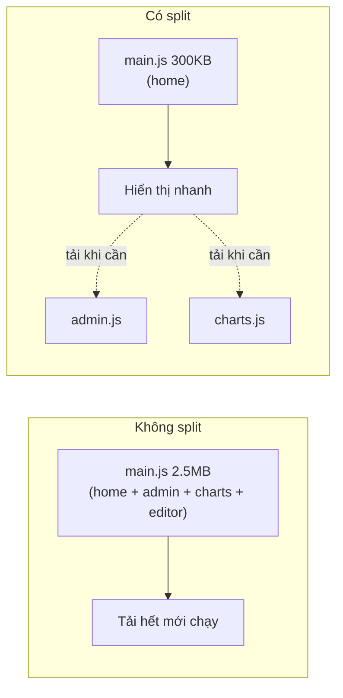
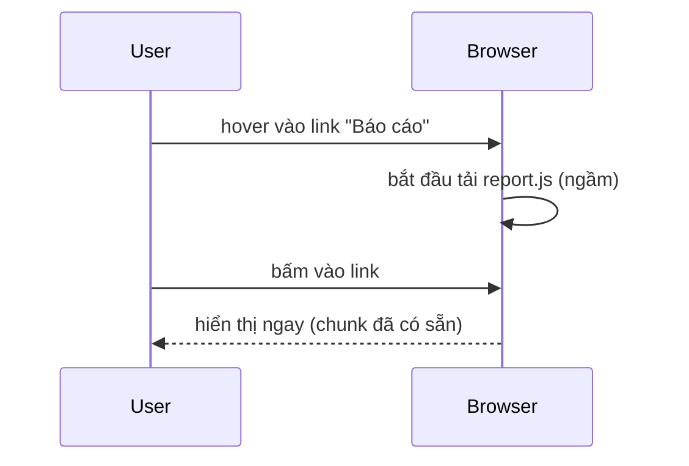

# Code-splitting & lazy loading

## Mục lục

- [Tổng quan](#tổng-quan)
- [1. Vấn đề: bundle một cục](#1-vấn-đề-bundle-một-cục)
- [2. React.lazy + Suspense](#2-reactlazy--suspense)
- [3. Route-based splitting](#3-route-based-splitting)
- [4. Component-based splitting](#4-component-based-splitting)
- [5. Bẫy: lazy trong render & layout shift](#5-bẫy-lazy-trong-render--layout-shift)
- [6. Preload thông minh](#6-preload-thông-minh)
- [Tài liệu tham khảo](#tài-liệu-tham-khảo)

---

## Tổng quan

Code-splitting là chia bundle JavaScript thành nhiều mảnh (chunk) **tải theo nhu cầu**, thay vì bắt người dùng tải toàn bộ app ngay lần đầu. Đây là tối ưu **thời gian tải** (khác với tối ưu re-render ở các bài trước, vốn là tối ưu **runtime**).

> [!IMPORTANT]
> Re-render tối ưu CPU lúc chạy; code-splitting tối ưu byte lúc tải. Một app có thể render siêu mượt nhưng vẫn tệ nếu bắt user tải 5MB JS trước khi thấy gì. Hai loại tối ưu này bổ sung cho nhau.

---

## 1. Vấn đề: bundle một cục

Mặc định, mọi `import` tĩnh được gộp vào một (vài) file lớn. User mở trang chủ vẫn phải tải cả code trang admin, trang thống kê, thư viện biểu đồ nặng...



---

## 2. React.lazy + Suspense

`React.lazy` nhận một hàm trả về `import()` động; component chỉ được tải khi lần đầu render. `Suspense` cung cấp fallback trong lúc tải.

```tsx
import { lazy, Suspense, useState } from 'react';

// import() động → bundler tách Chart thành chunk riêng
const Chart = lazy(() => import('./Chart'));

export default function Dashboard() {
  const [show, setShow] = useState(false);
  return (
    <div>
      <button onClick={() => setShow(true)}>Hiện biểu đồ</button>
      {show && (
        <Suspense fallback={<p>Đang tải biểu đồ…</p>}>
          <Chart /> {/* chunk Chart chỉ tải khi show = true */}
        </Suspense>
      )}
    </div>
  );
}
```

> [!NOTE]
> Component truyền cho `lazy` phải là **default export**. Nếu là named export, bọc lại: `lazy(() => import('./m').then(m => ({ default: m.Named })))`.

---

## 3. Route-based splitting

Cách chia hiệu quả nhất và dễ nhất: tách theo **route**. Mỗi trang là một chunk; user chỉ tải code của trang đang xem.

```tsx
import { lazy, Suspense } from 'react';
import { Routes, Route } from 'react-router-dom';

const Home = lazy(() => import('./pages/Home'));
const Admin = lazy(() => import('./pages/Admin'));
const Report = lazy(() => import('./pages/Report'));

export default function App() {
  return (
    <Suspense fallback={<PageSkeleton />}>
      <Routes>
        <Route path="/" element={<Home />} />
        <Route path="/admin" element={<Admin />} />
        <Route path="/report" element={<Report />} />
      </Routes>
    </Suspense>
  );
}
```

> [!TIP]
> Với Next.js (như repo này dùng), code-splitting theo route là **mặc định** — mỗi page tự thành chunk. Bạn chủ yếu cần `next/dynamic` cho component nặng trong một trang.

---

## 4. Component-based splitting

Tách những component **nặng** và **không phải lúc nào cũng hiện**: modal, editor giàu tính năng, biểu đồ, bản đồ.

| Ứng viên tốt cho lazy | Vì sao |
|-----------------------|--------|
| Modal/Dialog | Chỉ mở khi user bấm |
| Rich text editor | Thư viện rất nặng |
| Biểu đồ (chart) | Thư viện vẽ lớn |
| Bản đồ | Tải SDK bản đồ tốn kém |
| Tab ẩn | Chưa chắc user mở |

---

## 5. Bẫy: lazy trong render & layout shift

<Callout type="warn">
Đừng khai báo <code>lazy(() => import(...))</code> <strong>bên trong</strong> thân component. Mỗi render sẽ tạo một lazy component mới → React remount → mất state → tải lại. Luôn đặt <code>lazy</code> ở <strong>module scope</strong> (ngoài component).
</Callout>

```tsx
// ❌ trong component → tạo lại mỗi render
function Bad() {
  const Heavy = lazy(() => import('./Heavy')); // SAI
  return <Suspense fallback={null}><Heavy /></Suspense>;
}

// ✅ module scope
const Heavy = lazy(() => import('./Heavy'));
function Good() {
  return <Suspense fallback={null}><Heavy /></Suspense>;
}
```

> [!IMPORTANT]
> Chọn `fallback` có **kích thước gần đúng** với nội dung thật (skeleton) để tránh **layout shift** — màn hình nhảy khi nội dung tải xong. Fallback `null` hoặc spinner nhỏ giữa trang lớn gây giật bố cục.

---

## 6. Preload thông minh

Tải trước chunk **ngay trước khi** user cần (vd khi hover vào link), để khi bấm thì đã sẵn sàng — vừa nhanh vừa không tốn băng thông lúc đầu.

```tsx
const Report = lazy(() => import('./pages/Report'));

function ReportLink() {
  // gọi import() khi hover → trình duyệt tải chunk trước
  const preload = () => import('./pages/Report');
  return (
    <a href="/report" onMouseEnter={preload} onFocus={preload}>
      Xem báo cáo
    </a>
  );
}
```



> [!TIP]
> Cân bằng: preload quá sớm/quá nhiều thì lại tải thừa như khi không split. Preload theo tín hiệu ý định của user (hover, focus, sắp scroll tới) là điểm ngọt.

---

## Tài liệu tham khảo

- [React Docs — lazy](https://react.dev/reference/react/lazy)
- [React Docs — Suspense](https://react.dev/reference/react/Suspense)
- [Next.js — Lazy Loading](https://nextjs.org/docs/app/building-your-application/optimizing/lazy-loading)
- [Tổng quan tối ưu](/toi-uu-rerender/tong-quan-toi-uu/)
