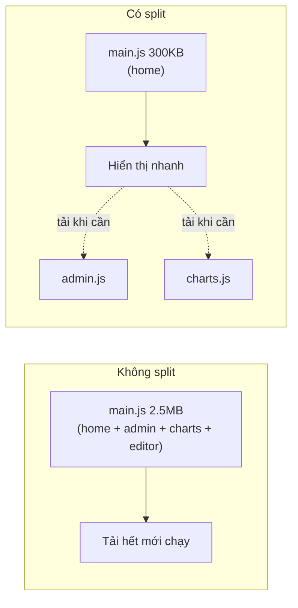
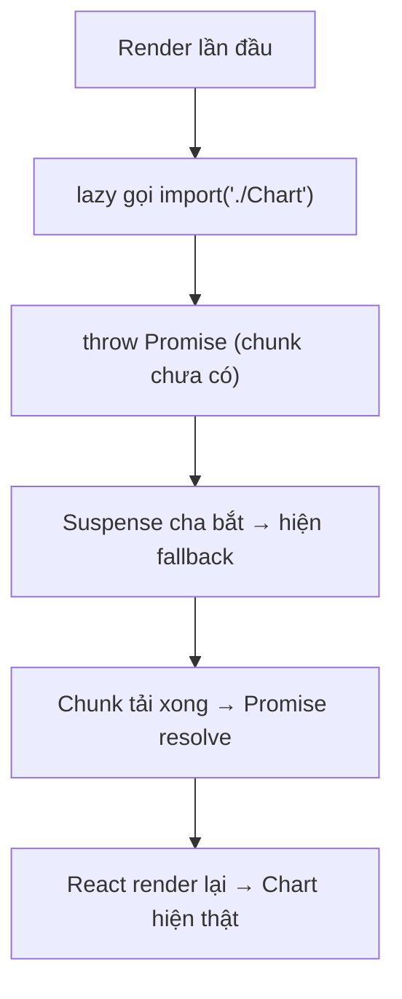
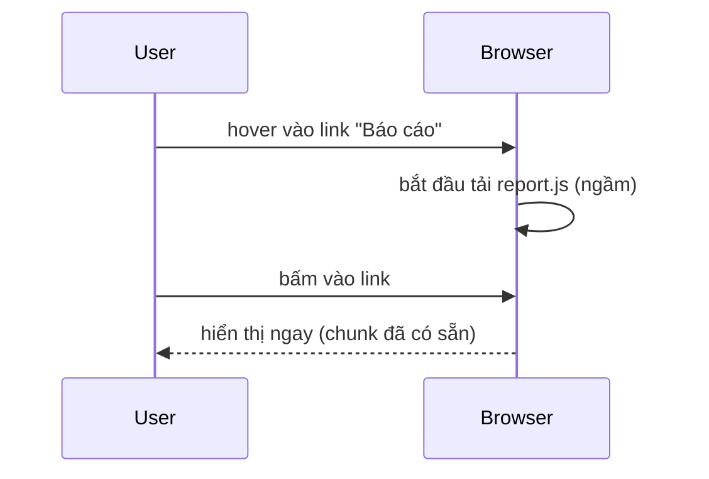

# Code-splitting & lazy loading

## Mục lục

- [Tổng quan](#tổng-quan)
- [1. Vấn đề: bundle một cục](#1-vấn-đề-bundle-một-cục)
- [2. React.lazy + Suspense](#2-reactlazy--suspense)
  - [2.1 Cơ chế: lazy & Suspense hoạt động thế nào](#21-cơ-chế-lazy--suspense-hoạt-động-thế-nào)
  - [2.2 Bắt lỗi tải bằng Error Boundary](#22-bắt-lỗi-tải-bằng-error-boundary)
- [3. Route-based splitting](#3-route-based-splitting)
- [4. Component-based splitting](#4-component-based-splitting)
  - [4.1 next/dynamic trong Next.js](#41-nextdynamic-trong-nextjs)
- [5. Bẫy: lazy trong render & layout shift](#5-bẫy-lazy-trong-render--layout-shift)
- [6. Bẫy: waterfall khi lazy lồng nhau](#6-bẫy-waterfall-khi-lazy-lồng-nhau)
- [7. Preload thông minh](#7-preload-thông-minh)
- [8. Câu hỏi tự kiểm tra](#8-câu-hỏi-tự-kiểm-tra)
- [Tài liệu tham khảo](#tài-liệu-tham-khảo)

---

## Tổng quan

Code-splitting là chia bundle JavaScript thành nhiều mảnh (chunk) **tải theo nhu cầu**, thay vì bắt người dùng tải toàn bộ app ngay lần đầu. Đây là tối ưu **thời gian tải** (khác với tối ưu re-render ở các bài trước, vốn là tối ưu **runtime**).

> [!IMPORTANT]
> Re-render tối ưu CPU lúc chạy; code-splitting tối ưu byte lúc tải. Một app có thể render siêu mượt nhưng vẫn tệ nếu bắt user tải 5MB JS trước khi thấy gì. Hai loại tối ưu này bổ sung cho nhau.

---

## 1. Vấn đề: bundle một cục

Mặc định, mọi `import` tĩnh được gộp vào một (vài) file lớn. User mở trang chủ vẫn phải tải cả code trang admin, trang thống kê, thư viện biểu đồ nặng...



> [!TIP]
> Đo bundle trước khi split: với Next.js xem cột "First Load JS" khi `next build`, hoặc dùng `@next/bundle-analyzer`. Với Vite/webpack dùng `rollup-plugin-visualizer`/`webpack-bundle-analyzer`. Tách cái **to và ít dùng** trước.

---

## 2. React.lazy + Suspense

`React.lazy` nhận một hàm trả về `import()` động; component chỉ được tải khi lần đầu render. `Suspense` cung cấp fallback trong lúc tải.

```tsx
import { lazy, Suspense, useState } from 'react';

// import() động → bundler tách Chart thành chunk riêng
const Chart = lazy(() => import('./Chart'));

export default function Dashboard() {
  const [show, setShow] = useState(false);
  return (
    <div>
      <button onClick={() => setShow(true)}>Hiện biểu đồ</button>
      {show && (
        <Suspense fallback={<p>Đang tải biểu đồ…</p>}>
          <Chart /> {/* chunk Chart chỉ tải khi show = true */}
        </Suspense>
      )}
    </div>
  );
}
```

> [!NOTE]
> Component truyền cho `lazy` phải là **default export**. Nếu là named export, bọc lại: `lazy(() => import('./m').then(m => ({ default: m.Named })))`.

### 2.1 Cơ chế: lazy & Suspense hoạt động thế nào

`lazy` trả về một component đặc biệt. Lần đầu render, nó gọi `import()` (trả về một Promise) và **"ném" (throw) chính Promise đó**. `Suspense` cha bắt lấy Promise này, hiển thị `fallback`, và đăng ký render lại khi Promise resolve.



> [!NOTE]
> Đây là cùng cơ chế Suspense dùng cho data fetching: "ném" một Promise để báo "tôi chưa sẵn sàng, hãy hiện fallback". Hiểu điều này giúp bạn dùng Suspense nhất quán cho cả code-splitting lẫn data.

### 2.2 Bắt lỗi tải bằng Error Boundary

Nếu mạng lỗi, `import()` reject → component lazy ném lỗi. `Suspense` **không** bắt lỗi (chỉ bắt trạng thái chờ). Bọc thêm **Error Boundary** để xử lý:

```tsx
<ErrorBoundary fallback={<p>Tải thất bại. Thử lại.</p>}>
  <Suspense fallback={<Spinner />}>
    <Chart />
  </Suspense>
</ErrorBoundary>
```

> [!WARNING]
> Thiếu Error Boundary, một lỗi tải chunk (vd user mất mạng giữa chừng, hoặc deploy mới làm chunk cũ 404) sẽ làm sập cả nhánh UI. Luôn ghép Suspense với Error Boundary cho lazy.

---

## 3. Route-based splitting

Cách chia hiệu quả nhất và dễ nhất: tách theo **route**. Mỗi trang là một chunk; user chỉ tải code của trang đang xem.

```tsx
import { lazy, Suspense } from 'react';
import { Routes, Route } from 'react-router-dom';

const Home = lazy(() => import('./pages/Home'));
const Admin = lazy(() => import('./pages/Admin'));
const Report = lazy(() => import('./pages/Report'));

export default function App() {
  return (
    <Suspense fallback={<PageSkeleton />}>
      <Routes>
        <Route path="/" element={<Home />} />
        <Route path="/admin" element={<Admin />} />
        <Route path="/report" element={<Report />} />
      </Routes>
    </Suspense>
  );
}
```

> [!TIP]
> Với Next.js (như repo này dùng), code-splitting theo route là **mặc định** — mỗi page tự thành chunk. Bạn chủ yếu cần `next/dynamic` cho component nặng trong một trang.

---

## 4. Component-based splitting

Tách những component **nặng** và **không phải lúc nào cũng hiện**: modal, editor giàu tính năng, biểu đồ, bản đồ.

| Ứng viên tốt cho lazy | Vì sao |
|-----------------------|--------|
| Modal/Dialog | Chỉ mở khi user bấm |
| Rich text editor | Thư viện rất nặng |
| Biểu đồ (chart) | Thư viện vẽ lớn |
| Bản đồ | Tải SDK bản đồ tốn kém |
| Tab ẩn | Chưa chắc user mở |

### 4.1 next/dynamic trong Next.js

Trong Next.js, dùng `next/dynamic` thay cho `React.lazy` — nó hỗ trợ SSR và cho phép tắt SSR cho component chỉ chạy ở client:

```tsx
import dynamic from 'next/dynamic';

// Component nặng, chỉ chạy ở client (vd dùng window/canvas)
const Map = dynamic(() => import('@/components/Map'), {
  loading: () => <p>Đang tải bản đồ…</p>,
  ssr: false, // không render ở server
});

export default function Page() {
  return <Map />;
}
```

> [!NOTE]
> `ssr: false` hữu ích cho thư viện đụng tới `window`/`document` (chỉ có ở trình duyệt). Với component bình thường, để mặc định `ssr: true` để vẫn có HTML từ server.

---

## 5. Bẫy: lazy trong render & layout shift

<Callout type="warn">
Đừng khai báo <code>lazy(() => import(...))</code> <strong>bên trong</strong> thân component. Mỗi render sẽ tạo một lazy component mới → React remount → mất state → tải lại. Luôn đặt <code>lazy</code> ở <strong>module scope</strong> (ngoài component).
</Callout>

```tsx
// ❌ trong component → tạo lại mỗi render
function Bad() {
  const Heavy = lazy(() => import('./Heavy')); // SAI
  return <Suspense fallback={null}><Heavy /></Suspense>;
}

// ✅ module scope
const Heavy = lazy(() => import('./Heavy'));
function Good() {
  return <Suspense fallback={null}><Heavy /></Suspense>;
}
```

> [!IMPORTANT]
> Chọn `fallback` có **kích thước gần đúng** với nội dung thật (skeleton) để tránh **layout shift** — màn hình nhảy khi nội dung tải xong. Fallback `null` hoặc spinner nhỏ giữa trang lớn gây giật bố cục.

---

## 6. Bẫy: waterfall khi lazy lồng nhau

Nếu component lazy A bên trong lại render component lazy B, hai chunk tải **tuần tự** (A xong mới biết cần B) → chậm:


> [!TIP]
> Tránh waterfall: đặt các ranh giới lazy ở cùng một tầng (song song) thay vì lồng sâu, hoặc preload B ngay khi bắt đầu tải A. Một `Suspense` bao nhiều lazy anh em sẽ tải song song.

---

## 7. Preload thông minh

Tải trước chunk **ngay trước khi** user cần (vd khi hover vào link), để khi bấm thì đã sẵn sàng — vừa nhanh vừa không tốn băng thông lúc đầu.

```tsx
const Report = lazy(() => import('./pages/Report'));

function ReportLink() {
  // gọi import() khi hover → trình duyệt tải chunk trước
  const preload = () => import('./pages/Report');
  return (
    <a href="/report" onMouseEnter={preload} onFocus={preload}>
      Xem báo cáo
    </a>
  );
}
```



> [!TIP]
> Cân bằng: preload quá sớm/quá nhiều thì lại tải thừa như khi không split. Preload theo tín hiệu ý định của user (hover, focus, sắp scroll tới) là điểm ngọt.

---

## 8. Câu hỏi tự kiểm tra

<Accordions type="single">
  <Accordion title="1. React.lazy báo cho Suspense biết 'đang tải' bằng cách nào?">
    Component lazy 'ném' (throw) chính Promise của import() khi chunk chưa có. Suspense cha bắt Promise đó, hiện fallback, và render lại khi resolve.
  </Accordion>
  <Accordion title="2. Suspense có bắt lỗi tải chunk không?">
    Không. Suspense chỉ xử lý trạng thái chờ. Lỗi tải (mạng/404) cần Error Boundary bọc ngoài.
  </Accordion>
  <Accordion title="3. Vì sao không được khai báo lazy() trong thân component?">
    Mỗi render tạo một lazy component mới → React coi là type khác → remount, mất state, tải lại. Đặt ở module scope.
  </Accordion>
  <Accordion title="4. Khi nào dùng ssr:false với next/dynamic?">
    Khi component đụng tới window/document (chỉ có ở client) hoặc thư viện không chạy được ở server.
  </Accordion>
  <Accordion title="5. Waterfall trong lazy là gì và tránh thế nào?">
    Là việc các chunk tải tuần tự vì lazy lồng nhau (A xong mới biết cần B). Tránh bằng cách đặt ranh giới lazy song song cùng tầng hoặc preload sớm.
  </Accordion>
</Accordions>

---

## Tài liệu tham khảo

- [React Docs — lazy](https://react.dev/reference/react/lazy)
- [React Docs — Suspense](https://react.dev/reference/react/Suspense)
- [Next.js — Lazy Loading](https://nextjs.org/docs/app/building-your-application/optimizing/lazy-loading)
- [Tổng quan tối ưu](/toi-uu-rerender/tong-quan-toi-uu/)
