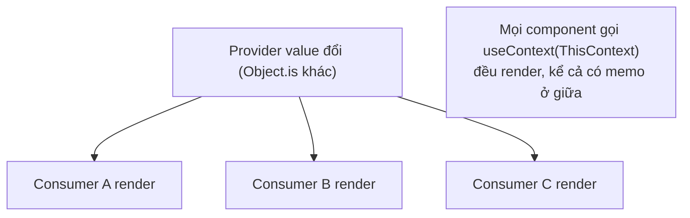
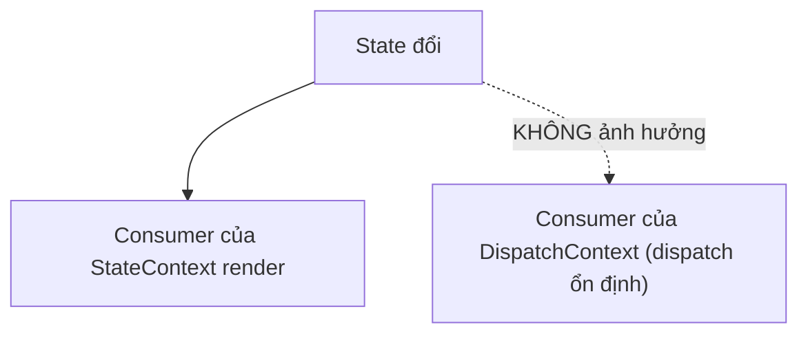

# Tối ưu Context

## Mục lục

- [Tổng quan](#tổng-quan)
- [1. Cơ chế re-render của Context](#1-cơ-chế-re-render-của-context)
- [2. Bẫy 1: value tạo mới mỗi render](#2-bẫy-1-value-tạo-mới-mỗi-render)
- [3. Bẫy 2: trộn nhiều thứ vào một context](#3-bẫy-2-trộn-nhiều-thứ-vào-một-context)
- [4. Kỹ thuật: tách state và dispatch](#4-kỹ-thuật-tách-state-và-dispatch)
- [5. Kỹ thuật: selector pattern](#5-kỹ-thuật-selector-pattern)
- [6. Khi nào nên dùng thư viện state](#6-khi-nào-nên-dùng-thư-viện-state)
- [Tài liệu tham khảo](#tài-liệu-tham-khảo)

---

## Tổng quan

Context giải quyết "prop drilling" (truyền props qua nhiều tầng), nhưng nếu dùng sai sẽ biến thành nguồn re-render khổng lồ: **mọi** component đọc context sẽ render lại khi context value đổi — bất kể nó chỉ quan tâm một phần nhỏ.

> [!IMPORTANT]
> Khác với props (chỉ ảnh hưởng cây con của cha render), Context value đổi sẽ làm **tất cả consumer** (`useContext`) render lại, dù chúng nằm rải rác. `React.memo` ở giữa **không** chặn được điều này — consumer đăng ký trực tiếp với Provider, "nhảy cóc" qua các tầng memo.

---

## 1. Cơ chế re-render của Context



React so sánh context value cũ vs mới bằng `Object.is`. Khác → mọi consumer render.

---

## 2. Bẫy 1: value tạo mới mỗi render

```tsx
const AuthContext = createContext(null);

function AuthProvider({ children }) {
  const [user, setUser] = useState(null);

  // ❌ object value tạo MỚI mỗi render → consumer render lại dù user không đổi
  return (
    <AuthContext.Provider value={{ user, setUser }}>
      {children}
    </AuthContext.Provider>
  );
}
```

Mỗi lần `AuthProvider` render, `{ user, setUser }` là object mới → `Object.is` khác → mọi consumer render. **Sửa** bằng `useMemo`:

```tsx
function AuthProvider({ children }) {
  const [user, setUser] = useState(null);

  // ✅ value chỉ đổi tham chiếu khi user đổi
  const value = useMemo(() => ({ user, setUser }), [user]);

  return <AuthContext.Provider value={value}>{children}</AuthContext.Provider>;
}
```

> [!NOTE]
> `setUser` từ `useState` vốn đã ổn định (React đảm bảo cùng tham chiếu suốt vòng đời), nên chỉ cần `user` trong deps.

---

## 3. Bẫy 2: trộn nhiều thứ vào một context

Nếu một context chứa cả thứ hay đổi (vd vị trí chuột) lẫn thứ ít đổi (vd theme), thì mỗi lần thứ hay đổi cập nhật, **cả** consumer chỉ cần theme cũng render.

```tsx
// ❌ Một context "khổng lồ"
const AppContext = createContext({ theme, user, mousePos, cart, notifications });
// mousePos đổi liên tục → mọi consumer (kể cả chỉ đọc theme) render điên cuồng
```

> [!WARNING]
> Quy tắc: **một context cho một mối quan tâm**, và nhóm theo **tần suất thay đổi**. Tách thứ đổi nhiều ra khỏi thứ đổi ít.

---

## 4. Kỹ thuật: tách state và dispatch

Một mẫu rất hiệu quả: tách **giá trị** (hay đổi) khỏi **hàm cập nhật** (không bao giờ đổi). Component nào chỉ cần `dispatch` sẽ **không** render khi state đổi.

```tsx
import { createContext, useContext, useReducer, Dispatch } from 'react';

const StateContext = createContext<State | null>(null);
const DispatchContext = createContext<Dispatch<Action> | null>(null);

function TodoProvider({ children }: { children: React.ReactNode }) {
  const [state, dispatch] = useReducer(reducer, initialState);
  return (
    <StateContext.Provider value={state}>
      {/* dispatch ổn định suốt đời → consumer của nó KHÔNG render khi state đổi */}
      <DispatchContext.Provider value={dispatch}>
        {children}
      </DispatchContext.Provider>
    </StateContext.Provider>
  );
}

// Component chỉ thêm todo (cần dispatch, không cần state) sẽ không render khi danh sách đổi:
function AddButton() {
  const dispatch = useContext(DispatchContext)!;
  return <button onClick={() => dispatch({ type: 'add' })}>Thêm</button>;
}
```



---

## 5. Kỹ thuật: selector pattern

Context thuần **không** hỗ trợ "chỉ render khi phần tôi quan tâm đổi". Bạn có thể mô phỏng selector bằng cách **chia nhỏ context**, hoặc dùng thư viện ngoài.

```tsx
// Cách thủ công: nhiều context nhỏ thay cho một context to
const ThemeContext = createContext('light');
const UserContext = createContext(null);
const CartContext = createContext([]);
// Consumer chỉ subscribe context nó cần → đổi cart không làm theme consumer render
```

> [!TIP]
> Nếu cần selector thực sự (subscribe một mẩu của object lớn) mà không tách context, dùng `useSyncExternalStore` (API chính thức để subscribe store ngoài) hoặc thư viện như Zustand/Jotai/Redux — chúng cài sẵn cơ chế selector.

---

## 6. Khi nào nên dùng thư viện state

| Nhu cầu | Giải pháp |
|---------|-----------|
| Vài giá trị ít đổi (theme, locale, user) | Context thuần + `useMemo` |
| State chia sẻ, đổi vừa phải | Context tách state/dispatch |
| State lớn, đổi nhiều, cần selector | Zustand / Jotai / Redux Toolkit |
| Server state (data từ API) | TanStack Query / SWR (không nên nhét vào Context) |

> [!IMPORTANT]
> Đừng dùng Context như một "store toàn cục cho mọi thứ". Context giỏi truyền **giá trị ít đổi** xuống sâu. Với state đổi liên tục và cần tối ưu chi tiết, một thư viện chuyên dụng (có selector) sẽ đỡ đau đầu hơn nhiều.

---

## Tài liệu tham khảo

- [React Docs — useContext](https://react.dev/reference/react/useContext)
- [React Docs — Scaling Up with Reducer and Context](https://react.dev/learn/scaling-up-with-reducer-and-context)
- [Provider Pattern](/patterns/provider-pattern/)
- [Referential Equality](/toi-uu-rerender/referential-equality/)
