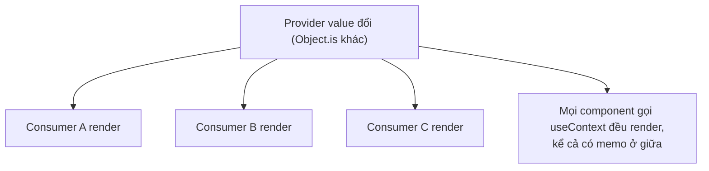
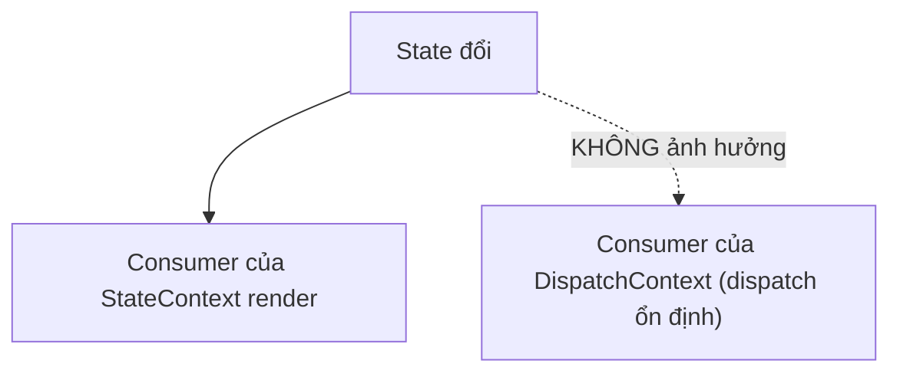

# Tối ưu Context

## Mục lục

- [Tổng quan](#tổng-quan)
- [1. Cơ chế re-render của Context](#1-cơ-chế-re-render-của-context)
  - [1.1 Vì sao React.memo không chặn được](#11-vì-sao-reactmemo-không-chặn-được)
- [2. Bẫy 1: value tạo mới mỗi render](#2-bẫy-1-value-tạo-mới-mỗi-render)
- [3. Bẫy 2: trộn nhiều thứ vào một context](#3-bẫy-2-trộn-nhiều-thứ-vào-một-context)
- [4. Kỹ thuật: tách state và dispatch](#4-kỹ-thuật-tách-state-và-dispatch)
- [5. Kỹ thuật: selector pattern](#5-kỹ-thuật-selector-pattern)
- [6. Khi nào nên dùng thư viện state](#6-khi-nào-nên-dùng-thư-viện-state)
- [7. Câu hỏi tự kiểm tra](#7-câu-hỏi-tự-kiểm-tra)
- [Tài liệu tham khảo](#tài-liệu-tham-khảo)

---

## Tổng quan

Context giải quyết "prop drilling" (truyền props qua nhiều tầng), nhưng nếu dùng sai sẽ biến thành nguồn re-render khổng lồ: **mọi** component đọc context sẽ render lại khi context value đổi — bất kể nó chỉ quan tâm một phần nhỏ.

<Callout type="info" title="Important">

Khác với props (chỉ ảnh hưởng cây con của cha render), Context value đổi sẽ làm **tất cả consumer** (`useContext`) render lại, dù chúng nằm rải rác. `React.memo` ở giữa **không** chặn được điều này — consumer đăng ký trực tiếp với Provider, "nhảy cóc" qua các tầng memo.

</Callout>

---

## 1. Cơ chế re-render của Context



React so sánh context value cũ vs mới bằng `Object.is`. Khác → mọi consumer render. Khi Provider nhận `value` mới, React **duyệt cây fiber** tìm tất cả fiber đang đọc context đó (`dependencies` của fiber) và đánh dấu chúng cần render — bất kể chúng nằm sâu bao nhiêu tầng.

### 1.1 Vì sao React.memo không chặn được

`memo` chặn re-render khi **cha** truyền cùng props. Nhưng consumer của context **không** nhận giá trị qua props — nó đăng ký **trực tiếp** với Provider. Khi context đổi, React đánh dấu thẳng vào fiber consumer, "vượt qua" mọi `memo` ở giữa.

```tsx
const ThemeCtx = createContext('light');

const Middle = memo(function Middle() {
  // memo chặn re-render do props cha, nhưng...
  return <Leaf />;
});

function Leaf() {
  const theme = useContext(ThemeCtx); // ...Leaf vẫn render khi ThemeCtx đổi
  return <div className={theme} />;
}
```

<Callout type="info" title="Note">

Đây là điểm khác biệt cốt lõi giữa "re-render do cha" (memo chặn được) và "re-render do context" (memo bó tay). Cách duy nhất để giảm là **đừng để value đổi** hoặc **thu nhỏ phạm vi context**.

</Callout>

---

## 2. Bẫy 1: value tạo mới mỗi render

```tsx
const AuthContext = createContext(null);

function AuthProvider({ children }) {
  const [user, setUser] = useState(null);

  // ❌ object value tạo MỚI mỗi render → consumer render lại dù user không đổi
  return (
    <AuthContext.Provider value={{ user, setUser }}>
      {children}
    </AuthContext.Provider>
  );
}
```

Mỗi lần `AuthProvider` render, `{ user, setUser }` là object mới → `Object.is` khác → mọi consumer render. **Sửa** bằng `useMemo`:

```tsx
function AuthProvider({ children }) {
  const [user, setUser] = useState(null);

  // ✅ value chỉ đổi tham chiếu khi user đổi
  const value = useMemo(() => ({ user, setUser }), [user]);

  return <AuthContext.Provider value={value}>{children}</AuthContext.Provider>;
}
```

<Callout type="info" title="Note">

`setUser` từ `useState` vốn đã ổn định (React đảm bảo cùng tham chiếu suốt vòng đời), nên chỉ cần `user` trong deps. Đây là ví dụ trực tiếp của [Referential Equality](/toi-uu-rerender/referential-equality/).

</Callout>

---

## 3. Bẫy 2: trộn nhiều thứ vào một context

Nếu một context chứa cả thứ hay đổi (vd vị trí chuột) lẫn thứ ít đổi (vd theme), thì mỗi lần thứ hay đổi cập nhật, **cả** consumer chỉ cần theme cũng render.

```tsx
// ❌ Một context "khổng lồ"
const AppContext = createContext({ theme, user, mousePos, cart, notifications });
// mousePos đổi liên tục → mọi consumer (kể cả chỉ đọc theme) render điên cuồng
```

<Callout type="warn" title="Warning">

Quy tắc: **một context cho một mối quan tâm**, và nhóm theo **tần suất thay đổi**. Tách thứ đổi nhiều ra khỏi thứ đổi ít.

</Callout>

---

## 4. Kỹ thuật: tách state và dispatch

Một mẫu rất hiệu quả: tách **giá trị** (hay đổi) khỏi **hàm cập nhật** (không bao giờ đổi). Component nào chỉ cần `dispatch` sẽ **không** render khi state đổi.

```tsx
import { createContext, useContext, useReducer, Dispatch } from 'react';

const StateContext = createContext<State | null>(null);
const DispatchContext = createContext<Dispatch<Action> | null>(null);

function TodoProvider({ children }: { children: React.ReactNode }) {
  const [state, dispatch] = useReducer(reducer, initialState);
  return (
    <StateContext.Provider value={state}>
      {/* dispatch ổn định suốt đời → consumer của nó KHÔNG render khi state đổi */}
      <DispatchContext.Provider value={dispatch}>
        {children}
      </DispatchContext.Provider>
    </StateContext.Provider>
  );
}

// Component chỉ thêm todo (cần dispatch, không cần state) sẽ không render khi danh sách đổi:
function AddButton() {
  const dispatch = useContext(DispatchContext)!;
  return <button onClick={() => dispatch({ type: 'add' })}>Thêm</button>;
}
```



<Callout type="info" title="Tip">

`dispatch` từ `useReducer` (và `setState` từ `useState`) được React đảm bảo **ổn định** suốt vòng đời component — nên đặt chúng vào một context riêng là cách "miễn phí" để cắt re-render cho nhánh chỉ-ghi.

</Callout>

---

## 5. Kỹ thuật: selector pattern

Context thuần **không** hỗ trợ "chỉ render khi phần tôi quan tâm đổi". Bạn có thể mô phỏng selector bằng cách **chia nhỏ context**, hoặc dùng thư viện ngoài.

```tsx
// Cách thủ công: nhiều context nhỏ thay cho một context to
const ThemeContext = createContext('light');
const UserContext = createContext(null);
const CartContext = createContext([]);
// Consumer chỉ subscribe context nó cần → đổi cart không làm theme consumer render
```

Nếu muốn một **store lớn** mà consumer chỉ render khi "mẩu" nó chọn đổi, dùng `useSyncExternalStore` (API chính thức để subscribe store ngoài React):

```tsx
import { useSyncExternalStore } from 'react';

// store ngoài React rất tối giản
function createStore<T>(initial: T) {
  let state = initial;
  const listeners = new Set<() => void>();
  return {
    getState: () => state,
    setState: (next: Partial<T>) => {
      state = { ...state, ...next };
      listeners.forEach((l) => l());
    },
    subscribe: (l: () => void) => (listeners.add(l), () => listeners.delete(l)),
  };
}

const store = createStore({ theme: 'light', count: 0 });

// Component chỉ render khi MẨU mình chọn (theme) đổi, count đổi không ảnh hưởng
function ThemeLabel() {
  const theme = useSyncExternalStore(store.subscribe, () => store.getState().theme);
  return <span>{theme}</span>;
}
```

<Callout type="info" title="Tip">

Nếu cần selector thực sự (subscribe một mẩu của object lớn) mà không tự viết, dùng thư viện như Zustand/Jotai/Redux Toolkit — chúng cài sẵn cơ chế selector trên nền `useSyncExternalStore`.

</Callout>

---

## 6. Khi nào nên dùng thư viện state

| Nhu cầu | Giải pháp |
|---------|-----------|
| Vài giá trị ít đổi (theme, locale, user) | Context thuần + `useMemo` |
| State chia sẻ, đổi vừa phải | Context tách state/dispatch |
| State lớn, đổi nhiều, cần selector | Zustand / Jotai / Redux Toolkit |
| Server state (data từ API) | TanStack Query / SWR (không nên nhét vào Context) |

<Callout type="info" title="Important">

Đừng dùng Context như một "store toàn cục cho mọi thứ". Context giỏi truyền **giá trị ít đổi** xuống sâu. Với state đổi liên tục và cần tối ưu chi tiết, một thư viện chuyên dụng (có selector) sẽ đỡ đau đầu hơn nhiều.

</Callout>

---

## 7. Câu hỏi tự kiểm tra

<Accordions type="single">
  <Accordion title="1. Khi context value đổi, những component nào render lại?">
    Mọi component gọi useContext cho context đó, dù nằm sâu hay rải rác. memo ở giữa không chặn được.
  </Accordion>
  <Accordion title="2. Vì sao React.memo không chặn re-render do context?">
    Vì consumer đăng ký trực tiếp với Provider, không nhận giá trị qua props. React đánh dấu thẳng fiber consumer, vượt qua mọi memo ở giữa.
  </Accordion>
  <Accordion title="3. Vì sao nên useMemo cho Provider value?">
    Object value tạo mới mỗi render → Object.is ra khác → mọi consumer render dù dữ liệu thực không đổi. useMemo giữ tham chiếu ổn định.
  </Accordion>
  <Accordion title="4. Lợi ích của việc tách StateContext và DispatchContext?">
    Component chỉ cần dispatch (ổn định) sẽ không render khi state đổi — cắt re-render cho nhánh chỉ-ghi mà không tốn gì.
  </Accordion>
  <Accordion title="5. Khi nào nên rời Context sang thư viện state?">
    Khi state lớn, đổi nhiều và cần selector (chỉ render khi mẩu quan tâm đổi), hoặc với server state thì dùng TanStack Query/SWR.
  </Accordion>
</Accordions>

---

## Tài liệu tham khảo

- [React Docs — useContext](https://react.dev/reference/react/useContext)
- [React Docs — Scaling Up with Reducer and Context](https://react.dev/learn/scaling-up-with-reducer-and-context)
- [React Docs — useSyncExternalStore](https://react.dev/reference/react/useSyncExternalStore)
- [Provider Pattern](/patterns/provider-pattern/)
- [Referential Equality](/toi-uu-rerender/referential-equality/)
