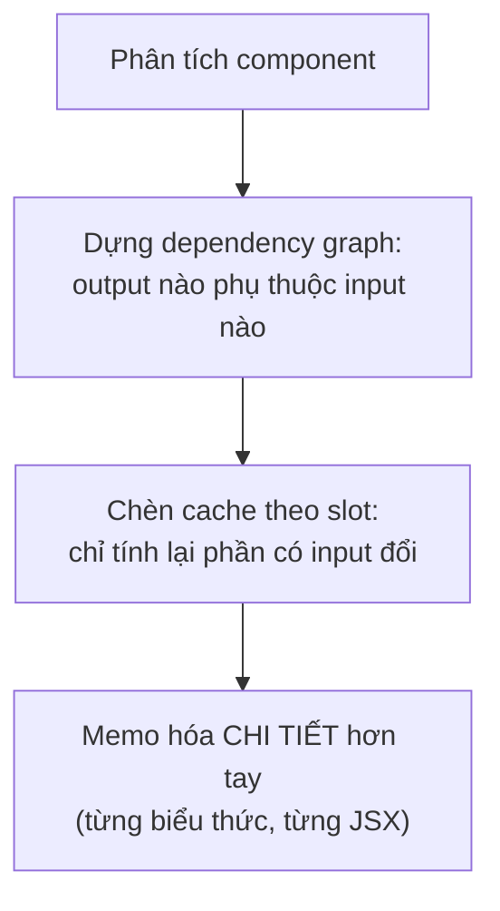
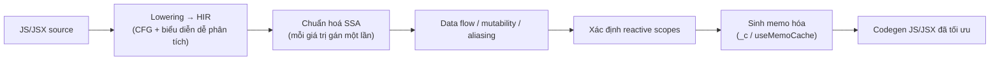
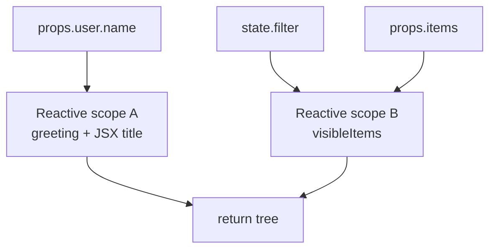
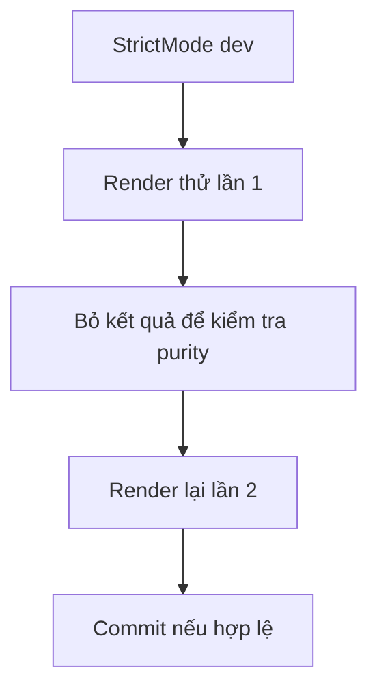
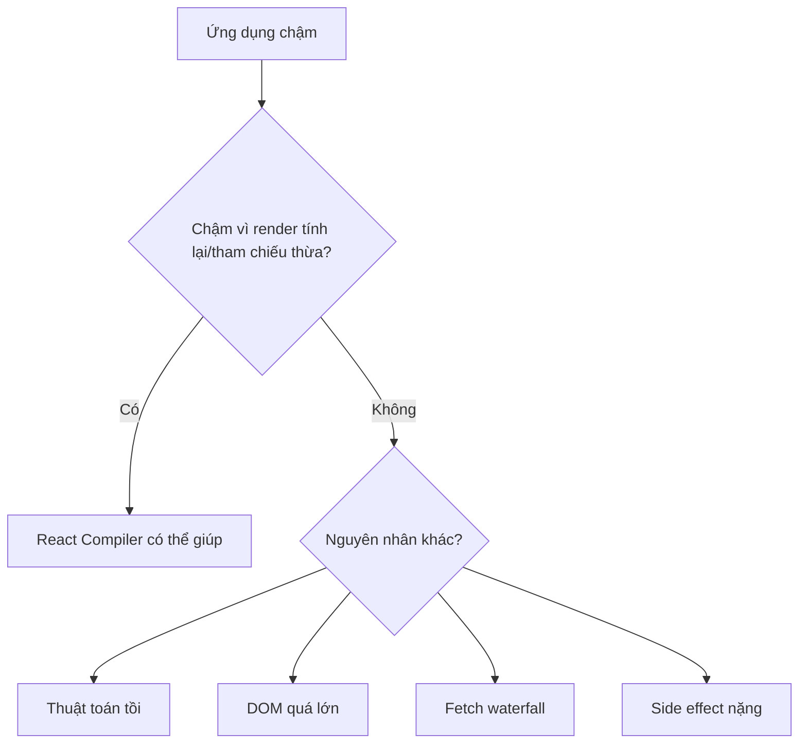

# React Compiler

## Mục lục

- [Tổng quan](#tổng-quan)
- [1. Vấn đề: memo hóa thủ công quá mệt và dễ sai](#1-vấn-đề-memo-hóa-thủ-công-quá-mệt-và-dễ-sai)
- [2. React Compiler làm gì](#2-react-compiler-làm-gì)
- [3. Cơ chế bên trong: cache theo slot](#3-cơ-chế-bên-trong-cache-theo-slot)
- [4. Pipeline biên dịch nhiều pha](#4-pipeline-biên-dịch-nhiều-pha)
- [5. Reactive scopes: khối phản ứng](#5-reactive-scopes-khối-phản-ứng)
- [6. Phân tích mutability & aliasing](#6-phân-tích-mutability--aliasing)
- [7. useMemoCache / _c chi tiết](#7-usememocache--_c-chi-tiết)
- [8. Khi nào Compiler bỏ qua một component](#8-khi-nào-compiler-bỏ-qua-một-component)
- [9. StrictMode, double-render và effects](#9-strictmode-double-render-và-effects)
- [10. Tương tác với memo/useMemo thủ công](#10-tương-tác-với-memousememo-thủ-công)
- [11. Giới hạn: điều Compiler KHÔNG làm](#11-giới-hạn-điều-compiler-không-làm)
- [12. Điều kiện tiên quyết: Rules of React](#12-điều-kiện-tiên-quyết-rules-of-react)
- [13. Cài đặt](#13-cài-đặt)
- [14. Trước và sau khi có Compiler](#14-trước-và-sau-khi-có-compiler)
- [15. Opt-out: "use no memo"](#15-opt-out-use-no-memo)
- [16. Kiểm chứng Compiler đang hoạt động](#16-kiểm-chứng-compiler-đang-hoạt-động)
- [17. Còn cần memo/useMemo thủ công không](#17-còn-cần-memousememo-thủ-công-không)
- [18. Hiểu lầm thường gặp (FAQ)](#18-hiểu-lầm-thường-gặp-faq)
- [19. Câu hỏi tự kiểm tra](#19-câu-hỏi-tự-kiểm-tra)
- [Tài liệu tham khảo](#tài-liệu-tham-khảo)

---

## Tổng quan

**React Compiler** (trước đây có tên *React Forget*) là một trình biên dịch chạy ở **build time**, tự động chèn memo hóa vào code React của bạn — thay thế phần lớn việc dùng `React.memo`, `useMemo`, `useCallback` bằng tay.


<Callout type="info" title="Important">

Ý tưởng cốt lõi: bạn **viết code tự nhiên, tường minh** như thể mọi thứ tính lại mỗi render; **Compiler** lo phần "chỉ tính lại khi cần". Nó dịch chuyển gánh nặng tối ưu từ **con người** (dễ quên, dễ sai deps) sang **máy** (phân tích chính xác dependency ở build time).

</Callout>

Bài này nối tiếp [Tổng quan tối ưu re-render](/toi-uu-rerender/tong-quan-toi-uu/), [React.memo](/toi-uu-rerender/react-memo/) và [useMemo & useCallback](/toi-uu-rerender/usememo-usecallback/). Nên đọc trước để thấy Compiler thay thế những gì.

---

## 1. Vấn đề: memo hóa thủ công quá mệt và dễ sai

Trước Compiler, để tránh tính toán/tạo tham chiếu thừa, bạn phải rải `useMemo`/`useCallback`/`memo` khắp nơi — và **tự bảo trì dependency array**. Điều này sinh ra hàng loạt vấn đề:

- **Dễ sai deps**: thiếu dependency → bug stale; thừa → memo vô dụng. ESLint giúp nhưng không cứu hết.
- **Ồn (noise)**: code ngập trong `useCallback(() => ..., [a, b, c])`, khó đọc logic thật.
- **Tối ưu nửa vời**: người ta thường memo **quá nhiều** (chậm hơn) hoặc **quá ít** (bỏ sót). Rất khó memo hóa "vừa đủ" bằng tay.
- **Referential equality thủ công**: phải nhớ bọc mọi object/hàm truyền xuống con `memo` (xem [Referential Equality](/toi-uu-rerender/referential-equality/)).

<Callout type="info" title="Note">

Đây đúng là loại công việc máy làm tốt hơn người: phân tích **chính xác** giá trị nào phụ thuộc giá trị nào, rồi chèn cache ở **đúng** mức chi tiết. React Compiler sinh ra để tự động hóa việc đó.

</Callout>

---

## 2. React Compiler làm gì

Compiler đọc từng component/hook, dựng **đồ thị phụ thuộc (dependency graph)** giữa các biến, rồi tự động chèn memo hóa ở mức **chi tiết hơn** cả những gì bạn thường làm tay:

- Memo hóa **kết quả tính toán** (thay `useMemo`).
- Memo hóa **hàm** truyền xuống con (thay `useCallback`).
- Memo hóa **JSX element** để bỏ qua re-render con khi props không đổi (thay `React.memo`).



<Callout type="info" title="Important">

Compiler memo hóa ở mức **fine-grained (chi tiết)**: nó có thể chỉ tính lại **một biểu thức con** khi đúng input của biểu thức đó đổi, thay vì tính lại cả khối như `useMemo` gộp. Đây là điều gần như bất khả thi khi làm bằng tay.

</Callout>

---

## 3. Cơ chế bên trong: cache theo slot

Ở mức thực thi, code sau khi biên dịch dùng một **mảng cache cố định** (thường thấy tên `_c` — một hook nội bộ `useMemoCache`) lưu trong fiber. Mỗi giá trị/hàm/JSX được memo có **một slot**; mỗi lần render, Compiler so sánh input với giá trị đã lưu — nếu không đổi thì **tái dùng slot**, đổi thì tính lại và cập nhật slot.

```tsx
// Bạn viết (không hề memo):
function Profile({ user, items }) {
  const greeting = `Xin chào, ${user.name}`;
  const sorted = items.slice().sort();
  return <List title={greeting} data={sorted} />;
}

// Compiler sinh ra (giản lược ý tưởng):
function Profile({ user, items }) {
  const $ = _c(4);                       // mảng cache 4 slot trong fiber
  let greeting;
  if (!Object.is($[0], user.name)) {     // chỉ tính lại khi user.name đổi
    greeting = `Xin chào, ${user.name}`;
    $[0] = user.name; $[1] = greeting;
  } else greeting = $[1];

  let sorted;
  if (!Object.is($[2], items)) {         // chỉ sort lại khi items đổi tham chiếu
    sorted = items.slice().sort();
    $[2] = items; $[3] = sorted;
  } else sorted = $[3];

  return <List title={greeting} data={sorted} />; // JSX cũng được memo tương tự
}
```

<Callout type="info" title="Note">

Bản chất giống hệt `useMemo`/`useCallback` bạn tự viết — nhưng Compiler đặt cache ở **mọi ranh giới phụ thuộc** nó phân tích được, tự động và nhất quán, không cần bạn khai báo dependency array. Đây là lý do nó vừa đầy đủ hơn vừa ít lỗi hơn làm tay.

</Callout>

---

## 4. Pipeline biên dịch nhiều pha

<Callout type="info">
Phần này là **mô hình khái niệm về cách React Compiler hoạt động**. Tên gọi như HIR, SSA, reactive scope, mutable range phản ánh các ý tưởng được đội React công bố, nhưng chi tiết cài đặt nội bộ có thể thay đổi giữa các phiên bản Compiler.
</Callout>

React Compiler không chỉ "tìm `useMemo` để chèn tự động". Nó làm việc giống một trình biên dịch tối ưu: chuyển JavaScript/JSX thành một **IR nội bộ** (thường được mô tả là **HIR — High-level Intermediate Representation**), chuẩn hóa dữ liệu để dễ phân tích, chạy nhiều pass kiểm tra an toàn, rồi mới sinh JavaScript trở lại.



| Giai đoạn | Compiler cần biết gì | Kết quả |
|-----------|----------------------|---------|
| Lowering → HIR | Component làm những phép tính nào, control flow rẽ nhánh ra sao | Code được đưa về dạng dễ chạy phân tích hơn AST gốc |
| SSA | Mỗi biến/giá trị được tạo ở đâu và phụ thuộc vào giá trị nào | Data flow rõ ràng, ít nhập nhằng do gán lại biến |
| Data flow / mutability / aliasing | Giá trị nào đọc props/state, giá trị nào bị mutate, biến nào có thể cùng trỏ tới một object | Biết cache ở đâu là an toàn |
| Reactive scopes | Nhóm các biểu thức có chung tập input reactive | Tạo ranh giới memo hóa tự động |
| Codegen | Cần bao nhiêu slot cache, slot nào lưu input/kết quả | Sinh code có `_c(n)` và các nhánh tái dùng cache |

<Callout type="info" title="Important">

Điểm khó nhất không phải là "thêm cache" mà là **chứng minh cache đó không đổi hành vi chương trình**. Nếu Compiler không chứng minh được, nó sẽ bỏ qua tối ưu cho phạm vi đó.

</Callout>

---

## 5. Reactive scopes: khối phản ứng

**Reactive scope** là một khái niệm cốt lõi: Compiler nhóm những giá trị được tính cùng phụ thuộc vào một tập input chung thành một "khối phản ứng". Mỗi scope có:

- **Inputs**: props, state, context, biến dẫn xuất từ chúng, hoặc giá trị bên ngoài mà scope đọc.
- **Body**: các phép tính thuần cần chạy lại khi input đổi.
- **Outputs**: giá trị/hàm/JSX được dùng ở phần còn lại của render.



Thay vì bạn tự viết một `useMemo` lớn cho cả đoạn render, Compiler có thể chia thành nhiều scope nhỏ:

```tsx
function Products({ user, items, filter }) {
  const greeting = `Xin chào, ${user.name}`;
  const visible = items.filter((item) => item.name.includes(filter));
  const countLabel = `${visible.length} sản phẩm`;

  return <Panel title={greeting} subtitle={countLabel} items={visible} />;
}
```

Ở mức khái niệm, Compiler có thể thấy `greeting` chỉ phụ thuộc `user.name`, còn `visible` và `countLabel` phụ thuộc `items` + `filter`. Khi `filter` đổi, scope liên quan danh sách chạy lại; scope `greeting` vẫn tái dùng.

| Làm tay bằng `useMemo` | Compiler với reactive scope |
|------------------------|-----------------------------|
| Bạn tự chọn ranh giới memo; thường gộp quá to hoặc tách quá nhỏ | Compiler tách theo data flow thực tế |
| Bạn tự viết dependency array | Dependencies được suy ra từ biến thật sự được đọc |
| Dễ thiếu deps trong nhánh điều kiện/closure | Phân tích cả control flow để biết scope đọc gì |
| Dễ tạo `useMemo` chỉ để ổn định tham chiếu | Compiler có thể memo cả JSX/hàm/biểu thức con |

<Callout type="info" title="Tip">

Đây là lý do reactive scope thường **tốt hơn `useMemo` thủ công**: ranh giới memo hóa được đặt theo dữ liệu thật sự chảy qua component, không theo trực giác hoặc thói quen của người viết code.

</Callout>

---

## 6. Phân tích mutability & aliasing

Memo hóa chỉ đúng nếu giá trị được cache không bị thay đổi ngầm. Vì JavaScript cho phép object mutable và nhiều biến cùng trỏ tới một object, Compiler phải phân tích hai chuyện:

1. **Mutability**: một giá trị có bị mutate sau khi tạo không?
2. **Aliasing / points-to**: hai biến có thể đang trỏ tới cùng một object không?

```tsx
function Bad({ items }) {
  const a = items;
  const b = a;

  b.push({ id: 'new' }); // mutate qua alias b, nhưng cũng làm items/a đổi

  return <List items={a} />;
}
```

Trong ví dụ trên, nếu Compiler chỉ nhìn `a` mà không biết `b` là alias của `a`, nó có thể cache `<List items={a} />` sai. Vì vậy Compiler cần ước lượng **points-to**: biến nào có thể trỏ tới object nào.

<Callout type="warn">
Đây là lý do quy tắc "không mutate props/state" không phải giáo điều. Mutation làm mất tính thuần của render, khiến Compiler khó hoặc không thể chứng minh memo hóa là an toàn.
</Callout>

Khi một giá trị mutable được tạo trong render, Compiler có thể tính một **mutable range** — khoảng code mà mutation còn hợp lệ và chưa được phép cache vượt qua ranh giới đó. Ví dụ tạo array tạm rồi push ngay trong cùng scope có thể vẫn an toàn nếu array không thoát ra ngoài trước khi hoàn tất.

```tsx
function Good({ items }) {
  const result = [];
  for (const item of items) {
    result.push(item.name); // mutate biến local mới tạo
  }

  return <List names={result} />;
}
```

| Pattern | Compiler dễ tối ưu? | Lý do |
|---------|---------------------|-------|
| Tạo object/array mới rồi chỉ mutate nội bộ trước khi trả ra | Thường có thể | Mutable range nằm gọn trong render và không alias với props/state |
| Mutate props/state/context | Không an toàn | Giá trị reactive bị đổi ngoài cơ chế update của React |
| Gán nhiều alias rồi mutate qua alias | Khó hơn | Cần chứng minh mọi alias và phạm vi ảnh hưởng |
| Truyền object mutable vào API động không biết hành vi | Có thể bail | Compiler không biết API đó có giữ/mutate object không |

---

## 7. useMemoCache / _c chi tiết

Output của Compiler thường có dạng `const $ = _c(n)`. Có thể hiểu `_c` là wrapper nội bộ quanh **`useMemoCache`**: nó lấy một mảng cache gắn với fiber hiện tại. Kích thước `n` là **cố định và biết trước lúc biên dịch**, vì Compiler đã biết cần bao nhiêu slot.

```tsx
import { c as _c } from 'react/compiler-runtime';

function Profile({ user }) {
  const $ = _c(3);
  const t0 = $[0];

  let greeting;
  if (!Object.is(t0, user.name)) {
    greeting = `Xin chào, ${user.name}`;
    $[0] = user.name;
    $[1] = greeting;
  } else {
    greeting = $[1];
  }

  let element;
  if ($[2] === Symbol.for('react.memo_cache_sentinel')) {
    element = <h1>{greeting}</h1>;
    $[2] = element;
  } else {
    element = $[2];
  }

  return element;
}
```

<Callout type="info" title="Note">

Đoạn trên là ví dụ giản lược để đọc hiểu output. Code thật có thể sinh biến tạm, thứ tự slot và helper khác nhau theo phiên bản Compiler/runtime.

</Callout>

Cách hoạt động ở runtime:

```mermaid
sequenceDiagram
    participant R as Render component
    participant C as _c(n) / useMemoCache
    participant F as Fiber hiện tại
    R->>C: yêu cầu mảng cache n slot
    C->>F: lấy hoặc tạo memo cache
    F-->>C: trả về mảng $
    C-->>R: $[0..n-1]
    R->>R: so input từng slot bằng Object.is
    R->>R: input đổi → tính lại; không đổi → dùng cache
```

| Thành phần | Vai trò |
|------------|---------|
| `_c(n)` | Lấy mảng cache có đúng `n` slot cho component/hook đã biên dịch |
| Slot input | Lưu dependency đã thấy ở lần render trước |
| Slot output | Lưu giá trị/hàm/JSX đã tính |
| Sentinel | Đánh dấu slot "chưa từng tính" ở render đầu |
| `Object.is` | So sánh nông từng input, giống deps của `useMemo`/`useEffect` |

Trong output thật, Compiler thường dùng sentinel `Symbol.for('react.memo_cache_sentinel')` để phân biệt "slot chưa có giá trị" với các giá trị hợp lệ như `undefined` hoặc `null`. Nếu một scope có nhiều input, Compiler so từng input bằng `Object.is`; chỉ cần một input khác là tính lại cả scope.

---

## 8. Khi nào Compiler bỏ qua một component

React Compiler ưu tiên **đúng hơn nhanh**. Nếu không chứng minh được memo hóa giữ nguyên hành vi, nó có thể **bail / skip** một component, hook hoặc một scope cụ thể.

| Trường hợp | Vì sao nguy hiểm |
|------------|------------------|
| Mutate props/state/context | Cache có thể giữ giá trị trước mutation hoặc bỏ qua mutation |
| Gọi hook có điều kiện / trong vòng lặp / sau return sớm | Thứ tự hook không ổn định, không thể gắn cache an toàn |
| Đọc/ghi `ref.current` trong render sai cách | Render không còn thuần; giá trị ref là mutable ngoài data flow React |
| Gọi `setState` trong render | Có thể tạo vòng lặp render và phá giả định idempotent |
| Gọi API động lạ (`eval`, mutation qua thư viện không rõ, global mutable) | Compiler không biết API đó đọc/ghi gì |
| Directive `'use no memo'` | Bạn chủ động yêu cầu bỏ qua |

```tsx
function Bad({ user }) {
  user.name = user.name.trim(); // mutate props
  return <Profile user={user} />;
}

function AlsoBad({ enabled }) {
  if (enabled) {
    const [count] = useState(0); // hook có điều kiện
    return <span>{count}</span>;
  }
  return null;
}
```

<Callout type="info" title="Important">

Khi Compiler bỏ qua một component, app vẫn chạy như trước — chỉ là không nhận tối ưu tự động ở phạm vi đó. Vì vậy chiến lược đúng là bật lint, sửa vi phạm, rồi đo lại; không nên ép Compiler tối ưu code không thuần.

</Callout>

---

## 9. StrictMode, double-render và effects

Trong development, **StrictMode** có thể gọi render nhiều hơn một lần để phát hiện side effect ẩn. Cache do Compiler sinh ra phải cho kết quả nhất quán trong tình huống này: cùng input thì cùng output, render thử bị bỏ đi cũng không được làm hỏng render kế tiếp.



Điều này quay lại yêu cầu cốt lõi: render phải **idempotent**. Nếu bạn ghi global, mutate ref, fetch, hoặc set state trong render, double-render sẽ làm lỗi lộ rõ hơn — và Compiler cũng khó tối ưu hơn.

Compiler cũng không memo hóa "vượt ranh giới effect" theo cách làm sai ngữ nghĩa. Code trong `useEffect` chạy sau commit để đồng bộ với hệ thống ngoài; Compiler có thể tối ưu giá trị được tạo trong render, nhưng không biến side effect thành cache render.

<Callout type="info">
Nếu một effect phụ thuộc vào object/hàm tạo trong render, Compiler có thể giúp ổn định tham chiếu đó khi an toàn. Nhưng nếu effect đang che giấu logic tính toán hoặc fetch waterfall, Compiler không biến nó thành kiến trúc data fetching tốt hơn.
</Callout>

---

## 10. Tương tác với memo/useMemo thủ công

Compiler làm việc **song song** với `React.memo`, `useMemo`, `useCallback` đang có. Bạn không cần xóa toàn bộ memo thủ công trước khi bật Compiler; làm vậy còn dễ tạo diff lớn và khó debug.

<Steps>
  <Step>
    ### Bật lint trước
    Cài rule React Compiler / Rules of React để biết component nào đang vi phạm purity, hooks, refs, setState trong render.
  </Step>
  <Step>
    ### Sửa vi phạm theo cụm nhỏ
    Ưu tiên mutate props/state, hook sai chỗ, effect viết sai dependency. Đây là sửa correctness, không chỉ tối ưu.
  </Step>
  <Step>
    ### Bật Compiler theo thư mục hoặc gating
    Rollout từng phần, đo bằng Profiler/DevTools, giữ khả năng rollback nhanh.
  </Step>
  <Step>
    ### Dọn memo thủ công sau cùng
    Khi đã ổn định, xóa `useMemo`/`useCallback` chỉ dùng cho tối ưu tham chiếu thừa để code gọn hơn. Giữ lại chỗ có lý do ngữ nghĩa rõ ràng.
  </Step>
</Steps>

<Callout type="info" title="Tip">

Hãy coi Compiler là cách giảm **chi phí bảo trì memo hóa**, không phải lý do để xóa mù quáng mọi `useMemo`. Những memo đang bảo vệ API bên ngoài hoặc giữ identity vì ngữ nghĩa vẫn cần được review cẩn thận.

</Callout>

---

## 11. Giới hạn: điều Compiler KHÔNG làm

Compiler chỉ loại bỏ **tính lại thừa** và **tham chiếu thừa** trong render. Nó không thay thế các kỹ thuật tối ưu khác.

| Compiler KHÔNG làm | Bạn vẫn cần làm gì |
|--------------------|--------------------|
| Không đổi thuật toán O(n²) thành O(n log n) | Chọn data structure/algorithm tốt hơn |
| Không memo hóa side effect | Đưa side effect vào `useEffect`/event handler/server action đúng chỗ |
| Không giảm số DOM node khổng lồ | Dùng [virtualization](/toi-uu-rerender/virtualization/) hoặc pagination |
| Không sửa fetch waterfall | Thiết kế data fetching song song, prefetch, cache dữ liệu |
| Không biến component không thuần thành thuần | Sửa Rules of React và mutation |
| Không thay thế profiling | Vẫn đo bằng React DevTools Profiler và Web Vitals |



<Callout type="info" title="Important">

Nếu bottleneck nằm ngoài render thuần, Compiler không thể "cứu" bạn. Nó là một tối ưu compiler cho React render, không phải optimizer tổng quát cho toàn bộ ứng dụng web.

</Callout>

---

## 12. Điều kiện tiên quyết: Rules of React

Compiler chỉ **an toàn** nếu code của bạn tuân thủ **Rules of React** — vì nó giả định component/hook là **thuần** để có thể memo hóa mà không đổi hành vi.

| Quy tắc | Vì sao Compiler cần |
|---------|---------------------|
| Component/hook **thuần** (cùng input → cùng output) | Có memo hóa (bỏ qua tính lại) thì kết quả vẫn phải đúng |
| **Không mutate** props, state, giá trị trả về | Nếu mutate, giá trị cache sẽ sai |
| Tuân thủ **Rules of Hooks** | Compiler dựa vào thứ tự hook ổn định |

```tsx
// ❌ Không thuần: mutate props → Compiler có thể memo sai
function Bad({ list }) {
  list.push('x');   // mutate props — VI PHẠM
  return <List data={list} />;
}

// ✅ Thuần: tạo bản sao mới
function Good({ list }) {
  const next = [...list, 'x'];
  return <List data={next} />;
}
```

<Callout type="warn" title="Warning">

Compiler **không sửa** code sai — nó chỉ **từ chối tối ưu** (skip) những component vi phạm mà nó phát hiện, hoặc tệ hơn, tối ưu một chỗ ẩn chứa mutate và gây bug. Hãy bật **`eslint-plugin-react-compiler`**: nó cảnh báo trước những vi phạm khiến Compiler bỏ qua hoặc gặp rủi ro.

</Callout>

---

## 13. Cài đặt

React Compiler chạy như một **Babel plugin**. Nó nhắm React 19, nhưng cũng hỗ trợ 17/18 kèm một runtime nhỏ.

<Tabs items={['Next.js', 'Vite / Babel', 'ESLint']}>
  <Tab value="Next.js">
    ```bash
    npm install -D babel-plugin-react-compiler
    ```
    ```js
    // next.config.js
    const nextConfig = {
      experimental: { reactCompiler: true },
    };
    module.exports = nextConfig;
    ```
  </Tab>
  <Tab value="Vite / Babel">
    ```bash
    npm install -D babel-plugin-react-compiler
    ```
    ```js
    // vite.config.js
    export default {
      plugins: [
        react({
          babel: { plugins: [['babel-plugin-react-compiler', {}]] },
        }),
      ],
    };
    ```
  </Tab>
  <Tab value="ESLint">
    ```bash
    npm install -D eslint-plugin-react-compiler
    ```
    ```js
    // .eslintrc
    {
      "plugins": ["react-compiler"],
      "rules": { "react-compiler/react-compiler": "error" }
    }
    ```
  </Tab>
</Tabs>

<Callout type="info" title="Tip">

Với dự án lớn/cũ, có thể bật Compiler **theo thư mục** (option cấu hình) để rollout dần, thay vì bật toàn bộ ngay. Chạy ESLint plugin trước để dọn các vi phạm Rules of React trước khi bật biên dịch.

</Callout>

---

## 14. Trước và sau khi có Compiler

```tsx
// ❌ TRƯỚC: tự memo hóa thủ công, đầy noise
const Row = React.memo(function Row({ item, onSelect }) {
  return <li onClick={() => onSelect(item.id)}>{item.name}</li>;
});

function List({ items }) {
  const [selected, setSelected] = useState(null);
  const onSelect = useCallback((id) => setSelected(id), []);
  const sorted = useMemo(() => items.slice().sort(), [items]);
  return <ul>{sorted.map((it) => <Row key={it.id} item={it} onSelect={onSelect} />)}</ul>;
}
```

```tsx
// ✅ SAU: viết tự nhiên, Compiler lo memo hóa
function Row({ item, onSelect }) {
  return <li onClick={() => onSelect(item.id)}>{item.name}</li>;
}

function List({ items }) {
  const [selected, setSelected] = useState(null);
  const onSelect = (id) => setSelected(id);       // không cần useCallback
  const sorted = items.slice().sort();            // không cần useMemo
  return <ul>{sorted.map((it) => <Row key={it.id} item={it} onSelect={onSelect} />)}</ul>;
}
```

<Callout type="info" title="Important">

Code "sau" **ngắn hơn, dễ đọc hơn, và thường nhanh hơn hoặc bằng** code "trước" — vì Compiler memo hóa chính xác và chi tiết. Bạn tập trung vào logic; tối ưu là việc của trình biên dịch.

</Callout>

---

## 15. Opt-out: "use no memo"

Nếu một component có vấn đề (thường do vi phạm Rules of React chưa sửa), bạn có thể tạm **loại nó khỏi Compiler** bằng directive:

```tsx
function LegacyWidget() {
  'use no memo'; // Compiler bỏ qua component này
  // ... code cũ chưa kịp dọn
}
```

<Callout type="error" title="Caution">

`'use no memo'` là **giải pháp tạm** (escape hatch), không phải cách sửa. Mục tiêu cuối là dọn vi phạm để Compiler tối ưu được. Đừng rải directive này để "làm ngơ" cảnh báo.

</Callout>

---

## 16. Kiểm chứng Compiler đang hoạt động

<Steps>
  <Step>
    ### Cài React DevTools mới nhất
    Component nào được Compiler tối ưu sẽ hiện badge **"Memo ✨"** cạnh tên trong tab Components.
  </Step>
  <Step>
    ### Quan sát Profiler
    Sau khi bật Compiler, số component "Did not render" (bailout) trong flamegraph tăng lên khi props không đổi — bằng chứng memo hóa tự động đang chạy.
  </Step>
  <Step>
    ### Kiểm tra output biên dịch
    Có thể dùng React Compiler Playground (trên trang chủ React) để dán code và xem code đã biên dịch với cache _c.
  </Step>
</Steps>

---

## 17. Còn cần memo/useMemo thủ công không

| Tình huống | Sau khi có Compiler |
|-----------|---------------------|
| `useMemo`/`useCallback` cho tối ưu re-render thông thường | **Phần lớn không cần** — Compiler lo |
| `React.memo` để chặn re-render từ cha | **Phần lớn không cần** |
| `useMemo` cho giá trị cần **ổn định tham chiếu vì lý do ngữ nghĩa** (vd làm dependency của effect, key của Map) | **Vẫn có thể cần** cân nhắc |
| Tối ưu **thuật toán** (giảm độ phức tạp, tránh tính toán O(n²)) | **Compiler KHÔNG làm** — vẫn là việc của bạn |

<Callout type="info" title="Important">

Compiler giải quyết **memo hóa tham chiếu/tính lại thừa**, **không** giải quyết **thuật toán tồi**. Một vòng lặp O(n²) hay một phép tính nặng vẫn cần bạn tối ưu logic. Và với DOM lớn, bạn vẫn cần [virtualization](/toi-uu-rerender/virtualization/) — Compiler không thay thế được.

</Callout>

---

## 18. Hiểu lầm thường gặp (FAQ)

<Accordions type="single">
  <Accordion title="React Compiler chạy lúc nào — build time hay runtime?">
    Build time (như một Babel plugin). Nó biến đổi code trước khi chạy, chèn sẵn logic cache. Runtime chỉ đọc/ghi mảng cache _c.
  </Accordion>
  <Accordion title="Bật Compiler có làm app tự nhanh gấp bội không?">
    Không thần kỳ. Nó loại bỏ re-render/tính lại thừa (thường ngang hoặc tốt hơn memo tay), nhưng không sửa thuật toán tồi hay DOM quá lớn.
  </Accordion>
  <Accordion title="Phải xóa hết useMemo/useCallback cũ trước khi bật không?">
    Không bắt buộc. Compiler làm việc song song với memo thủ công đang có. Có thể dọn dần cho gọn code, nhưng không cần xóa hết ngay.
  </Accordion>
  <Accordion title="Vì sao Compiler bỏ qua (skip) component của tôi?">
    Thường do vi phạm Rules of React (mutate props/state, hook đặt sai chỗ, không thuần). Bật eslint-plugin-react-compiler để tìm và sửa.
  </Accordion>
  <Accordion title="Compiler có cần React 19 không?">
    Nhắm React 19, nhưng hỗ trợ 17/18 kèm một runtime nhỏ (react-compiler-runtime). Kiểm tra tài liệu phiên bản để cấu hình đúng.
  </Accordion>
  <Accordion title="Reactive scope khác gì một useMemo lớn quanh toàn bộ render?">
    Reactive scope nhỏ và chính xác hơn. Compiler có thể tách nhiều scope theo data flow: phần chỉ phụ thuộc user.name không cần chạy lại khi filter đổi, trong khi một useMemo lớn dễ kéo quá nhiều dependency vào cùng một chỗ.
  </Accordion>
  <Accordion title="Nếu Compiler skip một component thì có phải app bị lỗi không?">
    Không. Skip nghĩa là component chạy như code gốc, không nhận tối ưu tự động ở phạm vi đó. Đây là lựa chọn an toàn: Compiler thà bỏ tối ưu còn hơn sinh cache có thể đổi hành vi.
  </Accordion>
  <Accordion title="Có nên dựa vào output _c để viết code production không?">
    Không. `_c`, `useMemoCache`, số slot và sentinel là chi tiết runtime/compiler. Bạn có thể đọc output để học hoặc debug, nhưng code ứng dụng nên dựa vào Rules of React và API public.
  </Accordion>
</Accordions>

---

## 19. Câu hỏi tự kiểm tra

<Accordions type="single">
  <Accordion title="1. React Compiler thay thế những API thủ công nào?">
    Phần lớn React.memo, useMemo, useCallback — bằng cách tự động chèn memo hóa ở build time dựa trên dependency graph.
  </Accordion>
  <Accordion title="2. Cơ chế runtime của code đã biên dịch là gì?">
    Một mảng cache cố định (_c / useMemoCache) trong fiber, mỗi giá trị/hàm/JSX một slot; so input, không đổi thì tái dùng slot, đổi thì tính lại.
  </Accordion>
  <Accordion title="3. Vì sao Compiler đòi hỏi Rules of React?">
    Vì memo hóa chỉ an toàn khi component/hook thuần và không mutate. Nếu không, giá trị cache sẽ sai. ESLint plugin giúp phát hiện vi phạm.
  </Accordion>
  <Accordion title="4. 'use no memo' dùng để làm gì?">
    Escape hatch tạm thời để loại một component khỏi Compiler khi nó còn vấn đề — không phải cách sửa, chỉ dùng tạm.
  </Accordion>
  <Accordion title="5. Compiler KHÔNG giải quyết loại tối ưu nào?">
    Thuật toán tồi (O(n²), tính toán nặng) và DOM quá lớn (cần virtualization). Nó chỉ lo memo hóa tham chiếu/tính lại thừa.
  </Accordion>
  <Accordion title="6. Reactive scope gồm những thành phần nào?">
    Gồm tập input reactive được suy ra tự động, phần body tính toán thuần, và output được tái dùng. Khi một input đổi, cả scope chạy lại; nếu không, output trong cache được dùng lại.
  </Accordion>
  <Accordion title="7. Vì sao aliasing làm Compiler khó tối ưu?">
    Vì hai biến có thể cùng trỏ tới một object. Nếu mutate qua biến B nhưng cache lại dựa trên biến A, Compiler phải biết A và B là alias; nếu không chứng minh được an toàn, nó nên bail.
  </Accordion>
  <Accordion title="8. Vì sao StrictMode liên quan tới Compiler?">
    StrictMode double-render ở dev giúp phát hiện render không thuần. Compiler giả định render idempotent; nếu render có side effect, cache và double-render đều có thể làm lỗi lộ ra.
  </Accordion>
</Accordions>

---

## Tài liệu tham khảo

- [React Docs — React Compiler](https://react.dev/learn/react-compiler)
- [React Blog — React Compiler v1.0](https://react.dev/blog/2025/10/07/react-compiler-1)
- [React Labs — What We've Been Working On, February 2024](https://react.dev/blog/2024/02/15/react-labs-what-we-have-been-working-on-february-2024)
- [React Compiler Playground](https://playground.react.dev/)
- [eslint-plugin-react-compiler](https://www.npmjs.com/package/eslint-plugin-react-compiler)
- [Tổng quan tối ưu re-render](/toi-uu-rerender/tong-quan-toi-uu/)
- [React.memo](/toi-uu-rerender/react-memo/)
- [useMemo & useCallback](/toi-uu-rerender/usememo-usecallback/)
- [Referential Equality](/toi-uu-rerender/referential-equality/)
- [Virtualization](/toi-uu-rerender/virtualization/)
