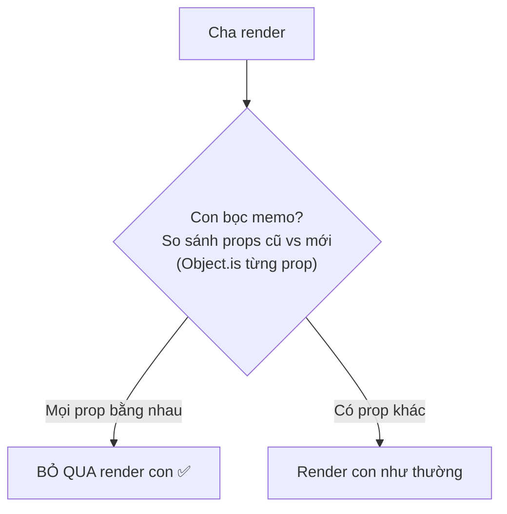

# React.memo

## Mục lục

- [Tổng quan](#tổng-quan)
- [1. memo làm gì](#1-memo-làm-gì)
- [2. Ví dụ: trước và sau memo](#2-ví-dụ-trước-và-sau-memo)
- [3. Cạm bẫy: props là object/hàm inline](#3-cạm-bẫy-props-là-objecthàm-inline)
- [4. So sánh tùy biến với hàm thứ hai](#4-so-sánh-tùy-biến-với-hàm-thứ-hai)
- [5. Khi nào KHÔNG cần memo](#5-khi-nào-không-cần-memo)
- [6. Giải pháp thay thế thường tốt hơn: children](#6-giải-pháp-thay-thế-thường-tốt-hơn-children)
- [Tài liệu tham khảo](#tài-liệu-tham-khảo)

---

## Tổng quan

`React.memo` bọc một component để React **bỏ qua re-render** nếu props của nó **không thay đổi** (so sánh nông). Nó cắt đứt chuỗi "cha render → con render" với điều kiện props giữ nguyên tham chiếu.

> [!IMPORTANT]
> `memo` chỉ chặn re-render đến từ **cha**. Nó **không** chặn re-render do **state nội bộ** hay **context** của chính component đổi. Và nó chỉ hữu ích khi bạn **thật sự giữ được props ổn định** — điều mà object/hàm inline phá vỡ ngay (mục 3).

---

## 1. memo làm gì

Mặc định: cha render → mọi con render (xem [Vì sao re-render](/react-internals/vi-sao-component-rerender/)). `memo` thêm một bước kiểm tra:



So sánh mặc định là **nông (shallow)**: với mỗi prop, React dùng `Object.is(propCũ, propMới)`.

---

## 2. Ví dụ: trước và sau memo

```tsx
import { memo, useState } from 'react';

// Con "nặng" giả lập: in log để thấy nó render
const HeavyList = memo(function HeavyList({ title }: { title: string }) {
  console.log('HeavyList render');
  // tưởng tượng đây là 1000 dòng cần render
  return <div>{title}</div>;
});

export default function App() {
  const [count, setCount] = useState(0);
  return (
    <div>
      <button onClick={() => setCount((c) => c + 1)}>Count: {count}</button>
      {/* title là string cố định → memo so sánh thấy không đổi → KHÔNG render lại */}
      <HeavyList title="Danh sách sản phẩm" />
    </div>
  );
}
```

**Kết quả:** "HeavyList render" chỉ in **1 lần** lúc mount. Bấm nút tăng `count` bao nhiêu lần cũng không in thêm — vì prop `title` không đổi. Bỏ `memo` đi: log in lại mỗi lần bấm.

---

## 3. Cạm bẫy: props là object/hàm inline

Đây là lý do `memo` "không hoạt động" trong 90% trường hợp người mới dùng:

```tsx
const Child = memo(function Child({ config, onClick }: any) {
  console.log('Child render');
  return <button onClick={onClick}>{config.label}</button>;
});

export default function App() {
  const [count, setCount] = useState(0);
  return (
    <div>
      <button onClick={() => setCount((c) => c + 1)}>Count: {count}</button>
      {/* ❌ Mỗi render App tạo object & hàm MỚI → tham chiếu khác → memo vô dụng */}
      <Child config={{ label: 'Bấm tôi' }} onClick={() => console.log('click')} />
    </div>
  );
}
```

`{ label: 'Bấm tôi' }` và `() => ...` là **giá trị mới** ở **mỗi** lần render App. `Object.is(objCũ, objMới)` → `false` → memo nghĩ props đổi → vẫn render. "Child render" vẫn in mỗi lần bấm.

**Sửa:** ổn định tham chiếu bằng `useMemo`/`useCallback`:

```tsx
import { memo, useState, useMemo, useCallback } from 'react';

export default function App() {
  const [count, setCount] = useState(0);

  const config = useMemo(() => ({ label: 'Bấm tôi' }), []); // 1 object, giữ nguyên
  const onClick = useCallback(() => console.log('click'), []); // 1 hàm, giữ nguyên

  return (
    <div>
      <button onClick={() => setCount((c) => c + 1)}>Count: {count}</button>
      <Child config={config} onClick={onClick} /> {/* memo giờ mới có tác dụng */}
    </div>
  );
}
```

> [!WARNING]
> `memo` và `useMemo`/`useCallback` thường phải đi **thành bộ ba**. Bọc `memo` mà quên ổn định props object/hàm = tốn chi phí so sánh mà chẳng chặn được gì. Đọc kỹ [Referential Equality](/toi-uu-rerender/referential-equality/).

---

## 4. So sánh tùy biến với hàm thứ hai

`memo` nhận tham số thứ hai: hàm `(prevProps, nextProps) => boolean`. Trả `true` nghĩa là "coi như bằng nhau, **đừng** render".

```tsx
const Row = memo(
  function Row({ user }: { user: { id: number; name: string } }) {
    return <li>{user.name}</li>;
  },
  // chỉ render lại khi id hoặc name đổi, bỏ qua các field khác của user
  (prev, next) => prev.user.id === next.user.id && prev.user.name === next.user.name
);
```

> [!CAUTION]
> Cẩn thận: hàm so sánh sai (vd quên một field) gây bug "UI không cập nhật". Và so sánh sâu thủ công có thể đắt hơn chính việc render. Chỉ dùng khi đo thấy đáng. Đa số trường hợp nên ổn định props thay vì viết comparator.

---

## 5. Khi nào KHÔNG cần memo

<Accordions type="single">
  <Accordion title="Component vốn đã rẻ">
    Render &lt;1ms thì memo chỉ thêm chi phí so sánh. Bỏ qua.
  </Accordion>
  <Accordion title="Props gần như luôn đổi">
    Nếu component nhận props đổi mỗi render (vd giá trị đang animate), memo luôn 'miss' → vô ích.
  </Accordion>
  <Accordion title="Dự án đã bật React Compiler">
    Compiler tự memo hóa. memo thủ công thường thừa. Xem Tổng quan tối ưu.
  </Accordion>
  <Accordion title="Có thể lift thành children (xem mục 6)">
    Thường gọn và hiệu quả hơn memo mà không cần ổn định props.
  </Accordion>
</Accordions>

---

## 6. Giải pháp thay thế thường tốt hơn: children

Một component nhận qua `children` **không** render lại khi cha đổi state, vì element `children` được tạo ở cấp cha-của-cha và truyền xuống — không bị tạo lại khi component ở giữa render.

```tsx
import { useState } from 'react';

function Wrapper({ children }: { children: React.ReactNode }) {
  const [count, setCount] = useState(0);
  return (
    <div>
      <button onClick={() => setCount((c) => c + 1)}>Count: {count}</button>
      {children} {/* không render lại khi count đổi — element đã được tạo ở ngoài */}
    </div>
  );
}

export default function App() {
  return (
    <Wrapper>
      <ExpensiveTree /> {/* tạo 1 lần ở App, Wrapper chỉ "đặt" vào — không tái tạo */}
    </Wrapper>
  );
}
```

> [!TIP]
> Kỹ thuật "lift content lên, nhận qua children" giải quyết rất nhiều trường hợp mà không cần `memo` lẫn ổn định props. Đây là một dạng **composition** — xem bài [Composition](/patterns/composition/).

---

## Tài liệu tham khảo

- [React Docs — memo](https://react.dev/reference/react/memo)
- [useMemo & useCallback](/toi-uu-rerender/usememo-usecallback/)
- [Referential Equality](/toi-uu-rerender/referential-equality/)
- [Composition](/patterns/composition/)
