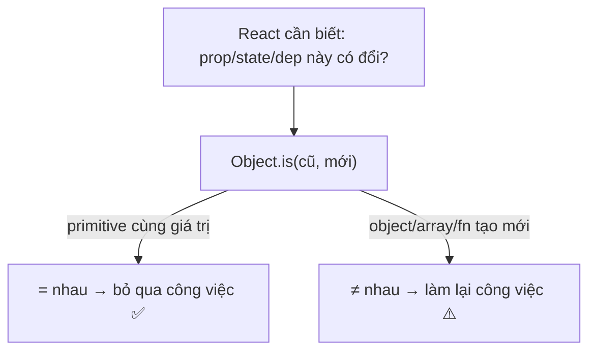
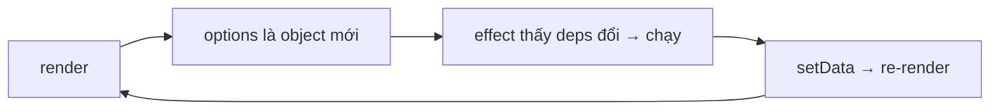

# Referential Equality

## Mục lục

- [Tổng quan](#tổng-quan)
- [1. Giá trị nguyên thủy vs tham chiếu](#1-giá-trị-nguyên-thủy-vs-tham-chiếu)
  - [1.1 Mô hình bộ nhớ: stack vs heap](#11-mô-hình-bộ-nhớ-stack-vs-heap)
- [2. React so sánh bằng Object.is](#2-react-so-sánh-bằng-objectis)
  - [2.1 Object.is khác === ở đâu](#21-objectis-khác--ở-đâu)
- [3. Vì sao object inline phá memo](#3-vì-sao-object-inline-phá-memo)
- [4. Bẫy useEffect chạy vô tận](#4-bẫy-useeffect-chạy-vô-tận)
- [5. Bẫy setState với object "giống hệt"](#5-bẫy-setstate-với-object-giống-hệt)
- [6. Bốn cách giữ tham chiếu ổn định](#6-bốn-cách-giữ-tham-chiếu-ổn-định)
- [7. Bảng tổng kết](#7-bảng-tổng-kết)
- [8. Câu hỏi tự kiểm tra](#8-câu-hỏi-tự-kiểm-tra)
- [Tài liệu tham khảo](#tài-liệu-tham-khảo)

---

## Tổng quan

Đây là khái niệm **nền** giải thích vì sao `memo`, `useMemo`, `useEffect` "không hoạt động như mong đợi". Hiểu nó một lần, bạn gỡ được cả một lớp bug performance.

> [!IMPORTANT]
> Trong JavaScript, object/array/function được so sánh **theo tham chiếu (địa chỉ bộ nhớ)**, không theo nội dung. Hai object "trông giống nhau" vẫn là **hai object khác nhau**. React dùng so sánh tham chiếu (`Object.is`) ở khắp nơi để quyết định "có gì đổi không". Tạo object mới mỗi render = "luôn có gì đó đổi".

---

## 1. Giá trị nguyên thủy vs tham chiếu

```ts
// Nguyên thủy (primitive): so theo GIÁ TRỊ
1 === 1;            // true
'abc' === 'abc';    // true
true === true;      // true

// Tham chiếu (reference): so theo ĐỊA CHỈ
{ a: 1 } === { a: 1 };       // false! hai object khác địa chỉ
[1, 2] === [1, 2];           // false!
(() => {}) === (() => {});   // false!

const x = { a: 1 };
const y = x;
x === y;            // true — cùng một địa chỉ
```

**Phép loại suy:** hai tờ giấy chép cùng một địa chỉ nhà thì nội dung giống nhau, nhưng là **hai tờ giấy khác nhau**. `===` hỏi "có phải cùng **một tờ giấy** không?", không hỏi "nội dung có giống không?".

### 1.1 Mô hình bộ nhớ: stack vs heap

```text
  STACK (biến)            HEAP (object thật)
  ┌──────────┐            ┌────────────────┐
  │ x  ──────┼──────────► │ { a: 1 }  @0x01 │
  │ y  ──────┼──────────► │ (cùng @0x01)    │
  │ z  ──────┼───┐        └────────────────┘
  └──────────┘   │        ┌────────────────┐
                 └──────► │ { a: 1 }  @0x02 │  ← object KHÁC, dù nội dung giống
                          └────────────────┘
```

- Primitive lưu **trực tiếp** giá trị trên stack → so sánh là so giá trị.
- Object lưu trên heap; biến chỉ giữ **địa chỉ** → so sánh là so địa chỉ. `x` và `y` cùng `@0x01` nên bằng nhau; `z` trỏ `@0x02` nên khác dù nội dung `{a:1}` giống hệt.

---

## 2. React so sánh bằng Object.is

`Object.is` gần giống `===` (khác ở vài ca biên như `NaN`, `-0`). React dùng nó cho: so sánh state (bailout), deps của hook, và props trong `memo`.



### 2.1 Object.is khác === ở đâu

```ts
NaN === NaN;            // false  (gây bug khi so sánh)
Object.is(NaN, NaN);    // true   (React coi NaN không đổi → đúng ý hơn)

-0 === 0;               // true
Object.is(-0, 0);       // false  (phân biệt -0 và +0)
```

> [!NOTE]
> React chọn `Object.is` thay vì `===` chính vì hai ca biên này: muốn `NaN` "bằng chính nó" (để bailout state là `NaN`) và muốn phân biệt `-0`/`+0`. Với object/array/hàm, `Object.is` và `===` hành xử **giống nhau** (đều so địa chỉ).

---

## 3. Vì sao object inline phá memo

```tsx
const Child = memo(function Child({ style }: { style: object }) {
  console.log('Child render');
  return <div style={style}>Nội dung</div>;
});

function Parent() {
  const [count, setCount] = useState(0);
  return (
    <>
      <button onClick={() => setCount((c) => c + 1)}>{count}</button>
      {/* ❌ object style tạo MỚI mỗi render → tham chiếu khác → memo thua */}
      <Child style={{ color: 'red' }} />
    </>
  );
}
```

`{ color: 'red' }` viết inline được **tạo lại** mỗi lần `Parent` render. Dù nội dung y hệt, `Object.is(styleCũ, styleMới)` = `false`. `memo` kết luận "props đổi" → render `Child`. Toàn bộ công sức bọc `memo` đổ sông đổ bể.

> [!WARNING]
> Cùng cạm bẫy này áp dụng cho mảng (`items={[1,2,3]}`), hàm (`onClick={() => ...}`), và cả JSX truyền qua prop. Bất cứ thứ gì "viết literal trong JSX" đều tạo tham chiếu mới mỗi render.

---

## 4. Bẫy useEffect chạy vô tận

Object trong deps của `useEffect` còn nguy hiểm hơn — gây vòng lặp:

```tsx
function Bad({ userId }: { userId: number }) {
  const [data, setData] = useState(null);

  const options = { userId, include: ['posts'] }; // object MỚI mỗi render

  useEffect(() => {
    fetch('/api', options).then((r) => setData(r));
  }, [options]); // ❌ options đổi tham chiếu mỗi render → effect chạy mỗi render → setData → render → ...
}
```



**Sửa:** đưa giá trị nguyên thủy vào deps, hoặc `useMemo` cho object:

```tsx
// ✅ Cách 1: chỉ phụ thuộc primitive
useEffect(() => {
  fetch('/api', { userId, include: ['posts'] }).then((r) => setData(r));
}, [userId]);

// ✅ Cách 2: memo hóa object
const options = useMemo(() => ({ userId, include: ['posts'] }), [userId]);
useEffect(() => { /* dùng options */ }, [options]);
```

---

## 5. Bẫy setState với object "giống hệt"

Khi `setState` nhận một object **mới** (dù nội dung giống), React vẫn coi state đã đổi → vẫn re-render (không bailout):

```tsx
const [user, setUser] = useState({ name: 'An' });

// ❌ object mới mỗi lần gọi → luôn re-render dù 'An' không đổi
setUser({ name: 'An' });

// React bailout khi truyền CÙNG tham chiếu:
setUser(user); // cùng object cũ → React bỏ qua re-render
```

> [!TIP]
> Ngược lại, khi cập nhật state object bạn **phải** tạo object mới (immutability) để React nhận ra thay đổi — mutate tại chỗ (`user.name = 'Bình'; setUser(user)`) sẽ **không** trigger re-render vì cùng tham chiếu. Đây là hai mặt của cùng một quy tắc.

---

## 6. Bốn cách giữ tham chiếu ổn định

<Steps>
  <Step>
    ### useMemo cho object/array
    `const cfg = useMemo(() => ({ a, b }), [a, b])` — cùng tham chiếu khi a, b không đổi.
  </Step>
  <Step>
    ### useCallback cho hàm
    `const fn = useCallback(() => ..., [deps])` — giữ nguyên hàm khi deps không đổi.
  </Step>
  <Step>
    ### Đưa hằng số ra ngoài component
    Object/array **không phụ thuộc props/state** nên khai báo ở **module scope** (ngoài component) — tạo đúng 1 lần cho cả app.
    ```tsx
    const DEFAULT_OPTIONS = { include: ['posts'] }; // ngoài component
    function C() { useEffect(() => {/*dùng DEFAULT_OPTIONS*/}, []); }
    ```
  </Step>
  <Step>
    ### useRef cho giá trị "mutable" sống lâu
    Khi cần một object tồn tại suốt vòng đời mà đổi nội dung không gây render: `const ref = useRef({ ... })`.
  </Step>
</Steps>

---

## 7. Bảng tổng kết

| Tình huống | Triệu chứng | Cách sửa |
|------------|-------------|----------|
| Object/hàm inline truyền cho `memo` | memo vô tác dụng | useMemo/useCallback, hoặc hằng ngoài component |
| Object trong deps `useEffect` | effect chạy mỗi render / vòng lặp | dùng primitive trong deps, hoặc useMemo |
| `setState({...})` với nội dung giống | vẫn re-render (không bailout) | chỉ set khi thật sự đổi; cân nhắc so sánh trước |
| Array/object props đổi tham chiếu | con render thừa | ổn định nguồn dữ liệu ở component cha |

> [!TIP]
> Quy tắc gọn: **giá trị nguyên thủy** (số, chuỗi, boolean) thì cứ truyền thẳng — React so sánh tốt. **Object/array/hàm** mới cần để tâm ổn định tham chiếu. Khi thiết kế props, ưu tiên truyền primitive khi có thể.

---

## 8. Câu hỏi tự kiểm tra

<Accordions type="single">
  <Accordion title="1. { a: 1 } === { a: 1 } trả về gì? Vì sao?">
    false. Hai object literal tạo hai địa chỉ heap khác nhau; === so địa chỉ chứ không so nội dung.
  </Accordion>
  <Accordion title="2. Object.is khác === ở những ca nào?">
    Object.is(NaN, NaN) là true (=== là false) và Object.is(-0, 0) là false (=== là true). Với object thì giống nhau.
  </Accordion>
  <Accordion title="3. Vì sao style={{color:'red'}} làm memo vô dụng?">
    Object literal tạo mới mỗi render → tham chiếu khác → memo thấy props đổi → render. Cần useMemo hoặc hằng ngoài component.
  </Accordion>
  <Accordion title="4. Object trong deps useEffect có thể gây gì?">
    Vòng lặp: object mới mỗi render → effect chạy → setState → render → lặp lại. Sửa bằng primitive deps hoặc useMemo.
  </Accordion>
  <Accordion title="5. Vì sao mutate state tại chỗ rồi setState lại không re-render?">
    Vì cùng tham chiếu → Object.is ra true → React bailout. Phải tạo object mới (immutability) để React nhận ra thay đổi.
  </Accordion>
</Accordions>

---

## Tài liệu tham khảo

- [MDN — Object.is](https://developer.mozilla.org/en-US/docs/Web/JavaScript/Reference/Global_Objects/Object/is)
- [React Docs — Removing Effect Dependencies](https://react.dev/learn/removing-effect-dependencies)
- [React.memo](/toi-uu-rerender/react-memo/)
- [useMemo & useCallback](/toi-uu-rerender/usememo-usecallback/)
