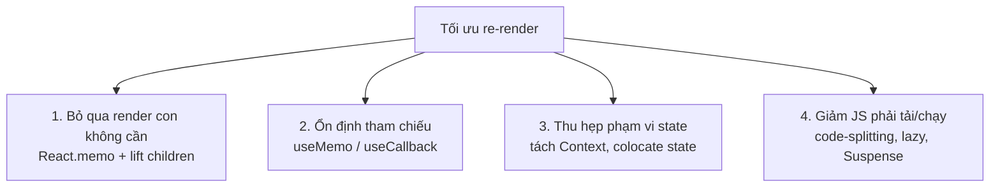
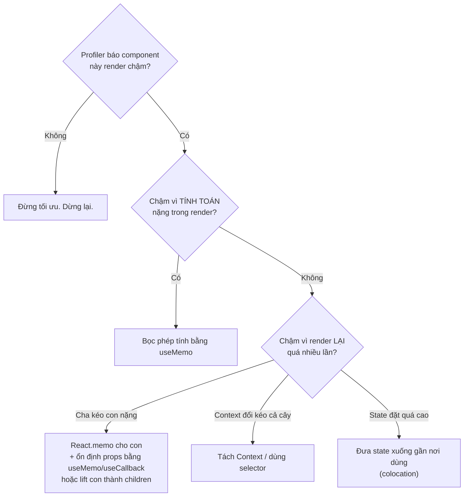

# Tổng quan tối ưu Re-render

## Mục lục

- [Tổng quan](#tổng-quan)
- [1. Nguyên tắc số 1: đo trước, sửa sau](#1-nguyên-tắc-số-1-đo-trước-sửa-sau)
  - [1.1 Đọc flame graph & "Why did this render?"](#11-đọc-flame-graph--why-did-this-render)
  - [1.2 Đo chi phí một phép tính](#12-đo-chi-phí-một-phép-tính)
- [2. Render rẻ vs tính toán đắt](#2-render-rẻ-vs-tính-toán-đắt)
- [3. Bốn nhóm kỹ thuật](#3-bốn-nhóm-kỹ-thuật)
- [4. Thứ tự ưu tiên: rẻ trước, đắt sau](#4-thứ-tự-ưu-tiên-rẻ-trước-đắt-sau)
- [5. Cây quyết định: nên dùng gì](#5-cây-quyết-định-nên-dùng-gì)
- [6. React Compiler thay đổi gì](#6-react-compiler-thay-đổi-gì)
- [7. Những lỗi tối ưu phản tác dụng](#7-những-lỗi-tối-ưu-phản-tác-dụng)
- [8. Câu hỏi tự kiểm tra](#8-câu-hỏi-tự-kiểm-tra)
- [Tài liệu tham khảo](#tài-liệu-tham-khảo)

---

## Tổng quan

Chương này dạy bạn **khi nào** và **bằng cách nào** giảm công việc thừa của React. Nhưng bài học quan trọng nhất lại là: **đa số trường hợp bạn không nên tối ưu gì cả.**

> [!IMPORTANT]
> Re-render không phải là kẻ thù. Render là gọi một hàm JS — thường &lt;1ms. Kẻ thù thật sự là (a) **tính toán nặng** chạy lại mỗi render, và (b) **DOM thay đổi** không cần thiết. Tối ưu mù quáng (bọc `memo`/`useMemo` khắp nơi) làm code khó đọc và đôi khi **chậm hơn** vì bản thân việc so sánh cũng tốn chi phí.

Để hiểu vì sao render thường rẻ, cần nắm [Render Pipeline](/react-internals/render-pipeline/) (render ≠ commit) và [Vì sao component re-render](/react-internals/vi-sao-component-rerender/).

---

## 1. Nguyên tắc số 1: đo trước, sửa sau

Đừng đoán. Dùng công cụ:

<Steps>
  <Step>
    ### React DevTools Profiler
    Tab "Profiler" → bấm record → tương tác → stop. Nó hiện flame graph: component nào render, mất bao lâu, **vì sao** (props/state/hooks đổi).
  </Step>
  <Step>
    ### Bật "Highlight updates"
    Trong DevTools settings, bật highlight — mỗi component render sẽ nháy viền. Thấy cả màn hình nháy khi gõ 1 ô input = có vấn đề.
  </Step>
  <Step>
    ### So sánh trước/sau
    Ghi lại thời gian commit trước và sau khi tối ưu. Nếu không nhanh hơn rõ rệt → hoàn tác, giữ code đơn giản.
  </Step>
</Steps>

> [!TIP]
> Quy tắc thực dụng: nếu một lần commit dưới ~16ms (60fps) và app cảm thấy mượt, **đừng đụng vào**. Tối ưu là nợ kỹ thuật — chỉ vay khi cần.

### 1.1 Đọc flame graph & "Why did this render?"

Trong tab Profiler, mỗi commit là một thanh. Bấm vào một commit để xem flame graph:

| Tín hiệu trong Profiler | Ý nghĩa |
|-------------------------|---------|
| Thanh **màu vàng/cam đậm** | Component đó mất nhiều thời gian render trong commit này |
| Thanh **xám** | Component **không** render trong commit này (đã bailout) |
| Mục **"Why did this render?"** | Lý do: "Props changed", "Hooks changed", "Parent rendered"... |
| Số lần render cao bất thường | Có thể do props đổi tham chiếu mỗi lần (xem Referential Equality) |

> [!NOTE]
> Bật "Why did this render?" trong Profiler settings (Record why each component rendered). Đây là cách nhanh nhất để biết một re-render đến từ state, props, hay parent — đúng 3 nguyên nhân ở bài [Vì sao component re-render](/react-internals/vi-sao-component-rerender/).

### 1.2 Đo chi phí một phép tính

Trước khi bọc `useMemo`, hãy đo phép tính đó có thật sự đắt không:

```tsx
function Dashboard({ rows }: { rows: Row[] }) {
  console.time('sort');
  const sorted = rows.slice().sort((a, b) => b.score - a.score);
  console.timeEnd('sort'); // ví dụ in: sort: 0.03ms  → KHÔNG cần useMemo
  return <Table rows={sorted} />;
}
```

> [!TIP]
> Nếu `console.timeEnd` báo dưới ~1ms, đừng `useMemo` — chi phí lưu + so sánh deps còn lớn hơn lợi ích. Chỉ memo khi phép tính tốn nhiều ms và chạy lại thường xuyên.

---

## 2. Render rẻ vs tính toán đắt

Phân biệt hai thứ hay bị gộp làm một:

| | Render component | Tính toán trong render |
|---|------------------|------------------------|
| Là gì | React gọi lại hàm component | Một biểu thức nặng chạy trong thân hàm |
| Chi phí điển hình | Rất rẻ | Có thể rất đắt |
| Ví dụ | `<Button/>` render lại | `sortBy(hugeArray)`, `parse(bigJson)` |
| Cách giảm | `React.memo`, lift `children` | `useMemo` |

```tsx
function Dashboard({ rows }: { rows: Row[] }) {
  // ❌ Chạy lại sắp xếp 100k phần tử MỖI render, kể cả khi rows không đổi
  const sorted = rows.slice().sort((a, b) => b.score - a.score);

  // ✅ Chỉ tính lại khi rows đổi
  // const sorted = useMemo(() => rows.slice().sort((a,b)=>b.score-a.score), [rows]);

  return <Table rows={sorted} />;
}
```

> [!WARNING]
> Hai vấn đề cần hai công cụ khác nhau: **render lại quá nhiều lần** → `React.memo` / composition; **một lần render quá đắt** → `useMemo`. Dùng nhầm công cụ (vd `memo` cho vấn đề tính toán) sẽ không giúp gì.

---

## 3. Bốn nhóm kỹ thuật



Mỗi nhóm có bài riêng:

<Cards>
  <Card href="/toi-uu-rerender/react-memo/" title="React.memo">Bỏ qua render con khi props không đổi</Card>
  <Card href="/toi-uu-rerender/usememo-usecallback/" title="useMemo & useCallback">Nhớ kết quả tính toán & hàm</Card>
  <Card href="/toi-uu-rerender/referential-equality/" title="Referential Equality">Vì sao object/array "phá" mọi tối ưu</Card>
  <Card href="/toi-uu-rerender/context-optimization/" title="Tối ưu Context">Tránh cả cây render khi context đổi</Card>
  <Card href="/toi-uu-rerender/code-splitting/" title="Code-splitting">lazy + Suspense để giảm bundle</Card>
</Cards>

---

## 4. Thứ tự ưu tiên: rẻ trước, đắt sau

Khi Profiler chỉ ra vấn đề, hãy thử các giải pháp theo thứ tự **rẻ → đắt** về mặt độ phức tạp code:

| Ưu tiên | Kỹ thuật | Vì sao thử trước |
|---------|----------|------------------|
| 1 | **Colocation** — đưa state xuống gần nơi dùng | Không thêm API, chỉ di chuyển code; thu hẹp vùng re-render tự nhiên |
| 2 | **Lift content thành `children`** | Không cần `memo`; tận dụng việc children tạo ở cha cao hơn |
| 3 | **`React.memo`** cho con nặng | Cần đảm bảo props ổn định mới có tác dụng |
| 4 | **`useMemo`/`useCallback`** ổn định props | Thêm dependency array, dễ sai; chỉ khi cần cho memo/effect |
| 5 | **Tách Context / selector** | Khi context kéo cả cây render |

> [!IMPORTANT]
> Hai cách rẻ nhất và nên thử **trước** mọi `memo`: (1) **đưa state xuống thấp** (colocation) để re-render chỉ ảnh hưởng vùng nhỏ; (2) **lift phần nặng thành `children`** truyền qua props để nó không render lại khi cha đổi state. Xem [Composition](/patterns/composition/).

---

## 5. Cây quyết định: nên dùng gì



---

## 6. React Compiler thay đổi gì

Từ React 19, **React Compiler** (trước đây gọi là "React Forget") có thể **tự động** chèn memoization lúc biên dịch — về lý thuyết khiến `useMemo`/`useCallback`/`memo` thủ công phần lớn không còn cần thiết.


> [!NOTE]
> Dù vậy, **hiểu cơ chế** vẫn cực kỳ quan trọng: để đọc code cũ, để debug khi compiler không áp dụng được (vì code vi phạm Rules of React), và để biết vì sao app chậm. Compiler là công cụ, không thay thế hiểu biết. Các bài sau dạy bạn bản chất; nếu dự án đã bật Compiler, hãy coi memoization thủ công là "tùy chọn" thay vì bắt buộc.

> [!WARNING]
> React Compiler chỉ hoạt động đúng khi code **tuân thủ Rules of React** (component/hook thuần, không mutate props/state). Code vi phạm sẽ bị compiler **bỏ qua** (không memo) — và bạn lại cần kiến thức thủ công. Vì vậy đừng coi compiler là lý do để viết ẩu.

---

## 7. Những lỗi tối ưu phản tác dụng

<Accordions type="single">
  <Accordion title="Bọc useMemo cho phép tính tầm thường">
    useMemo(() => a + b, [a, b]) đắt hơn là cứ tính a + b. Bản thân useMemo phải lưu giá trị + so sánh deps. Chỉ memo cái thật sự nặng.
  </Accordion>
  <Accordion title="React.memo nhưng vẫn truyền object/hàm inline">
    <Memoized data={{x:1}} onClick={() => ...} /> — object và hàm tạo mới mỗi render → memo so sánh thấy 'khác' → vô dụng. Phải ổn định props trước (useMemo/useCallback). Xem Referential Equality.
  </Accordion>
  <Accordion title="Tối ưu trước khi đo">
    Thêm memoization khắp nơi 'cho chắc' làm tăng độ phức tạp, dễ sinh bug stale closure, và thường không nhanh hơn. Luôn đo bằng Profiler trước.
  </Accordion>
  <Accordion title="Memo hóa nhưng quên một dependency">
    useMemo/useCallback thiếu deps → giữ giá trị cũ (stale). Bug loại này khó tìm hơn nhiều so với một re-render thừa vô hại. Bật eslint-plugin-react-hooks để bắt.
  </Accordion>
  <Accordion title="Dùng index làm key trong list để 'tối ưu'">
    Index key không tối ưu gì mà còn gây bug state dính sai phần tử và cập nhật DOM thừa khi list đổi thứ tự. Xem Vì sao list cần key.
  </Accordion>
</Accordions>

---

## 8. Câu hỏi tự kiểm tra

<Accordions type="single">
  <Accordion title="1. Vì sao re-render thường không đáng sợ?">
    Vì render chỉ là gọi một hàm JS (thường dưới 1ms) và nếu kết quả không đổi thì commit không đụng DOM. Cái đắt là tính toán nặng và DOM mutation.
  </Accordion>
  <Accordion title="2. Làm sao biết nên useMemo cho một phép tính?">
    Đo bằng console.time / Profiler. Nếu phép tính tốn nhiều ms và chạy lại thường xuyên thì memo; nếu dưới ~1ms thì đừng.
  </Accordion>
  <Accordion title="3. Hai giải pháp rẻ nên thử trước memo là gì?">
    Colocation (đưa state xuống gần nơi dùng) và lift content thành children. Cả hai không cần thêm API memo.
  </Accordion>
  <Accordion title="4. Vì sao React.memo đôi khi vô dụng?">
    Khi props vẫn là object/hàm tạo mới mỗi render → so sánh nông luôn thấy khác → memo không bao giờ bailout. Phải ổn định props trước.
  </Accordion>
  <Accordion title="5. React Compiler có khiến kiến thức memo trở nên vô dụng?">
    Không. Compiler chỉ áp dụng cho code tuân thủ Rules of React, và bạn vẫn cần hiểu cơ chế để debug, đọc code cũ, và biết vì sao app chậm.
  </Accordion>
</Accordions>

---

## Tài liệu tham khảo

- [React Docs — Render and Commit](https://react.dev/learn/render-and-commit)
- [React Docs — React Compiler](https://react.dev/learn/react-compiler)
- [React DevTools — Profiler](https://react.dev/learn/react-developer-tools)
- [Vì sao component re-render](/react-internals/vi-sao-component-rerender/)
- [React.memo](/toi-uu-rerender/react-memo/)
- [Referential Equality](/toi-uu-rerender/referential-equality/)
