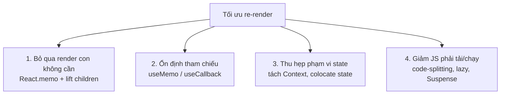
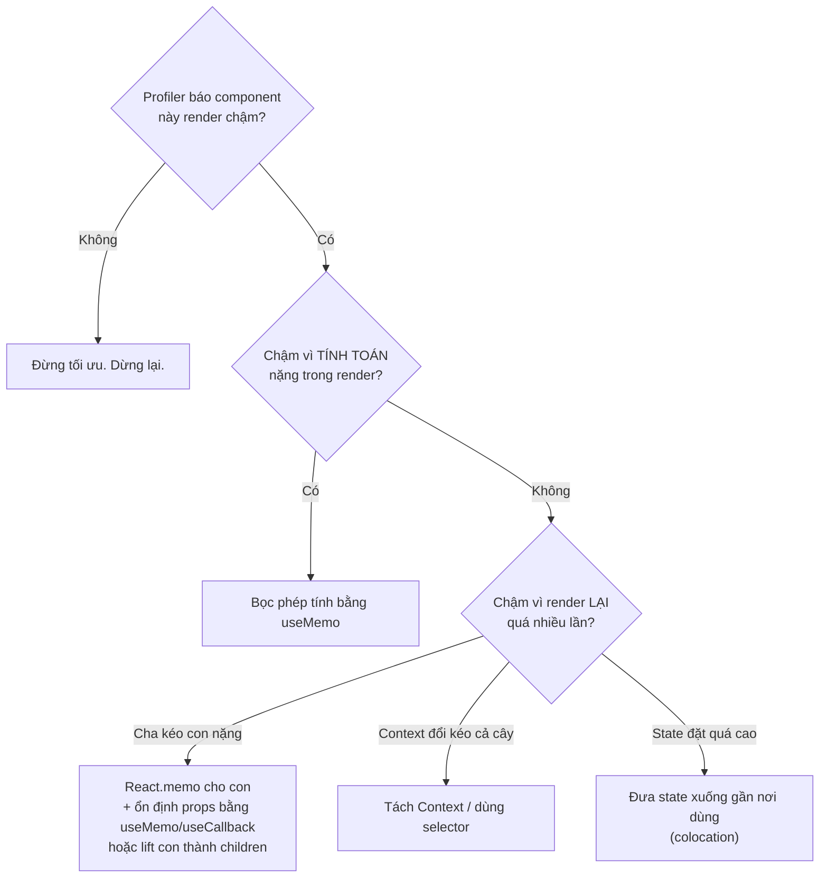

# Tổng quan tối ưu Re-render

## Mục lục

- [Tổng quan](#tổng-quan)
- [1. Nguyên tắc số 1: đo trước, sửa sau](#1-nguyên-tắc-số-1-đo-trước-sửa-sau)
- [2. Render rẻ vs tính toán đắt](#2-render-rẻ-vs-tính-toán-đắt)
- [3. Bốn nhóm kỹ thuật](#3-bốn-nhóm-kỹ-thuật)
- [4. Cây quyết định: nên dùng gì](#4-cây-quyết-định-nên-dùng-gì)
- [5. React Compiler thay đổi gì](#5-react-compiler-thay-đổi-gì)
- [6. Những lỗi tối ưu phản tác dụng](#6-những-lỗi-tối-ưu-phản-tác-dụng)
- [Tài liệu tham khảo](#tài-liệu-tham-khảo)

---

## Tổng quan

Chương này dạy bạn **khi nào** và **bằng cách nào** giảm công việc thừa của React. Nhưng bài học quan trọng nhất lại là: **đa số trường hợp bạn không nên tối ưu gì cả.**

> [!IMPORTANT]
> Re-render không phải là kẻ thù. Render là gọi một hàm JS — thường &lt;1ms. Kẻ thù thật sự là (a) **tính toán nặng** chạy lại mỗi render, và (b) **DOM thay đổi** không cần thiết. Tối ưu mù quáng (bọc `memo`/`useMemo` khắp nơi) làm code khó đọc và đôi khi **chậm hơn** vì bản thân việc so sánh cũng tốn chi phí.

---

## 1. Nguyên tắc số 1: đo trước, sửa sau

Đừng đoán. Dùng công cụ:

<Steps>
  <Step>
    ### React DevTools Profiler
    Tab "Profiler" → bấm record → tương tác → stop. Nó hiện flame graph: component nào render, mất bao lâu, **vì sao** (props/state/hooks đổi).
  </Step>
  <Step>
    ### Bật "Highlight updates"
    Trong DevTools settings, bật highlight — mỗi component render sẽ nháy viền. Thấy cả màn hình nháy khi gõ 1 ô input = có vấn đề.
  </Step>
  <Step>
    ### So sánh trước/sau
    Ghi lại thời gian commit trước và sau khi tối ưu. Nếu không nhanh hơn rõ rệt → hoàn tác, giữ code đơn giản.
  </Step>
</Steps>

> [!TIP]
> Quy tắc thực dụng: nếu một lần commit dưới ~16ms (60fps) và app cảm thấy mượt, **đừng đụng vào**. Tối ưu là nợ kỹ thuật — chỉ vay khi cần.

---

## 2. Render rẻ vs tính toán đắt

Phân biệt hai thứ hay bị gộp làm một:

| | Render component | Tính toán trong render |
|---|------------------|------------------------|
| Là gì | React gọi lại hàm component | Một biểu thức nặng chạy trong thân hàm |
| Chi phí điển hình | Rất rẻ | Có thể rất đắt |
| Ví dụ | `<Button/>` render lại | `sortBy(hugeArray)`, `parse(bigJson)` |
| Cách giảm | `React.memo`, lift `children` | `useMemo` |

```tsx
function Dashboard({ rows }: { rows: Row[] }) {
  // ❌ Chạy lại sắp xếp 100k phần tử MỖI render, kể cả khi rows không đổi
  const sorted = rows.slice().sort((a, b) => b.score - a.score);

  // ✅ Chỉ tính lại khi rows đổi
  // const sorted = useMemo(() => rows.slice().sort((a,b)=>b.score-a.score), [rows]);

  return <Table rows={sorted} />;
}
```

---

## 3. Bốn nhóm kỹ thuật



Mỗi nhóm có bài riêng:

<Cards>
  <Card href="/toi-uu-rerender/react-memo/" title="React.memo">Bỏ qua render con khi props không đổi</Card>
  <Card href="/toi-uu-rerender/usememo-usecallback/" title="useMemo & useCallback">Nhớ kết quả tính toán & hàm</Card>
  <Card href="/toi-uu-rerender/referential-equality/" title="Referential Equality">Vì sao object/array "phá" mọi tối ưu</Card>
  <Card href="/toi-uu-rerender/context-optimization/" title="Tối ưu Context">Tránh cả cây render khi context đổi</Card>
  <Card href="/toi-uu-rerender/code-splitting/" title="Code-splitting">lazy + Suspense để giảm bundle</Card>
</Cards>

---

## 4. Cây quyết định: nên dùng gì



> [!IMPORTANT]
> Hai cách rẻ nhất và nên thử **trước** mọi `memo`: (1) **đưa state xuống thấp** (colocation) để re-render chỉ ảnh hưởng vùng nhỏ; (2) **lift phần nặng thành `children`** truyền qua props để nó không render lại khi cha đổi state. Xem [Composition](/patterns/composition/).

---

## 5. React Compiler thay đổi gì

Từ React 19, **React Compiler** (trước đây gọi là "React Forget") có thể **tự động** chèn memoization lúc biên dịch — về lý thuyết khiến `useMemo`/`useCallback`/`memo` thủ công phần lớn không còn cần thiết.

> [!NOTE]
> Dù vậy, **hiểu cơ chế** vẫn cực kỳ quan trọng: để đọc code cũ, để debug khi compiler không áp dụng được (vì code vi phạm Rules of React), và để biết vì sao app chậm. Compiler là công cụ, không thay thế hiểu biết. Các bài sau dạy bạn bản chất; nếu dự án đã bật Compiler, hãy coi memoization thủ công là "tùy chọn" thay vì bắt buộc.

---

## 6. Những lỗi tối ưu phản tác dụng

<Accordions type="single">
  <Accordion title="Bọc useMemo cho phép tính tầm thường">
    `useMemo(() => a + b, [a, b])` đắt hơn là cứ tính `a + b`. Bản thân useMemo phải lưu giá trị + so sánh deps. Chỉ memo cái thật sự nặng.
  </Accordion>
  <Accordion title="React.memo nhưng vẫn truyền object/hàm inline">
    `<Memoized data={{x:1}} onClick={() => ...} />` — object và hàm tạo mới mỗi render → memo so sánh thấy "khác" → vô dụng. Phải ổn định props trước (useMemo/useCallback). Xem Referential Equality.
  </Accordion>
  <Accordion title="Tối ưu trước khi đo">
    Thêm memoization khắp nơi 'cho chắc' làm tăng độ phức tạp, dễ sinh bug stale closure, và thường không nhanh hơn. Luôn đo bằng Profiler trước.
  </Accordion>
</Accordions>

---

## Tài liệu tham khảo

- [React Docs — render and commit](https://react.dev/learn/render-and-commit)
- [React Compiler](https://react.dev/learn/react-compiler)
- [Vì sao component re-render](/react-internals/vi-sao-component-rerender/)
