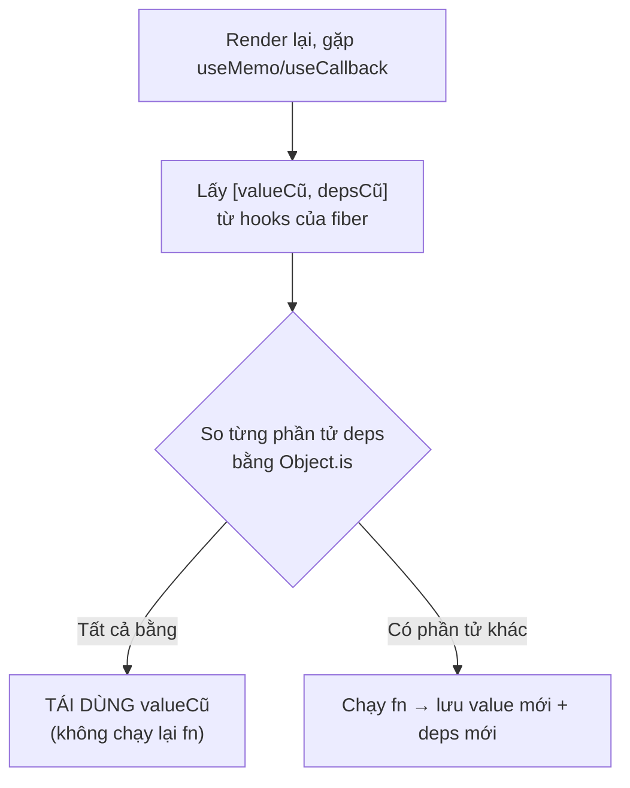
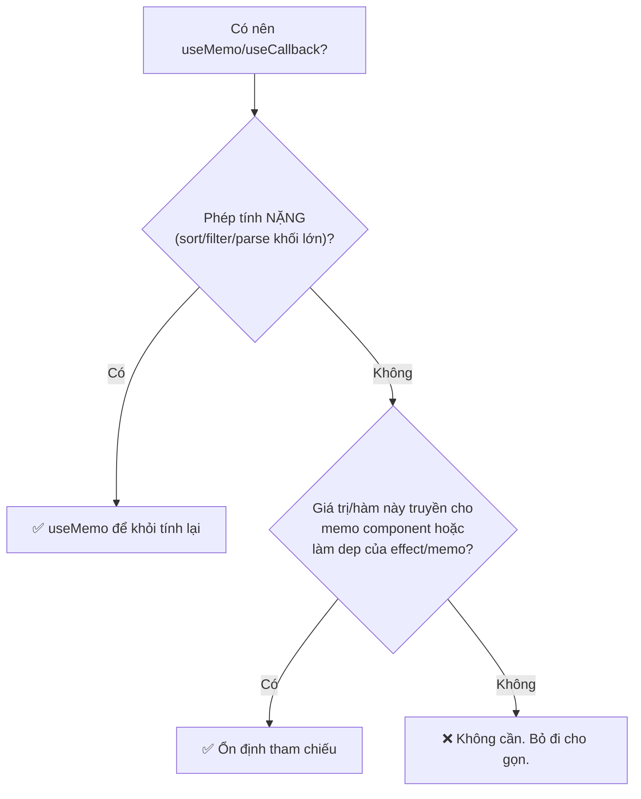

# useMemo & useCallback

## Mục lục

- [Tổng quan](#tổng-quan)
- [1. useMemo — nhớ một giá trị](#1-usememo--nhớ-một-giá-trị)
- [2. useCallback — nhớ một hàm](#2-usecallback--nhớ-một-hàm)
- [3. useCallback chỉ là useMemo trả về hàm](#3-usecallback-chỉ-là-usememo-trả-về-hàm)
- [4. Cơ chế: lưu ở đâu, so deps thế nào](#4-cơ-chế-lưu-ở-đâu-so-deps-thế-nào)
- [5. Dependency array — quy tắc vàng](#5-dependency-array--quy-tắc-vàng)
- [6. Hai lý do chính đáng để dùng](#6-hai-lý-do-chính-đáng-để-dùng)
- [7. Cạm bẫy stale closure](#7-cạm-bẫy-stale-closure)
- [8. useMemo KHÔNG phải bảo đảm](#8-usememo-không-phải-bảo-đảm)
- [9. Khi nào KHÔNG cần](#9-khi-nào-không-cần)
- [10. Câu hỏi tự kiểm tra](#10-câu-hỏi-tự-kiểm-tra)
- [Tài liệu tham khảo](#tài-liệu-tham-khảo)

---

## Tổng quan

`useMemo` và `useCallback` đều là **memoization** (ghi nhớ kết quả): giữ lại giá trị/hàm từ lần render trước và **tái dùng** nếu dependencies không đổi, thay vì tạo lại.

| Hook | Nhớ cái gì | Trả về |
|------|-----------|--------|
| `useMemo(fn, deps)` | **Kết quả** của `fn()` | Giá trị `fn()` trả ra |
| `useCallback(fn, deps)` | **Bản thân hàm** `fn` | Chính hàm `fn` |

<Callout type="info" title="Important">

Hai hook này **không làm app nhanh hơn một cách thần kỳ**. Chúng đánh đổi: tốn thêm bộ nhớ + chi phí so sánh deps để **tránh** tạo lại giá trị/hàm. Chỉ đáng khi (1) phép tính thật sự đắt, hoặc (2) bạn cần **ổn định tham chiếu** cho `memo`/`useEffect`. Ngoài hai lý do đó, chúng chỉ làm code rối hơn.

</Callout>

---

## 1. useMemo — nhớ một giá trị

```tsx
import { useMemo, useState } from 'react';

function ProductList({ products, query }: { products: Product[]; query: string }) {
  // Lọc + sắp xếp đắt: chỉ chạy lại khi products HOẶC query đổi
  const visible = useMemo(() => {
    console.log('Đang tính lại danh sách...');
    return products
      .filter((p) => p.name.includes(query))
      .sort((a, b) => b.rating - a.rating);
  }, [products, query]); // ← dependencies

  return <ul>{visible.map((p) => <li key={p.id}>{p.name}</li>)}</ul>;
}
```

Nếu component re-render vì **lý do khác** (vd state không liên quan đổi) mà `products` và `query` vẫn nguyên → `useMemo` trả lại kết quả cũ, **không** in "Đang tính lại".

<Callout type="info" title="Note">

`useMemo` chạy hàm **trong** pha render (đồng bộ). Đừng đặt side effect (fetch, set state) trong đó — chỉ tính toán thuần.

</Callout>

---

## 2. useCallback — nhớ một hàm

Mỗi lần render, một arrow function `() => {...}` viết trong component là một **object hàm mới** (tham chiếu mới). `useCallback` giữ nguyên tham chiếu nếu deps không đổi.

```tsx
import { useCallback, useState } from 'react';

function SearchBar({ onSearch }: { onSearch: (q: string) => void }) {
  return <input onChange={(e) => onSearch(e.target.value)} />;
}

export default function App() {
  const [count, setCount] = useState(0);

  // Không có useCallback: handleSearch là hàm MỚI mỗi render App
  const handleSearch = useCallback((q: string) => {
    fetch(`/api/search?q=${q}`);
  }, []); // deps rỗng → cùng 1 hàm suốt vòng đời

  return (
    <div>
      <button onClick={() => setCount((c) => c + 1)}>{count}</button>
      <SearchBar onSearch={handleSearch} />
    </div>
  );
}
```

<Callout type="info" title="Tip">

`useCallback` chỉ **có ý nghĩa** khi hàm đó được truyền cho một component bọc `memo`, hoặc làm dependency của một hook khác (`useEffect`, `useMemo`). Truyền hàm xuống một component **không** memo thì useCallback chẳng giúp gì — con vẫn render theo cha.

</Callout>

---

## 3. useCallback chỉ là useMemo trả về hàm

Hai dòng sau **tương đương hệt nhau**:

```tsx
const fn = useCallback(() => doSomething(a), [a]);
const fn = useMemo(() => () => doSomething(a), [a]); // useMemo trả về 1 hàm
```

`useCallback(fn, deps)` chính là cú pháp tắt cho `useMemo(() => fn, deps)`. Hiểu điều này giúp bạn không bao giờ lẫn lộn hai hook.

---

## 4. Cơ chế: lưu ở đâu, so deps thế nào

Cả hai hook lưu `[giá_trị, deps]` vào **danh sách hooks** của fiber (`memoizedState` — xem [Fiber](/react-internals/fiber-reconciliation/)). Ở mỗi lần render:



<Callout type="info" title="Note">

So sánh deps là **nông** và dùng `Object.is` từng phần tử — giống cơ chế của `memo` và của effect deps. Vì vậy một dep là object/array tạo mới mỗi render sẽ luôn "khác" → memo hóa vô hiệu (xem [Referential Equality](/toi-uu-rerender/referential-equality/)).

</Callout>

| Cấu trúc | So sánh | Dùng ở |
|----------|---------|--------|
| `deps` của useMemo/useCallback | `Object.is` từng phần tử | render |
| `deps` của useEffect | `Object.is` từng phần tử | sau commit |
| props của `memo` | `Object.is` từng prop | reconcile |

Tất cả đều cùng một ý tưởng "so sánh nông bằng `Object.is`" — nắm một chỗ là hiểu cả ba.

---

## 5. Dependency array — quy tắc vàng

<Callout type="info" title="Important">

**Mọi** giá trị reactive (props, state, biến tính từ chúng, hàm khác) mà bạn **dùng bên trong** `fn` **phải** có mặt trong mảng deps. Thiếu deps = dùng giá trị cũ (stale). Đây là lỗi #1 với hai hook này.

</Callout>

```tsx
const [multiplier, setMultiplier] = useState(2);

// ❌ Thiếu multiplier trong deps → luôn nhân với 2 ban đầu, dù multiplier đã đổi
const calc = useMemo(() => (x: number) => x * multiplier, []);

// ✅ Đủ deps
const calc = useMemo(() => (x: number) => x * multiplier, [multiplier]);
```

<Callout type="warn">
Đừng "chữa cháy" cảnh báo lint bằng cách xóa deps khỏi mảng — đó là che giấu bug, không phải sửa bug. Hãy bật rule <code>react-hooks/exhaustive-deps</code> của ESLint và tin nó.
</Callout>

**Cách giảm deps một cách đúng đắn:** dùng updater function để bỏ state khỏi deps.

```tsx
// ❌ phụ thuộc count → mỗi lần count đổi, hàm tạo lại
const inc = useCallback(() => setCount(count + 1), [count]);

// ✅ updater → không cần count trong deps → hàm ổn định suốt đời
const inc = useCallback(() => setCount((c) => c + 1), []);
```

---

## 6. Hai lý do chính đáng để dùng



---

## 7. Cạm bẫy stale closure

`useCallback` "đóng băng" closure với các biến tại thời điểm tạo. Nếu deps thiếu, hàm sẽ nhìn thấy **giá trị cũ**:

```tsx
function Chat() {
  const [text, setText] = useState('');

  // ❌ deps rỗng → send LUÔN gửi text = '' (giá trị lúc tạo hàm)
  const send = useCallback(() => {
    sendMessage(text);
  }, []);

  // ✅ thêm text vào deps → hàm cập nhật theo text mới nhất
  const sendFixed = useCallback(() => {
    sendMessage(text);
  }, [text]);

  return <input value={text} onChange={(e) => setText(e.target.value)} />;
}
```

<Callout type="info" title="Note">

Nếu bạn cần một hàm ổn định **mà vẫn** đọc state mới nhất, hãy cân nhắc `useRef` lưu giá trị, hoặc dùng updater function. React cũng đang chuẩn hoá hook `useEffectEvent` cho nhu cầu này. Xem thêm phần stale closure ở [Vì sao component re-render](/react-internals/vi-sao-component-rerender/).

</Callout>

---

## 8. useMemo KHÔNG phải bảo đảm

<Callout type="warn" title="Warning">

Theo tài liệu React, `useMemo` là **gợi ý hiệu năng**, không phải bảo đảm ngữ nghĩa. React **có quyền** vứt bỏ giá trị đã nhớ (vd để giải phóng bộ nhớ) và tính lại ở render sau. Vì vậy **đừng** dựa vào `useMemo` để giữ một giá trị "chỉ tạo đúng một lần" cho tính đúng đắn của logic.

</Callout>

```tsx
// ❌ SAI: dựa vào useMemo để tạo đối tượng "duy nhất" cho logic
const id = useMemo(() => createId(), []); // React có thể tính lại → id đổi!

// ✅ ĐÚNG: cần ổn định tuyệt đối thì dùng useRef hoặc useState khởi tạo lười
const idRef = useRef<string>();
if (!idRef.current) idRef.current = createId();
```

---

## 9. Khi nào KHÔNG cần

- Phép tính tầm thường: `useMemo(() => a + b, [a, b])` đắt hơn `a + b`.
- Hàm truyền cho component **không** memo: useCallback vô ích.
- Dự án đã bật **React Compiler**: phần lớn memoization thủ công trở nên thừa.

<Callout type="info" title="Tip">

Mặc định: **viết code không có** useMemo/useCallback. Khi Profiler chỉ ra điểm nóng, mới thêm vào đúng chỗ. "Premature memoization" cũng tệ như premature optimization.

</Callout>

---

## 10. Câu hỏi tự kiểm tra

<Accordions type="single">
  <Accordion title="1. useMemo và useCallback nhớ cái gì khác nhau?">
    useMemo nhớ KẾT QUẢ của fn(); useCallback nhớ BẢN THÂN hàm fn. useCallback(fn, deps) = useMemo(() => fn, deps).
  </Accordion>
  <Accordion title="2. Deps được so sánh bằng gì?">
    Object.is từng phần tử (so sánh nông), giống deps của useEffect và props của memo.
  </Accordion>
  <Accordion title="3. Vì sao truyền hàm useCallback xuống component không memo là vô ích?">
    Vì con không memo vẫn re-render theo cha bất kể props ổn định hay không. useCallback chỉ phát huy khi kết hợp memo hoặc làm dep.
  </Accordion>
  <Accordion title="4. useMemo có bảo đảm giữ giá trị mãi mãi không?">
    Không. React có thể vứt bỏ và tính lại. Cần ổn định tuyệt đối thì dùng useRef/useState khởi tạo lười.
  </Accordion>
  <Accordion title="5. Cách đúng để bỏ một state khỏi deps của useCallback?">
    Dùng updater function setCount(c => c + 1) thay vì setCount(count + 1) — khi đó không cần count trong deps.
  </Accordion>
</Accordions>

---

## Tài liệu tham khảo

- [React Docs — useMemo](https://react.dev/reference/react/useMemo)
- [React Docs — useCallback](https://react.dev/reference/react/useCallback)
- [Fiber & Reconciliation](/react-internals/fiber-reconciliation/)
- [React.memo](/toi-uu-rerender/react-memo/)
- [Referential Equality](/toi-uu-rerender/referential-equality/)
