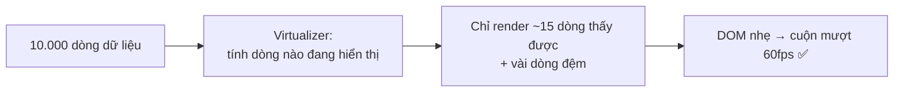
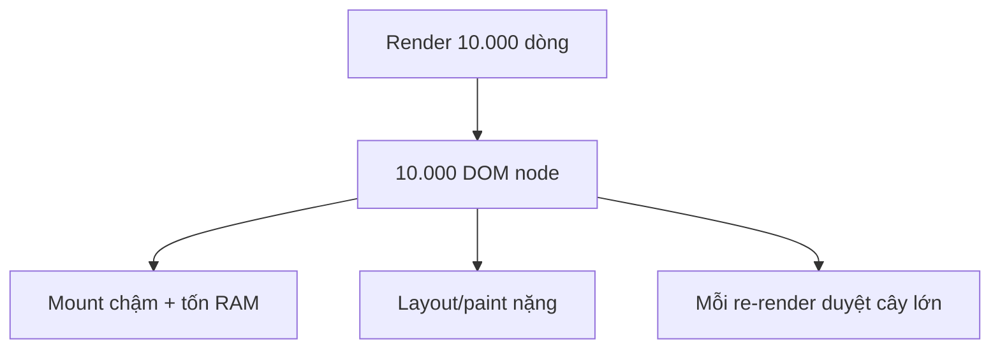
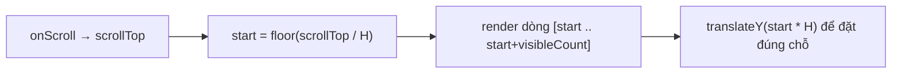
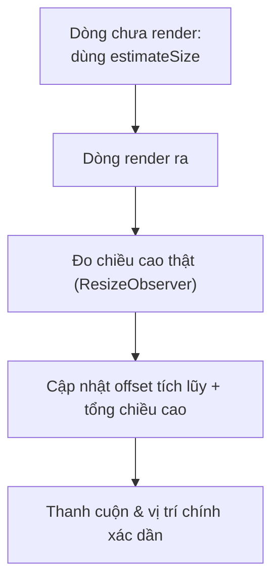
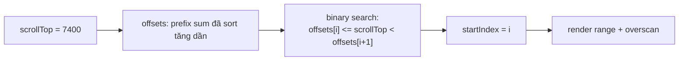
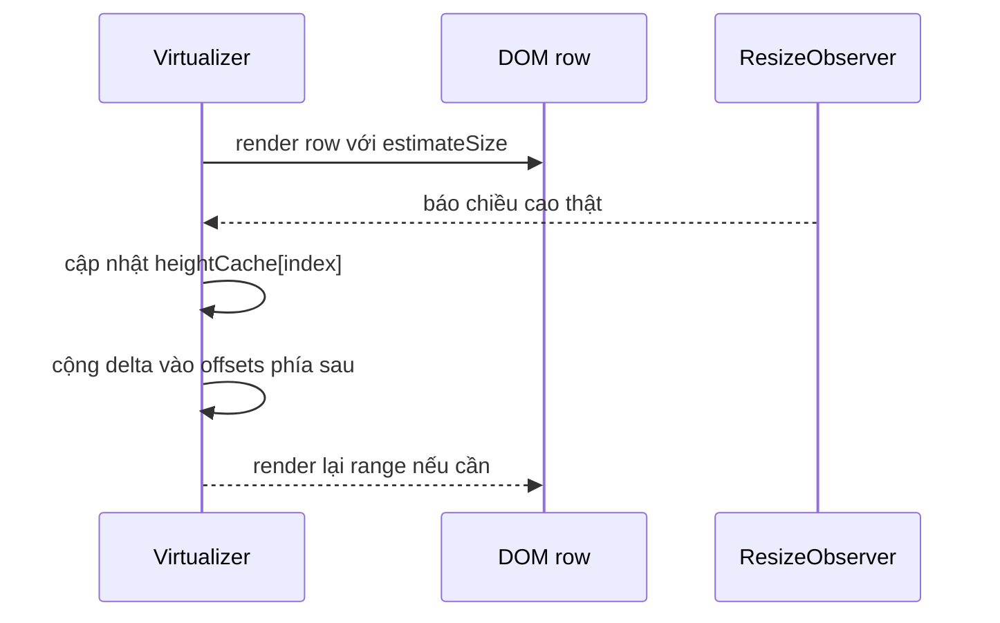
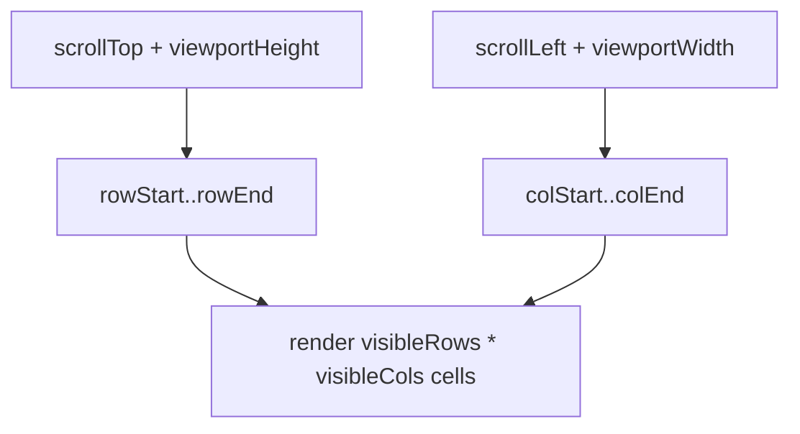

# Virtualization (Windowing)

## Mục lục

- [Tổng quan](#tổng-quan)
- [1. Vấn đề: DOM lớn giết performance](#1-vấn-đề-dom-lớn-giết-performance)
- [2. Ý tưởng: chỉ render "cửa sổ" đang thấy](#2-ý-tưởng-chỉ-render-cửa-sổ-đang-thấy)
- [3. Cơ chế bên trong từng bước](#3-cơ-chế-bên-trong-từng-bước)
  - [3.1 Tính visible range từ scroll offset](#31-tính-visible-range-từ-scroll-offset)
  - [3.2 Overscan — đệm chống chớp](#32-overscan--đệm-chống-chớp)
- [4. Chiều cao cố định vs động](#4-chiều-cao-cố-định-vs-động)
- [5. Chiều cao động — prefix sum và binary search](#5-chiều-cao-động--prefix-sum-và-binary-search)
- [6. Vòng đo lường với ResizeObserver](#6-vòng-đo-lường-với-resizeobserver)
- [7. Scroll anchoring và scroll jump](#7-scroll-anchoring-và-scroll-jump)
- [8. Infinite / bi-directional scroll](#8-infinite--bi-directional-scroll)
- [9. Throttle scroll bằng requestAnimationFrame](#9-throttle-scroll-bằng-requestanimationframe)
- [10. translateY vs top — compositor](#10-translatey-vs-top--compositor)
- [11. Grid / 2D virtualization](#11-grid--2d-virtualization)
- [12. Sticky header trong danh sách ảo](#12-sticky-header-trong-danh-sách-ảo)
- [13. contain CSS & DOM recycling](#13-contain-css--dom-recycling)
- [14. Ví dụ chạy được: @tanstack/react-virtual](#14-ví-dụ-chạy-được-tanstackreact-virtual)
- [15. react-window — thư viện gọn nhẹ](#15-react-window--thư-viện-gọn-nhẹ)
- [16. Bẫy cần biết: a11y, Ctrl+F, SEO](#16-bẫy-cần-biết-a11y-ctrl-f-seo)
- [17. Khi nào KHÔNG cần virtualization](#17-khi-nào-không-cần-virtualization)
- [18. Giải pháp thay thế: CSS content-visibility](#18-giải-pháp-thay-thế-css-content-visibility)
- [19. Hiểu lầm thường gặp (FAQ)](#19-hiểu-lầm-thường-gặp-faq)
- [20. Câu hỏi tự kiểm tra](#20-câu-hỏi-tự-kiểm-tra)
- [Tài liệu tham khảo](#tài-liệu-tham-khảo)

---

## Tổng quan

**Virtualization** (hay **windowing**) là kỹ thuật **chỉ render các phần tử đang nằm trong vùng nhìn thấy** (viewport), thay vì render toàn bộ danh sách/bảng có thể lên tới hàng nghìn/triệu dòng.



> [!IMPORTANT]
> Nguyên tắc gốc: **mắt người chỉ thấy vài chục dòng cùng lúc** — vậy tại sao phải tạo 10.000 node DOM? Virtualization giữ số node DOM gần như **không đổi** (chỉ những dòng thấy được), bất kể dữ liệu có 1.000 hay 1.000.000 dòng. Đây là tối ưu về **kích thước DOM**, khác hẳn với memo hóa (tối ưu số lần render) ở các bài trước.

Bài này bổ sung cho [Tổng quan tối ưu re-render](/toi-uu-rerender/tong-quan-toi-uu/): `memo`/`useMemo` giảm **render thừa**, còn virtualization giảm **DOM thừa** — hai vấn đề khác nhau.

---

## 1. Vấn đề: DOM lớn giết performance

Render thẳng 10.000 dòng tạo ra 10.000+ node DOM. Chi phí không chỉ ở lần đầu:

| Chi phí | Vì sao đắt |
|---------|-----------|
| **Mount ban đầu** | React tạo 10.000 fiber + 10.000 DOM node → chậm, giật khi mở trang |
| **Layout & paint** | Trình duyệt phải tính vị trí + vẽ toàn bộ, kể cả phần ngoài màn hình |
| **Bộ nhớ** | Mỗi node tốn RAM; hàng chục nghìn node → app phình to |
| **Mỗi lần update** | Reconciliation phải duyệt cây khổng lồ; dù có `memo`, chi phí duyệt vẫn lớn |



> [!WARNING]
> `React.memo` **không cứu** được vấn đề này. Memo giảm số **lần** render, nhưng nếu bạn vẫn tạo 10.000 node ở DOM thì mount, layout, paint và bộ nhớ vẫn nặng. Vấn đề là **số lượng node**, không phải **số lần render** — phải dùng virtualization.

---

## 2. Ý tưởng: chỉ render "cửa sổ" đang thấy

Virtualization dựng một **container cuộn** có chiều cao đúng bằng "nếu render hết" (để thanh cuộn đúng tỉ lệ), nhưng bên trong **chỉ đặt vài dòng đang thấy**, định vị tuyệt đối vào đúng chỗ.

```text
┌─ container cuộn (height = tổng ảo, vd 500.000px)─┐
│  ··· phần trống phía trên (spacer) ···           │  ← chưa render
│  ┌────────────────────────────────────────────┐  │
│  │ dòng 148  (top: 7400px)  ← đang thấy       │  │
│  │ dòng 149  (top: 7450px)  ← đang thấy       │  │  ← CHỈ những dòng
│  │ dòng 150  (top: 7500px)  ← đang thấy       │  │     này có DOM
│  │ ...                                        │  │
│  └────────────────────────────────────────────┘  │
│  ··· phần trống phía dưới (spacer) ···           │  ← chưa render
└──────────────────────────────────────────────────┘
```

Khi user cuộn, virtualizer tính lại "dòng nào đang thấy" và thay đổi tập dòng được render — số node DOM luôn nhỏ và gần như cố định.

---

## 3. Cơ chế bên trong từng bước

### 3.1 Tính visible range từ scroll offset

Với danh sách **chiều cao cố định** (mỗi dòng cao `H` px), công thức rất đơn giản:

```ts
// Dữ liệu đầu vào
const itemHeight = 50;          // H: chiều cao mỗi dòng
const viewportHeight = 600;     // chiều cao khung nhìn
const scrollTop = 7400;         // vị trí cuộn hiện tại (từ sự kiện onScroll)

// Chỉ số dòng đầu và cuối đang hiển thị
const startIndex = Math.floor(scrollTop / itemHeight);              // 148
const visibleCount = Math.ceil(viewportHeight / itemHeight);        // 12
const endIndex = startIndex + visibleCount;                          // 160

// Tổng chiều cao ảo (để thanh cuộn đúng)
const totalHeight = itemCount * itemHeight;                          // 10000 * 50

// Đẩy khối dòng xuống đúng vị trí
const offsetY = startIndex * itemHeight;                             // 7400
```



> [!NOTE]
> `totalHeight` giữ cho thanh cuộn có kích thước "thật" (như thể render hết), còn `offsetY` (thường qua `transform: translateY`) đẩy nhóm dòng đang render xuống đúng vị trí. Người dùng cảm giác đang cuộn một danh sách khổng lồ, dù DOM chỉ có ~15 dòng.

### 3.2 Overscan — đệm chống chớp

Nếu chỉ render **đúng** những dòng thấy được, khi cuộn nhanh sẽ thấy **khoảng trắng chớp** ở mép trước khi dòng mới kịp render. Giải pháp: render thêm vài dòng **ngoài** viewport ở trên và dưới — gọi là **overscan**.

```ts
const overscan = 5;
const start = Math.max(0, startIndex - overscan);
const end = Math.min(itemCount, endIndex + overscan);
```

> [!TIP]
> Overscan quá nhỏ → chớp trắng khi cuộn nhanh. Overscan quá lớn → mất lợi ích (render thừa). Giá trị 3–10 thường hợp lý; tăng nhẹ nếu dòng nhẹ và cuộn nhanh.

---

## 4. Chiều cao cố định vs động

| Loại | Cách tính vị trí | Độ khó |
|------|------------------|--------|
| **Fixed height** (mọi dòng cao bằng nhau) | Công thức trực tiếp `index * H` | Dễ, nhanh nhất |
| **Variable/dynamic height** (cao khác nhau, vd nội dung chat) | Phải **đo** từng dòng sau khi render, lưu offset tích lũy, ước lượng dòng chưa đo | Khó hơn nhiều |

Với chiều cao động, virtualizer thường: (1) dùng một **ước lượng** ban đầu (`estimateSize`), (2) **đo thật** khi dòng render (qua `ResizeObserver`/ref), (3) **hiệu chỉnh** tổng chiều cao và vị trí dần.



> [!WARNING]
> Chiều cao động dễ gây **giật thanh cuộn (scroll jump)** nếu ước lượng lệch nhiều so với thực tế. Cho `estimateSize` càng sát càng tốt, và ưu tiên thư viện đã xử lý đo động chuẩn (`@tanstack/react-virtual`, `react-virtuoso`).

---

## 5. Chiều cao động — prefix sum và binary search

Với chiều cao cố định, `startIndex = floor(scrollTop / itemHeight)` là đủ. Nhưng với dòng cao khác nhau, vị trí của dòng `i` không còn là `i * H` nữa. Virtualizer phải lưu một mảng **offset tích lũy** (prefix sum):

```ts
const heights = [30, 50, 20, 80];
const offsets = [0, 30, 80, 100, 180];
// offsets[i] = tổng chiều cao dòng 0..i-1
// dòng 2 bắt đầu ở y = offsets[2] = 80
// tổng chiều cao = offsets[heights.length] = 180
```

Bài toán khi cuộn tới `scrollTop`: tìm dòng đầu tiên sao cho vùng của dòng đó giao với viewport. Nói cách khác, tìm index lớn nhất có `offsets[index] <= scrollTop`, rồi clamp trong `[0, itemCount - 1]`. Duyệt tuyến tính từ đầu là `O(n)` mỗi lần scroll; binary search trên `offsets` chỉ `O(log n)`.



```ts
export function findStartIndex(scrollTop: number, offsets: number[]): number {
  // offsets có độ dài itemCount + 1, offsets[0] = 0.
  // Trả về index dòng chứa scrollTop.
  const itemCount = offsets.length - 1;

  if (itemCount <= 0) return 0;
  if (scrollTop <= 0) return 0;
  if (scrollTop >= offsets[itemCount]) return itemCount - 1;

  let low = 0;
  let high = itemCount;

  // Tìm upper_bound: vị trí đầu tiên có offsets[pos] > scrollTop.
  while (low < high) {
    const mid = Math.floor((low + high) / 2);

    if (offsets[mid] <= scrollTop) {
      low = mid + 1;
    } else {
      high = mid;
    }
  }

  return Math.max(0, low - 1);
}
```

> [!IMPORTANT]
> `offsets` tăng dần nên binary search hợp lệ. Đây là lý do virtualizer dynamic height thường quản lý dữ liệu kiểu prefix sum/measurement cache, thay vì chỉ lưu `height` rời rạc rồi cộng lại từ đầu mỗi lần scroll.

---

## 6. Vòng đo lường với ResizeObserver

Vòng đời của dynamic height thường lặp như sau: render bằng kích thước ước lượng → DOM thật xuất hiện → đo chiều cao thật → ghi vào cache → cập nhật prefix sum cho các dòng phía sau.



```ts
type SizeCache = {
  heights: number[];
  offsets: number[];
};

function applyMeasuredHeight(cache: SizeCache, index: number, measuredHeight: number) {
  const previous = cache.heights[index];
  const delta = measuredHeight - previous;

  if (delta === 0) return 0;

  cache.heights[index] = measuredHeight;

  for (let i = index + 1; i < cache.offsets.length; i += 1) {
    cache.offsets[i] += delta;
  }

  return delta;
}
```

<Callout type="warn">
Tránh <strong>layout thrashing</strong>: đừng xen kẽ “đọc layout” (<code>getBoundingClientRect</code>, <code>offsetHeight</code>) và “ghi layout” (<code>style</code>, state update) trong cùng vòng lặp. Hãy để <code>ResizeObserver</code> gom thông tin đo, rồi batch cập nhật trong <code>requestAnimationFrame</code>.
</Callout>

```ts
const cache: SizeCache = {
  heights: Array.from({ length: 10_000 }, () => 50),
  offsets: Array.from({ length: 10_001 }, (_, index) => index * 50),
};

function renderVirtualRange() {
  // Trong app thật: setState hoặc gọi API của virtualizer để tính lại range.
}

const pendingMeasurements = new Map<number, number>();
let rafId = 0;

const observer = new ResizeObserver((entries) => {
  for (const entry of entries) {
    const index = Number((entry.target as HTMLElement).dataset.index);
    pendingMeasurements.set(index, entry.contentRect.height);
  }

  if (rafId === 0) {
    rafId = requestAnimationFrame(() => {
      rafId = 0;

      for (const [index, height] of pendingMeasurements) {
        applyMeasuredHeight(cache, index, height);
      }

      pendingMeasurements.clear();
      renderVirtualRange();
    });
  }
});
```

---

## 7. Scroll anchoring và scroll jump

**Scroll jump** xảy ra khi chiều cao của dòng **phía trên viewport** thay đổi. Ví dụ: dòng 20 ban đầu ước lượng 50px, đo thật là 90px trong khi user đang xem dòng 200. Tổng offset trước dòng 200 tăng 40px, nên nội dung đang nhìn có vẻ bị đẩy xuống.

Có hai lớp xử lý:

| Cách | Cơ chế | Khi nào đủ |
|------|--------|------------|
| CSS `overflow-anchor` | Trình duyệt tự chọn anchor node để giữ vị trí nhìn khi layout đổi | Nội dung DOM bình thường, không bị virtualizer tháo/lắp quá nhiều |
| Bù `scrollTop` thủ công | Nếu một dòng phía trên viewport đổi `delta`, cộng `delta` vào `scrollElement.scrollTop` | Dynamic height, prepend chat, virtualizer tự quản offset |

```css
.virtual-list {
  overflow-anchor: auto;
}

.virtual-row {
  overflow-anchor: none;
}
```

```ts
function compensateScrollForMeasurement(params: {
  scrollElement: HTMLElement;
  changedIndex: number;
  firstVisibleIndex: number;
  delta: number;
}) {
  const { scrollElement, changedIndex, firstVisibleIndex, delta } = params;

  // Chỉ bù khi thay đổi nằm phía trên vùng đang xem.
  if (changedIndex < firstVisibleIndex && delta !== 0) {
    scrollElement.scrollTop += delta;
  }
}
```

> [!NOTE]
> Nếu dòng phía dưới viewport đổi chiều cao, không cần bù: vị trí nhìn hiện tại không đổi. Nếu dòng đang nằm trong viewport đổi chiều cao, quyết định bù hay không phụ thuộc UX — nhiều app để trình duyệt/virtualizer xử lý tự nhiên.

---

## 8. Infinite / bi-directional scroll

Chat thường cuộn “ngược”: user đang ở giữa cuộc trò chuyện, kéo lên đầu danh sách hiện tại để tải tin nhắn cũ hơn và **prepend** vào mảng. Nếu chỉ thêm item vào đầu, toàn bộ index cũ bị đẩy xuống, `scrollTop` không đổi nhưng nội dung đang đọc sẽ nhảy.

Pattern đúng là đo tổng chiều cao trước và sau khi prepend, rồi bù `scrollTop` bằng phần tăng thêm:

```ts
async function prependOlderMessages<T>(params: {
  scrollElement: HTMLElement;
  fetchOlderMessages: () => Promise<T[]>;
  prepend: (olderMessages: T[]) => void;
}) {
  const { scrollElement, fetchOlderMessages, prepend } = params;
  const previousHeight = scrollElement.scrollHeight;
  const previousTop = scrollElement.scrollTop;

  const olderMessages = await fetchOlderMessages();
  prepend(olderMessages);

  requestAnimationFrame(() => {
    const nextHeight = scrollElement.scrollHeight;
    const delta = nextHeight - previousHeight;
    scrollElement.scrollTop = previousTop + delta;
  });
}
```

Với **bi-directional scroll**, danh sách có thể load thêm cả hai phía:

- Gần đầu danh sách → load page cũ hơn, prepend, bù `scrollTop`.
- Gần cuối danh sách → load page mới hơn, append, thường không cần bù nếu user không bị neo ở cuối.
- Nếu user đang ở đáy chat, append tin mới có thể auto-scroll xuống đáy; nếu user đã kéo lên đọc lịch sử, không tự kéo xuống.

---

## 9. Throttle scroll bằng requestAnimationFrame

Sự kiện `scroll` có thể bắn rất dày. Virtualizer thường không tính range ngay trong mọi event, mà chỉ lấy `scrollTop` mới nhất và tính lại **một lần mỗi frame** bằng `requestAnimationFrame`. Listener nên là `passive` để báo với trình duyệt rằng handler không gọi `preventDefault()`, giúp cuộn không bị chặn.

```ts
function listenVirtualScroll(
  scrollElement: HTMLElement,
  onFrame: (scrollTop: number) => void,
) {
  let latestScrollTop = scrollElement.scrollTop;
  let scheduled = false;

  function handleScroll() {
    latestScrollTop = scrollElement.scrollTop;

    if (scheduled) return;
    scheduled = true;

    requestAnimationFrame(() => {
      scheduled = false;
      onFrame(latestScrollTop);
    });
  }

  scrollElement.addEventListener('scroll', handleScroll, { passive: true });

  return () => {
    scrollElement.removeEventListener('scroll', handleScroll);
  };
}
```

---

## 10. translateY vs top — compositor

Các dòng virtual thường `position: absolute; top: 0` rồi đặt vị trí bằng `transform: translateY(...)`. Lý do: `transform` có thể được xử lý ở **compositor layer**, tránh làm lại layout cho toàn bộ cây như khi liên tục đổi `top`.

| Tiêu chí | `transform: translateY(...)` | `top: ...` |
|----------|-------------------------------|------------|
| Ảnh hưởng layout | Không thay đổi flow/layout của phần tử | Có thể buộc browser tính lại vị trí layout |
| Compositor | Thường được compositor xử lý tốt | Ít tối ưu hơn cho animation/cuộn liên tục |
| Độ mượt khi scroll | Tốt hơn trong danh sách lớn | Dễ gây jank hơn nếu cập nhật dày |
| Khi dùng | Dịch chuyển item ảo tới offset đã tính | Layout tĩnh, không update liên tục |

```css
.virtual-row {
  position: absolute;
  left: 0;
  top: 0;
  width: 100%;
  transform: translateY(var(--virtual-start));
  contain: layout paint style;
}
```

> [!TIP]
> `will-change: transform` có thể giúp browser chuẩn bị layer, nhưng đừng rải bừa bãi cho hàng trăm node: mỗi layer tốn bộ nhớ. Với row ảo, thường chỉ cần `transform` + `contain`; chỉ thêm `will-change` khi đo profiler thấy lợi.

---

## 11. Grid / 2D virtualization

Với bảng lớn, virtualize mỗi hàng là chưa đủ nếu có hàng trăm/cả nghìn cột. **2D virtualization** tính range theo cả trục dọc và ngang:

```ts
type GridRange = {
  rowStart: number;
  rowEnd: number;
  colStart: number;
  colEnd: number;
};

function countRenderedCells(range: GridRange) {
  return (range.rowEnd - range.rowStart) * (range.colEnd - range.colStart);
}
```



Thư viện thường chạy hai virtualizer độc lập: một cho rows, một cho columns. Mỗi cell được đặt tại `(row.start, col.start)` trong một canvas ảo có `totalHeight` và `totalWidth`.

---

## 12. Sticky header trong danh sách ảo

`position: sticky` thuần thường không đủ trong danh sách ảo có group header, vì header cũ có thể bị tháo khỏi DOM khi ra khỏi range. Cách phổ biến là tính `activeStickyIndex` — header nhóm gần nhất phía trên `startIndex` — rồi render một header riêng chồng lên đầu viewport.

```ts
function findActiveStickyIndex(startIndex: number, stickyIndexes: number[]) {
  let active = stickyIndexes[0] ?? -1;

  for (const index of stickyIndexes) {
    if (index > startIndex) break;
    active = index;
  }

  return active;
}
```

```tsx
function StickyOverlay({ title }: { title: string }) {
  return (
    <div style={{ position: 'sticky', top: 0, zIndex: 1 }}>
      {title}
    </div>
  );
}
```

> [!IMPORTANT]
> Sticky trong virtual list thường là “render riêng phần đang active”, không phải chỉ gắn `position: sticky` vào mọi group header. Nếu không, header cần dính có thể biến mất đúng lúc bị virtualizer unmount.

---

## 13. contain CSS & DOM recycling

`contain` cho browser biết một row là vùng tương đối độc lập, giúp cô lập layout/paint và giảm lan truyền reflow sang phần còn lại của trang.

```css
.virtual-row {
  contain: layout paint style;
}
```

Một số framework/thư viện còn dùng **DOM recycling**: thay vì unmount node cũ và mount node mới khi cuộn, chúng tái dùng một số node cố định rồi thay data/transform. React thường dựa vào key và reconciliation nên pattern này không phải lúc nào tự nhiên, nhưng ý tưởng vẫn quan trọng: giữ số node nhỏ, ổn định, ít mount/unmount nhất có thể.

<Callout type="info">
Trong React, ưu tiên key ổn định theo item thật để không làm mất state/focus ngoài ý muốn. DOM recycling thủ công chỉ nên dùng khi thư viện đã thiết kế cho nó hoặc bạn kiểm soát rất rõ lifecycle của row.
</Callout>

---

## 14. Ví dụ chạy được: @tanstack/react-virtual

`@tanstack/react-virtual` là một **headless hook** (không áp UI) — bạn tự render, nó lo tính toán. Linh hoạt nhất hiện nay.

```tsx
import { useRef } from 'react';
import { useVirtualizer } from '@tanstack/react-virtual';

function BigList({ items }: { items: string[] }) {
  const parentRef = useRef<HTMLDivElement>(null);

  const rowVirtualizer = useVirtualizer({
    count: items.length,              // tổng số dòng
    getScrollElement: () => parentRef.current,
    estimateSize: () => 50,           // chiều cao mỗi dòng (px)
    overscan: 5,                      // đệm trên/dưới
  });

  return (
    <div ref={parentRef} style={{ height: 600, overflow: 'auto' }}>
      {/* Container ảo giữ đúng tổng chiều cao */}
      <div style={{ height: rowVirtualizer.getTotalSize(), position: 'relative' }}>
        {rowVirtualizer.getVirtualItems().map((virtualRow) => (
          <div
            key={virtualRow.key}
            style={{
              position: 'absolute',
              top: 0, left: 0, width: '100%',
              height: virtualRow.size,
              transform: `translateY(${virtualRow.start}px)`, // đặt đúng vị trí
            }}
          >
            {items[virtualRow.index]}
          </div>
        ))}
      </div>
    </div>
  );
}
```

Dù `items` có **1 triệu** phần tử, DOM chỉ chứa ~15–25 dòng tại mọi thời điểm. Mở React DevTools/Inspector để tự thấy số node DOM không tăng khi cuộn.

> [!TIP]
> Với chiều cao động, thêm `measureElement`: gắn `ref={rowVirtualizer.measureElement}` vào từng dòng để nó tự đo bằng `ResizeObserver` — không cần biết trước chiều cao.

---

## 15. react-window — thư viện gọn nhẹ

Nếu chỉ cần list/grid chiều cao cố định đơn giản, `react-window` nhẹ và nhanh:

```tsx
import { FixedSizeList } from 'react-window';

function BigList({ items }: { items: string[] }) {
  return (
    <FixedSizeList
      height={600}
      width="100%"
      itemCount={items.length}
      itemSize={50}      // chiều cao mỗi dòng
    >
      {({ index, style }) => (
        // style chứa position/top đã tính sẵn — BẮT BUỘC gắn vào dòng
        <div style={style}>{items[index]}</div>
      )}
    </FixedSizeList>
  );
}
```

| Thư viện | Điểm mạnh | Khi nào chọn |
|----------|-----------|--------------|
| `react-window` | Nhỏ, đơn giản, fixed/variable size cơ bản | List/grid đơn giản, ưu tiên bundle nhẹ |
| `@tanstack/react-virtual` | Headless, linh hoạt, đo động tốt, grid/ngang | Cần kiểm soát UI, chiều cao động, layout phức tạp |
| `react-virtuoso` | Nhiều tính năng sẵn (grouping, sticky, auto-measure) | Muốn "cắm là chạy", ít code |

---

## 16. Bẫy cần biết: a11y, Ctrl+F, SEO

Vì phần lớn dòng **không tồn tại trong DOM**, virtualization đánh đổi một số thứ:

| Bẫy | Hệ quả | Cách giảm nhẹ |
|-----|--------|---------------|
| **Ctrl+F của trình duyệt** | Không tìm thấy dòng chưa render | Cung cấp ô search riêng trong app |
| **SEO / crawler** | Nội dung chưa render không được index | Không virtualize nội dung cần SEO; hoặc SSR phần đầu |
| **Accessibility** | Screen reader mất ngữ cảnh danh sách | Đặt `role="list"`/`aria-rowcount`, đảm bảo focus quản lý đúng |
| **Ctrl/Cmd + A, in ấn** | Chỉ chọn/in được dòng đang render | Cân nhắc chế độ "hiện tất cả" khi in |
| **Anchor / scroll-to** | `#id` tới dòng chưa render sẽ trượt | Dùng API `scrollToIndex` của thư viện |

> [!IMPORTANT]
> Virtualization là đánh đổi có chủ đích: **hiệu năng** đổi lấy **một phần khả năng truy cập/tìm kiếm gốc của trình duyệt**. Với dữ liệu công khai cần SEO hoặc trang cần in đầy đủ, cân nhắc kỹ hoặc kết hợp phân trang.

---

## 17. Khi nào KHÔNG cần virtualization

| Tình huống | Có nên virtualize? |
|-----------|--------------------|
| Danh sách vài chục → vài trăm dòng nhẹ | ❌ Không — thêm phức tạp thừa |
| Dòng rất nặng (nhiều ảnh/chart) dù ít | ⚠️ Có thể, dù không dài |
| Danh sách hàng nghìn+ dòng | ✅ Nên |
| Bảng lớn cuộn cả 2 chiều | ✅ Nên (grid virtualization) |

> [!TIP]
> Như mọi tối ưu: **đo trước**. Nếu danh sách 200 dòng vẫn mượt, đừng thêm virtualization — nó làm code phức tạp, khó a11y và khó style (sticky header, kéo-thả...). Chỉ dùng khi số lượng node DOM thực sự là nút thắt.

---

## 18. Giải pháp thay thế: CSS content-visibility

Trước khi thêm thư viện, với một số trường hợp bạn có thể dùng thuộc tính CSS **`content-visibility: auto`** — trình duyệt tự **bỏ qua render (layout/paint)** phần ngoài màn hình mà **vẫn giữ node trong DOM**.

```css
.row {
  content-visibility: auto;
  contain-intrinsic-size: 0 50px; /* ước lượng kích thước để thanh cuộn đúng */
}
```

| | Virtualization (JS) | `content-visibility` (CSS) |
|---|---------------------|----------------------------|
| Node DOM | Chỉ dòng thấy được | Vẫn đủ node (bỏ qua render) |
| Ctrl+F tìm được | ❌ | ✅ (node vẫn tồn tại) |
| Chi phí mount ban đầu | Rất thấp | Vẫn tạo hết node (cao hơn) |
| Độ phức tạp code | Cao (thư viện) | Rất thấp (chỉ CSS) |

> [!NOTE]
> `content-visibility` phù hợp khi số node **vừa phải** và bạn muốn giữ Ctrl+F/SEO. Với danh sách **cực lớn** (hàng chục nghìn+), việc tạo đủ node vẫn quá đắt → vẫn cần virtualization thật.

---

## 19. Hiểu lầm thường gặp (FAQ)

<Accordions type="single">
  <Accordion title="React.memo có thay được virtualization không?">
    Không. memo giảm số LẦN render; virtualization giảm số NODE DOM. Danh sách lớn vẫn nặng ở mount/layout/paint/bộ nhớ dù có memo. Đây là hai vấn đề khác nhau.
  </Accordion>
  <Accordion title="Vì sao cần container giữ tổng chiều cao ảo?">
    Để thanh cuộn phản ánh đúng độ dài thật của danh sách. Nếu chỉ render vài dòng, thanh cuộn sẽ sai tỉ lệ và không cuộn được tới cuối.
  </Accordion>
  <Accordion title="Overscan là gì và vì sao cần?">
    Là số dòng render thêm ngoài viewport (trên/dưới) để tránh chớp trắng khi cuộn nhanh. Giá trị vừa phải (3-10) là hợp lý.
  </Accordion>
  <Accordion title="Chiều cao động xử lý thế nào?">
    Dùng estimateSize ban đầu, đo thật khi dòng render (ResizeObserver/ref), rồi hiệu chỉnh offset và tổng chiều cao dần.
  </Accordion>
  <Accordion title="Ctrl+F không tìm thấy dòng — có phải bug?">
    Không, đó là đánh đổi cố hữu: dòng ngoài viewport không có trong DOM nên trình duyệt không tìm được. Cung cấp ô search riêng trong app.
  </Accordion>
  <Accordion title="Vì sao dynamic height cần binary search?">
    Vì offset của dòng không còn tính trực tiếp bằng index * height. Virtualizer lưu prefix sum offsets và tìm dòng chứa scrollTop bằng binary search O(log n), thay vì cộng chiều cao từng dòng O(n) trong mỗi scroll.
  </Accordion>
  <Accordion title="Prepend tin nhắn cũ bị nhảy màn hình thì sửa thế nào?">
    Đo scrollHeight trước khi prepend, render thêm tin cũ, đo scrollHeight sau đó, rồi cộng phần chênh lệch vào scrollTop. Đây là scroll compensation để giữ nguyên nội dung đang nhìn.
  </Accordion>
  <Accordion title="Có nên dùng will-change cho mọi row ảo không?">
    Không. will-change có thể tạo layer và tốn bộ nhớ. Chỉ dùng khi profiler chứng minh có lợi; mặc định ưu tiên transform, contain và số DOM nhỏ.
  </Accordion>
</Accordions>

---

## 20. Câu hỏi tự kiểm tra

<Accordions type="single">
  <Accordion title="1. Virtualization tối ưu điều gì, khác memo hóa ở đâu?">
    Giảm số NODE DOM (chỉ render dòng thấy được), giữ DOM nhỏ bất kể dữ liệu lớn. Memo hóa giảm số LẦN render — vấn đề khác.
  </Accordion>
  <Accordion title="2. Với chiều cao cố định, tính startIndex thế nào?">
    startIndex = floor(scrollTop / itemHeight); số dòng thấy = ceil(viewportHeight / itemHeight). Tổng chiều cao = itemCount * itemHeight.
  </Accordion>
  <Accordion title="3. Vai trò của totalHeight và offsetY (translateY)?">
    totalHeight giữ thanh cuộn đúng tỉ lệ như render hết; offsetY đẩy nhóm dòng đang render xuống đúng vị trí trong container ảo.
  </Accordion>
  <Accordion title="4. Ba đánh đổi lớn của virtualization là gì?">
    Mất Ctrl+F gốc của trình duyệt, khó SEO/crawler, và cần xử lý a11y/scroll-to thủ công vì dòng ngoài viewport không có trong DOM.
  </Accordion>
  <Accordion title="5. Khi nào nên dùng content-visibility thay vì virtualization?">
    Khi số node vừa phải và cần giữ Ctrl+F/SEO — content-visibility bỏ qua render phần khuất mà vẫn giữ node. Danh sách cực lớn thì vẫn cần virtualization thật.
  </Accordion>
  <Accordion title="6. Với dynamic height, offsets[i] có nghĩa là gì?">
    offsets[i] là tổng chiều cao các dòng 0..i-1, tức vị trí y nơi dòng i bắt đầu. offsets[itemCount] là tổng chiều cao ảo của toàn danh sách.
  </Accordion>
  <Accordion title="7. Vì sao scroll listener nên passive và throttle bằng rAF?">
    passive giúp trình duyệt không phải chờ handler trước khi cuộn; rAF gom nhiều scroll event thành một lần tính range mỗi frame, giảm jank.
  </Accordion>
  <Accordion title="8. Sticky header trong virtual list khác gì list thường?">
    Header cũ có thể bị unmount khi ra khỏi range, nên thường phải tính activeStickyIndex và render header active riêng chồng lên viewport.
  </Accordion>
</Accordions>

---

## Tài liệu tham khảo

- [TanStack Virtual — Docs](https://tanstack.com/virtual/latest)
- [react-window (bvaughn)](https://github.com/bvaughn/react-window)
- [react-virtuoso](https://virtuoso.dev/)
- [MDN — content-visibility](https://developer.mozilla.org/en-US/docs/Web/CSS/content-visibility)
- [MDN — overflow-anchor](https://developer.mozilla.org/en-US/docs/Web/CSS/overflow-anchor)
- [MDN — CSS contain](https://developer.mozilla.org/en-US/docs/Web/CSS/contain)
- [Tổng quan tối ưu re-render](/toi-uu-rerender/tong-quan-toi-uu/)
- [React.memo](/toi-uu-rerender/react-memo/)
- [Code Splitting](/toi-uu-rerender/code-splitting/)
